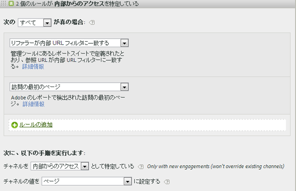
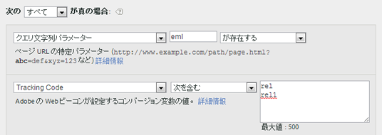

# よくある質問と例

<!--
Read about best practices and examples of how to populate various rules you can set up for your marketing channels.

* [Frequently Asked Questions](/help/components/c-marketing-channels/c-faq.md#section_E490CEAF0E76422C91D34D8A80A0C573) 
* [No Channel Identified](/help/components/c-marketing-channels/c-faq.md##no-channel-identified) 
* [Paid Search](/help/components/c-marketing-channels/c-faq.md#section_E934BFE182E4404A93FE07AFEAE64DC1) 
* [Natural Search](/help/components/c-marketing-channels/c-faq.md#section_A4C6B8F0360449BE94F0128FF7C71386) 
* [Affiliates](/help/components/c-marketing-channels/c-faq.md#section_8D142C7074CD4DEC87DF55B691107622) 
* [Social Networks](/help/components/c-marketing-channels/c-faq.md#section_492B72A3B261479D9C84F631E90C03D8) 
* [Display](/help/components/c-marketing-channels/c-faq.md#section_4FD846B89FCE4ECFB7781BD02874A1AB) 
* [Internal](/help/components/c-marketing-channels/c-faq.md#section_179A2BE5C8E24719A9E5C0DC09AF0947) 
* [Email](/help/components/c-marketing-channels/c-faq.md#section_4A927BE947B748E39595F4525B7280DE) 
* [Direct](/help/components/c-marketing-channels/c-faq.md#section_D0A1DD9D5EEF4A05A1CC81F9EADC074A)
-->

[マーケティングチャネルの処理ルールの作成](/help/components/c-marketing-channels/t-rules.md)で、[!UICONTROL マーケティングチャネルの処理ルール]ページに表示されるフィールドの定義に関する項目を参照してください。

## よくある質問 {#faq}

マーケティングチャネルの処理ルールの実装は、トラッキングコードによって異なります。求める結果をもたらすようなルールを設定するには、問題を解決するための工夫が求められる場合があります。

**質問**：私のトラッキングコードはパターンに従っていません。また、アフィリエイトチャネル用に指定しなければならないコードが無数にあります。

* 除外処理を使用します。電子メールチャネルとアフィリエイトチャネルに同一のクエリ文字列パラメーターを使用しているとき、電子メールのトラッキングコードが少数なら、電子メールを定義するルールセットで電子メールトラッキングコードを指定することができます。その後、残りすべてのトラッキングコードをアフィリエイトとして分類します。 *`affiliates.`*
* 電子メールシステムで、ランディングページのすべての URL に *`&ch=eml`* などのクエリ文字列パラメーターを追加します。ch クエリパラメーターが *`eml`* と等しいかどうかを検出するルールセットを作成します。*`eml`* が含まれない場合はアフィリエイトです。

**質問**：参照ドメインに予想より多くのデータが含まれています。

* 参照ドメインが処理ルールリストで上位すぎる可能性があります。処理順序が重要なので、下位の方（または最下位）に配置してください。

**質問**：クエリ文字列パラメーターに一致するルールを作成しましたが、うまく機能しません。

* クエリ文字列パラメーターのフィールドでパラメーター名（通常は英数字の値）が指定されていることを確認してください。また、次の電子メールルールの例に示すように、演算子の後にパラメーター値が指定されていることを確認してください。

   

**質問**：ラストタッチトラフィックの属性がすべて内部ドメインになっているのはどうしてですか。

* 内部トラフィックに一致するルールがあります。これらのルールは訪問の最初のページだけでなく、サイト上のすべてのページビューで処理されることを忘れないでください。「*`Page URL exists`*」などのルールが指定されていて、他の条件が指定されていない場合は、ページの URL が常に存在するので、サイト上の連続するヒットのそれぞれについてそのチャネルが照合されます。

**質問**：レポートに「チャネルが識別されませんでした」と表示されているトラフィックは、どのようにデバッグしたらよいですか。

* ルールは順番に処理されます。以下のような場合は、どの条件にも一致しないことがあります。

1. リファラーなし（直接訪問）。

2. 内部リファラー、訪問の最初のページ。

3. ページの処理異常。

この 3 つの可能性用のチャネルを用意してください。例えば、次のようなルールを作成します。

1. 「**[!UICONTROL リファラー]**」と「**[!UICONTROL 存在しない]**」と「**[!UICONTROL 訪問の最初のページ]**」。（[直接](/help/components/c-marketing-channels/c-faq.md)を参照）

2. 「**[!UICONTROL リファラーが内部 URL フィルターに一致する]**」と「**[!UICONTROL 訪問の最初のページ]**」（[内部](/help/components/c-marketing-channels/c-faq.md)を参照）。

3. 「**[!UICONTROL リファラー]**」と「**[!UICONTROL 存在する]**」と「**[!UICONTROL リファラーが内部 URL フィルターに一致しない]**」

最後に、[チャネルが識別されませんでした](/help/components/c-marketing-channels/c-faq.md#no-channel-identified)で説明されているように、残りのヒットを捕捉する「その他」**&#x200B;のチャネルを作成します。

## チャネルが識別されませんでした {#no-channel-identified}

ルールがデータを捕捉しない場合、あるいはルールが正しく設定されていない場合、レポートの「[!UICONTROL チャネルが識別されませんでした]」列にデータが表示されます。例えば、内部トラフィックも識別する「*その他*」というルールセットを処理順序の最後に作成することができます。

この種類のルールは、チャネルトラフィックが常に外部トラフィックに一致し、通常は「**[!UICONTROL チャネルが識別されませんでした]**」にならないようにする包括的ルールとして機能します。内部トラフィックも識別してしまうルールを作成しないように注意してください。「その他」のルールを作成するには、チャネルの値を&#x200B;**[!UICONTROL 参照ドメイン]**&#x200B;または&#x200B;**[!UICONTROL ページ URL]** にするのが最も一般的で有効な方法です。

> [!NOTE]一部のチャネルトラフィックは引き続き「チャネルが識別されませんでした」カテゴリーに分類される場合があります。例えば、訪問者がサイトを訪問してページをブックマークし、その訪問中にブックマークを使用してそのページに戻った場合がこれに該当します。このページは訪問者が最初に訪問したページではなく、参照ドメインが存在しないので、直接アクセスチャネルにもその他チャネルにも分類されません。

## 有料検索 {#paid-search}

有料検索とは、単語または語句が検索エンジンの検索結果ページに配置されるように料金を支払うことです。マーケティングチャネルを有料検索検知ルールに一致させるには、[!UICONTROL 有料検索検知]ページでの設定内容をマーケティングチャネルに使用します（**[!UICONTROL 管理者]**／**[!UICONTROL レポートスイート]**／**[!UICONTROL 設定を編集]**／**[!UICONTROL 一般]**／**[!UICONTROL 有料検索検知]**。）リンク先 URL はその検索エンジンの既存の有料検索検知ルールと一致します。

マーケティングチャネルルールでは、[!UICONTROL 有料検索]の設定は次のようになります。

詳しくは、管理ヘルプの「[有料検索検知](https://marketing.adobe.com/resources/help/en_US/reference/paid_search_detection.html)」を参照してください。

## 自然検索 {#natural-search}

自然検索は、Web 検索リストでの掲載順位に対して料金を支払わない場合に検索エンジンで決定される掲載位置から貴社の Web サイトを訪問者が見つけた場合に発生します。検索エンジンから貴社のサイトにリンクするときに使用されるリンク先 URL を制御できます。この URL によって、Analytics が自然検索かどうかを識別できます。

Analytics には自然検索の検出は用意されていません。有料検索検知を設定すると、検索リファラーが有料検索リファラーでなかった場合は、リファラーを自然検索リファラーにする必要があるとシステムで判断されます。自然検索の場合、リンク先 URL はその検索エンジンの既存の有料検索検知ルールに一致しません。

マーケティングチャネルルールでは、自然検索の設定は次のようになります。

詳しくは、管理ヘルプの「[有料検索検知](https://marketing.adobe.com/resources/help/en_US/reference/paid_search_detection.html)」を参照してください。

## アフィリエイト {#afilliates}

アフィリエイトのルールは、指定された一連の参照ドメインからの訪問者を識別します。このルールでは、追跡するアフィリエイトのドメインを次のように一覧表示します。

## SNS {#social-networks}

このルールは、Facebook* などのソーシャルネットワークからの訪問者を識別します。以下のように設定できます。

## 表示 {#display}

このルールは、バナー広告から来た訪問者を識別します。これはリンク先 URL のクエリ文字列パラメーターによって識別されます（この場合  *`Ad_01`*）。

## 内部からのアクセス {#internal}

このルールは、レポート スイートの内部 URL フィルターと一致するリファラーから派生する訪問者を識別します。

## 電子メール {#email}

このルールを設定するには、電子メールキャンペーンのクエリ文字列パラメーターが必要です。この例では、パラメーターは  *`eml`* です。

ルールにトラッキングコードが含まれている場合は、下図に示すように、それぞれの行に値を 1 つずつ入力します。

## 直接アクセス {#direct}

このルールは参照ドメインのない訪問者を識別します。このルールには、お気に入りリンクをクリックしたり、ブラウザーにリンクを貼り付けたりしてサイトに直接アクセスした訪問者が含まれます。

