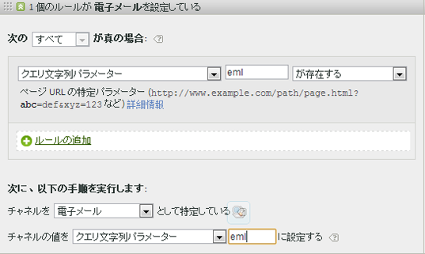

# マーケティングチャネルFAQ

マーケティングチャネルに関するよくある質問(FAQ)です。

## 私のトラッキングコードはパターンに従っておらず、アフィリエイトチャネル用に指定する必要があるコードが無数にあります。

* 除外処理を使用します。電子メールチャネルとアフィリエイトチャネルに同一のクエリ文字列パラメーターを使用しているとき、電子メールのトラッキングコードが少数なら、電子メールを定義するルールセットで電子メールトラッキングコードを指定することができます。その後、残りすべてのトラッキングコードをアフィリエイトとして分類します。 *`affiliates.`*
* 電子メールシステムで、ランディングページのすべての URL に *`&ch=eml`* などのクエリー文字列パラメーターを追加します。ch クエリパラメーターが *`eml`* と等しいかどうかを検出するルールセットを作成します。*`eml`* が含まれない場合はアフィリエイトです。

## 参照ドメインに予想以上のデータが含まれています。

* 参照ドメインが処理ルールリストで上位すぎる可能性があります。処理順序が重要なので、下位の方（または最下位）に配置してください。

## クエリ文字列パラメーターに一致するルールを作成しましたが、機能しません。

* クエリー文字列パラメーターのフィールドでパラメーター名（通常は英数字の値）が指定されていることを確認してください。また、次の電子メールルールの例に示すように、演算子の後にパラメーター値が指定されていることを確認してください。

   

## ラストタッチトラフィックの属性がすべて内部ドメインになっているのはなぜですか。

* 内部トラフィックに一致するルールがあります。これらのルールは訪問の最初のページだけでなく、サイト上のすべてのページビューで処理されることを忘れないでください。「*`Page URL exists`*」などのルールが指定されていて、他の条件が指定されていない場合は、ページの URL が常に存在するので、サイト上の連続するヒットのそれぞれについてそのチャネルが照合されます。

## レポートに「チャネルが識別されませんでした」と表示されているトラフィックをデバッグする方法を教えてください。

* ルールは順番に処理されます。以下のような場合は、どの条件にも一致しないことがあります。

1. リファラーなし（直接訪問）。

2. 内部リファラー、訪問の最初のページ。

3. ページの処理異常。

この 3 つの可能性用のチャネルを用意してください。例えば、次のようなルールを作成します。

1. 「**[!UICONTROL リファラー]**」と「**[!UICONTROL 存在しない]**」と「**[!UICONTROL 訪問の最初のページ]**」。（[直接](/help/components/c-marketing-channels/c-faq.md)を参照）

2. 「**[!UICONTROL リファラーが内部 URL フィルターに一致する]**」と「**[!UICONTROL 訪問の最初のページ]**」（[内部](/help/components/c-marketing-channels/c-faq.md)を参照）。

3. 「**[!UICONTROL リファラー]**」と「**[!UICONTROL 存在する]**」と「**[!UICONTROL リファラーが内部 URL フィルターに一致しない]**」

最後に、[チャネルが識別されませんでした](/help/components/c-marketing-channels/c-faq.md#no-channel-identified)で説明されているように、残りのヒットを捕捉する「*その他*」のチャネルを作成します。

## ファーストタッチとラストタッチの関係

従来のファーストタッチディメンションとラストタッチディメンションの間のやり取りを理解し、上書きが期待どおりに動作することを確認するには、（下の例を参照）に示す主要な成功指標を追加して、ラストタッチチャネルレポートを取り込みます。 この例は、ファーストタッチチャネルとラストタッチチャネルの間のインタラクションを示しています。

最初のタッチと最後のタッチが等しい交点は、テーブルの対角線です。 直接更新とセッション更新の両方で、ラストタッチクレジットが取得されるのは、それらがファーストタッチのチャネルでもある場合のみです。これは、他の永続的なチャネル（強調表示された行）からクレジットを受け取ることができないためです。

## チャネルが識別されない理由 {#no-channel-identified}

ルールがデータを捕捉しない場合、あるいはルールが正しく設定されていない場合、レポートの「[!UICONTROL チャネルが識別されませんでした]」列にデータが表示されます。例えば、内部トラフィックも識別する「*その他*」というルールセットを処理順序の最後に作成することができます。

この種類のルールは、チャネルトラフィックが常に外部トラフィックに一致し、通常は「**[!UICONTROL チャネルが識別されませんでした]**」にならないようにする包括的ルールとして機能します。内部トラフィックも識別してしまうルールを作成しないように注意してください。「その他」のルールを作成するには、チャネルの値を&#x200B;**[!UICONTROL 参照ドメイン]**&#x200B;または&#x200B;**[!UICONTROL ページ URL]** にするのが最も一般的で有効な方法です。

>[!NOTE]
>
>一部のチャネルトラフィックは引き続き「チャネルが識別されませんでした」カテゴリーに分類される場合があります。例えば、訪問者がサイトを訪問してページをブックマークし、その訪問中にブックマークを使用してそのページに戻った場合がこれに該当します。このページは訪問者が最初に訪問したページではなく、参照ドメインが存在しないので、直接アクセスチャネルにもその他チャネルにも分類されません。

## 内部の理由（セッションの更新） {#internal}

ラストタッチ内部（セッション更新）は、ファーストタッチでもある場合にのみ発生します。前述の「ファーストタッチとラストタッチの関係」を参照してください。 次のシナリオでは、Session Refreshがファーストタッチチャネルになる可能性を説明します。

* **セッションタイムアウト**:訪問者がWebサイトを訪問し、ブラウザーでタブを開いたままにして、後で使用します。 訪問者のエンゲージメント期間が終了（または訪問者が任意に cookie を削除）した後で、訪問者が「開く」タブを使用して Web サイトに再度アクセスします。参照 URL は内部ドメインなので、訪問は「セッション更新」に分類されます。

* **一部のサイトページにタグが付いていない**:訪問者は、タグ付けされていないページAに移動し、タグ付けされているページBに移動します。 ページ A は内部リファラーと見なされ、訪問は「セッション更新」と見なされます。

* **リダイレクト**:転送者データを新しいランディングページに渡すようにリダイレクトが設定されていない場合、実際のエントリ転送者データは失われ、リダイレクトページ（おそらく内部ページ）が参照ドメインとして表示されます。 訪問は、「セッション更新」に分類されます。

* **クロスドメイントラフィック**:訪問者は、スイートAに対して起動する1つのドメインから、スイートBに対して起動する2つ目のドメインに移動します。スイートBでは、内部URLフィルターーが最初のドメインを含む場合、マーケティングチャネルは2番目のスイートの新しい訪問と見なすので、スイートBの訪問は内部ドメインとして記録されます。 訪問は、「セッション更新」に分類されます。

* **入口ページの読み込み時間が長い**:訪問者はページAにランディングし、ページAはコンテンツが多く、Adobe Analyticsコードはページの下部に配置されます。 訪問者は、（Adobe Analytics イメージリクエストを含む）すべてのコンテンツを読み込む前に、ページ B をクリックします。ページ B は Adobe Analytics イメージリクエストを実行します。ページ A のイメージリクエストは読み込まれないので、2 番目のページは Adobe Analytics の訪問の最初のヒットとして表示され、ページ A がリファラーとして表示されます。訪問は、「セッション更新」に分類されます。

* **ミッドサイト**:cookieをクリア中訪問者がサイトにアクセスし、中間セッションがcookieをクリアします。 ファーストタッチチャネルとラストタッチチャネルの両方がリセットされ、訪問は「セッション更新」に分類されます（リファラーが内部的なものになるため）。

以下に、ファーストタッチとラストタッチの両方のチャネルとして設定される内部（セッションの更新）の例を示します。

* 1 日目：ユーザーが「表示」でサイトにアクセスした。ファーストタッチチャネルとラストタッチチャネルは「表示」に設定されます。
* 2 日目：ユーザーが「自然検索」でサイトにアクセスした。ファーストタッチは「表示」のままで、「ラストタッチ」は「自然検索」に設定されます。
* 35 日目：ユーザーが 33 日間サイトにアクセスせず、ブラウザーで開いていたタブを使用して戻ってきた。30 日間のエンゲージメント期間を想定すると、この期間は終了し、マーケティングチャネル cookie の有効期限が切れます。ファーストタッチチャネルとラストタッチチャネルはリセットされ、ユーザーが内部 URL から来ているため「セッション更新」に設定されます。

## マーケティングチャネルの処理ルールを変更した後、一部のチャネルが変更されないのはなぜですか。

マーケティングチャネルの処理ルールが正しく設定されていない場合があり、処理ルールを変更する必要があります。 変更を適用すると、一部の指標が誤ったチャネルにまだ属性を持っていることがわかります。 考慮すべき点がいくつかあります。

* **マーケティングチャネルデータはリアルタイムで収集されます**。マーケティングチャネルのデータはデータ収集時に処理され、100%永続的です。 処理ルールの変更は、データに遡って影響を与えません。
* **処理ルールを変更しても、ファーストタッチデータにはすぐに影響しません**。次に例を示します。
   1. ユーザーが誤って設定されていたので、電子メールチャネルから入ってきて、サイトを離れます。
   2. 次の日に、電子メール処理ルールを修正するように変更します。
   3. 数日後に自然検索から戻ってきて、購入を行います。
   4. 電子メールチャネルにはファーストタッチクレジットが、自然検索にはラストタッチクレジットが付与されます。

   処理ルールを変更した数日後でも、誤ったファーストタッチチャネルでデータを収集できます。 ファーストタッチデータは、すべてのユーザーの訪問者エンゲージメントが期限切れになるまで、誤ったチャネルで継続的に収集されます。

これらの不一致を修正する最善の方法は、次のいずれかまたは両方を行うことです。

* **すべての訪問者エンゲージメント期間を手動で期限切れにする**:この設定は、すべての訪問者で、すべてのファーストタッチチャネルとラストタッチイベントを即時に期限切れにします。
   1. 管理ツール/レポートスイートに移動します。
   2. 画像編集設定/マーケティングチャネル/訪問者のエンゲージメント期間の上にカーソルを置く
   3. 「すべて期限切れ」をクリックします。
   4. 警告ポップアップウィンドウの「OK」をクリックします。これは、実行する処理を理解していることを確認するメッセージです。

* **ルールを修正した時点からの表示ラストタッチ指標のみ**:ラストタッチ指標は常に、現在のルールセットに従います。 処理ルールを正しく変更した後の時間の表示は、最新の処理ルールを反映しています。
