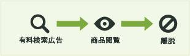
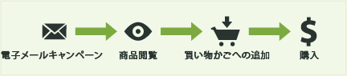
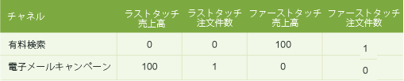
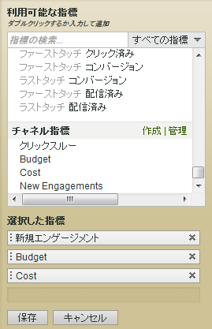

# マーケティングチャネルレポートで使用される指標

マーケティングチャネルレポートで指標を使用する方法。

## Metrics used in Marketing Channel reports {#topic_F83F5D4C3E144967AD90D956F0E8A999}

マーケティングチャネルレポートで指標を使用する方法。

指標を追加（または編集）します。

 レポートに列を追加します。

## First and last-touch metrics {#concept_68D9A50204304BA58C1F8013451E7853}

ファーストタッチとラストタッチは、チャネル内の訪問者のアクティビティによって生じる新規エンゲージメント（または製品表示、売上高、注文件数などの指標データ）の数を表示するためのチャネル属性です。

When a success event occurs, Analytics looks at the entire visitor's activity and history (back to the [visitor's engagement expiration](../../components/c-marketing-channels/visitor-engagement.md#topic_32ADFDB12D3A4F35843A4545AC97C49F)). 訪問者が最初に使用したチャネルと、最新（最後）のチャネルが認識されます。その後、該当する各チャネルに成功イベントのクレジットが与えられます。

<!-- 

<note>
  A first-touch value has a rolling expiration based on the frequency of a visitor returning to the site. This first-touch expiration resets whenever a visitor returns to the site. This effects reporting by causing first-touch values to persist longer than you might expect. For example, this can occur if an instance of an first-touch channel was created a year ago. Remove the values on the eVar in the admin console to reset. 
</note>

 -->

**例**

有料検索と電子メールキャンペーンの 2 つのマーケティングチャネルを設定したとします。

有料検索は、製品の広告です。訪問者の関心を誘い製品表示を生み出しましたが、コンバージョンイベントには結びつきませんでした。

1 ヶ月後、その製品の電子メールキャンペーンを実施しました。その結果 100 ドルの購入(または他の望まれるコンバージョンイベント)に結びつきました 。

マーケティングチャネルレポートには、次のように結果が表示されます。

有料検索チャネルは、売上高のファーストタッチチャネルとして 100 ドルのクレジットを受けますが、ファーストタッチの注文件数は 1 です。電子メールキャンペーンチャネルは、ラストタッチ売上高チャネル(コンバージョンイベントの前、最後にユーザーがタッチしたチャネル)として 100 ドルのクレジットを受け、ラストタッチの注文件数は 1 です。つまり、このレポートの主な目的は、全ファーストタッチチャネルの売上高の内訳が、全ラストタッチチャネル間の売上高の内訳とどの程度異なっているか確認することです。

すべての成功イベントのインスタンスに、ファーストタッチチャネルとラストタッチチャネルが必ず 1 つずつ含まれます。つまり、成功イベントに特定の指標の列を追加すると、この列は常に同じ期間の合計数と同一になります。また、この合計数は、該当する[!UICONTROL サイト指標]／[!UICONTROL カスタムイベント]レポートでのイベントの合計数と同一になります。同じ訪問で複数のチャネルが呼び出される場合があるので、成功イベント以外の指標（訪問数や訪問者数）は 1 対 1 で一致するわけではありません。

>[!NOTE]
>
>このレポートでは、各指標のファーストタッチまたはラストタッチバージョンを使用します。したがって、[!UICONTROL マーケティングチャネル]レポートに表示されるデータと他のレポートに表示されるデータとは一致しないことがあります。

## Metric definitions {#section_364D003D34D748B79503DFA4DD208EDB}

| 指標 | 定義 |
|--- |--- |
| ファーストタッチチャネル | 訪問者の関心を向けさせるための最初のマーケティングチャネルです。技術的には、ファーストタッチチャネルは元の配分を持つeVarです。 |
| ファーストタッチの訪問者 | チャネルレポート機能におけるファーストタッチの訪問者は、チャネルから派生する日別訪問者です。訪問者のエンゲージメントはサイトに対するエンゲージメント期間中に保存されるので、多数の訪問が続く可能性があります。 |
| ラストタッチチャネル | コンバージョンチャネル、つまり訪問者の関心を向けさせ、コンバージョンに結びつく最後のマーケティングチャネルです。ファーストタッチチャネルとして設定されるのは、1 つのチャネルのみです。ラストタッチチャネルは、サイトへの再来訪ごとに変化する場合があります。すべての訪問にはファーストタッチチャネルとラストタッチチャネルがありますが、ファーストタッチチャネルの値が以降の値によって変わることはありません。 |

## クリックスルー {#reference_55E2254F02EF4E7EB0AD2838C948347A}

クリックスルーは、ラストタッチチャネル上のインスタンスです。これは配分が最新（最後）に設定された eVar です。

例えば、次に示すように、訪問者が Web サイトに 1 日 1 回アクセスし、それぞれの訪問が別のマーケティングチャネルからのものであるとします。

* 1 日目：有料検索
* 2 日目：表示
* 3 日目：自然検索
* 4 日目：表示
* 5 日目：有料検索
* 6 日目：表示
* 7 日目：自然検索

この場合、ファーストタッチチャネルレポートには、有料検索の新規エンゲージメントとして 1 が表示されます。その他の各チャネルの新規エンゲージメントとしては 0 が表示されます。ラストタッチチャネルレポートには、有料検索のクリックスルーとして 2、表示として 3、自然検索として 2 が表示されます。

## マーケティングチャネルレポートへの指標の追加 {#task_D381139E00504666AB2402D553CFEA5B}

マーケティングチャネルレポートに指標を追加します。レポートの各列に対して指標を 4 つまで追加することができます。列はいくつでも追加できます。

1. [!UICONTROL マーケティングチャネルレポート]を開きます。
1. 「指標の追加」をクリックします。

   

1. 「[!UICONTROL 利用可能な指標]」で、追加する指標を「[!UICONTROL 利用可能な指標]」セクションから「[!UICONTROL 選択した指標]」セクションにドラッグアンドドロップして移動します。

   

1. To create calculated metrics, scroll to [!UICONTROL Calculated Metrics], then click **[!UICONTROL Create]**.
1. Click **[!UICONTROL Save.]**
