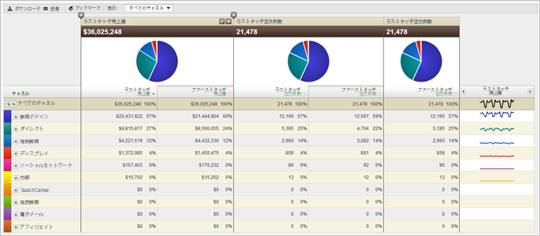

# マーケティングチャネルレポートについて

マーケティングチャネルレポート機能を使用すると、マーケティングチャネルがもたらす売上高を把握できます。これらのレポートには、ファーストタッチチャネルおよびラストタッチチャネルの配分の概要、および売上高、注文件数、コストなどの重要な標準指標が含まれます。

管理ツールでチャネル定義ルールを設定できます。チャネルレポート固有の API を使用できます。[!UICONTROL マーケティングチャネル]レポートを実行する際には、その他の外部の実装を変更する必要はありません。

* [サンプルレポート](../../components/c-marketing-channels/c-overview.md#section_64F7FB1326A64B318654BAFE66FA97EC)
* [使用可能なレポート](../../components/c-marketing-channels/c-overview.md#section_8A95A56AE24E4F34BBA069361D6354B9)

## サンプルレポート {#section_64F7FB1326A64B318654BAFE66FA97EC}

チャネルデータは、ダッシュボード、API、Report Builder（Excel 用）、Ad Hoc Analysis、Data Warehouse、およびデータ抽出で利用できます。

指標を追加（または編集）します。

 レポートに列を追加します。

## 使用可能なレポート {#section_8A95A56AE24E4F34BBA069361D6354B9}

Experience Cloud では、次の[!UICONTROL マーケティングチャネル]レポートを使用できます。

| レポート | 説明 |
|--- |--- |
| チャネル概要 |  この概要レポートには、選択した期間のトレンドのサマリーレポートが円グラフおよびグラフで表示されます。ファーストタッチ指標とラストタッチ指標を追加したり、このレポートで使用する計算指標を作成できます。また、ファーストタッチチャネルおよびラストタッチチャネルを詳細に調べ、概要表から詳細レポートを作成することも可能です。その他のマーケティングチャネルレポートでは、このレポートに要約されているデータをさらに掘り下げて調べることができます。レポート内のチャネルを展開すると、そのチャネルの値の分類レポートを確認できます。チャネル値は、チャネルの詳細では未分類の値です。 |
| ファースト（またはラスト）タッチチャネル | 特定のファーストタッチチャネルまたはラストタッチチャネルに関するデータを示す指標が表示されます。これらのレポートでは、チャネルを分類し、各チャネルの詳細を表示できます。 |
| ファースト（またはラスト）タッチチャネルの詳細 | ルールの設定時に「チャネルの値を設定」オプションで設定したチャネル値から取得された、ページ名やリファラーなどの詳細が表示されます。チャネル詳細レポートでは、概要レポートで報告されたチャネルの詳細値を詳しく調査できます。 |