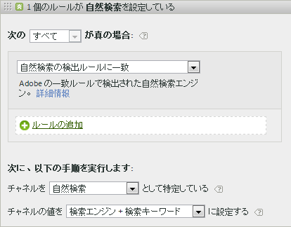
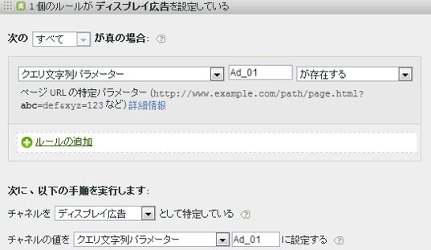
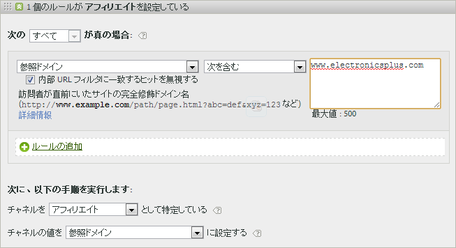
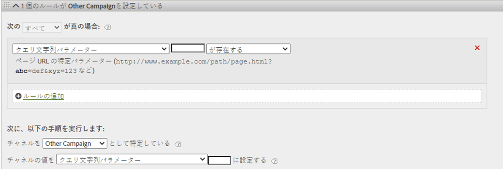
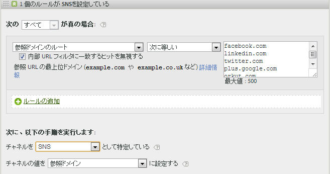
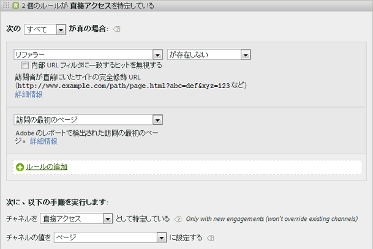
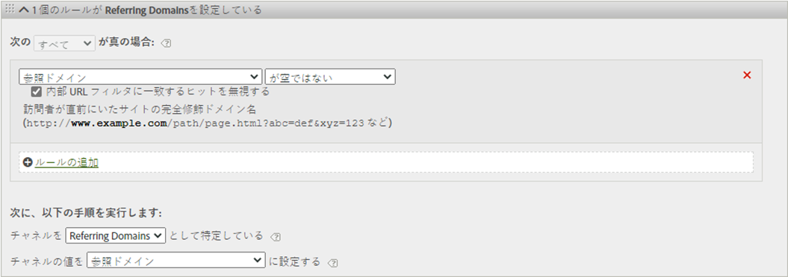

# マーケティングチャネルの処理ルール

マーケティングチャネルの処理ルールは、訪問者のヒットがチャネルに割り当てられた条件を満たすかどうかを決定するために、訪問者がサイトでおこなうすべてのヒットを処理します。ルールは指定された順序処理され、ルールの 1 つが満たされると残りのルールの処理を中止します。

処理に関する追加情報：

* これらのルールを使用して収集されたデータは完全に永久的なもので、データの収集後に変更されたルールを過去のデータにさかのぼって適用させることはできません。[!UICONTROL マーケティングチャネル処理ルール]を保存する前に、すべての状況を確認し、検討して、誤ったチャネルでデータが収集されないようにすることを強くお勧めします。
* レポートは一度に 25 のチャネルまで処理できます。
* ルールは VISTA が設定した変数にはアクセスできますが、VISTA が削除したデータにはアクセスできません。
* 2 つのマーケティングチャネルが同じイベント（購入やクリックなど）からクレジットを受けることはありません。この点でマーケティングチャネルは eVar と異なります（同一イベントから 2 つの eVar がクレジットを受ける場合がある）。
* ルールのギャップカバレッジがある場合、「[チャネルが識別されていません](/help/components/c-marketing-channels/c-faq.md)」と表示されることがあります。

## 前提条件

* [マーケティングチャネル使用の手引き](/help/components/c-marketing-channels/c-getting-started-mchannel.md)で概念的な情報を確認する。
* ルールを割り当てるためにチャネルを 1 つ以上作成してください。[マーケティングチャネルの追加](/help/components/c-marketing-channels/c-channels.md)を参照してください。
* [!UICONTROL マーケティングチャネル]を[!UICONTROL Attribution IQ]と共に使用する際のベストプラクティスを確認します。

## マーケティングチャネルの処理ルールの作成

訪問者のヒットがチャネルに割り当てられた条件を満たすかどうかを判断するためのマーケティングチャネルの処理ルールを作成します。

1. **[!UICONTROL Analytics]**／**[!UICONTROL 管理者]**／**[!UICONTROL レポートスイート]**&#x200B;の順にクリックします。
2. レポートスイートを選択します。

   レポートスイートでチャネルが定義されていない場合、[!UICONTROL マーケティングチャネル ：自動セットアップ]ページが表示されます。

   詳しくは、[自動セットアップの実行](/help/components/c-marketing-channels/c-getting-started-mchannel.md)を参照してください。

3. **[!UICONTROL 設定を編集]**／**[!UICONTROL マーケティングチャネル]**／**[!UICONTROL マーケティングチャネルの処理ルール]**&#x200B;の順にクリックします。自動セットアップを実行した場合、チャネルとルールのセットが自動的に定義されていました。

   

4. 新しいルールを追加する場合は、「**[!UICONTROL 追加新しいルールセット]**」メニューから選択します。 チャネルを選択すると、ルールテンプレートが与えられ、「カスタム」を選択すると、空白のスレートから開始が与えられます。 どちらのオプションを使用しても、必要に応じてルールセットを変更できます。

   

5. ルールの作成を続けるには、[**[!UICONTROL 追加新しいルールセットのルール]**]をクリックします。
6. ルールに優先順位を付けるには、目的の位置にルールをドラッグアンドドロップします。
7. 「**[!UICONTROL 保存]**」をクリックします。

このページに進み、チャネルルールの順序の推奨事項と、その他の定義の例を確認してください。

### マーケティングチャネル値の設定

**[!UICONTROL チャネルの]** 値を設定し、そのチャネルで使用できるマーケティングチャネルの詳細ディメンションを定義します。これにより、マーケティングチャネルのディメンションを分類して、チャネルに関する詳細を表示できます。

チャネルの値は、チャネル自体を定義するのと同じ条件に設定することをお勧めします。例えば、クエリー文字列パラメーターを使用してチャネルを定義する場合、クエリー文字列パラメーターをチャネル値として設定します。

### ルール条件

このテーブルは、マーケティングチャネルの処理ルールで使用可能なフィールド、オプションおよびヒット属性を定義しています。

>[!NOTE]
>
>クエリ文字列パラメーターや一致する値のリストーなど、定義したテキストフィールドは、**大文字と小文字を区別しない**&#x200B;値として評価されます。 例えば、クエリ文字列パラメーターcmp = abc123のルールがある場合、「cmp」と「abc123」の両方のバージョンはすべてルールと一致します。 これらの値の大文字と小文字を区別して複数のリストを行う必要はありません。

| 用語 | 定義 |
|--- |--- |
| すべて | 番号付きルール内のすべてのルールが真のときにのみ、このチャネルをアクティブにします。 |
| いずれか | ルールセット内のいずれかのルールが真のときに、このチャネルをアクティブにします。このオプションは、番号付きルール内に 2 つ以上ルールが存在している場合にのみ利用可能です。 |
| AMO ID | Advertising Cloud と Advertising Analytics の統合で使用されるプライマリトラッキングコード。これらの統合の 1 つが有効になっている場合、トラッキングコードプレフィックスを使用して Advertising Cloud 固有のチャネルを識別できます。「AMO ID」は、検索には「AL」、表示には「AC」、Social には「AO」で始まる名前を使用します。AMO ID をマーケティングチャネルで使用する場合、クリック／コスト／インプレッション指標を正しいチャネルに関連付けることができます（設定されていない場合、これらの指標は「直接」または「なし」になります）。 |
| AMO ED ID | Advertising Cloud で使用されるセカンダリトラッキングコード。このトラッキングコードは、Ad Cloud にデータを返送する際の鍵となることを主な目的としています。ただし、2 つの異なるマーケティングチャネルとして表示したい場合は、表示クリックスルー数と表示ビュースルー数を識別するためにも使用できます。これは、「表示クリックスルー」の場合は「AMO EF ID」のマーケティングチャネルロジックを「:d」で終わるように設定し、「表示ビュースルー」の場合は「:i」で終わるように設定することで実現できます。「表示」を 2 つのチャネルに分割しない場合は、代わりに AMO ID ディメンションを使用します。 |
| コンバージョン変数 | このレポートスイート用に有効になっている eVar から構成され、これらの変数がページ上の Adobe コード経由で設定された場合にのみ適用されます。実装マニュアルを参照してください。 |
| 存在する | 以下のオプションを選択できます。<ul><li>**が存在しない**：ヒット属性がリクエストに存在しないことを示します。たとえば、参照ドメインで、ユーザーが URL を入力するかブックマークをクリックすると、その参照ドメイン属性は存在しません。</li><li>**が空である**：ヒット属性（通常は eVar またはクエリ文字列パラメーター）は存在しますが、そのヒット属性に関連付けられた値がないことを示します。</li><li>**次を含まない**：例えば参照ドメインなどに特定の値を含めないこと（「次を含む」オプションを選択する場合と逆）を示します。</li></ul> |
| チャネルを次として特定する | マーケティングチャネルマネージャーページに追加したマーケティングチャネルにルールを関連付けます。マーケティングチャネルの追加を参照してください。 |
| 有料検索の検出ルールに一致 | アドビによって検出された有料検索。有料検索とは、自社サイトが検索結果リストに優先的に載せられるように会社が検索エンジンに料金を支払った検索キーワードを指します。有料検索のキーワードは通常検索結果の上部または右側に表示されます。 |
| 自然検索の検出ルールに一致 | アドビのレポートによって検出された無料検索。 |
| リファラーが内部 URL フィルターに一致する | 管理ツールのレポートスイートで定義されている内部 URL フィルターに一致するページ URL からのアクセス。 |
| リファラーが内部 URL フィルターに一致しない | 管理ツールにあるレポートスイートで定義されたとおり、参照 URL が内部 URL フィルターに一致しません。この設定を      「ページの URL」および「存在する」と共に使用して包括的ルールを設定できるので、訪問のランディングページがレポートの「チャネルが識別されませんでした」セクションになることはありません。 |
| 内部 URL フィルターに一致するヒットを無視する | （リファラーに対して）外部参照サイトからのヒットのみをトラッキングします。内部トラフィックを含める場合以外、通常はこの設定を有効にしておきます。 |
| 訪問の最初のページ | アドビのレポートで検出された訪問の最初のページ。 |
| ページ | アドビの Web ビーコンを使ってタグ付けされた、サイト上の Web ページのページ名。この値は s.pageName と同等です。例として、`Home Page` および `About Us` があります。 |
| ページドメイン | `products.example.co.uk` など、訪問者が到着したページのドメイン。 |
| ページドメインとパス | ドメインとパス（例：`products.example.co.uk/mens/pants/overview.html`）。 |
| ページルートドメイン（TLD+1） | example.co.uk など、訪問者が到着したページのルートドメイン。 |
| ページ URL | サイトの Web ページの URL。 |
| 参照ドメイン | サイトにアクセスする前に訪問者が来たドメイン。例えば、`abcsite.com` から来たリファラーや `xyzsite.com` から来たリファラーなどです。 |
| クエリー文字列パラメーター | サイトのページURLが`https://example.com/?page=12345&cat=1`のような場合、「page」と「cat」は両方ともクエリ文字列パラメータです。 （`https://en.wikipedia.org/wiki/Query_string` を参照。）1 つのルールセットにつき 1 つだけクエリー文字列パラメーターを指定できます。クエリー文字列パラメーターをさらに追加するには、「`ANY`」演算子を使用して、ルールに新しいクエリー文字列パラメーターを追加します。クエリ文字列のパラメーターは、大文字と小文字が区別されないと評価されます。例えば、「cat」と「CAT」は同じように評価されます。 |
| リファラー | サイトにアクセスする前に訪問者が閲覧していた Web ページの場所（フル URL）。リファラーは、定義ドメインの外側に存在します。 |
| 参照ドメインとパス | 参照ドメインと URL パスを短縮したもの。例：`www.example.com/products/id/12345` または `ad.example.com/foo` |
| 参照パラメーター | リファラー URL のクエリー文字列パラメーター。例えば、訪問者が `example.com/?page=12345&cat=1` から来訪した場合、page と cat が参照パラメーターとなります。 |
| 参照ドメインのルート | リファラーのルートドメイン。リファラーは、定義ドメインの外側に存在します。 |
| 検索エンジン | 訪問者をサイトに導いた Google や Yahoo! などの検索エンジン。 |
| 検索キーワード | 検索エンジンでの検索に使用された単語。 |
| 検索エンジン + キーワード | 検索エンジンを一意に識別するために検索キーワードと検索エンジンを連結したもの。例えば、computer という単語を検索した場合、検索エンジンとキーワードは次のように特定されます。`Search Tracking Code = "<search_type>:<search engine>:<search keyword>" where    search_type = "n" or "p", search_engine = "Google", and search_keyword = "computer"`**注意：** n = natural（自然検索）、p = paid（有料検索） |
| チャネルの値を次の値に設定する | 訪問者をサイトに導くマーケティングチャネルを特定することに加えて、訪問者のサイトのアクティビティに対してクレジットを受けるチャネル内のバナー広告、検索キーワードまたは電子メールキャンペーンを特定できます。この ID は、チャネルと共に保存されるチャネル値です。この値には、ランディングページや参照 URL に埋め込まれているキャンペーン ID、検索エンジンと検索キーワードの組み合わせ、特定チャネルからの訪問者と最も正確に識別する参照 URL などがよく使用されます。 |

## マーケティングチャネルのルールの順序と定義 {#channel-rules}

チャネルルールは、指定した順序で処理されます。チャネル注文の推奨方法は、有料検索や管理対象のチャネルがクレジットを受け取るように最初に配置し（有料検索、自然検索、表示、電子メールなど）、その後オーガニックチャネル（直接、内部、参照ドメインなど）を配置することです。

チャネルルールの推奨順序と例を次に示します。

### 有料検索 {#paid-search}

有料検索とは、単語または語句が検索エンジンの検索結果ページに配置されるように料金を支払うことです。このチャネルは、通常、クエリー文字列パラメーター（「表示」チャネルの例を参照）または有料検索の検出ルールに基づいて定義されます。決定は、記録したいマーケティングチャネルの詳細に応じて異なります。

#### 有料検索検知

マーケティングチャネルを有料検索検知ルールに一致させるには、[!UICONTROL 有料検索検知]ページでの設定内容をマーケティングチャネルに使用します（**[!UICONTROL 管理者]**／**[!UICONTROL レポートスイート]**／**[!UICONTROL 設定を編集]**／**[!UICONTROL 一般]**／**[!UICONTROL 有料検索検知]**）。リンク先 URL はその検索エンジンの既存の有料検索検知ルールと一致します。

マーケティングチャネルルールでは、[!UICONTROL 有料検索]の設定は次のようになります。

詳しくは、管理ヘルプの「[有料検索検知](https://docs.adobe.com/content/help/ja-JP/analytics/admin/admin-tools/paid-search-detection/paid-search-detection.html)」を参照してください。

### 自然検索 {#natural-search}

自然検索は、Web 検索リストでの掲載順位に対して料金を支払わない場合に検索エンジンで決定される掲載位置から貴社の Web サイトを訪問者が見つけた場合に発生します。

Analytics には自然検索の検出は用意されていません。有料検索検知を設定すると、検索リファラーが有料検索リファラーでなかった場合は、リファラーを自然検索リファラーにする必要があるとシステムで判断されます。詳しくは、管理ヘルプの「[有料検索検知](https://docs.adobe.com/content/help/en/analytics/admin/admin-tools/paid-search-detection/paid-search-detection.html)」を参照してください。

マーケティングチャネルルールでは、自然検索の設定は次のようになります。

### 表示 {#display}

このルールは、バナー広告から来た訪問者を識別します。これはリンク先 URL のクエリー文字列パラメーターによって識別されます（この場合は&#x200B;*`Ad_01`* を調整する際に便利です。クエリ文字列パラメーターと、そのパラメーターで検索される値は、大文字と小文字が区別されない値として評価されます。

### 電子メール {#email}

このルールは、電子メールキャンペーンから来た訪問者を識別します。これはリンク先 URL のクエリー文字列パラメーターによって識別されます（この場合は *`eml`*:

### アフィリエイト {#afilliates}

このルールは、指定された一連の参照ドメインからの訪問者を識別します。このルールでは、追跡するアフィリエイトのドメインを次のように一覧表示します。

### その他のキャンペーン {#other-campaigns}

ベストプラクティスは、すべての有料チャネルルールに従って、「その他のキャンペーン」チャネルを含めることです。このチャネルは、未分類の有料トラフィックの包括的な情報として機能します。

### SNS {#social-networks}

このルールは、Facebookなどのソーシャルネットワークから派生する訪問者を識別します。 このチャネルの名前は、多くの場合、「オーガニックソーシャル」に変更されます。以下のように設定できます。

### 内部（セッション更新）チャネル {#internal}

このルールでは、訪問者の参照 URL が Admin Console で設定された内部 URL フィルターと一致する場合、つまり訪問者がサイト内で訪問を開始した場合を扱います。このチャネルの名前は、多くの場合、「セッション更新」に変更されます。

このチャネルが発生する理由の詳細は、「[内部の理由（セッションの更新）](https://docs.adobe.com/content/help/ja-JP/analytics/components/marketing-channels/c-faq.html#internal)」を参照してください。

### 直接アクセス {#direct}

このルールは、参照ドメインを持たない訪問者を識別します。これには、お気に入りリンクをクリックしたり、ブラウザーにリンクを貼り付けたりしてサイトに直接アクセスした訪問者が含まれます。このチャネルの名前は、多くの場合、「直接入力またはブックマーク」に変更されます。

### 参照ドメインチャネル {#referring-domains}

参照ドメインチャネルは、参照ドメインを持つ訪問者を識別します。内部ドメイン、直接ドメイン、および参照ドメインの各チャネルは、まだチャネルに分類されていない残りのすべてのヒットの包括的な要素として機能します。

