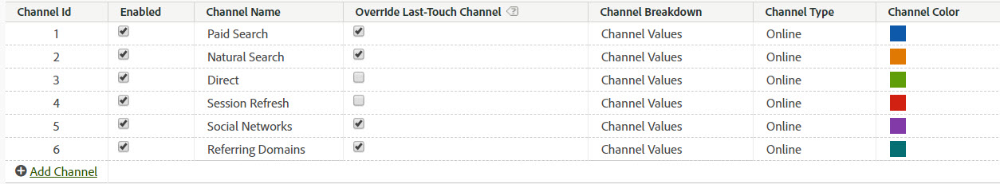

# 内部（セッション更新）チャネル

内部チャネル（多くの場合、「セッション更新」に名前変更）は、参照 URL が Admin Console の内部 URL フィルター設定と一致するサイトへの訪問で構成されます。つまり、訪問者はサイト内から訪問を開始します。

## ベストプラクティスの上書き

「ダイレクト」チャネルと「内部」チャネルのラストタッチの上書きオプションは、他の永続的なラストタッチチャネル（または相互）からクレジットを受け取れないように、オフにすることをお勧めします。

>[!NOTE]このドキュメントでは、「直接」および「セッション更新」の「上書き」設定がオフになっていることを前提としています。

## エンゲージメント期間

訪問者のファーストタッチチャネルとラストタッチチャネルは、両方とも、そのブラウザーで 30 日間操作が行われなかった場合にリセットされます。

>[!NOTE] デフォルトは 30 日ですが、必要に応じて管理者設定で変更できます。

訪問者が頻繁にサイトを使用する場合は、エンゲージメントウィンドウもそれに従って更新されます。期限が切れ、チャネルがリセットされるまで、訪問者は 30 日間非アクティブである必要があります。
例：

* 1 日目：ユーザーが「表示」でサイトにアクセスした。ファーストタッチチャネルとラストタッチチャネルは「表示」に設定されます。

* 2 日目：ユーザーが「自然検索」でサイトにアクセスした。ファーストタッチは「表示」のままで、「ラストタッチ」は「自然検索」に設定されます。

* 35 日目：ユーザーが 33 日間サイトにアクセスせず、ブラウザーで開いていたタブを使用して戻ってきた。30 日間のエンゲージメント期間を想定すると、この期間は終了し、マーケティングチャネル cookie の有効期限が切れます。ファーストタッチチャネルとラストタッチチャネルはリセットされ、ユーザーが内部 URL から来ているため「セッション更新」に設定されます。

## ファーストタッチとラストタッチの関係

ファーストタッチとラストタッチの相互作用を理解し、オーバーライドが期待どおりに機能することを確認するために、ラストタッチチャネルレポートに関連するファーストタッチチャネルレポートをプルし、主要な成功指標を追加できます（以下の例を参照）。この例は、ファーストタッチチャネルとラストタッチチャネルの間のインタラクションを示しています。

ファーストタッチとラストタッチが等しくなる交差の点は、オレンジ色でハイライト表示されます。「直接」および「セッション更新」の両方がラストタッチクレジットを取得するのは、それらがファーストタッチチャネルでもある場合のみです。これは、他の永続的なチャネル（灰色でハイライト表示された行）からクレジットを取得できないためです。

## セッション更新が発生する理由

ラストタッチのセッション更新はそれがファーストタッチでもあった場合にのみ発生することがわかっているので、以下のシナリオでは、セッション更新がファーストタッチチャネルとなる方法を説明します。

### シナリオ 1：セッションタイムアウト

訪問者が Web サイトを訪問し、後日使用できるよう、ブラウザーでタブを開いたままにします。訪問者のエンゲージメント期間が終了（または訪問者が任意に cookie を削除）した後で、訪問者が「開く」タブを使用して Web サイトに再度アクセスします。参照 URL は内部ドメインなので、訪問は「セッション更新」に分類されます。

### シナリオ 2：一部のサイトページがタグ付けされていない

訪問者は、タグ付けされていないページ A にランディングし、タグ付けされたページ B に移動します。ページ A は内部リファラーと見なされ、訪問は「セッション更新」と見なされます。

### シナリオ 3：リダイレクト

リダイレクトが新しいランディングページにリファラーデータを渡すように設定されていない場合、実際のエントリリファラーデータは失われ、リダイレクトページ（おそらく内部ページ）が参照ドメインとして表示されます。訪問は、「セッション更新」に分類されます。

### シナリオ 4：クロスドメイントラフィック

訪問者が、スイート A に対して起動する 1 番目のドメインから、スイート B に対して起動する 2 番目のドメインに移動します。スイート B の内部 URL フィルターが最初のドメインを含む場合、マーケティングチャネルは、これを 2 番目のスイートで新しい訪問と見なすので。「内部」として記録されます。訪問は、「セッション更新」に分類されます。

### シナリオ 5：入口ページ読み込み時間が長い

訪問者は、コンテンツが多いページ A にランディングし、Adobe Analytics コードはページの下部に配置されています。訪問者は、（Adobe Analytics イメージリクエストを含む）すべてのコンテンツを読み込む前に、ページ B をクリックします。ページ B は Adobe Analytics イメージリクエストを実行します。ページ A のイメージリクエストは読み込まれないので、2 番目のページは Adobe Analytics の訪問の最初のヒットとして表示され、ページ A がリファラーとして表示されます。訪問は、「セッション更新」に分類されます。

### シナリオ 6：ミッドサイトでの cookie の消去

訪問者がサイトを訪問し、セッション中に cookie を消去します。ファーストタッチチャネルとラストタッチチャネルの両方がリセットされ、訪問は「セッション更新」に分類されます（リファラーが内部的なものになるため）。
