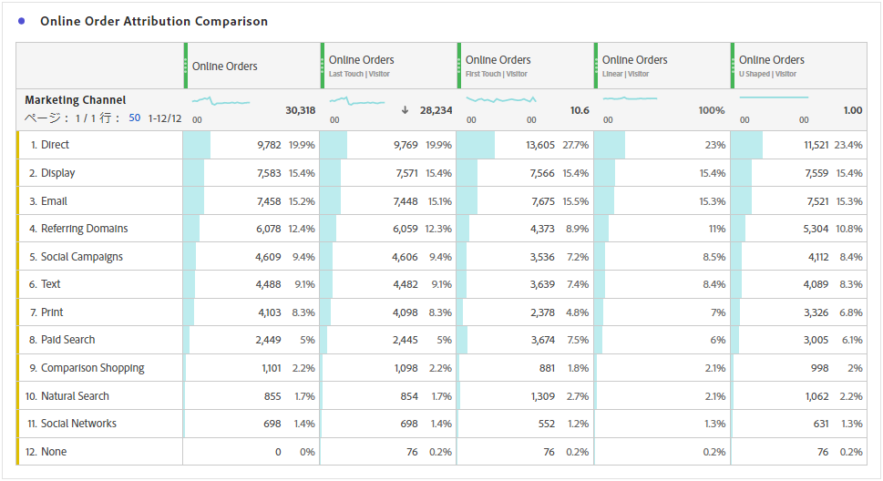
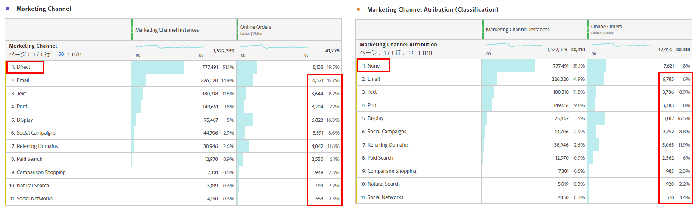
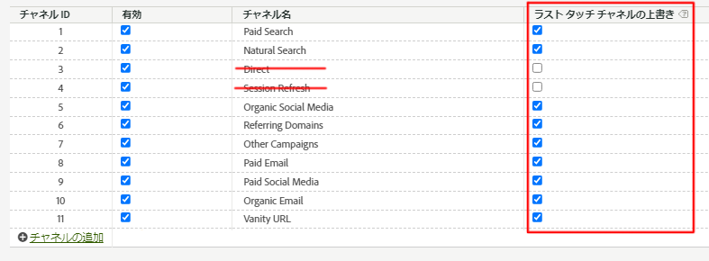
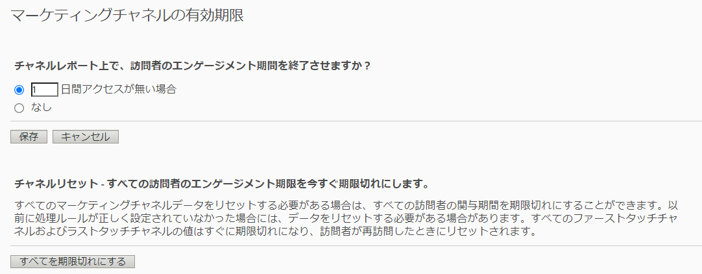

# Attribution とマーケティングチャネルの連携 - ベストプラクティス

[マーケティングチャネル](/help/components/c-marketing-channels/c-getting-started-mchannel.md)は、Adobe Analytics の有益で強力な機能です。マーケティングチャネルの実装に関する現在のガイダンスは、[Attribution](/help/analyze/analysis-workspace/attribution/overview.md) も [Customer Journey Analytics](https://experienceleague.adobe.com/docs/analytics-platform/using/cja-usecases/marketing-channels.html?lang=ja#cja-usecases) も存在しなかった頃に作成されています。

マーケティングチャネル実装の将来性を確保をし、Attribution や Customer Journey Analytics との一貫性をレポートで確実に保つために、アドビでは更新された一連のベストプラクティスを発行しています。既にマーケティングチャネルを使用している場合は、これらの新しいガイドラインの中から最適なオプションを選択できます。マーケティングチャネルを初めて使用する場合は、すべての新しいベストプラクティスに従うことをお勧めします。

マーケティングチャネルが初めて導入された際にあったディメンションはファーストタッチとラストタッチのみでした。現在のバージョンのアトリビューションでは、明示的なファーストタッチディメンションとラストタッチディメンションは不要になりました。アドビでは、汎用の「マーケティングチャネル」ディメンションと「マーケティングチャネルの詳細」ディメンションを提供し、それらを目的のアトリビューションモデルで使用できるようにしています。これらの汎用ディメンションは、「ラストタッチチャネル」ディメンションと同じように動作しますが、異なるアトリビューションモデルでマーケティングチャネルを使用する際の混乱を防ぐために、異なるラベルが付けられています。

マーケティングチャネルのディメンションは、（処理ルールで定義された）従来の訪問の定義に依存するので、仮想レポートスイートを使用して訪問の定義を変更することはできません。これらの改訂されたプラクティスにより、アトリビューションとAdobe Analyticsを使用した、明確で制御可能なルックバックウィンドウが可能になります。

## ベストプラクティス #1：制御された分析に Attribution を活用

マーケティングチャネル分析を微調整するには、既存のマーケティングチャネルアトリビューションではなく [Attribution](/help/analyze/analysis-workspace/attribution/overview.md) を使用することをお勧めします。他のベストプラクティスに従って、Attribution を使用した分析との一貫性と堅牢な制御を確保します。

* 「マーケティングチャネル」と「マーケティングチャネルの詳細」ディメンションの設定では、各マーケティングチャネルインスタンスに対応する、評価対象タッチポイントを設定します。
* 指標分析の場合、組織は 1 つ以上のアトリビューションモデルに合わせる必要があります。再利用しやすいように、カスタム指標をこのモデルと共に保存します。
* デフォルトでは、データはラストタッチと訪問者エンゲージメント期間の設定を使用して割り当てられます。Attribution 指標モデルは、ルックバックウィンドウの管理を強化し、[アルゴリズムアトリビューション](/help/analyze/analysis-workspace/attribution/algorithmic.md#analysis-workspace)をはじめとする多様な手法を提供します。

## ベストプラクティス #2：「直接」および「セッション更新」チャネル定義がない

「直接」および「内部／セッション更新」チャネルをカスタムアトリビューションモデルで使用することはお勧めしません。

組織で「直接」および「セッション更新」が既に設定されている場合は、どうすればよいでしょうか。この場合、Adobeでは、ファーストタッチ/ラストタッチの [&#x200B; 分類を作成 &#x200B;](/help/admin/tools/manage-rs/edit-settings/marketing-channels/classifications-mchannel.md) し、ダイレクトチャネルとセッション更新チャネルを未分類のままにすることをお勧めします。 分類されたディメンションを使用すると、これらのチャネルが設定されていない場合と同様のアトリビューション結果が得られます。

これらのチャネルを無効にして、マーケティングチャネルの処理ルールを削除すると、結果が分類アプローチとは少し異なります。 値 `None` は、マーケティングチャネルの処理ルールに一致しなかった訪問を表します。 チャネルに一致する訪問がチャネルに一致する訪問の後に続く場合は、違いが表示される可能性があります。

どちらの場合でも、カスタムアトリビューションモデルを使用して、ルックバックウィンドウとアトリビューションモデルを適用できます。

## ベストプラクティス #3：すべてのチャネルに対してラストタッチチャネルの上書きを有効にする

Workspace のマーケティングチャネルディメンションで使用されるカスタムアトリビューションモデルは、この設定が有効な場合に最も適しています。この設定を有効にすると、新しいチャネル／詳細が見つかった場合にマーケティングチャネルインスタンスがカウントされます。「直接」と「内部／セッション更新」を除くすべてのチャネルに対してこの機能を有効にする必要があります。この 2 つをカスタムアトリビューションモデルで使用することは推奨されなくなっています。

## ベストプラクティス #4：訪問者エンゲージメント期間の最小化

訪問者エンゲージメント期間を最小である「1 日」に設定すると、値が持続する可能性を最小限に抑えることができます。カスタムアトリビューションモデル（AIQ）では柔軟なルックバックウィンドウを許可するので、この設定の影響を最小限に抑えるために、最小値を設定することをお勧めします。

## ベストプラクティス #5：マーケティングチャネルの処理ルールは有効なチャネルに対してのみ存在する

無効なチャネルに対するマーケティングチャネルの処理ルールをすべて削除してください。ルールは、有効として確認されているマーケティングチャネルに対してのみ存在する必要があります。
