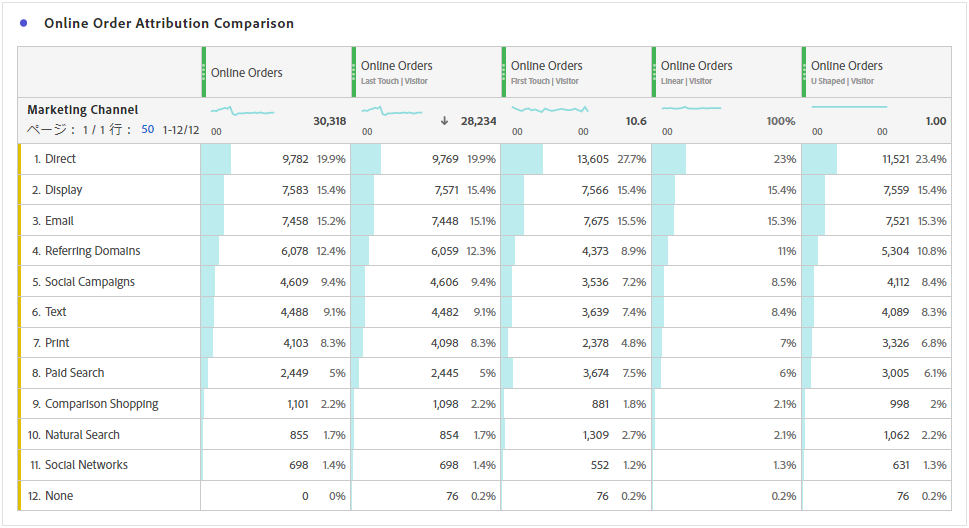
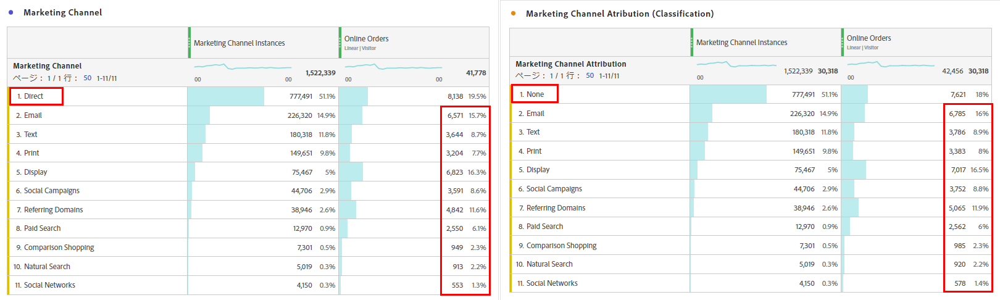
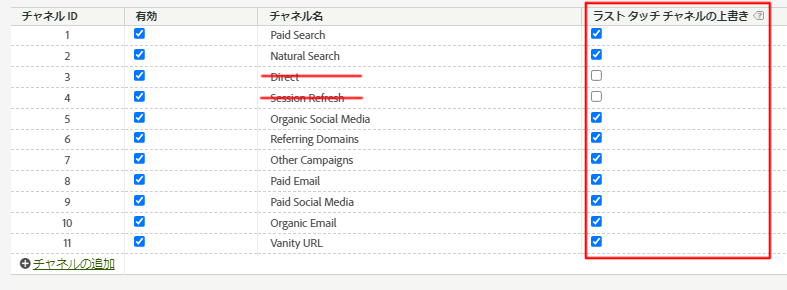
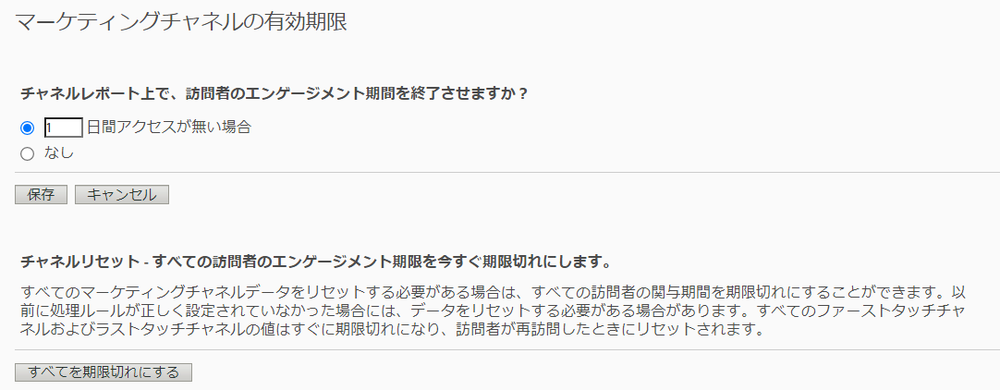

# Attribution とマーケティングチャネルの連携 - ベストプラクティス

[マーケティングチャネル](/help/components/c-marketing-channels/c-getting-started-mchannel.md)は、Adobe Analytics の有益で強力な機能です。 マーケティングチャネルの実装に関する現在のガイダンスは、[Attribution](/help/analyze/analysis-workspace/attribution/overview.md) も [Customer Journey Analytics](https://experienceleague.adobe.com/docs/analytics-platform/using/cja-usecases/marketing-channels.html?lang=ja#cja-usecases) も存在しなかった頃に作成されています。

マーケティングチャネル実装の将来性を確保をし、Attribution や Customer Journey Analytics との一貫性をレポートで確実に保つために、アドビでは更新された一連のベストプラクティスを発行しています。 既にマーケティングチャネルを使用している場合は、これらの新しいガイドラインの中から最適なオプションを選択できます。 マーケティングチャネルを初めて使用する場合は、すべての新しいベストプラクティスに従うことをお勧めします。

マーケティングチャネルが初めて導入された際にあったディメンションはファーストタッチとラストタッチのみでした。 現在のバージョンのアトリビューションでは、明示的なファーストタッチディメンションとラストタッチディメンションは不要になりました。 アドビでは、汎用の「マーケティングチャネル」ディメンションと「マーケティングチャネルの詳細」ディメンションを提供し、それらを目的のアトリビューションモデルで使用できるようにしています。 これらの汎用ディメンションは、「ラストタッチチャネル」ディメンションと同じように動作しますが、異なるアトリビューションモデルでマーケティングチャネルを使用する際の混乱を防ぐために、異なるラベルが付けられています。

マーケティングチャネルのディメンションは、（処理ルールで定義された）従来の訪問の定義に依存するので、仮想レポートスイートを使用して訪問の定義を変更することはできません。 これらの修正済みのプラクティスにより、アトリビューションとAdobe Analyticsで、明確で管理されたルックバックウィンドウを実現できます。

## ベストプラクティス #1：制御された分析に Attribution を活用

マーケティングチャネル分析を微調整するには、既存のマーケティングチャネルアトリビューションではなく [Attribution](/help/analyze/analysis-workspace/attribution/overview.md) を使用することをお勧めします。 他のベストプラクティスに従って、Attribution を使用した分析との一貫性と堅牢な制御を確保します。

* 「マーケティングチャネル」と「マーケティングチャネルの詳細」ディメンションの設定では、各マーケティングチャネルインスタンスに対応する、評価対象タッチポイントを設定します。
* 指標分析では、組織は1つ以上のアトリビューションモデルを調整する必要があります。 このモデルでカスタム指標を保存すると、簡単に再利用できます。
* デフォルトでは、データはラストタッチと訪問者エンゲージメント期間の設定を使用して割り当てられます。 Attribution 指標モデルは、ルックバックウィンドウの管理を強化し、[アルゴリズムアトリビューション](/help/analyze/analysis-workspace/attribution/algorithmic.md#analysis-workspace)をはじめとする多様な手法を提供します。

## ベストプラクティス #2：「直接」および「セッション更新」チャネル定義がない

「直接」および「内部／セッション更新」チャネルをカスタムアトリビューションモデルで使用することはお勧めしません。

組織で「直接」および「セッション更新」が既に設定されている場合は、どうすればよいでしょうか。 この場合、Adobeでは、ファーストタッチ/ラストタッチ用の分類[&#128279;](/help/admin/tools/manage-rs/edit-settings/marketing-channels/classifications-mchannel.md)を作成し、ダイレクトチャネルとセッションリフレッシュチャネルを未分類のままにすることをお勧めします。 分類されたディメンションでは、これらのチャネルが設定されなかった場合と同様のアトリビューション結果が得られます。

これらのチャネルを無効にし、マーケティングチャネルの処理ルールを削除すると、結果は分類アプローチとは若干異なります。 値`None`は、どのマーケティングチャネル処理ルールにも一致しない訪問を表します。 チャネルに一致しない訪問が、チャネルに一致する訪問に続く場合、違いが表示される場合があります。

カスタムアトリビューションモデルを使用して、ルックバックウィンドウとアトリビューションモデルを適用することは、いずれの場合でも可能です。

## ベストプラクティス #3：すべてのチャネルに対してラストタッチチャネルの上書きを有効にする

Workspace のマーケティングチャネルディメンションで使用されるカスタムアトリビューションモデルは、この設定が有効な場合に最も適しています。 この設定を有効にすると、新しいチャネル／詳細が見つかった場合にマーケティングチャネルインスタンスがカウントされます。 「直接」と「内部／セッション更新」を除くすべてのチャネルに対してこの機能を有効にする必要があります。この 2 つをカスタムアトリビューションモデルで使用することは推奨されなくなっています。

## ベストプラクティス #4：訪問者エンゲージメント期間の最小化

訪問者エンゲージメント期間を最小である「1 日」に設定すると、値が持続する可能性を最小限に抑えることができます。 カスタムアトリビューションモデル（AIQ）では柔軟なルックバックウィンドウを許可するので、この設定の影響を最小限に抑えるために、最小値を設定することをお勧めします。

## ベストプラクティス #5：マーケティングチャネルの処理ルールは有効なチャネルに対してのみ存在する

無効なチャネルに対するマーケティングチャネルの処理ルールをすべて削除してください。 ルールは、有効として確認されているマーケティングチャネルに対してのみ存在する必要があります。
