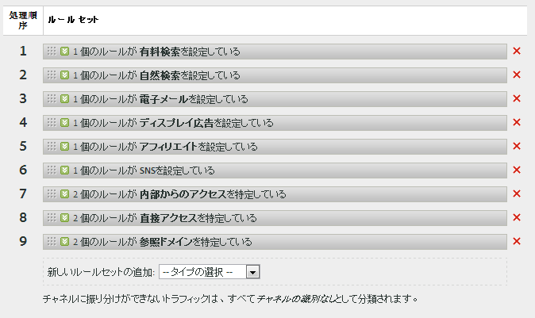
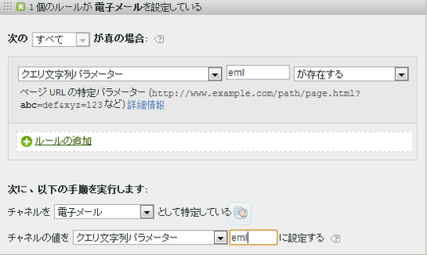

# マーケティングチャネルの処理ルールの作成

訪問者のヒットがチャネルに割り当てられた条件を満たすかどうかを判断するためのマーケティングチャネルの処理ルールを作成します。

この手順では、例として電子メールルールを使用します。この例では、マーケティングチャネルマネージャーページのチャネルのリストに電子メールチャネルを追加済みであることを前提としています。

1. **[!UICONTROL Analytics]** / **[!UICONTROL 管理者]** / **[!UICONTROL レポートスイート]**&#x200B;の順にクリックします。
1. レポートスイートを選択します。

   レポートスイートでチャネルが定義されていない場合、[!UICONTROL マーケティングチャネル ：自動セットアップ]ページが表示されます。

   詳しくは、[自動セットアップの実行](/help/components/c-marketing-channels/c-channel-autosetup.md)を参照してください。

1. Click **[!UICONTROL Edit Settings]** &gt; **[!UICONTROL Marketing Channels]** &gt; **[!UICONTROL Marketing Channel Processing Rules]**.

   

1. From the **[!UICONTROL Add New Rule Set]** menu, select **[!UICONTROL Email]**.

   これにより、チャネルを選択するのではなく、必要なパラメーターを持つルールを挿入するテンプレートを選択することになります。

   

   ブール値論理（if／then 文）を使用してルールを設定します。例えば、電子メールチャネルルールでは次のルール文で強調した設定または情報を提供します。

   `"If **[!UICONTROL All]** or **[!UICONTROL Any]** of the following are true:  **[!UICONTROL Query String Parameter]** *<value>* **[!UICONTROL exists]**...`

   `"Then identify the channel as **[!UICONTROL Email]**...`

   `"Then set the channel's value to **[!UICONTROL Query String Parameter]** *<value>*."`

   In this example, *`<value>`* is the query string parameter that you use for your email campaign, such as *`eml`*.
1. To continue creating rules, click **[!UICONTROL Add Rule]**.
1. ルールに優先順位を付けるには、目的の位置にルールをドラッグアンドドロップします。
1. Click **[!UICONTROL Save.]**

>[!MORE_LIKE_THIS]
>
>* [よくある質問と例](/help/components/c-marketing-channels/c-faq.md)

