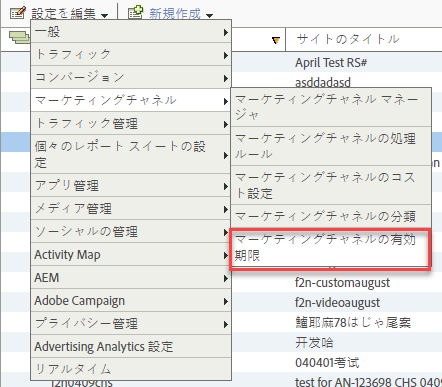

# 訪問者のエンゲージメント期間

マーケティングチャネルで訪問者のエンゲージメント期間を指定する方法について説明します。

## Visitor engagement expiration {#topic_32ADFDB12D3A4F35843A4545AC97C49F}

マーケティングチャネルで訪問者のエンゲージメント期間を指定する方法について説明します。

訪問者のエンゲージメント期間とは、訪問者のサイトにおけるアクティビティをどれだけの期間、ファーストタッチチャネルに関連付けるかということです。

例えば、訪問者は有料検索キャンペーンをクリックスルーして、製品を買い物かごに追加しますが、コンバージョンイベントに到達する前にセッションを終えることがよくあります。この訪問者が後で再来訪して購入した場合、前回のアクティビティと今回のアクティビティのどちらが 1 回のエンゲージメントとしてカウントされるかを指定できます。デフォルトの期間設定は 30 日間です。

| フィールド | 定義 |
|--- |--- |
| 日間アクセスが無い場合 | 訪問者のファーストタッチエンゲージメント期間の期限が切れるまでの日数。デフォルト値は 30 です。 |
| なし |  訪問者のエンゲージメント期間の期限は切れません。 |
| チャネルリセット | すべての訪問者のエンゲージメント期間を今すぐ期限切れにします。すべてのマーケティングチャネルデータをリセットする必要がある場合は、すべての訪問者のエンゲージメント期間を期限切れにすることができます。以前に処理ルールが正しく設定されていなかった場合には、データをリセットする必要がある場合があります。すべてのファーストタッチチャネルおよびラストタッチチャネルの値はすぐに期限切れになり、訪問者が再訪問したときにリセットされます。 |

## 訪問者のエンゲージメント期間の指定 {#task_A8B8B5A07C5A4882BB895252A018FDED}

訪問者のエンゲージメント期間を指定します。

1. **[!UICONTROL Analytics]** / **[!UICONTROL 管理者]** / **[!UICONTROL レポートスイート]**&#x200B;の順にクリックします。
1. [!UICONTROL Report Suite Manager]で、設定 **[!UICONTROL を編集]** / **[!UICONTROL マーケティングチャネル]** / **[!UICONTROL マーケティングチャネルの有効期限]**&#x200B;をクリックします。

   

1. 訪問者のエンゲージメント期間のフィールドを設定します。
1. Click **[!UICONTROL Save.]**
