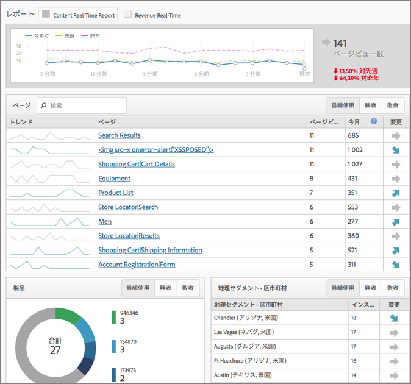

# リアルタイムレポートの概要

リアルタイムレポートは Web ページのトラフィックを表示し、ページビューをリアルタイムでランク付けします。ビジネス上の意思決定の基になる実行可能なデータを提供します。

>[!NOTE]
>
>リアルタイムレポートでは、追加の実装やタギングは必要ありません。Adobe Analytics の既存の実装が使用されます。リアルタイムレポートの設定については、[リアルタイムレポートの設定](/help/components/c-real-time-reporting/t-realtime-admin.md)を参照してください。

**[!UICONTROL サイト指標]**／**[!UICONTROL リアルタイム]**

リアルタイムレポートを使用すると、自分のサイトの傾向とその理由を把握できます。この機能を使用すると、マーケティング担当者はマーケティングコンテンツとキャンペーンの結果にすばやく対応し、その結果を自発的に管理できます。レポートされるリアルタイムデータは 2 分未満のもので、1 分ごとに自動更新されます。

ダッシュボードには Adobe Analytics の高頻度指標とサイト分析が含まれており、動的なニュースおよび小売業用 Web サイトのトラフィックとページビューの傾向を視覚的にレポートします。リアルタイムレポートでは、数秒間の収集で分刻みのデータ傾向を把握できます。この機能では、コンテンツのリアルタイムクロス集計と追跡およびいくつかのコンバージョンを使用して、収集したデータを自動更新 UI にストリームします。

リアルタイムレポートを使用する状況として最も一般的なシナリオが 2 つあります。1 つは、ユーザーアクティビティの変化に伴ってストーリーを昇格／降格させる投稿者が含まれるシナリオ、もう 1 つは、新しい製品ラインの発売を追跡するマーケティング担当者が含まれるシナリオです。

管理者として、次の操作をおこなうことができます。

* 既存のディメンションまたは分類および指標を使用して、レポートスイートあたり最大 3 つのリアルタイムレポートを作成できます。セカンダリディメンションを使用して、プライマリディメンションとのクロス集計を作成できます。
* 1 サイト規模の指標だけでなく、レポートあたり 3 つのディメンション（または分類）（1 つのプライマリと 2 つのセカンダリ）を追加できます。
* 任意のカスタムイベント、買い物かごイベントまたはインスタンスを使用できます。
* 最大 2 時間の履歴リアルタイムデータを表示し、この設定を変更できます。

   * 過去 15 分間：精度 1 分
   * 過去 30 分間：精度 1 分
   * 過去 1 時間：精度 2 分
   * 過去 2 時間：精度 4 分

* 例えば、先週の値と昨年の値（および今日の合計）を比較することができます。

永続性の概念がないので、eVar（コンバージョン指標）はサポートされないことに注意してください。コンバージョン指標を選択することはできますが、それが機能するのは、ディメンションと同じページに設定されている場合のみです。詳しくは、[リアルタイムレポートの設定](/help/components/c-real-time-reporting/t-realtime-admin.md)を参照してください。

リアルタイムレポートの設定および表示をおこなうことができるのは、管理者または「全レポートアクセス」および「高度なレポート機能」権限グループのユーザーに制限されています。ただし、リアルタイムは権限を重視します。例えば、売上高を表示する権限がないユーザーは、売上高データを含むリアルタイムレポートを表示できません。

## A4T 設定によるデータ遅延{#section_806CE36354FC4C539A0DED9266A5C704}

Adobe [!DNL Target] で A4T 統合を有効にすると、Adobe Analytics で 5～10 分の待ち時間が追加で発生します。この追加の待ち時間は、Analytics と [!DNL Target] からのデータを同じヒットに格納することによって、ページおよびサイトセクションによってテストを分類できるようにするためのものです。

この追加の待ち時間は、ライブストリームやリアルタイムレポートなどのすべての Adobe Analytics サービスおよびツールで発生します。追加の待ち時間が発生する対象となるヒットは次のとおりです。

* ライブストリーム、リアルタイムのレポートと API リクエスト、トラフィック変数の現在のデータでは、追加のデータ ID が設定されたヒットのみが遅延します。
* コンバージョン指標の現在のデータ、ファイナライズされたデータ、データフィードでは、すべてのヒットが追加で 5 ～ 7 分遅延します。

この統合を完全に実装していなくても、ID サービスを導入すると追加の待ち時間が発生することに注意してください。
