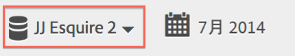
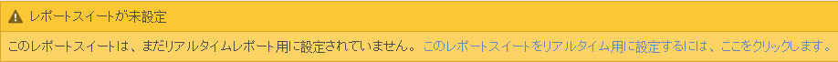
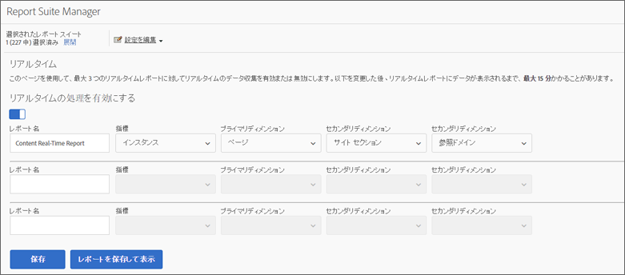
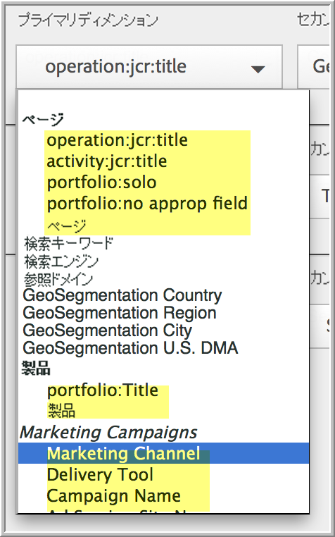
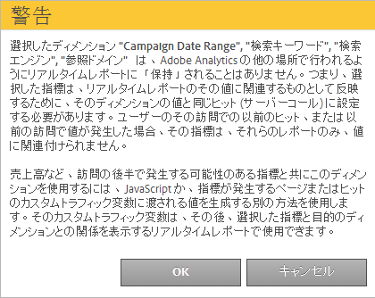

# リアルタイムレポートの設定

リアルタイムレポートを設定するための管理者の手順です。

[!UICONTROL Reports&amp; Analytics] 内でリアルタイムレポートを設定するには、レポートスイートを選択し、そのレポートスイートに対して最大3つのレポートを設定します。

1. リアルタイムレポートを有効にするレポートスイートを選択します。

   **[!UICONTROL Analytics]** / **[!UICONTROL レポート]** /すべてのレポート **[!UICONTROL を表示/サイト指標]** / **[!UICONTROL リアルタイム]** に移動し、上部のドロップダウンからレポートスイートを選択します。

   

   リアルタイムレポート用に設定されていないレポートスイートのリアルタイムレポートを表示しようとすると、メッセージが表示されます。このメッセージから、レポートスイートの設定を実行できます。

   

1. **[!UICONTROL 「設定」]** （歯車アイコン）をクリックして [!UICONTROL 、Report Suite Managerを実行]します。

   **[!UICONTROL （Analytics]** / **[!UICONTROL 管理者/レポートスイート]** /設定 **[!UICONTROL の編集]** / **[!UICONTROL リアルタイムからも利用できます）]**。

1. Turn on the **[!UICONTROL Enable Real-Time]** setting.
1. 最大 3 つのレポートに対してリアルタイムデータ収集を設定し、レポートあたり 1 つの指標と 3 つのディメンションまたは分類を使用できます。

   

   For information on supported real-time metrics and dimensions, see [Supported Metrics and Dimensions](../../components/c-real-time-reporting/realtime-metrics.md#concept_B86D8DF89AD448839332AD84B1DF2AE7).

   分類を作成している場合は、定義されているディメンションの下に、それらの分類がインデントして表示されます。

   

   >[!NOTE]
   >
   >単一のリアルタイムレポートでは、ディメンションごとに異なる分類が選択されていても、ディメンションの複製を有効にすることは現在サポートされていません。

   For more information about classifications, see [About Classifications](../../components/c-classifications2/c-classifications.md#concept_4CEC7FF1A9E24204A7DA6B9AC70709DE).

   >[!NOTE]
   >
   >「検索キーワード」や「製品」などのディメンションは、Adobe Analyticsのどこでも同様にリアルタイムで保持されません。永続的ではない指標を選択すると、次の警告が表示されます。

   

1. Click **[!UICONTROL Save]** or **[!UICONTROL Save and View Report]**.

   この最初のレポート設定の後、データのストリーミングが開始されるまでに最大 20 分間かかることがあります。それ以降はデータをすぐに使用できます。リアルタイムレポートの表示については、「[リアルタイムレポートの実行](https://marketing.adobe.com/resources/help/en_US/sc/user/reports_realtime.html)」を参照してください。

1. デフォルトでは、すべてのユーザーがリアルタイムレポートにアクセスします。
