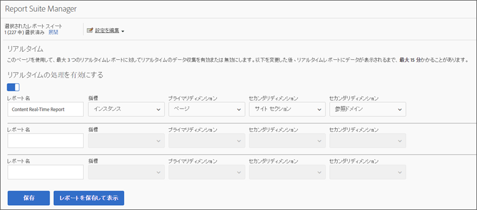
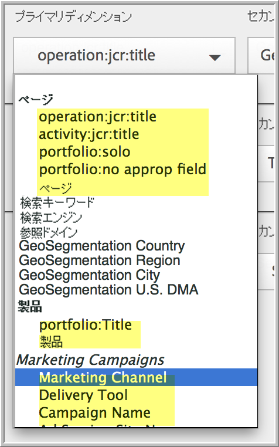

# リアルタイムレポートの設定

次の情報には、リアルタイムレポートを設定するための管理手順が含まれています。

これには、レポートスイートを選択し、最大3つのレポートを設定します。

1. リアルタイムレポートを有効にするレポートスイートを選択します。

   1. Analysis Workspaceで、「[!UICONTROL **Workspace**]」タブを選択し、[!UICONTROL **レポート**] > [!UICONTROL **エンゲージメント**] > **[!UICONTROL リアルタイム]**」を選択します。

   1. 上部のドロップダウンからレポートスイートを選択します。

      

      リアルタイムレポート用に設定されていないレポートスイートのリアルタイムレポートを表示しようとすると、メッセージが表示されます。このメッセージから、レポートスイートの設定を実行できます。

      

1. **[!UICONTROL 設定]**&#x200B;を選択して、[!UICONTROL  レポートスイートマネージャー]を実行します。

   （**[!UICONTROL Analytics]**／**[!UICONTROL 管理者／レポートスイート]**／**[!UICONTROL 設定を編集]**／**[!UICONTROL リアルタイム]**&#x200B;から Report Suite Manager にアクセスすることもできます）

1. 「**[!UICONTROL リアルタイムの処理を有効にする]**」設定をオンにします。
1. 最大 3 つのレポートに対してリアルタイムデータ収集を設定し、レポートあたり 1 つの指標と 3 つのディメンションまたは分類を使用できます。

   

   サポートされるリアルタイム指標とディメンションについて詳しくは、「[サポートされる指標とディメンション](/help/admin/tools/manage-rs/edit-settings/realtime/realtime-metrics.md)」を参照してください。

   分類を作成している場合は、定義されているディメンションの下に、それらの分類がインデントして表示されます。

   

   >[!NOTE]
   >
   >単一のリアルタイムレポートの場合、ディメンションごとに異なる分類が選択されていても、ディメンションの複製を有効にすることは現在サポートされていません。

   >[!NOTE]
   >
   >「検索キーワード」や「製品」などのディメンションが Adobe Analytics と同じようにリアルタイムで保持されるとは限りません。 永続的ではない指標を選択すると、次の警告が表示されます。

   

1. **[!UICONTROL 保存]**&#x200B;または&#x200B;**[!UICONTROL 保存してレポートを表示]**&#x200B;を選択します。

   この最初のレポート設定の後、データのストリーミングが開始されるまでに最大20分かかる場合があります。 その後、データはすぐに利用可能になります。

1. デフォルトでは、すべてのユーザーがリアルタイムレポートにアクセスします。
