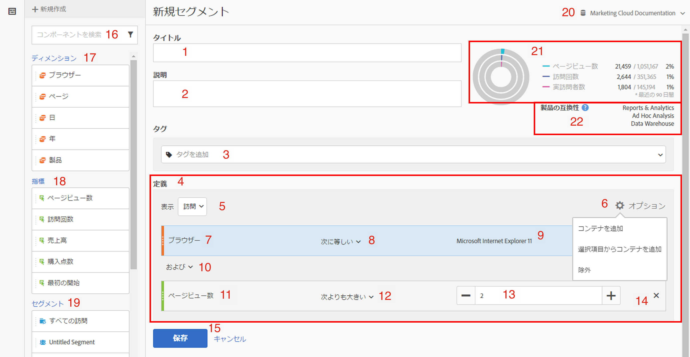
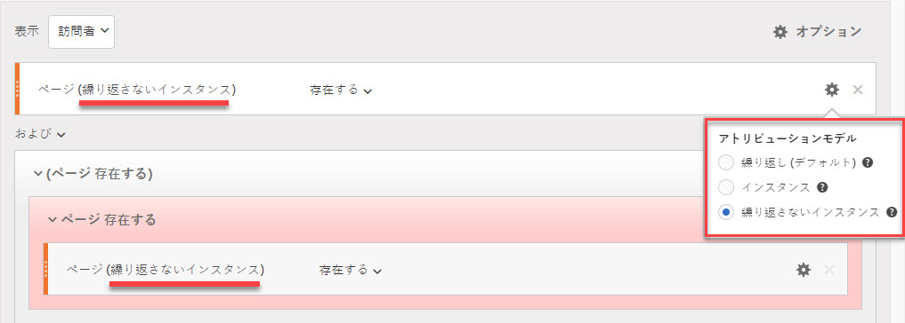
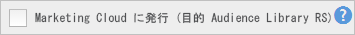
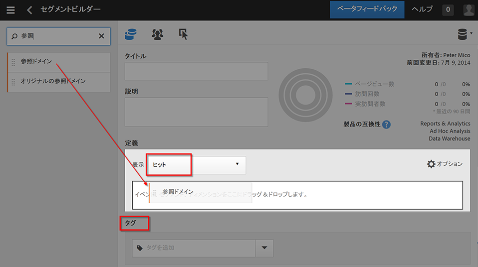
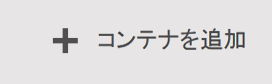
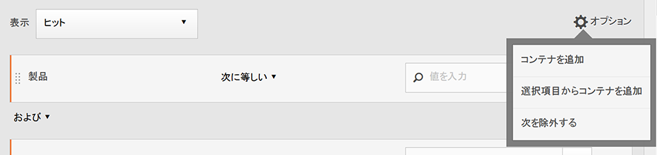
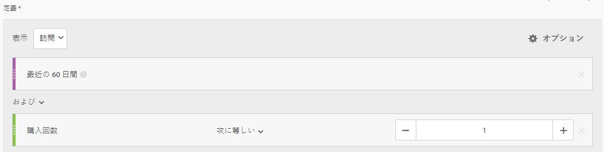
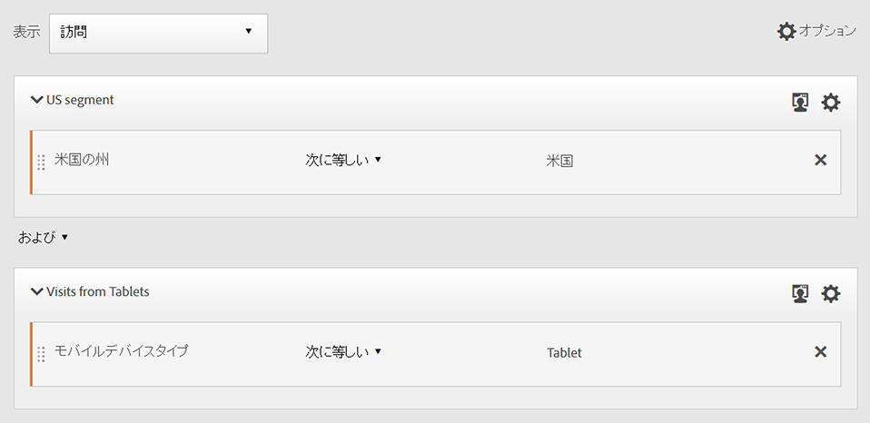
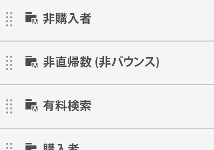
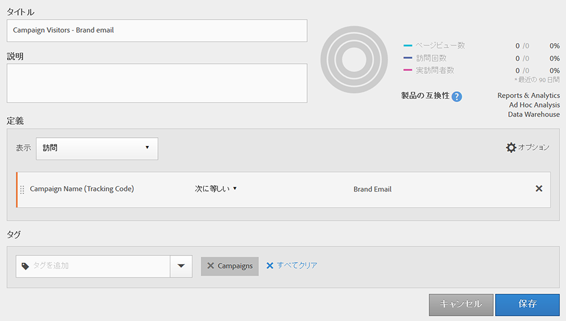

# セグメントビルダー

セグメントビルダーのキャンバスに指標ディメンション、セグメントおよびイベントをドラッグ＆ドロップすることで、コンテナ階層の論理、ルールおよび演算子に基づいて訪問者をセグメント化します。この統合開発ツールを使用すると、訪問やページヒットを対象として訪問者の属性やアクションを識別する、簡単な、または複雑なセグメントを作成し、保存できます。

[!UICONTROL セグメントビルダー]のキャンバスに指標ディメンション、セグメントおよびイベントをドラッグ＆ドロップすることで、コンテナ階層の論理、ルールおよび演算子に基づいて訪問者をセグメント化します。この統合開発ツールを使用すると、訪問やページヒットを対象として訪問者の属性やアクションを識別する、簡単な、または複雑なセグメントを作成し、保存できます。

>[!IMPORTANT]
>
>2019年6月リリースのディメンションアトリビューションモデルを導入しました。以下のWeb UI機能の#6を参照してください。

セグメントビルダーにアクセスする方法はいくつかあります。

* **Analytics上ナビゲーション:****[!UICONTROL Analytics]** / **[!UICONTROL コンポーネント]** / **[!UICONTROL セグメント]**&#x200B;をクリックします。
* **[!UICONTROL Analysis Workspace]:****[!UICONTROL Analytics]** / **[!UICONTROL ワークスペースをクリック]**&#x200B;し、プロジェクトを開き **[!UICONTROL 、+新規]** /セグメント **[!UICONTROL を作成をクリック]**&#x200B;します。
* **[!UICONTROL Reports&amp; Analytics]:****[!UICONTROL Analytics]** / **[!UICONTROL レポートをクリック]**&#x200B;し、既存のレポートを開き、左側のナビゲーションのセグメントアイコン  をクリックして、 **[!UICONTROL 「追加]**」をクリックします。
* **[!UICONTROL Ad Hoc Analysis]:**[Ad Hoc Analysisのセグメントの作成](../../../components/c-segmentation/c-segmentation-workflow/seg-build.md#section_E440630183D64999BA2369D1B8048AA6)を参照してください。
* **[!UICONTROL Report Builder]:**[Report Builderでのセグメントの追加または編集](https://marketing.adobe.com/resources/help/en_US/arb/segmentation.html)。

## Segment Builder user interface {#concept_643F2DF74C544796B58F4656ABC5F726}

[!UICONTROL セグメントビルダー]を使用すると、訪問やページヒットを対象として訪問者の属性やアクションを識別する、セグメントを作成できます。セグメントビルダーのキャンバスに、指標ディメンション、イベントまたはその他のセグメントをドラッグ＆ドロップすることで、階層ロジック、ルールおよび演算子に基づいて訪問者をセグメント化できます。

## Web UI 機能 {#section_F61C4268A5974C788629399ADE1E6E7C}

[!UICONTROL セグメントビルダー]では、Web UI（または [Ad Hoc Analysis の Java UI](../../../components/c-segmentation/c-segmentation-workflow/seg-workflow.md#section_E440630183D64999BA2369D1B8048AA6)）でセグメントを構築および編集できます。セグメントにルール定義やコンテナを追加して、セグメントの改良、積み重ね、ネストをすることができます。また、現在のセグメント定義から、結果に含まれるページビュー数、訪問回数および個別訪問者数を検証することもできます。その後、今後必要になる場合に備えてセグメントを保存します。

セグメントビルダーにアクセスするには、次の方法があります。

* 既存のレポートを表示して、左側のナビゲーションでセグメントアイコン In the segment rail that displays, click **[!UICONTROL Add]**.

* From within the Segment Manager, clicking **[!UICONTROL + Add]**.
* セグメントマネージャ内で既存のセグメントタイトルをクリックし、そのセグメントをセグメントビルダーで編集します。

1. **[!UICONTROL タイトル:]** セグメントの名前を付けたり、名前を変更したりできます。
1. **[!UICONTROL 説明:]** セグメントの説明を入力します。セグメントを共有したい場合は、説明を入力する必要があります。
1. **[!UICONTROL タグ:]**[既存のタグのリストから選択するか、新しいタグを作成して、作成し](../../../components/c-segmentation/c-segmentation-workflow/seg-workflow.md#concept_CD892CEB326C4986A1B67487052DBA50) ているセグメントにタグ付けします。
1. **[!UICONTROL 定義:]** ここでは、セグメント の作成と設定、ルールの追加、コンテナのネストと順序付けを行います。コンテナを選択し、ディメンション、セグメントまたは指標を定義にドラッグ＆ドロップすることで、新しいセグメントの説明を提供できます。
1. **[!UICONTROL 表示:]** （トップコンテナセレクター）。Lets you select the top-level [container](../../../components/c-segmentation/seg-overview.md#concept_A38E7000056547399E346559D85E2551) ( [!UICONTROL Visitor], [!UICONTROL Visit], [!UICONTROL Hit]). デフォルトのトップレベルのコンテナは、ヒットコンテナです。
1. **[!UICONTROL オプション:]** （ギア）アイコン

   * **[!UICONTROL +コンテナを追加:]** セグメント定義に新しいコンテナ（トップレベルのコンテナの下）を追加できます。
   * **[!UICONTROL +選択範囲からコンテナを追加:]** 定義フィールドで選択した要素から新しいコンテナを作成できます。
   * **[!UICONTROL 除外:]** 1つ以上のディメンション、セグメントまたは指標を除外してセグメントを定義できます。
   **[!UICONTROL アトリビューションモデル:]** ディメンションセグメント化の場合。ディメンションモデルは、フロービジュアライゼーションをサポートするような順次セグメントで特に便利です。
   * **[!UICONTROL 繰り返し]** （（デフォルト））:ディメンションにインスタンスと永続化された値が含まれます。
   * **[!UICONTROL インスタンス]**:ディメンションのインスタンスが含まれます。
   * **[!UICONTROL 非繰り返しインスタンス]**:ディメンションの一意のインスタンス（非繰り返し）が含まれます。
   

1. **[!UICONTROL ディメンション:]** ディメンションリスト（オレンジ色のサイドバー）からディメンションがドラッグ&amp;ドロップされます。
1. **[!UICONTROL 比較:]** 選択した演算子を使用して、値を比較および制限できます。
1. **[!UICONTROL 値:]** ディメンション、セグメントまたは指標に対して入力または選択した値。
1. **[!UICONTROL AND/OR/THEN:コンテナまたはルール間で]AND/OR/THEN** 演算子を割り当てます。The THEN operator lets you [define sequential segments](../../../components/c-segmentation/c-segmentation-workflow/seg-sequential-build.md#concept_83AEC78CD25F442EBEE364856A889560).
1. **[!UICONTROL 指標]**:（緑のサイドバー）指標リストからドラッグ&amp;ドロップした指標。
1. **[!UICONTROL 比較]** 演算子:選択した演算子を使用して、値を比較および制限できます。
1. **[!UICONTROL 値]**:ディメンション、セグメントまたは指標に対して入力または選択した値。
1. **[!UICONTROL X]**:（削除）セグメント定義のこの部分を削除できます。
1. **[!UICONTROL 保存]** または **[!UICONTROL キャンセル]**:セグメントを保存またはキャンセルします。**[!UICONTROL 「保存」]**&#x200B;をクリックすると、セグメントを管理できるセグメントマネージャーが表示されます。
1. **[!UICONTROL 検索:]** ディメンション、セグメントまたは指標のリストを検索します。
1. **[!UICONTROL ディメンション:]** （リスト）ヘッダーをクリックして展開します。
1. **[!UICONTROL 指標:]** ヘッダーをクリックして展開します。
1. **[!UICONTROL セグメント:]** ヘッダーをクリックして展開します。
1. **[!UICONTROL レポートスイートセレクター:]** このセグメントを保存するレポートスイートを選択できます。セグメントは、すべてのレポートスイートで利用できます。
1. **[!UICONTROL セグメントプレビュー:]** 主要指標をプレビューして、有効なセグメントとセグメントの範囲を確認できます。このセグメントを適用した場合に期待するデータセットの分類を表します。データセットに対してセグメントを実行した結果の[!UICONTROL ヒット数]、[!UICONTROL 訪問]および[!UICONTROL 訪問者]の件数と割合が 3 つの同心円とリストで表示されます。このグラフは、セグメント定義を作成または変更するとすぐに更新されます。
1. **[!UICONTROL 製品の互換性:]** 作成したセグメントの互換性があるAdobe Analytics製品（Analysis Workspace、 [!UICONTROL Reports&amp; Analytics]、Ad Hoc Analysis、Data Warehouse）のリストが表示されます。ほとんどのセグメントは、すべての製品と互換性があります。ただし、演算子とディメンションは、すべての Analytics 製品と互換性があるとは限りません。特に、 [Data Warehouse](../../../components/c-segmentation/seg-reference/seg-compatibility.md#concept_7A2CC00352274A75ACD4949CA3C144D4). このグラフは、セグメント定義を変更するとすぐに更新されます。

   Segments with embedded date ranges continue to operate differently in Analysis Workspace versus [!UICONTROL Reports &amp; Analytics]: In Workspace, a segment with an embedded date range overrides the panel date range. By contrast, [!UICONTROL Reports &amp; Analytics] gives you the intersection of the report date range and the segment's embedded date range.

**[!UICONTROL Experience Cloudに公開（for`<report suite name>`）]**:（画面に表示されません）このオプションは、このセグメントを保存するレポートスイートがExperience Cloudで有効に [なっている場合にのみ表示](../../../components/c-segmentation/c-segmentation-workflow/seg-workflow.md#concept_1E9FC92437D748C392546542B6511D01)されます。By publishing a segment to the Experience Cloud, you can use the segment for marketing activity in the [!UICONTROL Audience Library], [!DNL Target], and [!DNL Audience Manager]. 公開するためには、セグメントタイトルと説明が必須です。

>[!NOTE]
>
>Analytics では、公開されたセグメントを編集または削除できます。セグメントが使用中の場合は、セグメントを編集すると、警告メッセージが表示されます。Adobe [!DNL Target] によって使用されている公開したセグメントは削除できません。

>[!IMPORTANT]
>
>追加の処理遅延を回避するために、Analyticsから20に共有されたオーディエンスの数を制限する必要があります。Analytics から Experience Cloud に共有するオーディエンスの個別メンバーの数が 2,000 万を超えてはなりません。キャッシュの影響で、Analytics で削除したレポートスイートが Experience Cloud に反映されるまで 12 時間かかります。

>[!IMPORTANT]
>
>Once a visitor qualifies for the audience shared from Analytics, there is a 24 - 48 hour delay before that information is actionable in [!DNL Target], [!DNL Advertising Cloud], and [!DNL Campaign].

## Build segments {#section_050E3343533E45C3923242398E0E0213}

1. 左のパネルから、ディメンション、セグメントまたは指標イベントを[!UICONTROL 定義]フィールドにドラッグします。

   

   要素を[!UICONTROL 定義]にドラッグすると、デフォルトのトップレベルコンテナである[!UICONTROL ヒット]が表示されます。**[!UICONTROL 表示]ドロップダウンメニューから、コンテナタイプを訪問または訪問者に変更できます。**

1. [ドロップ](../../../components/c-segmentation/seg-reference/seg-operators.md) ダウンメニューから演算子を設定します。
1. 選択した項目に対して値を入力または選択します。
1. **[!UICONTROL AND]**、 **[!UICONTROL OR]**&#x200B;または **[!UICONTROL THEN]** ルールを使用して、必要に応じてコンテナを追加します。
1. コンテナを配置してルールを設定したら、右上の検証グラフにセグメントの結果を表示します。バリデーターは、作成されたセグメントと一致するページビュー、訪問回数および個別訪問者数の割合と絶対値を示します。
1. **[!UICONTROL 「タグ]**」 [で、既存のタグを選択するか、新しいタグを作成して、コンテナ](../../../components/c-segmentation/c-segmentation-workflow/seg-tag.md#concept_CD892CEB326C4986A1B67487052DBA50) にタグを付けます。
1. 「**[!UICONTROL 保存]」をクリックしてセグメントを保存します。**

[セグメントマネージャ](../../../components/c-segmentation/c-segmentation-workflow/seg-manage.md#concept_7A2E019317864065B7C641DC3315928F)に移動し、セグメントを複数の方法でタグ付け、共有、管理できるようになりました。

## Build and nest containers {#section_1C38F15703B44474B0718CEF06639EFD}

You can [build a framework of containers](../../../components/c-segmentation/seg-overview.md#concept_82653C7E29FE49F5A4B5E5E93B0A6399) and then place logic rules and operators between.

1. **[!UICONTROL オプション/コンテナを追加をクリック]**&#x200B;します。

   

   新しい[!UICONTROL ヒット]コンテナが、[!UICONTROL ヒット]（ページビュー）を識別していない状態で開きます。

   

1. 必要に応じて、コンテナタイプを変更します。
1. 左のパネルから、ディメンション、セグメントまたはイベントをコンテナにドラッグします。
1. Continue to add new containers from the top-level **[!UICONTROL Options]** &gt; **[!UICONTROL Add container]** button at the top of the definition, or add containers from within a container to nest logic.

   **OR**

   Select one or more rules and then click **[!UICONTROL Options]** &gt; **[!UICONTROL Add container from selection]**. 選択が別個のコンテナに変換されます。

## Use date ranges in segments {#concept_252A83D43B6F4A4EBAB55F08AB2A1ACE}

実施中のキャンペーンやイベントに関する質問に回答するため、日付範囲の周期を含むセグメントを構築できます。

例えば、「過去 60 日間に購入したすべてのユーザー」を含むセグメントを容易に構築できます。

訪問コンテナーを作成し、そこに、AND 演算子を使用して、「[!UICONTROL 最近の 60 日間]」という期間と「[!UICONTROL 購入回数が 1 よりも大きいか等しい]」という指標を追加します。

## Stack segments {#task_58140F17FFD64FF1BC30DC7B0A1B0E6D}

セグメントを積み重ねると、各セグメントの条件が「and」演算子で結合され、結合された条件が適用されます。

例えば、「携帯電話ユーザー」セグメントと「米国地域」セグメントを積み重ねると、米国の携帯電話ユーザーのデータのみが返されます。

これらのセグメントは、セグメントライブラリに含めることができる構成要素またはモジュールと見なすことができ、ユーザーが必要に応じてライブラリから利用できます。これにより、必要なセグメントの数を大きく減らすことができます。例えば、次のような 40 個のセグメントがあるとします。

* 各国の携帯電話ユーザー用のセグメントが 20 個（米国の携帯電話ユーザー用、ドイツの携帯電話ユーザー用、フランスの携帯電話ユーザー用、ブラジルの携帯電話ユーザー用など）
* 各国のタブレットユーザー用のセグメントが 20 個（米国のタブレットユーザー用、ドイツのタブレットユーザー用、フランスのタブレットユーザー用、ブラジルのタブレットユーザー用など）

セグメントの積み重ねを使用すると、全体のセグメント数を 22 個に減らし、それらを必要に応じて積み重ねることができます。具体的には、次のようなセグメントを作成する必要があります。

* 携帯電話ユーザー用の 1 つのセグメント
* タブレットユーザー用の 1 つのセグメント
* 各国用の 20 個のセグメント

>[!NOTE]
>
>2つのセグメントを積み重ねると、デフォルトではANDステートメントによって結合されます。これを OR ステートメントに変更することはできません。

1. セグメントビルダーに移動します。
1. セグメントのタイトルと説明を指定します。

   手順1.「**[!UICONTROL 表示 セグメント]」をクリックして、左のナビゲーションにセグメントのリストを表示します。**

   手順1.積み重ねるセグメントをセグメント定義キャンバスにドラッグ＆ドロップします。次に、既存のセグメント Visits from Tablets と US Geo を積み重ねたセグメントの例を示します。

   

1. セグメントを保存します。

   手順の結果

## Use segment templates {#concept_5098446CC78D441E93B8E4D1D1EA6558}

テンプレートは、事前設定済みの古いスイートセグメントを表します。

In the Segment Manager, click **[!UICONTROL Add]**, which takes you to the Segment Builder. Now click the Segments icon  

をクリックします。セグメントのリストの下部にセグメントテンプレートが表示されます。セグメントテンプレートは、テンプレート名の左側にあるフォルダーアイコンで区別できます。

これらのテンプレートを定義キャンバスにドラッグし、定義または変更したときと同様に使用できます。

<table id="table_98B87D807E9344C9BEBF072C65D87B1B"> 
 <thead> 
  <tr> 
   <th colname="col1" class="entry"> テンプレート名 </th> 
   <th colname="col2" class="entry"> 定義 </th> 
  </tr> 
 </thead>
 <tbody> 
  <tr> 
   <td colname="col1"> 買い物かごを放棄 </td> 
   <td colname="col2">商品を買い物かごに追加したが、何も注文しなかった訪問者のデータを表示します。セグメント定義のコンテナは「訪問」です。この順次セグメントのルールは 
 「買い物かごへの追加数が null でない 
 
その場合 
 
注文数が 0 に等しい」です。 
 </td> 
  </tr> 
  <tr> 
   <td colname="col1"> 初回訪問件数 </td> 
   <td colname="col2">最大 1 回訪問した訪問者のデータを表示します。セグメント定義のコンテナは「訪問」です。ルールは 
「訪問回数が 1 と等しい」です。 
 </td> 
  </tr> 
  <tr> 
   <td colname="col1"> 非購入者 </td> 
   <td colname="col2">注文イベントに参加しなかった訪問者のデータを表示します。セグメント定義のコンテナは「訪問者」です。このセグメントでは除外ロジックを使用します。ルールは 
「注文数が null でない」です。 
 </td> 
  </tr> 
  <tr> 
   <td colname="col1"> 非直帰数（非バウンス） </td> 
   <td colname="col2">複数のページを訪問した訪問者のデータを表示します。セグメント定義のコンテナは「訪問者」です。このセグメントでは除外ロジックを使用します。ルールは 
「単一アクセスが null でない」です。 
 </td> 
  </tr> 
  <tr> 
   <td colname="col1"> 有料検索 </td> 
   <td colname="col2">有料検索から訪問した訪問者のデータを表示します。セグメント定義のコンテナは「訪問」です。ルールは 
「有料検索が 1」です。 
 </td> 
  </tr> 
  <tr> 
   <td colname="col1"> 購入者 </td> 
   <td colname="col2">注文イベントを発生させた訪問者のデータを表示します。セグメント定義のコンテナは「訪問者」です。ルールは 
「注文数が null でない」です。 
 </td> 
  </tr> 
  <tr> 
   <td colname="col1"> 再訪問 </td> 
   <td colname="col2">少なくとも 1 回訪問した訪問者のデータを表示します。セグメント定義のコンテナは「訪問」です。ルールは 
「訪問回数が 1 より大きい」です。 
 </td> 
  </tr> 
  <tr> 
   <td colname="col1"> 直帰数 </td> 
   <td colname="col2"> 訪問時に複数のページビューを送信していても、単一のページ値を表示する訪問のデータを表示します。離脱リンクイベントを持つ直帰数がセグメントに含まれます。セグメント定義のコンテナは「訪問」です。ルールは 
「単一ページ訪問件数が 1」です。 
 </td> 
  </tr> 
  <tr> 
   <td colname="col1"> 閲覧された製品がカートに追加されませんでした </td> 
   <td colname="col2">製品を閲覧したが、買い物かごに追加しなかった訪問者のデータを表示します。セグメント定義のコンテナは「訪問」です。この順次セグメントのルールは 
「製品表示が null でない 
 
その場合 
 
 買い物かごへの追加数が 0 に等しい」です。 
 </td> 
  </tr> 
  <tr> 
   <td colname="col1"> キャンペーンからの訪問回数 </td> 
   <td colname="col2">キャンペーンから参照された訪問者のデータを表示します。セグメント定義のコンテナは「訪問」です。ルールは 
「トラッキングコードが null でない」です。 
 </td> 
  </tr> 
  <tr> 
   <td colname="col1"> モバイルデバイスからの訪問 </td> 
   <td colname="col2">モバイルデバイスを使用している訪問者のデータを表示します。セグメント定義のコンテナは「訪問」です。ルールは 
「モバイルデバイスがヌルでない」です。 
 </td> 
  </tr> 
  <tr> 
   <td colname="col1"> 自然検索からの訪問 </td> 
   <td colname="col2">有料検索から訪問していない訪問者のデータを表示します。セグメント定義のコンテナは「訪問」です。ルールは 
「有料検索が 0」です。 
 </td> 
  </tr> 
  <tr> 
   <td colname="col1"> モバイルデバイス以外からの訪問回数 </td> 
   <td colname="col2">モバイルデバイスを使用していない訪問者のデータを表示します。セグメント定義のコンテナは「訪問」です。このセグメントでは除外ロジックを使用します。ルールは 
「モバイルデバイスタイプが携帯電話に等しい」 
 
または 
 
「モバイルデバイスタイプがタブレットに等しい」です。 
 </td> 
  </tr> 
  <tr> 
   <td colname="col1"> 電話からの訪問回数 </td> 
   <td colname="col2">電話を使用している訪問者のデータを表示します。セグメント定義のコンテナは「訪問」です。ルールは 
「デバイスタイプが携帯電話に等しい」です。 
 </td> 
  </tr> 
  <tr> 
   <td colname="col1"> 検索エンジンからの訪問回数 </td> 
   <td colname="col2">検索エンジンから参照された訪問者のデータを表示します。セグメント定義のコンテナは「訪問」です。ルールは 
「リファラータイプが検索エンジンに等しい」です。 
 </td> 
  </tr> 
  <tr> 
   <td colname="col1"> ソーシャルサイトからの訪問件数 </td> 
   <td colname="col2">ソーシャルサイトから参照された訪問者のデータを表示します。セグメント定義のコンテナは「訪問」です。ルールは 
「リファラータイプがソーシャルネットワークに等しい」です。 
 </td> 
  </tr> 
  <tr> 
   <td colname="col1"> タブレットからの訪問回数 </td> 
   <td colname="col2">タブレットを使用している訪問者のデータを表示します。セグメント定義のコンテナは「訪問」です。ルールは 
「デバイスタイプがタブレットに等しい」です。 
 </td> 
  </tr> 
  <tr> 
   <td colname="col1"> 訪問者 ID cookie の訪問 </td> 
   <td colname="col2">持続的 cookie が必要なサイトへの訪問者のデータを表示します。セグメント定義のコンテナは「訪問」です。ルールは 
「持続的 Cookie が 1」です。 
 </td> 
  </tr> 
 </tbody> 
</table>

## Example: Campaign visitors segment {#concept_61AC6115097B4EB3AEFE8CE98F38315D}

頻繁に使用されるこのセグメントの例を示します。

多くの顧客は、特定のキャンペーンに反応を示した訪問者から指標を入手したいと思っています。キャンペーン訪問者セグメントを作成すると、そのデータを容易に取得できます。

このセグメントをセグメントビルダーで作成するには、トップレベルの訪問コンテナから、キャンペーンディメンション（このケースでは「Campaign Name」）をドラッグします。

（オプション）また、このセグメントにキャンペーンタグを適用すると、キャンペーン関連のすべてのセグメントを容易にフィルタリングできます。
