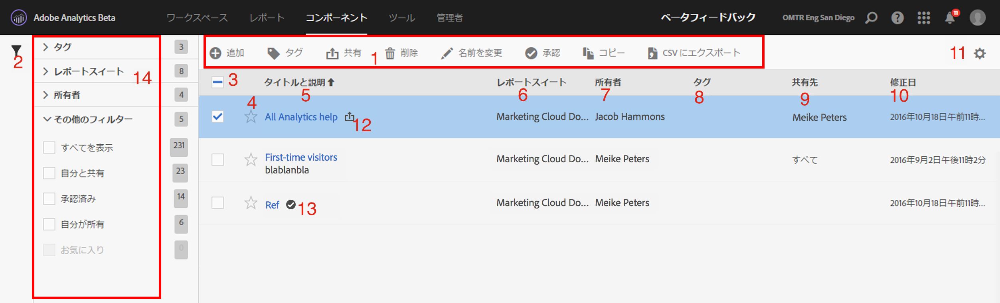
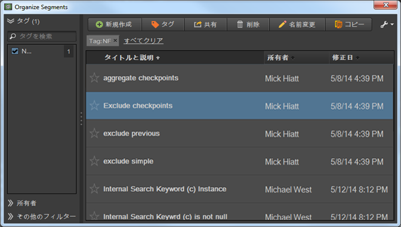

# セグメントの管理

セグメントマネージャでは、セグメントを様々な方法で管理できます。例えば、共有、フィルターを適用、タグ付け、承認、コピー、削除およびお気に入りへの登録が可能です。

Analytics セグメントマネージャには、自分が所有しているすべてのセグメントと、自分が共有しているセグメントが表示されます。管理者レベルのユーザーは、組織内のすべてのセグメントを表示できます。この概要では、セグメントマネージャのユーザーインターフェイスと機能について説明します。セグメントビルダーには、次のようにアクセスします

* Going to **[!UICONTROL Analytics]** &gt; **[!UICONTROL Components]** &gt; **[!UICONTROL Segments]** in the top navigation.
* 既存のレポートを表示して、左側のナビゲーションでセグメントアイコン Then click **[!UICONTROL Manage]**.

## ハウツービデオ {#section_B3C5DA22DC5248DBA17C56E03DA2D4F2}

この [Adobe Analytics の YouTube ビデオ](https://www.youtube.com/watch?v=CdfOq98PTrg&index=6&list=PL2tCx83mn7GtHqZicFTa--aE6d02BvvTd)では、セグメントマネージャの使用方法の概要を説明しています。

## セグメントマネージャのユーザーインターフェイス {#section_7FDCD12949BE4741A402DB83AB7B37DF}

| # | UI 機能 | 説明 |
|---|---|---|
| 1 | セグメント管理ツールバー | セグメントをチェックすると、このツールバーが表示されます。ほとんどの管理タスクをこのツールバーから完了できます。 |
| 2 | フィルターを表示する | フィルターアイコンをクリックすると、フィルターメニューが表示されます。「タグ」、「所有者」、「すべてを表示」（管理者のみ）、「自分が所有」、「お気に入り」、「承認済み」および「自分と共有」によってフィルタリングできます。 |
| 3 | チェックボックス | 管理するセグメントをチェックします。 |
| 4 | お気に入り | セグメントの横にある星をクリックすると、星が黄色に変わり、セグメントがお気に入りに登録されます。 |
| 5 | セグメントのタイトルと説明 | セグメントビルダーで提供されます。タイトルと説明を編集するには、タイトルリンクをクリックします。タイトルリンクをクリックすると、セグメントビルダーに戻ります。 |
| 6 | レポートスイート | この列には、セグメントが最後に保存されたレポートスイートが示されます。 |
| 7 | 所有者 | セグメントの所有者が示されます。管理者以外のユーザーは、自分が所有しているまたは自分が共有していたセグメントのみを表示できます。 |
| 8 | タグ（列の選択でチェックされていないので、列は表示されていません） | 自分または自分とセグメントを共有しているユーザーによってセグメントに適用されたタグ。 |
| 9 | 共有先 | 自分がセグメントを共有している個人、グループまたは全員が表示されます。グループまたは全員を表示できるのは管理者のみです。 |
| 10 | 修正日 | セグメントが最後に修正された日付を表示します。 |
| 11 | 列の選択 | セグメントマネージャ内で列を選択または選択を解除します。 |
| 12 | 共有アイコン | 既にこのセグメントを自分が共有していることを示します。 |
| 13 | 承認済みアイコン | このセグメントが管理者によって承認されていることを示します。 |
| 14 | フィルター | タグ、レポートスイート、所有者およびその他（すべてを表示、自分が所有、自分と共有、承認済み、お気に入り）のフィルターを確認および選択できます。 |

## Ad Hoc Analysis でのセグメントマネージャ {#section_CC8BDC968EBC4BC1919870869D8443A9}

Ad Hoc Analysis のセグメントオーガナイザーには、自分が所有しているすべてのセグメントと自分が共有しているセグメントが表示されます。

To access the Segment Organizer in [!DNL ad hoc analysis]:

* 左のパネルにある「**[!UICONTROL セグメント]**」タブに移動し、レンチアイコン ![ をクリックして、メニューから「**セグメントを整理]」を選択します。](assets/wrench_icon.png)[!UICONTROL **

Web ユーザーインターフェイスのセグメントマネージャと同様、このコンソールも複数の機能を備えており、セグメントの共有、タグ付け、承認、コピー、削除、お気に入りへの登録などを行うことができます。
