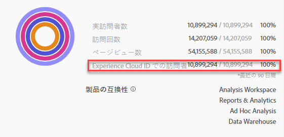

# Experience Cloud へのセグメントの公開

>[!IMPORTANT]
>
>このページで説明するセグメントの投稿およびユーザーインターフェイスに関する遅延の改善は、まだすべての顧客に展開されているわけではありません。 現在の実稼働環境については、ここで説明 [します](https://docs.adobe.com/content/help/en/core-services/interface/audiences/t-publish-audience-segment.html)。

Publishing a segment to the Experience Cloud lets you use the segment for marketing activity in the [!UICONTROL Audience Library], [!DNL Target], [!DNL Audience Manager], and [!DNL Advertising Cloud]. 最近の更新により、投稿ワークフローが大幅に最適化されました。 以前は、使用可能なセグメントの公開には約48時間かかりました。

現在は、処理には最大8時間かかりますが、他のトラフィックやセグメントサイズによっては、処理がさらに高速になる場合があります。 （ただし、現在、セグメントが利用可能になった時点で通知する方法はないので、手動で確認する必要があります）。また、公開可能なセグメントの最大数を20から75に増やしました。 公開済みのセグメントは、コンポーネント/セグメントで表示できます。

## 前提条件

* Ensure that the report suite that you are saving this segment to is [enabled for the Experience Cloud](https://docs.adobe.com/content/help/en/core-services/interface/audiences/t-publish-audience-segment.html). そうしないと、Experience cloudに公開できません。
* Experience cloud組織にマッピングされたレポートスイートで作業し [ていることを確認します](https://docs.adobe.com/content/help/en/core-services/interface/about-core-services/report-suite-mapping.html)。
* 組織でExperience Cloud IDを使用していることを確認します。
* セグメントを公開する前に、管理者は管理コンソールで製品プロファイルに [!UICONTROL Segment Publishing] （セグメント公開）権限を割り当て、製品プロファイルにユーザを追加する必要があります 。

## 注意点

* **レポートスイートの制限**:レポートスイートごとに最大75個のセグメントを公開できます。 この制限は適用されます。 既に75個のセグメントが公開されている場合は、公開を取り消して75個のセグメントしきい値を下回るまで、追加のセグメントを公開することはできません。
* **メンバーシップ**:Analyticsからに共有されるオーディエ [!DNL Experience Cloud] ンスは、2,000万人を超える一意のメンバーを超えることはできません。
* **Data Privacy**:オーディエンスは、訪問者の認証状態に基づいてフィルタリングされません。 訪問者が未認証状態および認証状態でサイトを閲覧できる場合、訪問者が未認証のときに生じるアクションによって、訪問者がオーディエンスに含められる可能性があります。オーディエンス共有がプライバシーに与える影響をすべて理解するには  、Adobe Experience cloudのプライバシーを確認します。
* とのセグメント間の違いにつ **いては、こちらを[!DNL Adobe Analytics]参照[!DNL Audience Manager]**&#x200B;して [ください](https://docs.adobe.com/content/help/en/analytics/integration/audience-analytics/audience-analytics-workflow/aam-analytics-segments.html)。

## セグメント公開タイムライン

| 利用可能な情報 | 利用可能な場合 | 利用可能な場所 |
|---|---|---|
| メタデータ（セグメントのタイトルと定義） | 投稿直後 | [!DNL Audience Manager]、 [!UICONTROL Experience cloudオーディエンスライブラリ]、 [!DNL Target] |
| メンバーシップを持つ使用可能なセグメント | 出版後8時間 | Visitor Profile Viewer in [!DNL Audience Manager] |
| 特性とメンバーシップの母集団 | 24時間以内 | [!DNL Audience Manager] |

## セグメントビルダーでのセ [!UICONTROL グメントの公開]

1. **[!UICONTROL Analytics/ワークスペース/コンポーネント/セグメント]/+に移動します。**
1. セグメントビルダーでセグメン [!UICONTROL トを作成します]。
1. セグメントのタイトルと説明を指定します。指定しないと、セグメントを保存できません。
1. Check **[!UICONTROL Publish this segment to the Experience Cloud (for *report suite*)]**.

>[!IMPORTANT]
>
>Adobe Analyticsの数値とAudience Managerの数値を比較する際に、Analyticsでセグメントプレビューを表示する際に、「個別訪問者数」の合計ではなく、「Experience Cloud IDを持つ訪問者」を使用してください。
>
>

| 要素 | 説明 |
|---|---|
| **[!UICONTROL このセグメントをExperience cloudに公開します(*<report suite>*)]** | このオプションを有効にすると、セグメントのタイトルと定義（広告プラットフォームで頻繁に使用されるシェルオーディエンス）が瞬時にExperience cloudで共有され、セグメントのメンバーシップが4時間ごとに評価および共有されます。   例えば、そのオーディエンスがのアクティビティに関連付け [!DNL Target]られている場合、そのExperience cloudとオー [!DNL Analytics] ディエンスに振り分けられた訪問者のIDの送信を開始 [!DNL Target] します。 At that point, the audience name and corresponding data begins displaying on the Experience Cloud Audiences page.   |
| **[!UICONTROL オーディエンス作成期間]** | 選択した時間枠を使用して、周期的なカレンダーベースでオーディエンスが作成されます。 例えば、「過去30日間」（デフォルト）には、今日の日付から過去30日間（セグメントが作成された元の日付からではなく）のオーディエンス資格を持つ訪問者が含まれます。 |
| **[!UICONTROL オーディエンスライブラリに作成]** | 作成および投稿したセグメントは、Experience cloudオーディエンスライブラリで待ち時間なく使用できます。 Analyticsの更新には依存しません。 これらのセグメントは、公開済みの75個のセグメントの制限に対してはカウントされません。 |
| **[!UICONTROL x of 75発行済み]** | Experience cloudに公開したセグメントの数を表示します。 リンクをクリックすると、公開済みのセグメントと、関連するレポートスイートおよび所有者のリストが表示されます。 |
| **[!UICONTROL 保存]** | このセグメントを保存します。 |

## セグメントの非公開または削除

Experience Cloud に公開されているセグメントを削除するには、まず非公開にする必要があります。セグメントを非公開にするには、公開するために使用したチェックボックスの&#x200B;**チェックを解除**&#x200B;します。

>[!NOTE]
>
>次のいずれかのアドビソリューションで現在使用中のセグメントの公開を取り消すことは&#x200B;**できません**：[!DNL Analytics]（[!DNL Audience Analytics]の場合）、[!DNL Campaign]、[!DNL Advertising Cloud]（[!DNL Core Service]および[!DNL Audience Manager] の顧客の場合）、およびその他すべての外部パートナー（[!DNL Audience Manager] の顧客の場合）。[!DNL Target] で使用中のセグメントを非公開にすることが&#x200B;**できます**。

## セグメントマネージャでのセグメントの公 [!UICONTROL 開状況の表示]

1. [!UICONTROL Analytics/コンポーネント/セグメントに移動します]。
1. 新しい「発行済み  」列に注目します。 はい/いいえは、セグメントがExperience cloudに公開されたかどうかを示します。

## UUIDの取 [!DNL Audience Manager] 得

ブラウザーに現在関連付けられているAAM UUIDを取得するには、次の2つの方法があります。

* Adobe Experience Cloud デバッガー
* ブラウザーのネイティブ開発者ツール（Chrome Developer toolsなど）

次のスクリーンショットは、ブラウザーでAAM UUIDを取得し、Audience Manager訪問者プロファイルビューアーでAAM UUIDを使用して特性とセグメントのメンバーシップを検証する方法を示しています。

**方法1:Adobe Experience cloudデバッガーの使用**

1. Chrome Web Storeで [Adobe Experience Cloud Debugger](https://docs.adobe.com/content/help/en/analytics/implementation/testing-and-validation/debugger.html) をダウンロードしてインストールします。
1. ページの読み込み時にデバッガーを起動します。
1. 「Audience Manager」セクションまでスクロールし、現在のブラウザーページで設定されているAAM UUIDを探します(`50814298273775797762943354787774730612` 以下の例を参照)。

**方法2:Chrome Developer Tools（または他のブラウザー開発者ツール）を使用する**

1. ページを読み込む前にChrome Developer toolsを起動する
1. ページを読み込み、アプリケーション/Cookieを確認します。 AAM UUIDは、サードパーティDemdex cookieに設定する必要があります([下の例では](https://marketing.adobe.com/resources/help/en_US/aam/demdex-calls.html) 、adobe.demdex.net)。 demdexフィールドは、ブラウザー上のAAM UUID設定です(`50814298273775797762943354787774730612` 以下の例を参照)。

## Audience Manager訪問者プロファイル [!UICONTROL ビューアを使用する]

訪問者プロファイルビューアが読み込まれると、ブラウザーのAAM UUIDがデ [!UICONTROL フォルトで使用され] ます。 他のユーザーの特性の関連付けを確認する場合は、「UUID」フィールドにUUIDを入力し、「 [!UICONTROL Refresh」をクリックします]。 詳しくは、訪問者プ [ロファイルビューア](https://marketing.adobe.com/resources/help/en_US/aam/t_visitor_profile_viewer.html) （英語のみ）を参照してください。

## セグメント特性の表示 [!DNL Audience Manager]

AAMでは、AnalyticsがExperience cloudとセグメントを共有するので、特定のセグメントのECIDを持つ訪問者のリストがストリーミング方式で評価されます。

1. で、オ [!DNL Audience Manager]ーディエンスデ [!UICONTROL ータ/特性/Analytics特性に移動します]。 Experience cloud組織にマップされている各Analyticsレポートスイートのフォルダーが表示されます。 これらのフォルダー（特性、セグメントおよびデータソースの場合）は、Profiles &amp; Audiences/Peopleコアサービスが開始またはプロビジョニングされると作成されます。
1. 共有するセグメントを以前に作成したレポートスイートのフォルダを選択します [!DNL Audience Manager]。 作成したセグメント/オーディエンスが表示されます。 セグメントを共有すると、次の2つのことが行われま [!DNL Audience Manager]す。
* 特性が作成されます。まず、データが含まれません。 約 セグメントが公開されてから8時間後に、ECIDのリ [!DNL Analytics]ストがオンボードされ、他のExperience cloudソリューションと共 [!DNL Audience Manager] 有されるようになります。

* 1つの特性セグメントが作成されます。 セグメントを公開したレポートスイートに関連付けられているデータソースを使用します。

## セグメントを [!DNL Adobe Target]

The [!UICONTROL Publish this segment to the Experience Cloud] checkbox during the segment creation process in Adobe Analytics allows the segment to be available within the Adobe Target's custom audience library. Analytics または Audience Manager で作成されたセグメントは、Target のアクティビティで使用できます。例えば、Analytics コンバージョン指標および Analytics で作成されたオーディエンスセグメントに基づいてキャンペーンアクティビティを作成できます。]をクリックし、「オーディエン [!UICONTROL ス]」をクリックします。
1. On the [!UICONTROL Audiences] page, locate the audience sourced from the [!DNL Experience Cloud]. These audiences are available for use in [!DNL Target] activities.

