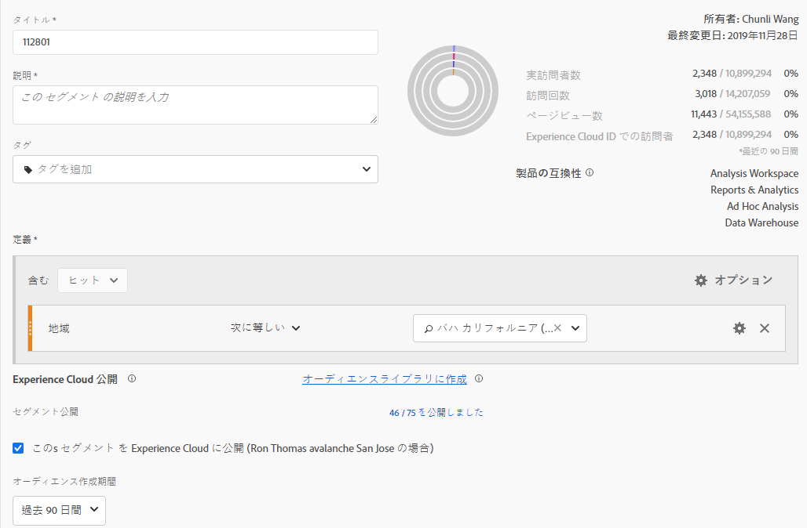
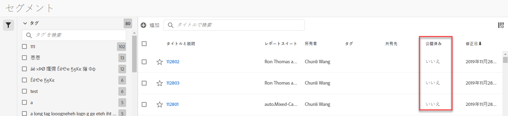

# Experience Cloudへのセグメントの公開

Publishing a segment to the Experience Cloud lets you use the segment for marketing activity in the [!UICONTROL Audience Library], [!DNL Target], [!DNL Audience Manager], and [!DNL Advertising Cloud]. 最新の更新により、投稿ワークフローが大幅に最適化されました。以前は、使用可能なセグメントの公開には約48時間かかりました。現在では、処理には最大8時間かかることがありますが、他のトラフィックやセグメントサイズによって処理がより高速になります。（ただし、現在、セグメントが利用可能なときに通知する手段がないので、手動でチェックする必要があります）。また、公開可能なセグメントの最大数を75（20から）に増やしました。コンポーネント/セグメントで、公開済みのセグメントを表示できます。

## 前提条件

* Ensure that the report suite that you are saving this segment to is [enabled for the Experience Cloud](https://docs.adobe.com/content/help/en/core-services/interface/audiences/t-publish-audience-segment.html). そうしないと、エクスペリエンスクラウドに投稿できません。
* Make sure you are working in a report suite that is [mapped to your Experience Cloud organization](https://docs.adobe.com/content/help/en/core-services/interface/about-core-services/report-suite-mapping.html).
* Before you can publish segments, your Admin needs to assign the [!UICONTROL Segment Creation] and the [!UICONTROL Segment Publishing] permissions to a product profile in the [Admin Console](https://docs.adobe.com/content/help/en/core-services/interface/manage-users-and-products/admin-getting-started.html), and add you to the product profile.

## 注意点

* **レポートスイートの制限**:レポートスイートごとに75個までのセグメントを公開できます。この制限は適用されます。既に75個のセグメントが公開されている場合は、75個のセグメントしきい値を下回るまで、追加のセグメントを公開することはできません。
* **メンバーシップの制限**:Analytics [!DNL Experience Cloud] から共有されるオーディエンスを2,000万人の一意のメンバーを超えることはできません。
* **データプライバシー**:オーディエンスは、訪問者の認証状態に基づいてフィルタリングされません。訪問者が未認証状態および認証状態でサイトを閲覧できる場合、訪問者が未認証のときに生じるアクションによって、訪問者がオーディエンスに含められる可能性があります。Review [Adobe Experience Cloud privacy](https://www.adobe.com/privacy/experience-cloud.html) to understand the full privacy implications of audience sharing.
* For a discussion about the differences between segments in [!DNL Adobe Analytics] and [!DNL Audience Manager], go [here](https://docs.adobe.com/content/help/en/analytics/integration/audience-analytics/audience-analytics-workflow/aam-analytics-segments.html).
* Analytics では、公開されたセグメントを編集または削除できます。セグメントが使用中の場合は、セグメントを編集すると、警告メッセージが表示されます。Adobe [!DNL Target] によって使用されている公開したセグメントは削除できません。

## セグメント公開タイムライン

| 利用可能な機能 | 使用可能な場合 | 利用可能な場所 |
|---|---|---|
| メタデータ（セグメントタイトルおよび定義） | 公開直後 | [!DNL Audience Manager]、 [!UICONTROL Experience Cloudオーディエンスライブラリ]、 [!DNL Target] |
| メンバーシップで使用可能なセグメント | 公開後8時間~8時間 | Visitor Profile Viewer in [!DNL Audience Manager] |
| 特性とメンバーシップの母集団 | 24時間以内 | [!DNL Audience Manager] |

## Publish segments in [!UICONTROL Segment Builder]

1. [!UICONTROL Analytics/ワークスペース/コンポーネント/セグメント] /+に移動します
1. [!UICONTROL セグメントビルダーでセグメントを作成]します。
1. セグメントのタイトルと説明を入力してください。それ以外の場合は保存できません。
1. Check [!UICONTROL Publish this segment to the Experience Cloud (for *report suite*)].

| 要素 | 説明 |
|---|---|
| Publish this segment to the Experience Cloud (for *report suite*) | このオプションを有効にすると、セグメントタイトルと定義（広告プラットフォームで頻繁に使用されるシェルオーディエンスなど）がExperience Cloudと瞬時に共有され、セグメントメンバーシップは4時間ごとに評価および共有されます。  そのオーディエンスがTargetのアクティビティに関連付けられている場合、Analyticsは、そのExperience CloudおよびTargetオーディエンスに振り分けられた訪問者のIDを送信し始めます。At that point, the audience name and corresponding data begins displaying on the Experience Cloud Audiences page.   |
| オーディエンス作成期間 | 選択した期間は、オーディエンスを周期的なカレンダー単位で作成します。例えば、「過去30日間」（デフォルト）には、今日の日付からの過去30日間のオーディエンスの資格があります（セグメント作成時の元の日付からはNOT）。 |
| オーディエンスライブラリに作成 | 作成および公開するセグメントは、Experience Cloudオーディエンスライブラリで遅延なしで使用できます。Analyticsの更新に依存しません。これらのセグメントは、公開されたセグメント75個の制限に対してカウントされません。 |
| x of75Published | エクスペリエンスクラウドに公開したセグメントの数が表示されます。リンクをクリックすると、公開済みセグメントと関連するレポートスイートおよび所有者のリストが表示されます。 |
| 保存 | このセグメントを保存します。 |

## セグメントの非公開

To unpublish a segment, just **unclick** the checkbox that you used to publish it.

## [!UICONTROL セグメントマネージャでのセグメント投稿ステータスの表示]

1. [!UICONTROL Analytics/コンポーネント/セグメントに移動]します。
1. Notice the new [!UICONTROL Published] column. はい/いいえは、そのセグメントがExperience Cloudに公開されているかどうかを示します。

## [!DNL Audience Manager] UUIDの取得と訪問者プロファイルビューアの使用

ブラウザーに現在関連付けられているAAM UUIDをキャプチャするには、2つの方法があります。

* Adobe Experience Cloud デバッガー
* ブラウザーのネイティブ開発者ツール（Chrome Developer Toolsなど）

次のスクリーンショットは、ブラウザー上でAAM UUIDを取得し、それをAudience Manager訪問者プロファイルビューアで使用して特性とセグメントのメンバーシップを検証する方法を示しています。

### 方法1:Adobe Experience Cloud Debuggerを使用する

1. Download and install [Adobe Experience Cloud Debugger](https://docs.adobe.com/content/help/en/analytics/implementation/testing-and-validation/debugger.html) in the Chrome Web Store.
1. ページの読み込み時にデバッガーを起動します。
1. Scroll to the Audience Manager section and find the AAM UUID set on the current browser page
(`50814298273775797762943354787774730612` in the example below)

### 方法2:Chrome Developer Tools（またはその他のブラウザー開発者ツール）を使用

1. ページを読み込む前にChrome Developer Toolsを起動する
1. ページを読み込み、アプリケーション/Cookieをチェックします。The AAM UUID should be set in the 3rd-party
Demdex cookie ([adobe.demdex.net](https://marketing.adobe.com/resources/help/en_US/aam/demdex-calls.html) in the example below). The field demdex is the AAM UUID set
on the browser (`50814298273775797762943354787774730612` in the example below)

## View the segment traits in [!DNL Audience Manager]

AAMでは、特定のセグメントのeIDを持つ訪問者のリストは、AnalyticsがExperience Cloudとの共有セグメントで評価されます。

1. In [!DNL Audience Manager], go to [!UICONTROL Audience Data &gt; Traits &gt; Analytics Traits]. Experience Cloud組織にマッピングされている各Analyticsレポートスイートのフォルダーが表示されます。これらのフォルダー（特性、セグメントおよびデータソース用）は、プロファイルおよびオーディエンス/Peopleコアサービスが開始またはプロビジョニングされると作成されます。
1. Select the folder for the report suite in which you previously created the segment you wanted to share with [!DNL Audience Manager]. 作成したセグメント/オーディエンスが表示されます。When you share a segment, 2 things happen in [!DNL Audience Manager]:
* 特性が作成され、まずデータが含まれません。およそ。8 hours after the segment gets published in [!DNL Analytics], the list of ECIDs gets onboarded and shared with [!DNL Audience Manager] and other Experience Cloud solutions.

* 1つの特性セグメントが作成されます。セグメントを公開したレポートスイートに関連付けられているデータソースを使用します。

## View the segment in [!DNL Adobe Target]

The [!UICONTROL Publish this segment to the Experience Cloud] checkbox during the segment creation process in Adobe Analytics allows the segment to be available within the Adobe Target's custom audience library. Analytics または Audience Manager で作成されたセグメントは、Target のアクティビティで使用できます。例えば、Analytics コンバージョン指標および Analytics で作成されたオーディエンスセグメントに基づいてキャンペーンアクティビティを作成できます。], click [!UICONTROL Audiences].
1. [!UICONTROL オーディエンス] ページで、対象 [!DNL Experience Cloud]のオーディエンスを見つけます。These audiences are available for use in [!DNL Target] activities.
