# 順次セグメントの構築

順次セグメントは、AND や OR ではなく、THEN 演算子を使用して作成されます。THEN は、1 つのセグメント条件が発生すると、もう 1 つのセグメント条件が続くことを示します。デフォルトでは、順次セグメントは、フィルター「全員を含む」を表示し、合致するすべてのデータを識別します。順次セグメントは、「シーケンスの前のみ」および「シーケンスの後のみ」オプションを使用して、さらに合致するヒットのサブセットにフィルタリングできます。

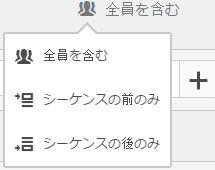

さらに、特定の期間、精度およびチェックポイント間のカウントに順次セグメントを制限することができます。それには、[After および Within 演算子](../../../components/c-segmentation/c-segmentation-workflow/seg-sequential-build.md#concept_07708877D06742998C6237DD9FD194EA)を使用します。

## 全員を含む {#section_75ADDD5D41F04800A09E592BB2940B35}

「全員を含む」が設定されているセグメントを作成すると、そのセグメントでは指定されたパターン全体と一致するパスを識別します。これは、同じ訪問者が訪問したときのヒット（ページ A）に続くヒット（ページ B）を探す基本的なシーケンスセグメントの例です。セグメントを「全員を含む」に設定します。

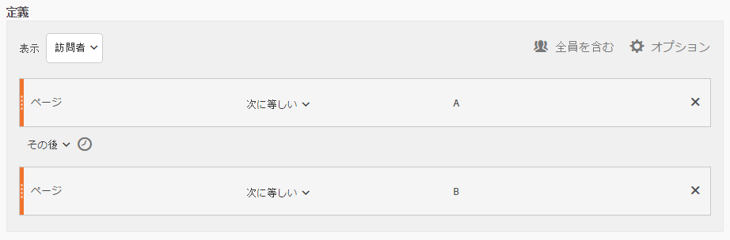

| 結果が | シーケンス |
|--- |--- |
| 一致する | A -&gt; BA -&gt; （別の訪問で） BA -&gt; D -&gt; B |
| 一致しない場合 | B -&gt; A |

## シーケンスの前のみおよびシーケンスの後のみ {#section_736E255C8CFF43C2A2CAAA6D312ED574}

「**[!UICONTROL シーケンスの前のみ]**」および「**シーケンスの後のみ[!UICONTROL 」オプションは、セグメントを特定のシーケンスの前または後のデータのサブセットにフィルタリングします。]**

* **シーケンスの前のみ**：シーケンスの前のすべてのヒットおよびシーケンス自体の最初のヒットが含まれます（例 1、3 を参照）。1 つのパスにシーケンスが複数回現れる場合、「シーケンスの前のみ」には、最後のシーケンスの最初のヒットおよびそれ以前のすべてのヒットが含まれます（例 2 を参照）。
* **シーケンスの後のみ**：シーケンスの後のすべてのヒットおよびシーケンス自体の最後のヒットが含まれます（例 1、3 を参照）。1 つのパスにシーケンスが複数回現れる場合、「シーケンスの後のみ」には、最初のシーケンスの最後のヒットおよびそれ以後のすべてのヒットが含まれます（例 2 を参照）。

例えば、B -&gt; D のシーケンスについて考えてみます。3 つのフィルターは、次のようにヒットを識別します。

**例 1：B の次に D が 1 回現れる**

| 例 | A | B | C | D | E | F |
|---|---|---|---|---|---|---|
| 全員を含む | A | B | C | D | E | F |
| シーケンスの前のみ | A | B |  |  |  |  |
| シーケンスの後のみ |  |  |  | D | E | F |

**例 2：B の次に D が複数回現れる**

| 例 | A | B | C | D | B | C | D | E |
|---|---|---|---|---|---|---|---|---|
| 全員を含む | A | B | C | D | B | C | D | E |
| シーケンスの前のみ | A | B | C | D | B |  |  |  |
| シーケンスの後のみ |  |  |  | D | B | C | D | E |

また、この概念をヒットの深さディメンションに当てはめてみましょう。

**例 3：ヒットの深さ 3 の後に 5**

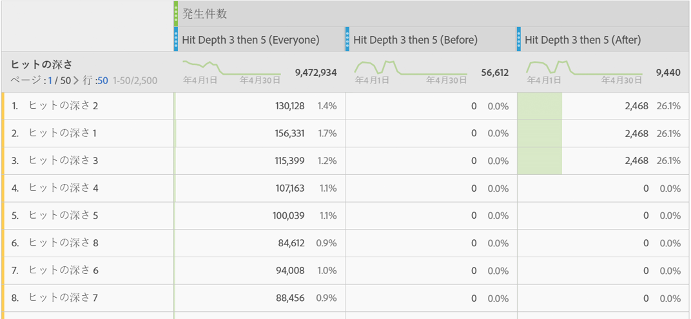

## ディメンション制約 {#section_EAFD755F8E674F32BCE9B642F7F909DB}

「within」句の「THEN」ステートメントの間に、たとえば「within 1 search keyword instance（1 個の検索キーワードのインスタンス内）」や「within 1 eVar 47 instance（1 個の eVar 47 インスタンス内）」というように追加できます。これにより、ディメンションの 1 個のインスタンス内にセグメントが制限されます。

ルールの間に「Within ディメンション」句を設定したセグメントでは、その句を満たすシーケンスにデータを制限できます。制約が「Within 1 page（1 ページ内）」に設定されている以下の例を参照してください。

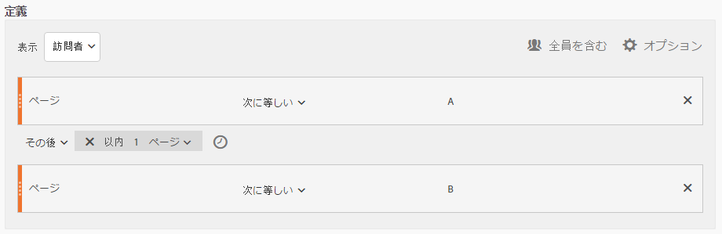

| 結果が | シーケンス |
|--- |--- |
| 一致する | A -&gt; B |
| 一致しない場合 |   A -&gt; C -&gt; B （BはAの1ページ以内ではなかったため）注&#x200B;****&#x200B;意： ディメンションの制限を取り除くと、「A -&gt; B」と「A -&gt; C -&gt; B」の両方が一致します。 |

## 単純なページビューシーケンス

あるページを閲覧した後に別のページを閲覧した訪問者を識別します。以前、過去または中間の訪問セッションまたは間に発生したページビューの時間や数に関係なく、ヒットレベルのデータによって、このシーケンスがフィルターされます。

**例**:訪問者は、ページAを閲覧し、同じ訪問または別の訪問でページBを閲覧した。

**使用例**

次に、セグメントの使用例を示します。

1. スポーツサイトの訪問者がフットボールランディングページを閲覧し、その後、バスケットボールランディングページを閲覧しますが、必ずしも同じ訪問であるとは限りません。これは、フットボールシーズン中のフットボールの閲覧者にバスケットボールに関するコンテンツをプッシュするようにキャンペーンに促します。
1. ある自動車小売店では、顧客の忠誠度ページをランディングページとして閲覧し、その後、同じ訪問または別の訪問でビデオページに移動した訪問者間の関係を識別します。

**このセグメントを作成**

2 つのページルールをトップレベルの[!UICONTROL 訪問者]コンテナ内でネストし、[!UICONTROL THEN] 演算子を使用してページヒットを順番に並べます。

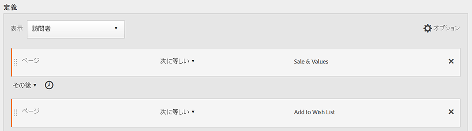

## 訪問間の訪問者シーケンス

キャンペーンからフォールアウトしたが、別のセッションでこのページビューのシーケンスに戻ってきた訪問者を識別します。

**例**:訪問者が1回の訪問でページAを閲覧し、次の訪問でページBを閲覧した。

**ユースケース**

次に、このタイプのセグメントの使用例を示します。

* ニュースサイトのスポーツページを訪問した後、別のセッションでスポーツページを再度訪問します。
* ある衣料品店では、あるセッションでランディングページを閲覧し、さらに、別のセッションでチェックアウトページに直接移動した訪問者間の関係を表示します。

**このセグメントを作成**

この例では、2 つの&#x200B;**[!UICONTROL 訪問]**&#x200B;コンテナをトップレベルの&#x200B;**[!UICONTROL 訪問者]コンテナ内でネストし、[!UICONTROL THEN]演算子を使用してセグメントを順に並べます。**

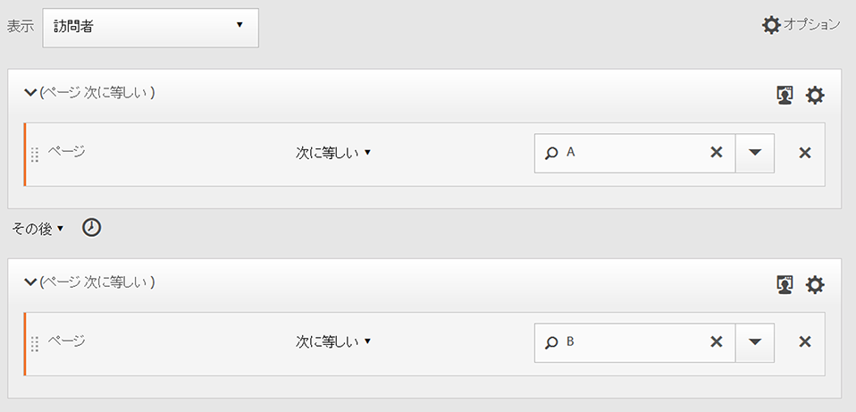

## 混合レベルシーケンス

不明な訪問回数の間に 2 つのページを閲覧し、さらに別の訪問で 3 ページ目を閲覧した訪問者を識別します。

**例**:訪問者は1回以上の訪問でページAを訪問し、次にページBを訪問し、次に別の訪問でページCを訪問します。

**ユースケース**

次に、このタイプのセグメントの使用例を示します。

* 訪問者は、最初にニュースサイトを訪問した後、同じ訪問でスポーツページを閲覧します。さらに、別の訪問でウェザーページを訪問します。
* ある小売店では、メインページの後にマイアカウントページに入る訪問者を定義します。さらに、これらの訪問者は、別の訪問でカートを表示ページを訪問します。

**このセグメントを作成**

1. 左のパネルからトップレベルの「[!UICONTROL 訪問者]」コンテナ内に 2 つのページディメンションをドロップします。
1. これらのページディメンション間に THEN 演算子を追加します。
1. Click **[!UICONTROL Options]** &gt; **[!UICONTROL Add container]** and add a [!UICONTROL Visit] container underneath the [!UICONTROL Visitor] level and sequenced using the [!UICONTROL THEN] operator.

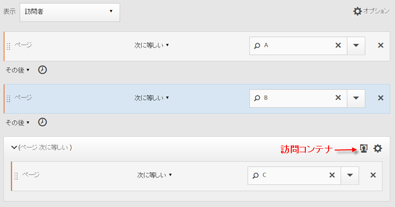

## 集計コンテナ

[!UICONTROL 訪問者]コンテナ内に[!UICONTROL ヒット]コンテナを複数追加すると、同じタイプのコンテナの間に適切な演算子を使用できます。また、ページ数や訪問回数などのルールやディメンションを使用して、ページビューを定義し、[!UICONTROL ヒット]コンテナ内に順次ディメンションを指定することもできます。ヒットレベルでロジックを適用すると、[!UICONTROL 訪問者]コンテナ内で一致した同じレベルのヒットを制限および組み合わせて、様々なタイプのセグメントを作成できます。

**例**：ページビューのシーケンスの最初のヒット（この例ではページ D）の後で、訪問者がページ A を訪問してから、ページ B またはページ C のいずれかを訪問した（訪問回数は不問）。

**ユースケース**

次に、このタイプのセグメントの使用例を示します。

* ある訪問でメインランディングページを訪問し、次の訪問で男性衣料品ページを閲覧し、さらに次の訪問で女性または子供のランディングページを閲覧した訪問者を識別します。
* e-zine で、ある訪問でホームページを閲覧し、次の訪問でスポーツページを閲覧し、さらに次の訪問でオピニオンページを閲覧した訪問者を収集します。

**このセグメントを作成**

1. [!UICONTROL 訪問者]コンテナを、トップレベルのコンテナとして選択します。
1. 2 つの[!UICONTROL ヒット]レベルのコンテナを追加します。このとき、ディメンションには、[!UICONTROL AND] や [!UICONTROL OR] 演算子によって同じ[!UICONTROL ヒット]レベルで結合された適切な数値ディメンションを含めます。
1. 同じ[!UICONTROL 訪問]コンテナ内に、別の[!UICONTROL ヒット]コンテナを追加し、[!UICONTROL OR] または [!UICONTROL AND] 演算子で結合された 2 つの追加の[!UICONTROL ヒット]コンテナをネストします。

   [!UICONTROL THEN] 演算子を使用して、ネストされた[!UICONTROL ヒット]コンテナのシーケンスを作成します。

## 順次セグメント内の「ネスト」

[!UICONTROL 訪問]と[!UICONTROL ヒット]の両方のレベルでチェックポイントを配置することで、特定の訪問に加えて特定のヒット内の要件も満たすようにセグメントに制約をかけることができます。

**例**:訪問者は、同じ訪問でページAを訪問し、次にページBを訪問した。 さらに別の訪問でページ C にアクセスした。

**このセグメントを作成**

1. トップレベルの[!UICONTROL 訪問]コンテナで、2 つのページディメンションをドラッグします。
1. Multi-select both rules, click **[!UICONTROL Options]** &gt; **[!UICONTROL Add container from selection]** and change it to a [!UICONTROL Visit] container.
1. これらのルールを [!UICONTROL THEN] 演算子で結合します。
1. [!UICONTROL 訪問]コンテナのピアとしてヒットコンテナを作成し、ページディメンションをドラッグします。
1. 別の [!UICONTROL THEN] 演算子を追加して、[!UICONTROL 訪問]コンテナ内のネストされたシーケンスを、[!UICONTROL ヒット]コンテナと結合します。

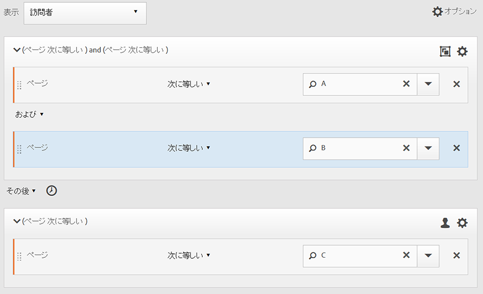

## ヒットの除外

「[!UICONTROL 以下を除外する]」ルールを使用して[!UICONTROL 訪問者]、[!UICONTROL 訪問]または[!UICONTROL ヒット]のデータを明示的に除外しない限り、セグメントルールはすべてのデータを含みます。「以下を除外する」ルールは、一般的なデータを無視して、より焦点を絞ったセグメントを作成するために使用できます。また、検索されたグループを除外するセグメントを作成して、それ以外のデータセットを識別するためにも使用できます。例えば、注文をした成功訪問者を含めたルールを作成した後に成功訪問者を除外することで「非購入者」を識別するという方法が考えられます。ただし、ほとんどの場合は、特定の値を含む対象を識別するために「[!UICONTROL 以下を除外する]」ルールを使用するよりも、広範な値を除外するルールを作成する方が良いでしょう。

以下に例を示します。

* **ページの除外**。セグメントルールを使用して特定のページ（ *`Home Page`*) from a report, create a Hit rule where the page equals "Home Page," and then exclude it. このルールにより、ホームページを除くすべての値が自動的に含まれるようになります。
* **参照ドメインの除外**。Google.com からの参照ドメインのみ含み、その他のすべての参照ドメインを除外するルールを使用します。
* **非購入者の識別**。注文件数が 1 以上の場合を識別して、その[!UICONTROL 訪問者]を除外します。

[!UICONTROL Exclude] 演算子を使用して、特定の訪問またはヒットが訪問者によって実行されないシーケンスを識別できます。[!UICONTROL 除外チェックポイント]も [論理グループ](../../../components/c-segmentation/c-segmentation-workflow/seg-sequential-build.md#concept_23CE0E6071E14E51B494CD21A9799112).

### チェックポイント間の除外

あるチェックポイントが他の 2 つチェックポイント間で明示的に発生しなかった場合に訪問者をセグメント化する論理を強制します。

**例**:ページAを訪問し、その後ページCを訪問したが、ページBを訪問しなかった訪問者。

**ユースケース**

次に、このタイプのセグメントの使用例を示します。

* ライフスタイルページの後、アートページに行かずに、シアターセクションを訪問した訪問者。
* ある自動車販売店では、メインランディングページの後、車両ページに行かずに、キャンペーンに興味なしページに直接移動した訪問者間の関係を表示します。

**このセグメントを作成**

単純な順次セグメント、混合レベル順次セグメントまたはネストされた順次セグメントの場合と同様にセグメントを作成し、コンテナ要素の [!UICONTROL EXCLUDE] 演算子を設定します。 次の例は、集計セグメントです。ここでは、3 つの[!UICONTROL ヒット]コンテナがキャンバスにドラッグされており、コンテナ論理を結合するために [!UICONTROL THEN] 演算子が割り当てられています。その後で、シーケンス内でページ A からページ C に移動した訪問者だけを含めるために中間のページビューコンテナが除外されています。

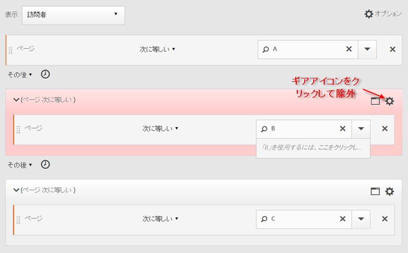

### シーケンスの先頭で除外

除外チェックポイントが順次セグメントの最初にある場合、除外されないヒットが最初に閲覧される前に、除外されるページは閲覧されないものとして扱われます。

**例**:訪問者はページAを訪問し、ページBは訪問しなかった。

**ユースケース**

次に、このタイプのセグメントの使用例を示します。

* ページ A を訪問し、ページ B を訪問しなかった訪問者。
* あるレストランでは、メインランディングページを避けて、注文ページに直接移動した常連ユーザーを表示します。

**このセグメントを作成**

トップレベルの訪問者コンテナ内に 2 つの別個のヒットコンテナを作成します。次に、最初のコンテナに対して [!UICONTROL EXCLUDE] 演算子を設定します。

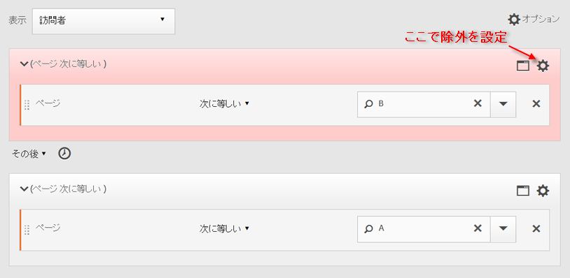

### シーケンスの最後で除外

除外チェックポイントがシーケンスの最後にある場合、訪問者シーケンスが終了するまで、除外されない最後のチェックポイントと訪問者シーケンスの最後の間でチェックポイントは発生しません。

**例**:訪問者は、現在の訪問または後続の訪問で、ページAを訪問したが、ページBを訪問しなかった。

**ユースケース**

次に、このタイプのセグメントの使用例を示します。

* ページ A を訪問し、ページ B を訪問しなかった訪問者。
* あるレストランでは、メインランディングページを避けて、注文ページに直接移動した常連ユーザーを表示します。

**このセグメントを作成**

Build a simple sequence segment by dragging two [!UICONTROL Hit] containers to the canvas and connecting them using the [!UICONTROL THEN] operator. 次に、[!UICONTROL EXCLUDE] 演算子をシーケンス内の 2 番目の[!UICONTROL ヒット]コンテナに割り当てます。

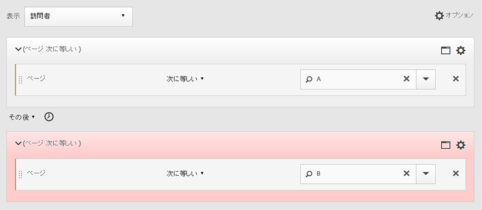

## 論理グループコンテナ

「論理グループ」コンテナは、条件を単一の順次セグメントチェックポイントにグループ化する場合に必要です。 特別な「論理グループ」コンテナは、順次セグメント化でのみ使用でき、前の順次チェックポイントの後、および後続の順次チェックポイントの前に、条件が満たされるようにします。 論理グループチェックポイント内の条件は、どの順序でも満たすことができます。 これに対し、非順次コンテナ（ヒット、訪問、訪問者）は、シーケンス全体で条件を満たす必要がないので、THEN演算子と組み合わせて使用した場合は直感に反する結果が得られます。
「論理グル [!UICONTROL ープ] 」コンテナは、複数のチェッ *クポイントをグループとして扱うように設計され*&#x200B;ていますが、グループ化されたチェックポイントの順 ** 序は決まりません。 つまり、そのグループ内のチェックポイントの順序は気にしません。 例えば、[!UICONTROL 訪問者]コンテナを別の[!UICONTROL 訪問者]コンテナ内にネストすることはできません。But instead, you can nest a [!UICONTROL Logic Group] container within a [!UICONTROL Visitor] container with specific [!UICONTROL Visit]-level and [!UICONTROL Hit]-level checkpoints.

>[!NOTE]
>
>A [!UICONTROL Logic Group] can only be defined in a sequential segment, meaning that the [!UICONTROL THEN] operator is used within the expression.

| コンテナの階層 | イラスト | 定義 |
|---|---|---|
| 標準的なコンテナ階層 |  | ヒット数、訪問数および訪問者に基づいてセグメントを抽出するために、[!UICONTROL 訪問者]コンテナ内で、[!UICONTROL 訪問]コンテナと[!UICONTROL ヒット]コンテナが順次ネストされます。 |
| 論理コンテナの階層 |  | 標準的なコンテナ階層は、[!UICONTROL 論理グループ]コンテナの外側にも必要です。ただし、[!UICONTROL 論理グループ]コンテナ内部では、チェックポイントの順序や階層を設定する必要はありません。これらのチェックポイントで必要なのは、順序を問わず、訪問者が条件を満たすことです。 |

論理グループは負担が大きいように見える場合があります。その使用方法に関するベストプラクティスを以下に示します。

**論理グループコンテナまたはヒット/訪問コンテナ**
順次チェックポイントをグループ化する場合、「コンテナ」は「論理グループ」になります。 ただし、これらの順次チェックポイントが1回のヒットまたは訪問の範囲内で発生する必要がある場合は、「ヒット」または「訪問」コンテナが必要です。 （もちろん、1つのヒットが複数のチェックポイントをクレジットしない場合、「ヒット」は順次チェックポイントのグループに対しては意味を持ちません）。

**論理グループは順次セグメントの作成を単純化しますか。**
はい、できます。 次の質問に答えようとしているとします。訪問 **者はページB、ページC、またはページAの後のページDを見たか。**

このセグメントは、論理グループコンテナを使用せずに構築できますが、複雑で面倒です。
* `Visitor Container [Page A THEN Page B THEN Page C THEN Page D] or`
* `Visitor Container [Page A THEN Page B THEN Page D THEN Page C] or`
* `Visitor Container [Page A THEN Page C THEN Page B THEN Page D] or`
* `Visitor Container [Page A THEN Page C THEN Page D THEN Page B] or`
* `Visitor Container [Page A THEN Page D THEN Page B THEN Page C] or`
* `Visitor Container [Page A THEN Page D THEN Page C THEN Page B]`

次に示すように、「論理グループ」コンテナを使用すると、このセグメントを簡単に作成できます。

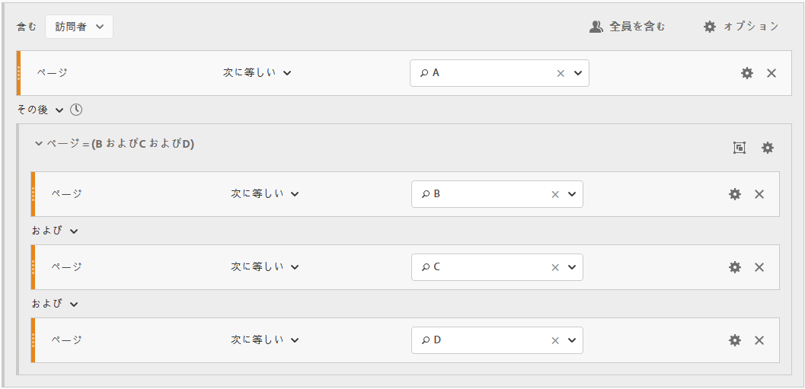

### Build a Logic Group segment {#section_A5DDC96E72194668AA91BBD89E575D2E}

他のコンテナと同様に、 [!UICONTROL 論理グループコンテナは] 、セグメントビルダー内で複数の方法で作成 [!UICONTROL できます]。 [!UICONTROL 論理グループ]コンテナをネストするための推奨される方法は次のとおりです。

1. 左のパネルから、ディメンション、イベントまたはセグメントをドラッグします。
1. 最上位のコンテナを「[!UICONTROL 訪問者]」コンテナに変更します。
1. デフォルトで挿入される [!UICONTROL AND] または [!UICONTROL OR] 演算子を THEN 演算子に変更します。
1. Select the [!UICONTROL Hit] containers (the Dimension, Event, or Item) and click **[!UICONTROL Options]** &gt; **[!UICONTROL Add container from selection]**.
1. Click the container icon and select **[!UICONTROL Logic Group]**.  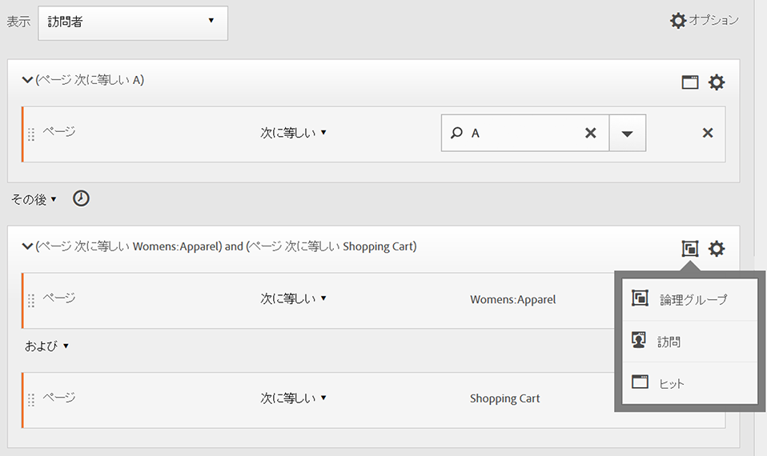
1. これで、階層に関係なく、[!UICONTROL ヒット]を[!UICONTROL 論理グループ]コンテナ内に設定できました。

### 論理グループのチェックポイントは任意の順序で作成されます

[!UICONTROL 論理グループ]を使用すると、シーケンスの外部にあるそのグループ内の条件を満たすことができます。これにより、「[!UICONTROL 訪問]」コンテナや「[!UICONTROL ヒット]」コンテナが通常の階層とは関係なく発生するセグメントを作成できます。

**例**:ページAを訪問し、次にページBとページCを任意の順序で訪問した訪問者。

**このセグメントを作成**

ページ B および C は、外部「[!UICONTROL 訪問者]」コンテナ内の「[!UICONTROL 論理グループ]」コンテナ内でネストされます。次に、A の「[!UICONTROL ヒット]」コンテナの後に、[!UICONTROL AND] 演算子を使用して識別された B と C の「[!UICONTROL 論理グループ]」コンテナが続きます。Because it is in the [!UICONTROL Logic Group], the sequence is not defined and hitting both page B and C in any order makes the argument true.

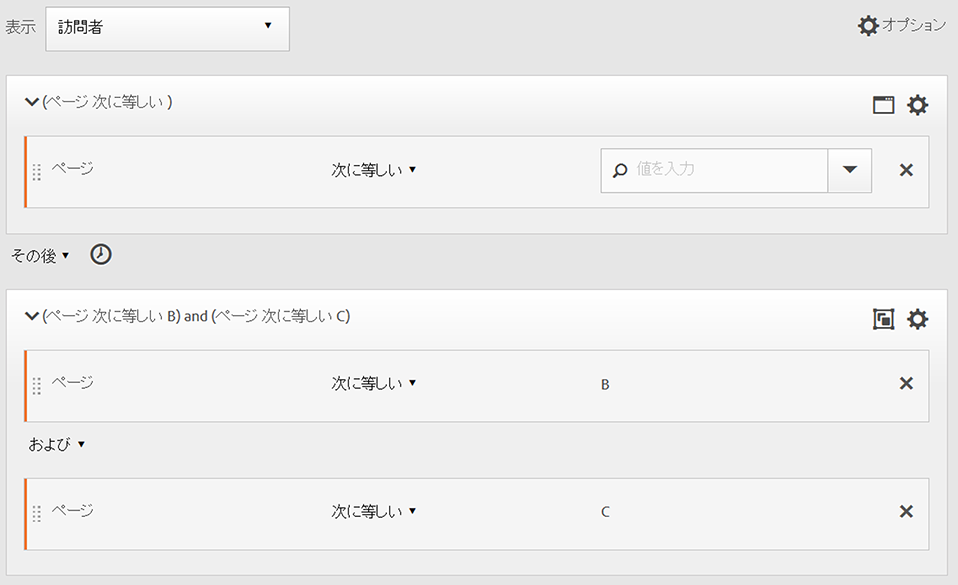

**別の例**:ページBまたはページCを訪問し、次にページAを訪問した訪問者：

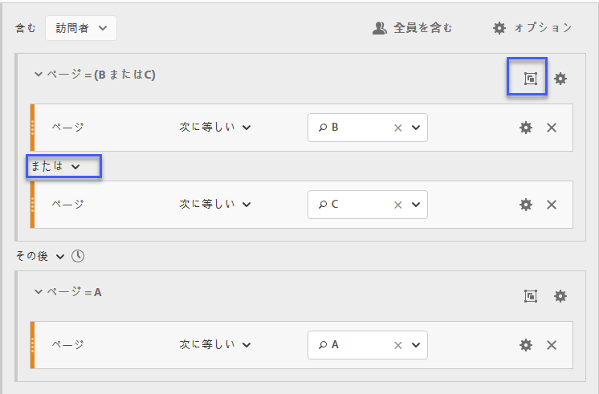

このセグメントは、論理グループのチェックポイント（BまたはC）の少なくとも1つに一致する必要があります。 また、論理グループの条件は、同じヒットで満たされる場合も、複数のヒットで満たされる場合もあり&#x200B;ます。

### 論理グループの最初の一致

[!UICONTROL 論理グループ]を使用すると、シーケンスの外部にあるそのグループ内の条件を満たすことができます。この順不同の最初の一致セグメントでは、[!UICONTROL 論理グループ]のルールによって、最初にページビューがページ B またはページ C のどちらであるかが識別され、その後で必須のページ A のビューが識別されます。

**例**:ページBまたはページCのいずれかを訪問し、その後ページAを訪問した訪問者。

**このセグメントを作成**

ページ B とページ C のディメンションは[!UICONTROL 論理グループ]コンテナ内にグループ化されます。このコンテナでは [!UICONTROL OR] 演算子が選択されます。次に、[!UICONTROL ヒット]コンテナにページ A が値として表されます。

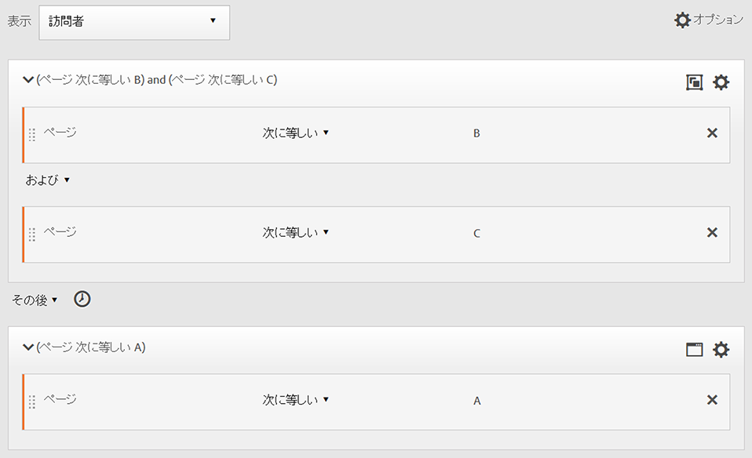

### 論理グループの除外AND

Build segments using the [!UICONTROL Logic Group] where multiple page views are aggregated to define what pages were necessary to be hit while other pages were specifically missed. ****

**例**:訪問者はページAを訪問し、ページBまたはCは明示的に訪問せずに、ページDをヒットした。

**このセグメントを作成**

このセグメントを作成するには、左のパネルからディメンション、イベントおよび事前ビルドセグメントをドラッグします。See [Building a Logic Group Segment](../../../components/c-segmentation/c-segmentation-workflow/seg-sequential-build.md#concept_23CE0E6071E14E51B494CD21A9799112).

「[!UICONTROL 論理グループ]」内で値をネストしてから、「**[!UICONTROL 論理グループ]」コンテナ内の**[!UICONTROL 除外]ボタンをクリックします。

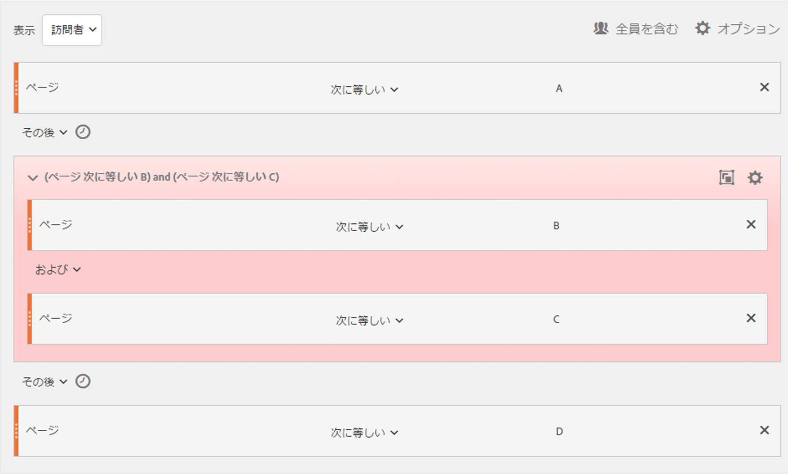

### 論理グループの除外OR

[!UICONTROL 論理グループ]を使用してセグメントを作成します。このグループでは、複数のページビューを集計して、他の特定のページが除外されている間にどのページがヒットされる必要があるかを定義します。

**例**:ページAを訪問したが、ページAの前にページBもページCも訪問しなかった訪問者。

**このセグメントを作成**

最初のページ B とページ C が、除外された「[!UICONTROL 論理グループ]」コンテナで識別されます。その後で、訪問者によるページ A のヒットが続きます。

このセグメントを作成するには、左のパネルからディメンション、イベントおよび事前ビルドセグメントをドラッグします。

「[!UICONTROL 論理グループ]」内で値をネストしてから、「**[!UICONTROL 論理グループ]」コンテナ内の**[!UICONTROL 除外]ボタンをクリックします。

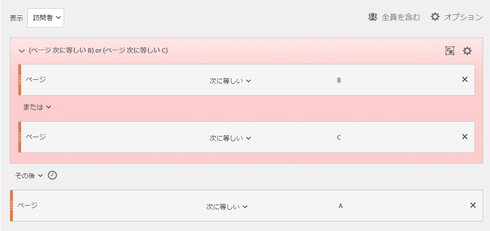

## 時間内および時間後のセグメントの作成

各コンテナのヘッダーに組み込まれた [!UICONTROL Within] および [!UICONTROL After] 演算子を使用して、時間、イベントおよびカウントを定義します。

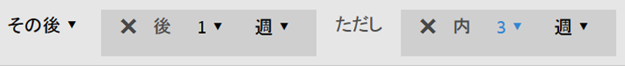

[!UICONTROL Within] および [!UICONTROL After] コンテナを使用し、精度とカウントを指定することで、一致の範囲を指定した期間に制限できます。[!UICONTROL Within] 演算子は、2 つのチェックポイントの間隔の最大値を指定するために使用します。[!UICONTROL After] 演算子は、2 つのチェックポイントの間隔の最小値を指定するために使用します。

### AFTER および WITHIN 演算子 {#section_CCAF5E44719447CFA7DF8DA4192DA6F8}

期間は、精度を表す 1 つの大文字の後に、その精度の繰り返し回数を表す数値を記述して指定します。

**[!UICONTROL Within]** はエンドポイントを含みます（エンドポイント以下）。

**[!UICONTROL After]** はエンドポイントを含みません（エンドポイントを超える）。

| 演算子 | 説明 |
|--- |--- |
| AFTER | After 演算子は、2 つのチェックポイントの間隔の最小値を指定するために使用します。After 値を設定すると、セグメントの適用時にこの時間制限が開始されます。例えば、ページAを訪問したが、1日後までページBを訪問しなかった訪問者を識別するためにコンテナにAfter演算子を設定した場合、訪問者がページAを離れた時点からその日が開始されます。 訪問者をこのセグメントに含めるには、ページAを離れてからページBを閲覧するまでに、最低1440分（1日）が経過する必要があります。 |
| WITHIN | Within 演算子は、2 つのチェックポイントの間隔の最大値を指定するために使用します。例えば、コンテナに対してWithin演算子を設定して、ページAを訪問した後、1日以内にページBを訪問した訪問者を識別した場合、訪問者がページAを離れた時点からその日が開始されます。このセグメントに含めるために、訪問者はページBを開く1日までの最大時間を持ちます。  訪問者をこのセグメントに含めるには、ページBへの訪問が、ページAを離れてからページBを閲覧するまでの1440分（1日）以内に発生する必要があります。 |
| AFTER／WITHIN | After と Within の両方の演算子を使用する場合に重要になるのが、両方の演算子が順次的ではなく並行的に開始および終了するという点です。For example, if you build a segment with the container set to: `After = 1 Week(s) and Within = 2 Week(s)` Then the conditions to identify visitors in the segment are met only between 1 and 2 weeks. 最初のページヒットの時点から、両方の条件が適用されます。 |

### After演算子の使用

* After の時間では、年、月、日、時間および分を指定して、一致する訪問を追跡できます。
* After の時間は、このような細かな精度を定義できる唯一のレベルである[!UICONTROL ヒット]コンテナにのみ適用されます。

**例**:ページAを訪問した訪問者が、2週間後のみページBを訪問した。****

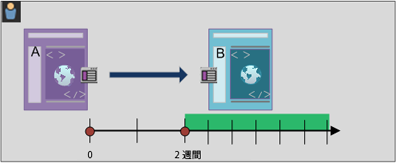

**セグメントの作成**:このセグメントは、2つのヒットコンテナを含む [!UICONTROL Visitor] コンテナを追加して [!UICONTROL 作成します] 。 これにより、[!UICONTROL THEN] 演算子を設定し、[!UICONTROL AFTER] 演算子のドロップダウンを展開して、週の数値を設定できます。

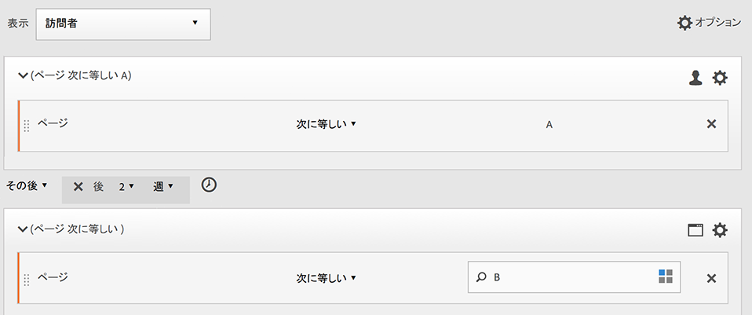

**一致する場合**

「2 週間後」と指定した状態で、ページ A へのヒットが 2019 年 6 月 1 日の 0 時 1 分 に発生し、その後、次のページ B へのヒットが 2019 年 6 月 15 日の 0 時 1 分（14 日後）までに発生した場合。

| ヒット A | ヒット B | 一致 |
|--- |--- |--- |
| **A** ヒット：2019 年 6 月 1 日 0 時 1 分 | **B** ヒット：2019 年 6 月 15 日 0 時 1 分 | **** 一致：この時間制限は、2019年6月1日（2週間）より後なので、一致と見なされます。 |
| **A** ヒット：2019 年 6 月 1 日 0 時 1 分 | **Bヒット** :2019年6月8日Bヒット：2019年6月15日0時1分 | **** 一致しない：ページBの最初のヒットは、2週間後にそれを要求する制約と矛盾するので、一致しません。 |

### Within演算子の使用

* [!UICONTROL Within] では、年、月、日、時間および分を指定して、一致する訪問を追跡できます。
* [!UICONTROL Within] は、このような細かな精度を定義できる唯一のレベルである[!UICONTROL ヒット]コンテナにのみ適用されます。

>[!IMPORTANT]
>
>「within」句の「THEN」ステートメントの間に、たとえば「within 1 search keyword instance（1 個の検索キーワードのインスタンス内）」や「within 1 eVar 47 instance（1 個の eVar 47 インスタンス内）」というように追加できます。これにより、ディメンションの 1 個のインスタンス内にセグメントが制限されます。

**例**:ページAを訪問し、5分以内にページBを訪問した訪問者。

**セグメントの作成**:このセグメントは、訪問者コンテナを追加し [!UICONTROL 、] 2つのヒットコンテナをドラッグして [!UICONTROL 作成します] 。 次に、[!UICONTROL THEN] 演算子を設定し、[!UICONTROL AFTER] 演算子のドロップダウンを展開して、間隔（ヒット、ページビュー、訪問、分、時、日、週、月、四半期または年）を設定できます。

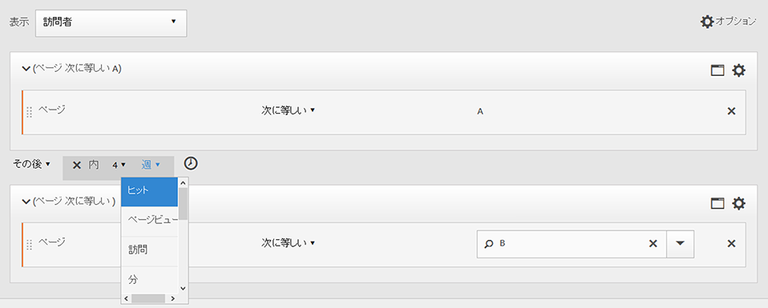

**一致する場合**

この時間制限以内に一致が発生する必要があります。この式では、訪問者のページAへのヒットが0時1分に発生し、その後のページBへのヒットが0時6分（同じ分を含む5分後）に発生する限り、一致と見なされます。 ちょうど指定した時間である場合も一致と見なされます。

### WithinおよびAfter演算子

[!UICONTROL Within] および [!UICONTROL After] は、セグメントの両端でエンドポイントの最大値と最小値を指定するために使用します。

**例**:ページAを訪問した訪問者は、2週間後から1か月以内にページBを訪問した。

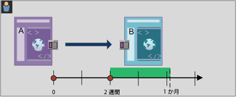

**セグメントの作成**:訪問者コンテナ内で2つのヒットコンテナを順 [!UICONTROL に並べて] 、セグメントを [!UICONTROL 作成します] 。 次に、[!UICONTROL After] 演算子と [!UICONTROL Within] 演算子を設定します。

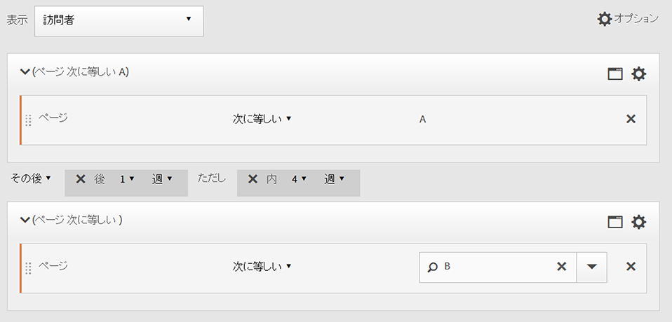

**一致する場合**

2019 年 6 月 1 日にページ A をヒットした後、2019 年 6 月 15 日 0 時 1 分より後、2019 年 7 月 1 日より前に戻った訪問者がこのセグメントに含まれます。**[間隔：「以下を除外する」](../../../components/c-segmentation/c-segmentation-workflow/seg-sequential-build.md#concept_C5CB0A391B7C4AC8A95B9724A14E28E8)と比較してください。

[!UICONTROL After] 演算子と [!UICONTROL Within] 演算子を一緒に使用して、順次セグメントを定義できます。

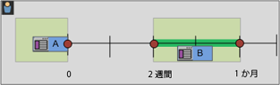

この例では、2 回目の訪問で 2 週間後から 1 か月までの間にページ B にヒットしています。
