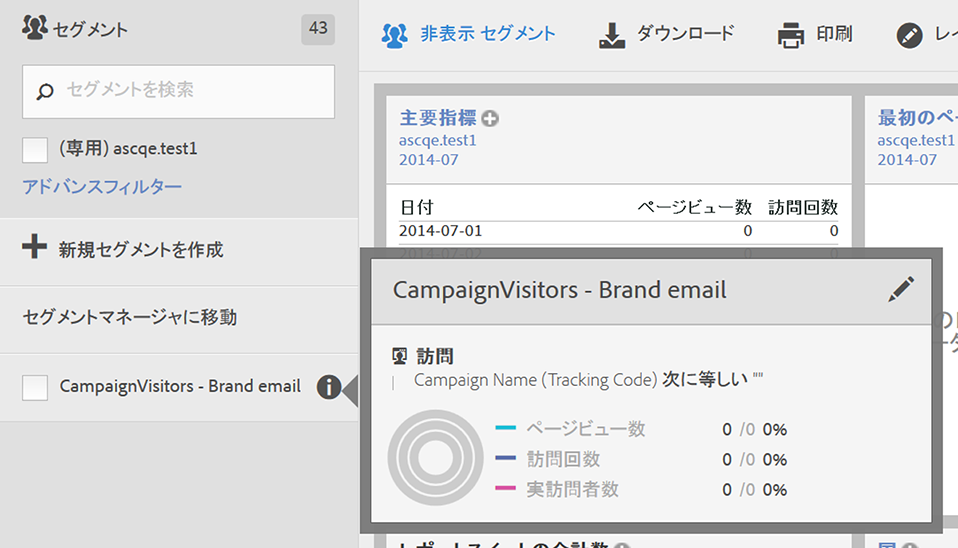
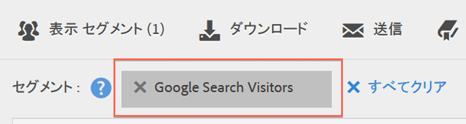

# セグメントの選択と適用

セグメントレールからレポートに 1 つ以上のセグメントを適用する方法について説明します。

1. セグメントを適用するレポートを表示します。例えば、[!UICONTROL ページレポート]を表示します。
1. Click **[!UICONTROL Show Segments]** above the report. セグメントレールが開きます。

   

1. Mark the checkbox next to one or more of the segments or **[!UICONTROL Search Segments]** to find the right segment.

   >[!NOTE]
   >
   >1つのレポートに複数のセグメントを適用できます（セグメントの積み重ねと呼ばれます）。 複数のセグメントを適用すると、各セグメントの条件が「and」演算子で結合され、結合された条件が適用されます。積み重ねることができるセグメントの数に制限はありません。

   >[!NOTE]
   >
   >セグメント名の横にある情報アイコン(i)をクリックすると、主要指標をプレビューして、有効なセグメントがあるかどうか、およびセグメントの範囲を確認できます。

1. You can filter by report suite by selecting the **[!UICONTROL (Only)`<report suite name>`]** check box. この方法を使用すると、該当するレポートスイートに最後に保存されたセグメントのみが表示されます。
1. Click **[!UICONTROL Apply Segment]** and the report will refresh. 適用されるセグメントがレポートの上部に表示されます。

   
