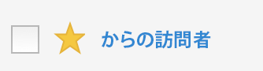

# セグメントをお気に入りに登録

セグメントを使いやすく整理するための 1 つの方法として、セグメントをお気に入りに登録することができます。

1. セグメントマネージャで、お気に入りに登録するセグメントの横にある星をチェックします。星が黄色の星に変わります。

   

1. **[!UICONTROL フィルター]** / **[!UICONTROL その他のフィルター]** / **[!UICONTROL お気]**&#x200B;に入りでも、お気に入りをフィルタリングできます。
