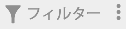
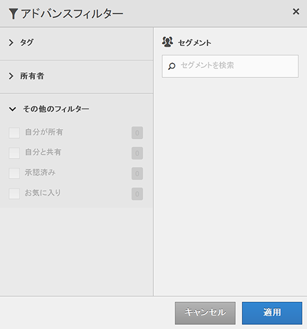

# セグメントのフィルタリング

タグ、所有者およびその他のフィルター（すべてを表示、自分が所有、自分と共有、お気に入りおよび承認済み）でフィルタリングします。

フィルタリングを使用すると、セグメントレール内でのセグメントの検索が容易になります。

1. In the Segment Manager, click the **[!UICONTROL Filters]** icon:  

   

1. 次のフィルターを使用できます。

   | フィルター名 | 説明 |
   |---|---|
   | タグ | 特定の[タグ](../../../components/c-segmentation/c-segmentation-workflow/seg-tag.md#concept_CD892CEB326C4986A1B67487052DBA50)、「タグ」列はデフォルトで表示されます。 |
   | 所有者 | セグメントを所有者でフィルタリングできます。 |
   | その他のフィルター／すべてを表示 | **（管理者のみ）**&#x200B;セグメント、所有者および最終修正日をすべて表示します。 |
   | その他のフィルター／自分が所有 | 自分が所有しているセグメントをすべて表示します。 |
   | その他のフィルター／自分と共有 | 他のユーザーが自分と[共有](../../../components/c-segmentation/c-segmentation-workflow/t-seg-share.md#task_7DC54643083E42C28F918E4F0845C5A5)しているセグメントをすべて表示します。 |
   | その他のフィルター／お気に入り | 自分が[お気に入り](../../../components/c-segmentation/c-segmentation-workflow/t-seg-favorite.md#task_F45DFA3FBF0C4082B46A0D032CB20FC5)に登録しているセグメントをすべて表示します。 |
   | その他のフィルター／承認済み | 正式に [承認された](../../../components/c-segmentation/c-segmentation-workflow/seg-approve.md#concept_DF477F151A9E483A92ED1DDAAF035953)セグメントをすべて表示します。 |
   | セグメントを検索 | セグメントを名前で検索できます。 |

