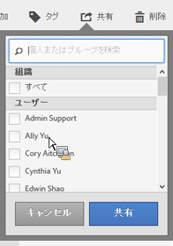

# セグメントの共有

権限に応じて、セグメントを組織全体、グループまたは個々のユーザーと共有できます。

| 管理者 | セグメントをすべてのユーザー、グループおよび特定のユーザーと共有できます。グループは、管理者コンソールで許可グループとして設定されます。 |
|---|---|
| 管理者以外 | セグメントを個人ユーザーとのみ共有できます。 |

セグメントを会社全体で共有する必要があるのはどのような場合でしょうか。また、セグメントをユーザーグループまたは個々のユーザーとのみ共有する必要があるのはどのような場合でしょうか。次に、いくつかのベストプラクティスを示します。

* 管理者として、セグメントを会社全体およびすべてのユーザーで使用すると良いと判断される場合は、セグメントを&#x200B;**[!UICONTROL 全員]で共有します。** In this case, you should also consider making it an [approved](../../../components/c-segmentation/c-segmentation-workflow/seg-approve.md#concept_DF477F151A9E483A92ED1DDAAF035953) segment.

* 管理者として、セグメントが特定のチームに対して適切なビジネス価値を提供すると判断される場合は、セグメントを特定の&#x200B;**[!UICONTROL グループ]と共有します。**&#x200B;このようなセグメントは正式に承認しないでください。
* 管理者または個人ユーザーとして、セグメントを他の個人ユーザーと共有し、セグメントを綿密に調べて確認します。役に立たないと判断される場合は、セグメントを破棄できます。このようなセグメントは正式に承認しないでください。

1. セグメントマネージャで、共有するセグメントの横にあるチェックボックスを選択します。セグメント管理ツールバーが表示されます。

   

1. 「**[!UICONTROL 共有]**」をクリックします。

   

   管理者は、「**[!UICONTROL すべて]**」を選択できます。また、組織内の&#x200B;**[!UICONTROL グループ]または**&#x200B;ユーザー]を選択することもできます。**[!UICONTROL **&#x200B;管理者以外は、個々のユーザーのみを表示できます。**[!UICONTROL 検索]フィールドを使用して、グループまたはユーザーを検索します。** 1. Click **[!UICONTROL Share]**.

   セグメントの横に共有アイコン 

1. **[!UICONTROL フィルター]** / **[!UICONTROL その他のフィルター]** /自分と **[!UICONTROL 共有に移動して、自分と共有しているセグメントをフィルタリング]**&#x200B;できます。
