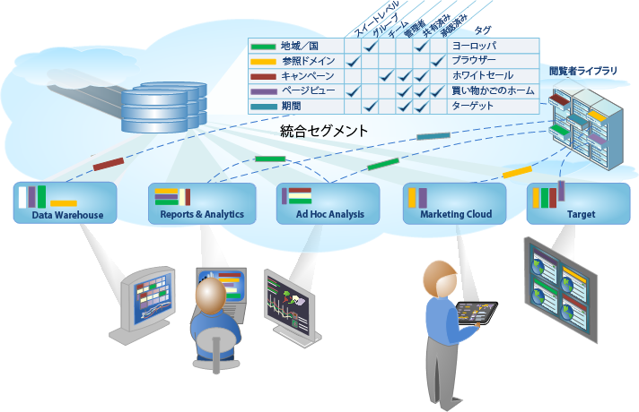

# Analyticsセグメント

Adobe Analytics では、Analytics 機能、Adobe Experience Cloud、Adobe Target および統合された他の Adobe 製品を使用して、強力かつ重要な閲覧者セグメントを構築、管理、共有し、レポートに適用できます。

Analytics のセグメント機能には、セグメントを作成して事前テストを実行する[セグメントビルダー](../../components/c-segmentation/c-segmentation-workflow/seg-workflow.md#concept_BD4C17B01C5B4E378D0C14C852D055D4)や、組織全体でセグメントを収集し、タグ付けし、承認し、セキュリティ設定し、共有する[セグメントマネージャー](../../components/c-segmentation/c-segmentation-workflow/seg-workflow.md#section_7FDCD12949BE4741A402DB83AB7B37DF)が含まれます。

データサイエンティストやマーケティングアナリストは、セグメントをニーズ固有の分析に合わせて利用、拡張および調整し、保存することができます。他のユーザーは、これらの保存されたセグメントを拡張および調整し、新しいセグメントとしてライブラリに保存できます。実際の運用では、これは体系化された閲覧者インサイトを[統合セグメントワークフロー](../../components/c-segmentation/c-segmentation-workflow/seg-workflow.md#concept_6D2E1A72A3AD4EBBB9135094F2D9DEDF)として設計および管理する一連のサイクルとなります。

**導入**

Start with [Setting up a Segmentation Workflow](../../components/c-segmentation/c-segmentation-workflow/seg-workflow.md#concept_6D2E1A72A3AD4EBBB9135094F2D9DEDF) or [Building Segments](../../components/c-segmentation/c-segmentation-workflow/seg-build.md#concept_BD4C17B01C5B4E378D0C14C852D055D4), or see [About Segments](../../components/c-segmentation/seg-overview.md#concept_82653C7E29FE49F5A4B5E5E93B0A6399) for a quick overview.
