# セグメントとコンテナについて

セグメントを使用すると、特性や Web サイトでのインタラクションに基づいて訪問者のサブセットを識別できます。セグメントは、分類された閲覧者インサイトとして設計され、特定のニーズに合わせて作成することができ、確認、編集および他のチームメンバーと共有したり、他の Adobe 製品や Analytics 機能で使用したりできます。

## About segments and containers {#concept_82653C7E29FE49F5A4B5E5E93B0A6399}

セグメントを使用すると、特性や Web サイトでのインタラクションに基づいて訪問者のサブセットを識別できます。セグメントは、分類された閲覧者インサイトとして設計され、特定のニーズに合わせて作成することができ、確認、編集および他のチームメンバーと共有したり、他の Adobe 製品や Analytics 機能で使用したりできます。

<!-- 

seg_overview.xml

 -->

セグメントは、[!UICONTROL 訪問者]、[!UICONTROL 訪問]および[!UICONTROL ヒット]の各レベル階層に基づき、ネストされたコンテナモデルを使用して構成されます。ネストされたコンテナを使用することで、コンテナ間およびコンテナ内のルールに基づいて、訪問者の属性とアクションを定義できます。Analytics セグメントは、[!DNL Adobe Experience Cloud] の複数の製品および機能間で構築、承認、共有、保存および実行できます。セグメントはレポートから生成したり、ダッシュボードレポートに組み込んだりできます。また、セグメントをブックマークに登録すると、セグメントにすばやくアクセスできるようになります。

セグメントビルダーでセグメントを作成して保存することも、（[!DNL ad hoc analysis] で）フォールアウトレポートからセグメントを生成することもできます。また、事前作成されたセグメントをネストされたコンテナ間の特定のルールに基づいて利用および拡張し、結果をフィルタリングしてレポートに適用することもできます。さらに、[積み重ねセグメント](../../components/c-segmentation/c-segmentation-workflow/seg-workflow.md#concept_40C299B60B354E10B344702EA3138B34)として複数のセグメントを使用することもできます。

セグメントでは、ページビューの特性と順序に基づいて訪問者を識別できます。

## セグメント {#section_CC4EBA2A6CCB4F8BBB8437052A880657}

セグメントは、訪問者の特性（国、性別、コーヒーショップ）、訪問者が使用しているデバイスとサービス（ブラウザー、検索エンジン、モバイルデバイス）、訪問者のナビゲーション元（検索エンジン、直前の終了ページ、自然検索）およびその他多数の情報を識別します。

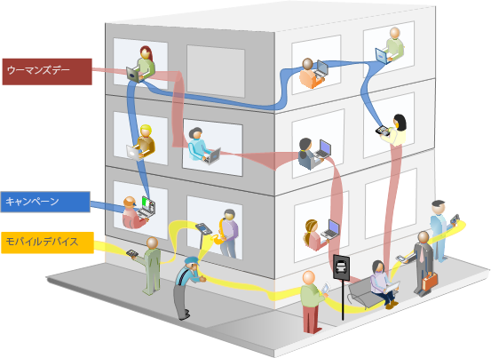

次の値に基づくセグメントを作成できます。

* 属性に基づく訪問者 - ブラウザーのタイプ、デバイス、訪問回数、国、性別。
* インタラクションに基づく訪問者 - キャンペーン、キーワード検索、検索エンジン。
* 出口および入口に基づく訪問者 - Facebook、定義済みのランディングページ、参照ドメインからの訪問者。
* カスタム変数に基づく訪問者 - フォームフィールド、定義済みのカテゴリ、顧客 ID。

セグメントビルダーで閲覧者セグメントを作成するときに、コンテナ間で [!UICONTROL AND] および [!UICONTROL OR] 演算子を使用して条件を定義できます。


このようなセグメントは、[!UICONTROL AND] および [!UICONTROL OR] 演算子を使用して結合された特性に基づいてデータセットをフィルタリングします。

## 順次セグメント {#section_EE5B14287FC44E0B96E77679A2438948}

順次セグメントでは、サイト間でのナビゲーションとページビューに基づいて訪問者を識別し、定義済みのアクションとインタラクションのセグメントを提供できます。順次セグメントを使用すると、訪問者が好むものとそうでないものを容易に識別できます。順次セグメントを作成するときは、[!UICONTROL THEN] 演算子を使用して訪問者のナビゲーションを定義し、順序を指定します。


| 訪問 1 | 訪問 2 | 訪問 3 |
|---|---|---|
| 1 回目の訪問では、訪問者はメインランディングページ（A）にアクセスし、キャンペーンページ（B）にアクセスせず、製品ページ（C）を閲覧しています。 | 2 回目の訪問では、訪問者は再度メインランディングページ（A）にアクセスし、キャンペーンページ（B）にアクセスせず、再度製品ページ（C）にアクセスし、さらに、新しいページ（D）にアクセスしています。 | 3 回目の訪問では、訪問者は 1 回目および 2 回目の訪問時と同じページに入って同じページをたどり、ページ F にアクセスせずに、目標とする製品ページ（G）に直接移動しています。 |

次のヒット値に基づく順次セグメントを定義できます。

* ページヒット順序に基づく訪問者 - 単一の訪問のページビュー、個別訪問間のページビュー、ページビューを行わない訪問
* ページビュー間またはページビュー後の時間に基づく訪問者 - 期間終了後、ヒット間、イベント後


順次セグメントでは、[!UICONTROL THEN] 演算子を使用したユーザーアクションに基づいてデータセットをフィルターします。

## セグメントコンテナについて {#concept_A38E7000056547399E346559D85E2551}

セグメントは、訪問者を属性やサイトでのインタラクションに基づいて選別するフィルター条件を設定します。セグメントに条件を設定するには、訪問者をその特性やナビゲーションの特徴に基づいて選別するフィルタールールを設定します。訪問者データをさらに分類するには、各訪問者の特定の訪問やページビューヒットに基づくフィルターを適用します。セグメントビルダーは、これらのサブセットを作成するためのシンプルなアーキテクチャで、訪問者／訪問／ヒットコンテナの順にネストされた階層的なコンテナとしてルールを適用します。

<!-- 

seg_container_overview.xml

 -->

## ハウツービデオ {#section_89D6184890AF4086A8056BFBB0B68C29}

この YouTube ビデオでは、セグメントコンテナの概要と使用方法を簡単に説明しています。

| ビデオ名 | ビデオリンク |
|---|---|
| セグメントコンテナ | [Adobe Analytics のセグメントコンテナ](https://www.youtube.com/watch?v=A513j-ej0oc&index=2&list=PL2tCx83mn7GtHqZicFTa--aE6d02BvvTd) |

## コンテナについて {#section_AF2A28BE92474DB386AE85743C71B2D6}

セグメントビルダーで利用されるコンテナアーキテクチャは、**[!UICONTROL 訪問者]を最も外側にあるコンテナとして定義します。この訪問者コンテナには、訪問とページビューの全体で訪問者に固有の最も重要なデータが含まれます。**&#x200B;ネストされた&#x200B;**[!UICONTROL 訪問]**&#x200B;コンテナでは、訪問者のデータを訪問に基づいて分類するルールを設定でき、ネストされた&#x200B;**ヒット]コンテナでは、訪問者情報を個々のページビューに基づいて分類できます。[!UICONTROL **&#x200B;各コンテナでは、訪問者の履歴全体で訪問別に分類されたインタラクションのレポートを作成することや、個々のヒットを分類することができます。

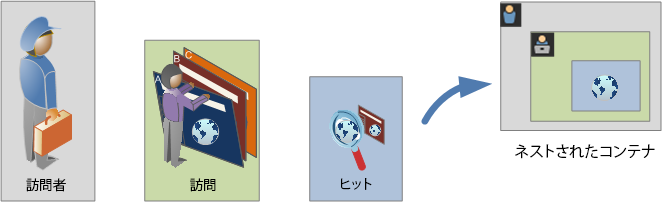

**訪問者コンテナ**

訪問者コンテナには、指定期間内に発生した訪問者による訪問とページビューがすべて含まれます。訪問者レベルのセグメントは、条件を満たすページと、訪問者が閲覧した（かつ、日付範囲の定義によって制限された）ページをすべて返します。訪問者コンテナは最も幅広い定義を持つコンテナなので、訪問者コンテナレベルで生成されるレポートは、すべての訪問からページビューを返し、マルチ訪問分析を生成できます。したがって、訪問者コンテナは、日付範囲の定義に基づく変化の影響を最も受けやすくなります。

訪問者コンテナには、訪問者の履歴全体に基づく値が含まれます。

* 初回購入までの日数
* オリジナルエントリページ
* オリジナルの参照ドメイン

**訪問コンテナ**

訪問コンテナでは、特定の Web セッションのページでのインタラクション、キャンペーンまたはコンバージョンを識別できます。訪問コンテナは、ルールを満たすと訪問セッション全体の行動を収集するので、最も一般的に使用されます。訪問コンテナでは、セグメントを作成および適用するときに含めるまたは除外する訪問を定義できます。訪問コンテナを使用すると、同じ訪問でニュース＆スポーツセクションを閲覧した訪問者が何人いたか、または購入へのコンバージョンにつながったページが何ページあったかを容易に答えることができます。

訪問コンテナには、1 回の訪問あたりの発生件数に基づく値が含まれます。

* 通算訪問回数
* 入口ページ
* 再来訪頻度
* パーティシペーション指標
* 線形的に割り当てられた指標

**ヒットコンテナ**

ヒットコンテナは、セグメントに含めるまたは除外するページヒットを定義します。ヒットコンテナは最も範囲の狭いコンテナで、特定のクリックと条件が真になるページビューを識別するのに使用でき、単一のトラッキングコードを表示することや、サイトの特定のセクション内での行動を切り離すことができます。また、アクションが発生したときの特定の値（注文が発生したときのマーケティングチャネルなど）を把握することもできます。

ヒットコンテナには、単一ページの分類に基づく値が含まれます。

* 製品
* リストプロパティ
* リスト eVar
* マーチャンダイジング eVar（イベントのコンテキスト内）

   >[!NOTE]
   >
   >このコンテナを永続的な値（evarなど）で使用すると、その値が持続するヒットすべてが取り込まれます。1 週間後に有効期限切れになるトラッキングコードの場合、その値は、複数の訪問間で持続することがあります。

**論理グループコンテナ**

論理グループコンテナは、セグメントルール内の個別のコンテナを提供して、階層に基づかずにエンティティをフィルタリングするために使用できます。例えば、訪問者に基づいてフィルタリングするセグメント内にネストされたコンテナを提供するとします。この論理タイプでは、（トップレベルの訪問者コンテナが既に存在するので）階層を超えて選択した訪問者のみをフィルタリングする必要があります。これは、論理グループコンテナを使用して実現できます。詳しくは、[論理グループの例](../../components/c-segmentation/c-segmentation-workflow/seg-sequential-build.md#concept_83AEC78CD25F442EBEE364856A889560)を参照してください。

## コンテナのネスト {#section_7FDF47B3C6A94C38AE40D3559AFFAF70}

セグメントコンテナを他のコンテナ内に作成する場合、本質的には、セグメントを他のセグメント内に作成しています。ネストされたコンテナでは、次のロジックが使用されます。

1. どのようなデータが含まれているかを、最も外側にあるコンテナによって調べます。この外部ルールと一致しないデータは、セグメント化レポートですべて削除されます。
1. ネストされたルールを残りのデータに適用します。ネストされたルールは、最初のルールで拒否されたヒットには適用されません。
1. ネストされたコンテナルールがすべて計算されるまで繰り返します。その結果、残りのデータが結果レポートに含まれます。

ネストは、コンテナ内のルール間だけでなく、コンテナ間でも使用できます。次に、各コンテナ内でネストできる要素を示します。

| コンテナ名 | コンテナ内でネストできる要素 |
|---|---|
| ヒット | イベントのみ |
| 訪問 | ヒットコンテナ、イベント |
| 訪問者 | 訪問コンテナ、ヒットコンテナ、イベント |
| 論理グループ | 訪問者コンテナ、訪問コンテナ、ヒットコンテナ |

**単一の定義に複数のコンテナを含める**

新しい複合セグメントに複数のセグメントを含めると、データをさらに正確にできます。既存の 2 つのセグメントをドラッグすると、これらのセグメントは、訪問者のフィルタリングで「OR」ステートメントとして機能します。キャンバス内のすべてのコンテナがすべてのデータと確認され、いずれかまたはいくつかのコンテナと一致するデータがレポートに含まれます。

例えば、Country = United States の訪問コンテナと、Order = True の訪問コンテナをドラッグしたとします。

```
Country = United States + Order = True
```

この場合、次の順序で機能するセグメントが作成されます。

1. 最初に、データ全体が調べられ、United States の訪問者がすべて識別されます。
1. 次に、すべてのデータが再度調べられ、訪問者が注文したかどうかが確認されます
1. 次に、両方のデータセットがレポートに適用されます。

## 順次セグメントのコンテナ {#section_324AF503F51A4A62806151FE440F3B2E}

順次セグメントでは、階層的にネストされた[!UICONTROL 訪問者]、[!UICONTROL 訪問]および[!UICONTROL ヒット]（ページビューや他のディメンションを含む）などの同じ基本コンテナを利用します。


「[!UICONTROL 訪問者]」コンテナは順次セグメントでは最上位のコンテナです。「[!UICONTROL 訪問]」コンテナは、「[!UICONTROL 訪問者]」コンテナ内に含まれ、「[!UICONTROL ヒット]」コンテナは「[!UICONTROL 訪問者]」コンテナまたは「[!UICONTROL 訪問]」コンテナ内に含まれます。適切な順序の順次セグメントを作成するためには、この[コンテナ階層](../../components/c-segmentation/seg-overview.md#section_7FDF47B3C6A94C38AE40D3559AFFAF70)を維持する必要があります。

**順次セグメントを作成するには**、コンテナをネストし、[!UICONTROL THEN] 演算子を使用して論理を順に結合します。この演算子は、各コンテナに対して、訪問者の訪問やヒットの順序を満たすことを求めるものです。


このコンテナ階層には唯一の例外があります。それは、[論理グループコンテナ](../../components/c-segmentation/c-segmentation-workflow/seg-sequential-build.md#concept_83AEC78CD25F442EBEE364856A889560)を使用する場合です。[!UICONTROL 論理グループ]コンテナでは、特定の順序に従わずに、コンテナ内でヒットをネストしてイベントやディメンションを収集できます。


## コンテナデータに基づくレポート {#concept_BE822C12F87C4F07B7147D80BEFBAB87}

コンテナを使用すると、セグメントを分類してレポートに適用するときに、レポート値に基づいて様々なデータを様々な方法でフィルタリングできます。

<!-- 

seg_container_reports.xml

 -->

訪問者／訪問／ヒットコンテナの階層構造の各レベルで収集されるデータは、セグメントの作成方法に影響します。同じデータセットを使用して、同じセグメントを同じレポートに適用しても、レポートを生成する際に基づくコンテナによって取得する値は様々です。コンテナレポートのレベルや、ヒット全体での値の持続性などの要素が、レポートの精度に対して大きな意味を持ちます。

## コンテナデータの基本事項 {#section_9576D970F912450191AFB5B83F7F1656}

例えば、次の図に示す訪問者は、サイトの初回訪問時に、ランディングページとしてホームページを開き、さらに 3 つのページを訪問して購入にいたっています。別の訪問では、今回は商品ページを通じてランディングし、ホームページに移動した後、再度商品ページに移動し、冬用帽子を見た後で、セッションを終了しています。セグメントの各コンテナに対して収集されたデータに基づいて、レポートには様々な値が表示されます。

次の例では、「*ページが Winter Coats（冬用コート）に等しい*」セグメントを&#x200B;**ページレポート**&#x200B;に適用しています。

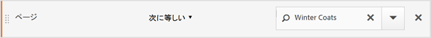

選択したコンテナに基づいて、レポートには様々な結果が表示されます。

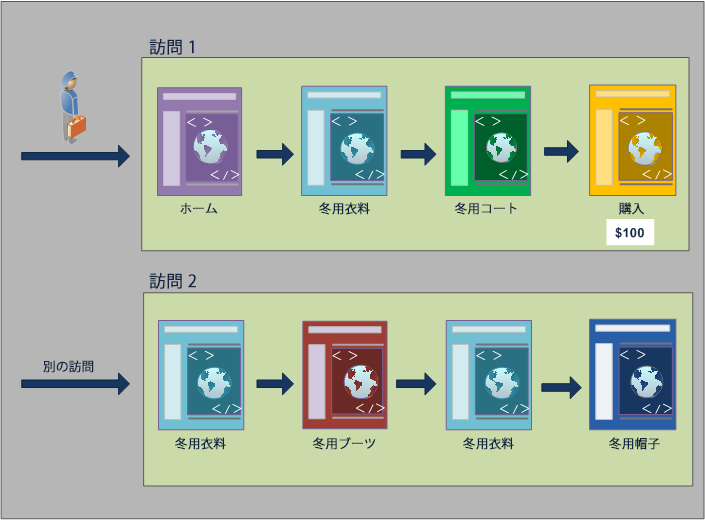

**ヒットコンテナからのレポート作成**

この条件がヒットコンテナ内にある場合、レポートには *ページ = Winter Coats* が真になるページのみが示されます。1 ページのみが収集されるコンテナ内には、この条件と一致するページが 1 ページしかないので、冬用コートページのみが表示されます。

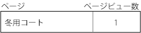

ヒットコンテナからのレポート作成では、様々なコンテナからのレポート作成がレポート値全体にどのように影響するかを確認できます。セグメントレポートを表示して、ページビュー数と訪問回数がほぼ等しいこと（約 2,000 人の訪問者が 1 回の訪問で同じページを何度も表示し、それがページビューの合計数に加算されています）と、個別訪問者数と訪問回数がほぼ等しいこと（約 2,000 人の個別訪問者が複数回訪問しています）に注目します。

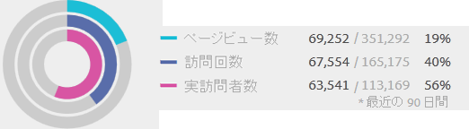

>[!IMPORTANT]
>
>ヒットコンテナ、訪問コンテナ、または訪問者コンテナからのデータの表示に関係なく、この例では、すべて同じ訪問者数、63、541の訪問者数を持ちます。どの方法でレポートを生成した場合でも、初回訪問者条件（冬用コートページを表示した訪問者）は変わりません。このデータサブセットから、様々なレベルのレポートを作成することになります。

**訪問コンテナからのレポート作成**

この同じ条件が訪問コンテナ内にある場合、レポートには *ページ = Winter Coats* が真になる訪問のページがすべて示されます。これは冬用コートページをフィルタリングするだけでなく、指定の条件が真になる訪問で訪れた他のページもすべて収集します。この訪問者は、指定の条件を満たした訪問でホーム、商品および購入ページも訪れています。したがって、訪問者コンテナデータを使用してレポートを作成すると、これらのページもレポートに示されます。

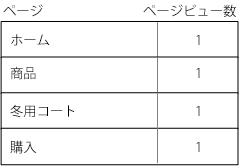

セグメント値を訪問コンテナから表示すると、ページビュー数が大幅に増加していることがわかります。これは、訪問コンテナからのレポート作成では、条件を満たすすべてのページだけでなく、訪問で閲覧された他のページも（各訪問コンテナに収集されたすべてのページビューと共に）すべて識別されるからです。


**訪問者コンテナからのレポート作成**

この同じ条件が訪問者コンテナ内にある場合、レポートには *ページ = Winter Coats* が真になる任意の訪問者が閲覧したページがすべて示されます。つまり、訪問者が冬物コートページを閲覧した場合、訪問者コンテナ内のページ（他の訪問のページビューを含む）がすべて示されます。したがって、条件に一致しないページも、訪問者が以前閲覧したことがあるページなので、レポートに示されます。以前に発生し、条件を明確に満たしていなくても、訪問者コンテナに含まれるページは、レポートにすべて示されます。

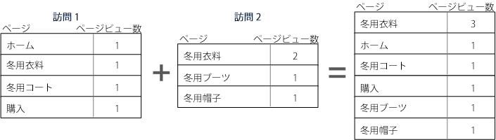

セグメントを訪問者コンテナから表示すると、ページビュー数と訪問回数が増加していることがわかります。これは、訪問者レベルで考えると、訪問者が冬物コートページを閲覧したのは 1 回のみであっても、その訪問者に対して、他のすべてのページビューと他のすべての訪問が収集されるからです。

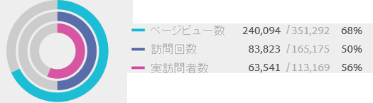

これまでの説明をまとめると、様々なデータ分類に対するセグメント化の機能を理解することが、セグメント化が返すデータを解釈するうえで重要となります。

## コンテナに基づくレポート作成 {#section_D0604748F2794327B8C668617A31EC18}

セグメントデータの分類ごとに適用されるスコープがあります。ほとんどのレポート分類はページビューに基づきますが、重要性の高い多くのセグメントは訪問コンテナに基づき、重要性の低いセグメントは訪問者コンテナに基づきます。コンテナのスコープに基づくレポート作成について理解することが重要です。

前述の「*ページが Winter Coats(冬用コート）に等しい*」セグメントの例に基づいて、以下では、コンテナデータの適用方法と、データのスコープとセグメントタイプを一致させる必要がある方法を基に、セグメントの他の側面を定義します。

**一致するセグメントルールに基づくセグメントコンテナ**

データの固有スコープに対してセグメントコンテナを適用すると、行項目がセグメントルールと一致する、予測された結果が得られます。

* **ページが「Winter Coat」（冬用コート）に等しいヒットコンテナ**：このセグメントによってページレポートを表示すると、「Winter Coat」に等しい値のみが返されます。それ以外のページは、レポートからすべて除外されます。
* **入口ページが「Winter Apparel」（冬物衣料）に等しい訪問コンテナ**：このセグメントによって入口ページレポートを表示すると、2 番目の訪問が返されます。これは、入口ページがセグメントルールと一致するからです。
* **通算訪問回数が 1 に等しい訪問コンテナ**：訪問を表示すると、初回訪問からのすべてのページビューがレポートに含まれます。これは、初回訪問がセグメントルールと一致するからです。

**訪問コンテナレベルでのページビュー**

多くのセグメントルールが 1 回の訪問あたりのページビューを識別します。この場合、単一のヒットがルールと一致するだけで、訪問者コンテナ全体が適用されます。訪問に基づくページビューは、1 回の訪問あたりのページビューに基づいてインサイトを提供するので、このセグメントレポートは特に重要です。

* **ページが「Winter Coat」（冬物コート）ページに等しい訪問コンテナ**：訪問者コンテナレベルでのページレポートには、冬物衣料ページの閲覧を含む訪問のすべてのページビューが表示されます。ページがセグメントルールと一致する場合は、その訪問に関連するページビューがすべてレポートに含まれます。
* **ページが「Home」（ホーム）ページに等しい訪問コンテナ**：このセグメントによるページレポートには、初回訪問からのデータのみが表示されます。これは、訪問者が 2 回目の訪問時にホームページを閲覧しなかったからです。
* **ページが「Winter Apparel」（冬物衣料）に等しい訪問者コンテナ**：このセグメントによるページレポートには、両方の訪問からのすべてのデータが抽出されます。これは、両方の訪問で訪問者が冬物衣料ページを閲覧したからです。

**ページビューよりも少ないヒット数を識別するセグメントコンテナ**

分類スコープよりも小さいコンテナをセグメントで使用すると、予期しないデータが返されます。さらに小さい分類を使用すると、データのスコープからすべてのヒットが抽出されます。

* **入口ページが Product（商品）ページに等しいヒットコンテナ**：すべてのページが訪問の入口ページに関連し、訪問ベースの分類になります。このセグメントを使用すると、入口ページである商品ページだけでなく、その訪問のすべてのヒットも抽出されます。
* **リスト変数 1 に値 1 が含まれるヒットコンテナ**：複数の値がリスト変数と同じヒットに定義されている場合、セグメントにはすべての変数値が含まれます。ヒットを分類する最小のセグメントコンテナはヒットコンテナなので、同じページビューで発生する値を分類する方法はありません。
* **ページが「Purchase」（購入）に等しいヒットコンテナ**：ページビューを指標として使用すると、購入ページのみが表示されます（予測された動作）。パーティシペーション指標は訪問ベースなので、売上高パーティシペーションレポートを使用すると、初回訪問のすべてのページが $100 を受け取ります。
* **ページが「Winter Coat」（冬物コート）に等しいヒットコンテナ**：ページビューを指標として使用すると、冬物コートページのみが表示されます（予測された動作）。このディメンションは持続的なディメンションを必要とするので、売上高パーティシペーションレポートを使用すると、どのページもクレジットを受け取りません。実際に購入が行われた（購入ページの）ページビューは、ヒットコンテナに含まれないので、売上高パーティシペーションレポートはどの項目にも与えられません。ただし、訪問コンテナからレポートを実行すると、その訪問のすべてのページビューが含まれて、セッションで閲覧されたページ全体で売上高パーティシペーション（$100）が分散されます。

## コンテナ間での持続性 {#concept_E579D72B1C644AE9A4C4EAF6B47A4DCB}

キャンペーン eVar や、参照ディメンションなど、ページの範囲間で持続するディメンションを使用したフィルタリングは、コンテナレベルで収集されるデータに影響します。精度の高いレポートを作成するには、こうしたフィルタリングについて理解する必要があります。

<!-- 

seg_container_persistence.xml

 -->

セグメントデータは、選択されたページ間でディメンションや適用される変数の持続性に応じて変化します。ページディメンションなどのディメンションは、ページレベルで固有値を提供し、ヒットコンテナのデータに基づいてフィルタリングされます（[コンテナデータに基づくレポート](../../components/c-segmentation/seg-overview.md#concept_BE822C12F87C4F07B7147D80BEFBAB87)の例を参照してください）。また、参照ドメインディメンションなどのディメンションは、訪問の複数のページ間で持続します。訪問期間などのディメンションや適用される変数は、訪問者の履歴全体に及びます。

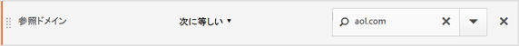

ページディメンションとは異なり、参照ドメイン値は、この訪問の各ページに添付されます。例えば、次の訪問者は、ある参照元サイトから Home ページを訪問しています。したがって、この訪問のすべてのページに、同じ参照ドメイン値が割り当てられます。

次の *参照ドメイン = aol.com* セグメントは、**ページレポート**&#x200B;に適用されます。

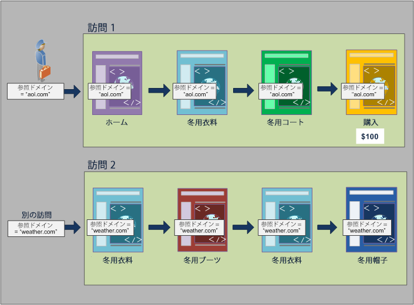

新しい訪問では、訪問者は別のサイトから参照されます。したがって、新しい訪問のすべてのページに、各ページビューの新しい参照ドメイン値が割り当てられます。

**ヒットコンテナからのレポート作成**

同じ訪問のすべてのページビューに、同じ参照ドメイン値が割り当てられるので、*参照ドメイン = "aol.com"* となるヒットコンテナレベルでのレポートは、次の表に示すように、すべてのページを返します。

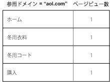

ヒットコンテナのデータを見ると、32,000 人を超える訪問者による 33,000 回を超える訪問回数で 92,000 回を超えるページビューが閲覧されています。平均では、訪問ごとのページビューは 3 回で、ほとんどすべての訪問が個別訪問者によって行われています。

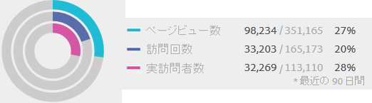

**訪問コンテナからのレポート作成**

この同じ条件が訪問コンテナでページレポート用にフィルタリングされると、*参照ドメイン = "aol.com"* が真になる訪問のすべてのページが返されます。参照ドメインの値は、訪問レベルで設定されるので、ページビューレベルと訪問レベルでのレポートは同じです。


この例では、どのページも、訪問に基づく同じ参照ドメイン値を持つので、訪問コンテナレベルからのレポートは、ページビューコンテナからのレポートと（ほとんど）同じです（データの異常による違いは 98,234 から 98,248 とわずかです）。

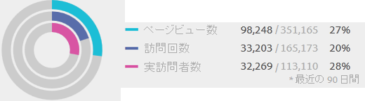

**訪問者コンテナからのレポート作成**

訪問者コンテナから、ページレポートには、*参照ドメイン = "aol.com"* が真になる任意の訪問者が閲覧したページがすべて示されます。したがって、訪問者が（定義された期間内の）履歴のいずれかの時点で *"aol.com"* を参照ドメインとして持つ場合、訪問者コンテナに含まれるすべてのページ（他の訪問でのページビューを含む）が示されます。第一条件に一致しないページも、訪問者コンテナに含まれるページなので、レポートに示されます。以前に発生し、条件を明確に満たしていなくても、訪問者コンテナに含まれるページは、レポートにすべて示されます。

参照ドメインレポートでは、4 つのページビューで *参照ドメイン = "aol.com"* が真ですが、訪問者がヒットした他のページでは *参照ドメイン = "weather.com"* が真です。訪問者コンテナから、"aol.com" が真になる訪問者のリストを取得しますが、このコンテナは、セグメント内の初期要求と一致した値ではなく、参照ドメインが "weather.com" であるページも提供します。

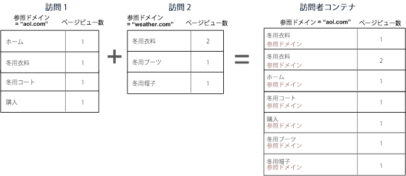

訪問者コンテナのデータを表示すると、ページビューが（98,248 から 112,925 に）大幅に増加していることに注意してください。これは、訪問者が行ったすべてのページビュー（訪問者コンテナレベルで保存された他の参照ドメイン値を持つページビューを含む）が示されているからです（また、同じ訪問者による追加訪問で訪問回数が 33,203 から 43,448 に増加しています）。

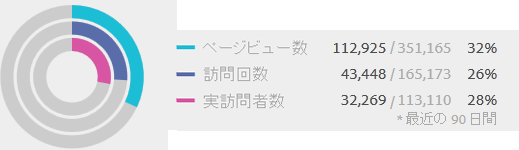

まとめ

* 訪問コンテナは、少なくとも 1 つのページが条件を満たす訪問で閲覧されたすべてのページを返します。したがって、ページが Day 1 の Visit 1 でしか閲覧されていない場合でも、訪問全体で閲覧されたすべてのページがデータに含まれます。
* セグメント化の条件が eVar または他の種類の持続的な変数に関する場合は注意してください。例えば、「キャンペーンに電子メールを含む」という条件を使用し、キャンペーンの有効期限を 7 日間に設定したとします。この場合、初回訪問時にキャンペーンが設定されると、キャンペーンは 7 日間以上継続します。キャンペーンが初回訪問時にのみ設定された場合も、各訪問が含まれます。他の訪問も含まれます（これらの訪問がレポートの日付範囲に含まれている場合）。持続的な値を排除して含めないようにしたい場合は、イベントのインスタンスを使用するか、同等の Prop 変数があれば、その Prop 変数を使用します。

