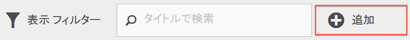
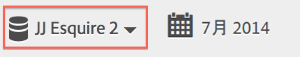
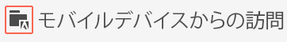
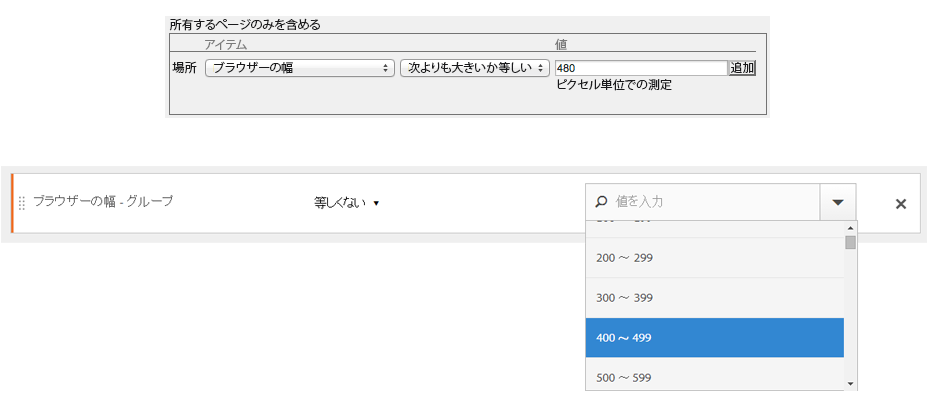

# よくある質問

セグメント化機能、アクセス、権限、ベストプラクティスおよびレガシーセグメントの管理に関する頻繁な質問に答えます。

## 機能 {#section_BD58629D1A9346BF879E229FA6BEC7A2}

* Analysis Workspace のセグメント：

   * [セグメントを比較](https://marketing.adobe.com/resources/help/en_US/analytics/analysis-workspace/segment-comparison.html)できます。
   * 比較の[ディメンションとしてセグメント](https://marketing.adobe.com/resources/help/en_US/analytics/analysis-workspace/segments_as_dimensions.html)を使用できます。
   * [フォールアウト分析](https://marketing.adobe.com/resources/help/en_US/analytics/analysis-workspace/graphics/compare-segments-fallout.html)でセグメントを使用できます。

* [レポートやプロジェクトに複数のセグメントを適用](../../components/c-segmentation/c-segmentation-workflow/seg-workflow.md#task_13E69C7D428A43EF9CCCA7F1104F1E8F)できます。
* セグメントが、レポートスイート全体で共通になりました。
* [セグメントビルダー](../../components/c-segmentation/c-segmentation-workflow/seg-workflow.md#concept_643F2DF74C544796B58F4656ABC5F726) を使用すると、セグメントの作成を簡素化できます。
* [セグメントマネージャー](../../components/c-segmentation/c-segmentation-workflow/seg-workflow.md#concept_7A2E019317864065B7C641DC3315928F)を使用すると、セグメントの共有、タグ設定、検証および承認の機能を使用して[ワークフロー](../../components/c-segmentation/c-segmentation-workflow/seg-workflow.md#concept_6D2E1A72A3AD4EBBB9135094F2D9DEDF)を設定できます。

* フォルダーを使用する代わりに[セグメントにタグを設定](../../components/c-segmentation/c-segmentation-workflow/seg-workflow.md#concept_CD892CEB326C4986A1B67487052DBA50)して、セグメントを整理したり検索したりできます。Previously, you used folders (in [!DNL Ad Hoc Analysis]) to organize your segments.

* Ad Hoc Analysis 以外でも[連続セグメント](/help/components/c-segmentation/c-segmentation-workflow/seg-sequential-build.md)を作成できます。
* ページビューコンテナの名称が「ヒットコンテナ」に変わりました。これは、ページビューだけでなく、すべての種類のデータをセグメント化するコンテナであることを意味しています。例えば、リンクトラッキング呼び出しと、モバイル SDK からの trackAction 呼び出しは、ヒットコンテナの対象になります。このコンテナは名前が変更されただけで、機能に変更はありません。

詳しくは、Digital Marketing Blog の投稿 [Improving Segmentation in Adobe Analytics](https://blogs.adobe.com/digitalmarketing/analytics/improving-segmentation-adobe-analytics/) を参照してください。

## Access the Segmentation Tools {#section_088AD0E4E21943DFA8CF7206AEC485DD}

**セグメントビルダーへの移動方法**

セグメントビルダーには、次のようにアクセスします。

* 既存のレポートを表示して、左側のナビゲーションでセグメントアイコン In the segment rail that displays, then click **[!UICONTROL Add]**, or

* At the top of the Segment Manager, clicking **[!UICONTROL + Add]**.  

    または

* セグメントマネージャ内で既存のセグメントタイトルをクリックし、そのセグメントをセグメントビルダーで編集します。

**セグメントマネージャへの移動方法**

セグメントマネージャには、次のようにアクセスします。

* Going to  **[!UICONTROL Analytics]** &gt; **[!UICONTROL Components]** in the top navigation. Then click **[!UICONTROL Segments]**, or

* 既存のレポートを表示して、左側のナビゲーションでセグメントアイコン Then click **[!UICONTROL Manage]**, or

* インターフェイス内の任意の場所でスラッシュキー「/」を押して、セグメントマネージャを検索します。

**レガシーセグメントドロップダウンの移動先**

The segment drop-down in Reports &amp; Analytics has been replaced by a much more feature rich [Segment Builder](../../components/c-segmentation/c-segmentation-workflow/seg-workflow.md#concept_643F2DF74C544796B58F4656ABC5F726) interface that lets you to create "universal" segments usable across report suites and across Adobe Analytics solutions. To view a list of existing segments, click the Segments icon  

をクリックすると、セグメントレールが表示されます。

**レガシーレポートスイートドロップダウンの移動先**

レポートスイートドロップダウンは、各レポートまたはダッシュボードの右上隅にある日付セレクターの横に移動しました。

## 権限 {#section_648DFA3A882146C485A84ED014EEC707}

**セグメントの使用、作成および管理に必要な権限と許可**

デフォルトでは、すべてのユーザーが個人用のセグメントを作成および編集できます。ただし、管理者の判断により、[セグメントを作成する権限](https://marketing.adobe.com/resources/help/en_US/reference/groups.html)を持つべきユーザーを決定し、特定のグループに割り当てることができます。これらのセグメントは、他の Analytics ユーザーと直接共有できます。

管理者はすべてのセグメントを編集できます。また、グループや組織のメンバー全員とセグメントを共有することもできます。[詳細情報...](../../components/c-segmentation/seg-reference/seg-rights.md)

**社内のすべてのセグメントを表示できますか？**

Yes, Admins can see all segments within the [!DNL Analysis Workspace] and [!DNL Reports & Analytics] user interfaces.

Ad Hoc Analysis と Report Builder には、自分が所有するセグメントと自分が共有しているセグメントが表示されます。

**セグメントマネージャですべての Analytics セグメントを管理できますか？**

すべてのセグメントを、Analysis Workspace、Reports &amp; Analytics および Ad Hoc Analysis のセグメントマネージャで管理できます。セグメントマネージャには、所有者（セグメントを作成したユーザー）、共有先ユーザーおよび管理者ユーザーに表示されるセグメントが表示されます。セグメントの選択には、ユーザーによって所有および共有されるセグメントが表示されます。

管理者は、Analysis Workspace および [!DNL Reports & Analytics] ユーザーインターフェイス内ですべてのセグメントを表示できます。

Ad Hoc Analysis と Report Builder には、自分が作成したセグメントまたは自分が共有しているセグメントのみが表示されます。

**このセグメントを削除できないのはなぜですか？**

セグメントが [Experience Cloud に公開されている](../../components/c-segmentation/c-segmentation-workflow/seg-workflow.md#concept_1E9FC92437D748C392546542B6511D01)場合には、そのセグメントを削除したり、編集したりすることはできません。ただし、コピーしたうえでそのコピーしたものを編集することは可能です。

## ベストプラクティス {#section_E2C3A1B4B4274D1B86CAA9C0359D049C}

**同じ名前でありながら定義が異なるセグメントがある場合には、どうしたらよいでしょうか？**&#x200B;セグメントが複数のレポートスイートで動作するようになったことから、同じ名前のセグメントが複数存在する結果になることがあります。そのような場合には、以下のいずれかを推奨しています。

* 同じ名前でありながら定義が異なるセグメントの名前を変更します。
* 不要なセグメントを削除します。

**セグメントのクリーンアップに関して、どんなことが推奨されていますか？**

* すべてのセグメントに「移行前」などのタグを付けます。
* 自分が所有しているセグメントを確認します。
* セグメントを適切なセグメントライブラリに追加します。
* 正規のセグメントを承認します。
* セグメントのタグ付け[ベストプラクティス](../../components/c-segmentation/c-segmentation-workflow/seg-workflow.md#concept_CD892CEB326C4986A1B67487052DBA50)に従ってセグメントにタグを設定します。

## レガシーセグメントの管理 {#section_76CF47142D1A4FB6A0718AD9073049FE}

**既存のセグメントへの影響**

既存のセグメントは、引き続きこれまでと同様に機能します。既存のセグメントが適用されたレポートも、これまでと同様に適切に機能します。詳しくは、[こちら](../../components/c-segmentation/seg-transition.md#section_83ACAB256F394DCD8B424D8920BDD853)を参照してください。

従来の事前定義されたスイートセグメントは、ほとんどがセグメントテンプレートとしてセグメントビルダーに移行されます。セグメントテンプレートは、一般的な閲覧者を含むカスタムセグメントをすばやく作成するために部品として利用できます。セグメントテンプレートは、レポートに直接適用できませんが、カスタムセグメントには容易に保存できます。

セグメントテンプレートは、セグメントビルダーに特別なアイコン付きで表示されます。

**既存のセグメントフォルダーへの影響**

セグメントマネージャでは、（Ad Hoc Analysis の）フォルダーの代わりに、タグを使用します。フォルダー名はタグに自動的に変換され、個々のセグメントに適用されています。

**セグメントが適用された配信レポートへの影響**

配信レポートは、定義済みのセグメントと共に、これまでと同様に適切に実行されます。

セグメントを削除しても、そのセグメントが適用された配信レポートとダッシュボードは、これまでどおりに機能します。つまり、セグメントやダッシュボードは、削除されたセグメントを使い続けます。

同じ名前を持つセグメントを編集しても、配信レポートは更新されません。具体的な例を見てみましょう。次に示すように、同じ名前を持つ 2 つのセグメントを、別々のレポートスイートで使用しているとします。

このとき、mainprod レポートスイートのセグメントを参照するブックマークがあるとします。このセグメントは重複しているので、セグメントを削除します。その後も、このブックマークは引き続き、削除されたセグメントの定義を参照します。ここで maindev セグメントのセグメント定義に手を加え、カタリナ島とメキシコのティフアナを含めるように変更しても、このブックマークに適用されているセグメントは変更されません。このセグメントは古い定義を使用したままです。これを修正するには、新しい定義を参照するようにブックマークを更新します。ブックマーク、ダッシュボードまたは配信レポートで削除されたセグメントを使用しているかどうかが不明な場合は、残りのセグメントの名前を変更できます。ブックマークが残りのセグメントを使用しているかどうかがより明確になります。

**Data Warehouse セグメントへの影響**

既存の Data Warehouse セグメントは、今後も Data Warehouse 内ですべて機能します。ほとんどのData Warehouseセグメントは、Analysis Workspace、Ad Hoc Analysis、Reports&amp; Analyticsなどの他のコンポーネントでも機能します。

新しい Data Warehouse セグメントは、セグメントビルダーとセグメントマネージャで作成または編集できます。セグメントビルダーの製品の互換性メカニズムは、セグメントが Data Warehouse と互換性があるかどうかを自動的に判定します。

**お気に入りセグメント（Ad Hoc Analysis）への影響**

Ad Hoc Analysis のこのセグメントは、Adobe Analytics の通常のセグメントとして表示されます。

セグメントマネージャーのお気に入り機能（セグメントをお気に入りとしてマークする機能）と混同しないようにしてください。

**事前設定済みのセグメントへの影響**

* **直帰数**
* **モバイルデバイスからの訪問**
* **自然検索からの訪問**
* **有料検索からの訪問**
* **訪問者 ID cookie の訪問**

これらのセグメントは、セグメントテンプレートとしてセグメントビルダーに移行されます。

既存のレポートにこのセグメントが適用されている場合でも、そのレポートは引き続き正しく動作します。

** Experience Cloud（スイート）セグメントへの影響:**

* 非購入者
* 購入者
* 初回訪問件数
* ソーシャルサイトからの訪問件数
* 10 分を超える訪問*
* 以前に 5 回以上の訪問履歴がある訪問*
* Facebook からの訪問件数*

これらのセグメントのほとんどは（アスタリスク * が付いているセグメントを除く）、セグメントテンプレートとしてセグメントビルダーに移行します。このほかに、新しいセグメントテンプレートがいくつか追加されています。

既存のレポートにこのセグメントが適用されている場合でも、そのレポートは引き続き正しく動作します。

**管理者セグメント（「グローバル」セグメントとも言う）への影響**

**管理**&#x200B;セグメントは、新しいセグメントインターフェイスに移行し、全員が共有するセグメントとして表示されます。

このセグメントの所有者は、ログイン企業の管理者ユーザー一覧に記載されているアカウントのうち、最も古くから存在する管理者に設定されます。ただし、管理者であれば誰でも、このセグメントの削除、編集および共有が可能です。

管理者がグローバルセグメントの作成および管理に使用していた Admin Console のセグメント管理インターフェイスは、利用できなくなりました。現在、管理者は新しいセグメントビルダーを使用して、セグメントを作成し、適切なグループ、個人またはすべてのユーザーとセグメントを共有します。

<!-- 

seg_definition.xml

 -->

この変更されたロジックを使用する既存のセグメントも引き続き正しく機能しますが、それらのセグメントを保存するには、その前にセグメントを更新する必要があります。例えば、米国の州に「ニューヨーク」を含む既存のセグメントがある場合、このセグメントは正しく機能しますが、次にこのセグメントを編集するときには、列挙型と等号条件を使用するように更新する必要があります。

**移行に関するヒント**

次のヒントは、一般的なディメンションを移行するのに役立ちます。

* 地域-市/地域/国-部分一致を使用する代わりに、特定の市区町村、地域または国を検索して選択します。
* ブラウザー-ブラウザータイプディメンションを使用して、すべてのブラウザー（例: Google Chrome）を取得します
* オペレーティングシステム- OSタイプディメンションを使用して、Microsoft Windowsなどのすべてのオペレーティングシステムを取得します。

* [新しいディメンションと名前が変更されたディメンション](../../components/c-segmentation/seg-transition.md#section_73CF121B64A24DEF8E6499F3167BF742)
* [次の項目に対する変更](../../components/c-segmentation/seg-transition.md#section_1A9EDEE5CBC44B5AA6262560052ABE77)
* [次よりも小さい/より大きい変更](../../components/c-segmentation/seg-transition.md#section_84A8AAD0344148AD9F9211D3EB271903)

## 新しいディメンションと名前が変更されたディメンション {#section_73CF121B64A24DEF8E6499F3167BF742}

次の表に、セグメントビルダーで名前が変更されたディメンションの一覧を示します。

<table id="table_1A8C1940FD0446FA8414C6A7DE66E44C"> 
 <thead> 
  <tr> 
   <th colname="col1" class="entry"> 新しいディメンション名 </th> 
   <th colname="col2" class="entry"> 以前の名前 </th> 
   <th colname="col3" class="entry"> メモ </th> 
  </tr> 
 </thead>
 <tbody> 
  <tr> 
   <td colname="col1"> オペレーティングシステムの種類 </td> 
   <td colname="col2"> 新規 </td> 
   <td colname="col3"> 2015 年春に追加されました。 </td> 
  </tr> 
  <tr> 
   <td colname="col1"> ブラウザーの幅 - グループ </td> 
   <td colname="col2"> ブラウザーの幅 </td> 
   <td colname="col3"> このディメンションは、すべてのインターフェイスと互換性があり、特定の整数値ではなく、範囲の列挙型リストに分割されます。特定の値をセグメント化する必要がある場合は、このディメンションの詳細バージョンを Data Warehouse セグメントで使用します。 </td> 
  </tr> 
  <tr> 
   <td colname="col1"> ブラウザーの高さ - グループ </td> 
   <td colname="col2"> ブラウザーの高さ </td> 
   <td colname="col3"> このディメンションは、すべてのインターフェイスと互換性があり、特定の整数値ではなく、範囲の列挙型リストに分割されます。特定の値をセグメント化する必要がある場合は、このディメンションの詳細バージョンを Data Warehouse セグメントで使用します。 </td> 
  </tr> 
  <tr> 
   <td colname="col1"> ブラウザーの幅 - 詳細 </td> 
   <td colname="col2"> ブラウザーの幅 </td> 
   <td colname="col3"> 
これは名前が変更され、現在は Data Warehouse とのみ互換性があります。すべてのインターフェイスと互換性があるセグメントを定義するには、列挙型の「ブラウザーの幅 - グループ」を使用します。 
 </td> 
  </tr> 
  <tr> 
   <td colname="col1"> ブラウザーの高さ - 詳細 </td> 
   <td colname="col2"> ブラウザーの高さ </td> 
   <td colname="col3"> 
これは名前が変更され、現在は Data Warehouse とのみ互換性があります。すべてのインターフェイスと互換性があるセグメントを定義するには、列挙型の「ブラウザーの高さ - グループ」を使用します。 
 </td> 
  </tr> 
  <tr> 
   <td colname="col1"> cookie サポート </td> 
   <td colname="col2"> cookie </td> 
   <td colname="col3"> - </td> 
  </tr> 
  <tr> 
   <td colname="col1"> 画面の色 </td> 
   <td colname="col2"> 画面の色設定 </td> 
   <td colname="col3"> - </td> 
  </tr> 
  <tr> 
   <td colname="col1"> - </td> 
   <td colname="col2"> "アプリ - *" </td> 
   <td colname="col3"> "アプリ -" プリフィックスは、多数のディメンションタイプから削除されました。一般に、モバイルアプリデータは、Web データを含まないレポートスイートに収集されるので、これらのプリフィックスは不要でした。 </td> 
  </tr> 
  <tr> 
   <td colname="col1"> オリジナルの入口ページ </td> 
   <td colname="col2"> オリジナルエントリページ </td> 
   <td colname="col3"> - </td> 
  </tr> 
  <tr> 
   <td colname="col1"> Java 有効 </td> 
   <td colname="col2"> Java </td> 
   <td colname="col3"> - </td> 
  </tr> 
  <tr> 
   <td colname="col1"> モバイルのブラウザー URL 最大長 </td> 
   <td colname="col2"> モバイルブラウザー URL の長さ </td> 
   <td colname="col3"> - </td> 
  </tr> 
  <tr> 
   <td colname="col1"> モバイルデコレーションメール </td> 
   <td colname="col2"> モバイルデコレーションメールのサポート </td> 
   <td colname="col3"> - </td> 
  </tr> 
  <tr> 
   <td colname="col1"> モバイルデバイス </td> 
   <td colname="col2"> モバイルデバイス名 </td> 
   <td colname="col3"> - </td> 
  </tr> 
  <tr> 
   <td colname="col1"> モバイルのブックマーク最大長 </td> 
   <td colname="col2"> モバイル ブックマーク URL の最大長 </td> 
   <td colname="col3"> - </td> 
  </tr> 
  <tr> 
   <td colname="col1"> モバイルの電子メール最大長 </td> 
   <td colname="col2"> モバイル メール URL の最大長 </td> 
   <td colname="col3"> - </td> 
  </tr> 
  <tr> 
   <td colname="col1"> モバイルオペレーティングシステム（非推奨） </td> 
   <td colname="col2"> モバイル OS </td> 
   <td colname="col3"> オペレーティングシステムディメンションを使用し、代わりに、モバイルデバイスセグメントからの訪問を適用します。 </td> 
  </tr> 
  <tr> 
   <td colname="col1"> モバイルプッシュトゥトーク </td> 
   <td colname="col2"> モバイル PTT </td> 
   <td colname="col3"> - </td> 
  </tr> 
  <tr> 
   <td colname="col1"> 調査ビュー </td> 
   <td colname="col2"> 調査表示回数合計 </td> 
   <td colname="col3"> - </td> 
  </tr> 
  <tr> 
   <td colname="col1"> 調査の回答 </td> 
   <td colname="col2"> 調査回答数合計 </td> 
   <td colname="col3"> - </td> 
  </tr> 
  <tr> 
   <td colname="col1"> 訪問の深さ </td> 
   <td colname="col2"> パスの長さ </td> 
   <td colname="col3"> - </td> 
  </tr> 
  <tr> 
   <td colname="col1"> 郵便番号 </td> 
   <td colname="col2"> 郵便番号 </td> 
   <td colname="col3"> - </td> 
  </tr> 
 </tbody> 
</table>

## 既知の値を持つ文字列ベースのディメンションの変更 {#section_1A9EDEE5CBC44B5AA6262560052ABE77}

既知の値のセットを持つ文字列ベースのディメンションは列挙型に変更されました。これらのディメンションを使用してセグメントを作成すると、リストにすべての既知の値が事前に設定されます。演算子は等号のみがサポートされます。したがって、必要な値をすばやく正確にセグメント化でき、制限の緩いマッチングによって意図しない値が選択されることはありません。

次のディメンションが列挙型リストに変更されました。

| モバイルの製造元 | モバイルの電子メールの長さ | 画面の色 |
|---|---|---|
| モバイルの画面のサイズ | モバイルデバイス番号 | 画面の解像度 |
| モバイルの画面の高さ | モバイルプッシュトゥトーク | プラグイン |
| モバイルの Cookie サポート | モバイルデコレーションメール | オペレーティングシステム |
| モバイルの画像サポート | モバイル情報サービス | リファラータイプ |
| モバイルの画面の色 | モバイルデバイスタイプ | 検索エンジン |
| モバイルのオーディオサポート | ブラウザーのタイプ | フラグ |
| モバイルのビデオサポート | ブラウザー | 地域 - 国 |
| モバイル DRM | 接続のタイプ | 地域 - 地域 |
| モバイルインターネットプロトコル | 携帯電話会社 | 地域 - 市 |
| モバイル OS | cookie | 地域 - DMA |
| モバイル Java VM | 顧客の忠誠度 | 永続的な Cookie |
| モバイルのブックマークの長さ | Java 有効 | 有料検索 |
| モバイルの URL の長さ | 言語 |  |

## 既知の値を持つ整数値ベースのディメンションの変更 {#section_84A8AAD0344148AD9F9211D3EB271903}

既知の値のセットを持つ整数値ベースのディメンションは列挙型の範囲に分割されたので、特定の範囲に対してセグメントをすばやく定義できます。これらの列挙型リストには、ディメンション名の後に「- グループ」が付きます。次のスクリーンショットに、以前および新しいセグメントビルダーインターフェイスを使用して、これらのディメンションをセグメント化する方法を示します。

より小さい、より大きい、および類似の演算子は、現在、Data Warehouse セグメントとのみ互換性があります。すべてのレポートインターフェイスと互換性を持つことを意図したセグメントでは、指標の「グループ」バージョンと等号演算子を使用する必要があります。
