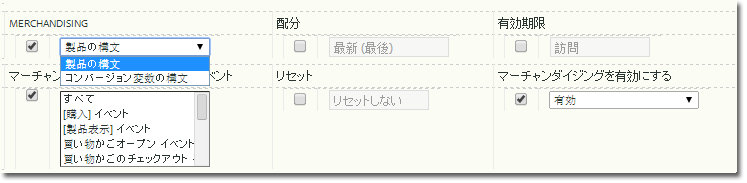

# マーチャンダイジング変数の実装

マーチャンダイジング変数を有効にして導入する方法を説明します。

## マーチャンダイジング変数の有効化 {#section_331B41FF5AED42F2AEFE043DD60238C7}

Merchandising can be enabled for any custom eVar on the **[!UICONTROL Admin Tools]** &gt; **[!UICONTROL Report Suites]** &gt; **[!UICONTROL Conversion Variables]** page (you no longer need to call Adobe):



| 設定 | 説明 |
|--- |--- |
| 有効期限 | マーチャンダイジング値が有効である期間を指定します。 |
| マーチャンダイジング | 製品の構文： s.products 内に設定されている値。コンバージョン変数の構文：指定されたマーチャンダイジング s.eVar に設定された値。 |
| マーチャンダイジングバインディングイベント（コンバージョン変数の構文のみ） | 製品を現在のマーチャンダイジングカテゴリーに結び付けるときのイベントを示します。Ctrl キーを押しながらリストの複数の項目をクリックすることで、複数のイベントを選択できます。注意：「製品の構文」を選択すると、イベントを選択できなくなります（無効になりますが、灰色にはなりません）。イベントを選択できるのは、「コンバージョン変数の構文」が選択されている場合のみです。 |

## 製品の構文を使用した導入 {#section_2774578D09CE40A093CB0D0A294DBF7C}

「製品の構文」が選択されている場合、マーチャンダイジングカテゴリーが products 変数に直接入力されるので、バインディングイベントを選択して設定する必要はありません。これが推奨される方法であり、成功イベントが発生したときにその値を `s.products` に設定できない場合を除いて、この方法を使用してください。

* **構文**

```js
  s.products="category;product;quantity;price;event_incrementer; 
<codeph outputclass="syntax">
  eVarN=merch_category| 
 <codeph outputclass="syntax">
   eVarM=merch_category2" 
 </codeph outputclass="syntax"> 
</codeph outputclass="syntax">
```

* **例**

```js
  s.events="prodView" 
  s.products=";Fernie Snow Goggles;;;; 
<codeph outputclass="syntax">
  eVar1=goggles" 
   In 
</codeph outputclass="syntax">
```

eVar1 の値「ゴーグル」が製品「Fernie Snow ゴーグル」に割り当てられます。この製品に関連して以降に発生するすべての成功イベント（製品の追加、チェックアウト、購入など）のクレジットは「ゴーグル」に付与されます。

## コンバージョン変数の構文を使用した導入 {#section_6AE10F69F4A14636AB050BEA89A34E4E}

eVar 変数を `s.products` に設定できない場合、コンバージョン変数の構文を使用する必要があります。一般的には、ページにマーチャンダイジングチャネルや検索方法のコンテキストがない場合です。そのような場合、製品ページに到達する前にマーチャンダイジング変数を設定し、その値がバインディングイベントの発生時まで保持されるようにする必要があります。

設定時にバインディングイベントが選択されると、保持された eVar の値が製品に関連付けられます。例えば、バインディングイベントとして prodView が指定されている場合、イベントの発生時にのみ現在の製品リストにマーチャンダイジングカテゴリーが結び付けられます。既に製品に割り当てられているマーチャンダイジング eVar を更新できるのは、以降のバインディングイベントのみです。

* **構文**&#x200B;バインディングイベントの前の同じページまたは直前のページの場合

   ```js
   s.eVar1="merchandising_category"
   ```

   バインディングイベントが発生するページの場合

   ```js
   s.events="prodView" 
   s.products="category;product"
   ```

* **例**&#x200B;その訪問の 1 ページ目

   ```js
   s.eVar1="Outdoors:Ski Goggles"
   ```

   その訪問の 2 ページ目

   ```js
   s.events="prodView" 
   s.products=";Fernie Snow Goggles"
   ```

   eVar1 の値「Outdoors:Ski Goggles」が製品「Fernie Snow ゴーグル」に割り当てられます。この製品に関連して以降に発生するすべての成功イベント（製品の追加、チェックアウト、購入など）のクレジットは「ゴーグル」に付与されます。

さらに、以下のどちらかの条件が満たされるまで、マーチャンダイジング変数の現在の値が以後のすべての製品に結び付けられます。

* eVar の期限が切れる（「有効期限」の設定に基づきます）。
* マーチャンダイジング eVar が新しい値で上書きされる。

詳しくは、[ の](https://analyticsdemystified.com/adobe-analytics/advanced-conversion-syntax-merchandising/)高度な変換構文マーチャンダイジング[!DNL analyticsdemystified.com]を参照してください。
