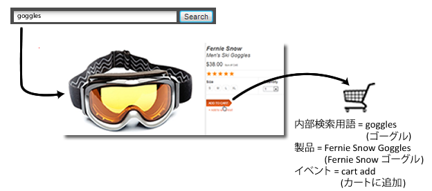
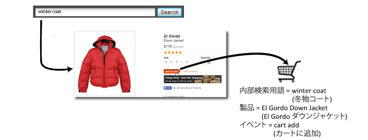

# マーチャンダイジング変数の概要

外部キャンペーンまたは外部検索用語の成功を測定する場合、一般的には発生する成功イベントすべてに対応するクレジットを受け取る 1 個の値が必要になります。例えば、顧客が電子メールキャンペーンのリンクをクリックして Web サイトを訪問した場合、その結果としておこなわれたすべての購入のクレジットがそのキャンペーンに付与される必要があります。

しかし、顧客が複数のアイテムを探しているときにサイト内検索またはカテゴリー閲覧によって発生したイベントはどうなるでしょうか。例えば、顧客がサイトで「ゴーグル」を検索し、ゴーグルをカートに追加したとします。

この顧客はチェックアウトの前に「冬物コート」を検索し、ダウンジャケットをカートに追加しました。

この購入が完了すると、配分が「最新」から変更されていない場合、「冬物コート」の検索にゴーグル購入のクレジットが付与されます。この場合、マーケティングに必要な正確なデータが得られなくなります。

| 内部検索用語 | 売上高 |
|---|---|
| 冬物コート | $157 |

**マーチャンダイジング変数による問題解決**

カテゴリーを問わないマーチャンダイジング変数、つまり「マーチャンダイジング eVar」を使用して、成功イベントが発生した時点で eVar の現在の値を製品に割り当てることができます。その特定の eVar に 1 つ以上の新しい値が後から設定された場合でも、この値はその製品に結び付けられたままになります。

前の例で eVar のマーチャンダイジングを有効にした場合、「ゴーグル」は Fernie Snow ゴーグルに結び付けられ、「冬物コート」は El Gordo ダウンジャケットに結び付けられます。マーチャンダイジング変数では製品レベルで売上を割り当てるので、用語が結び付けられた製品の売上金額に相当するクレジットを各用語が受け取ります。

| 内部検索用語 | 売上高 |
|---|---|
| 冬物コート | $119 |
| ゴーグル | $38 |

