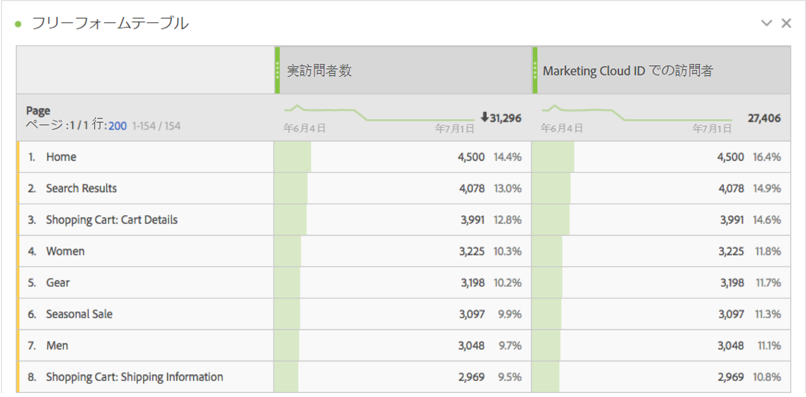
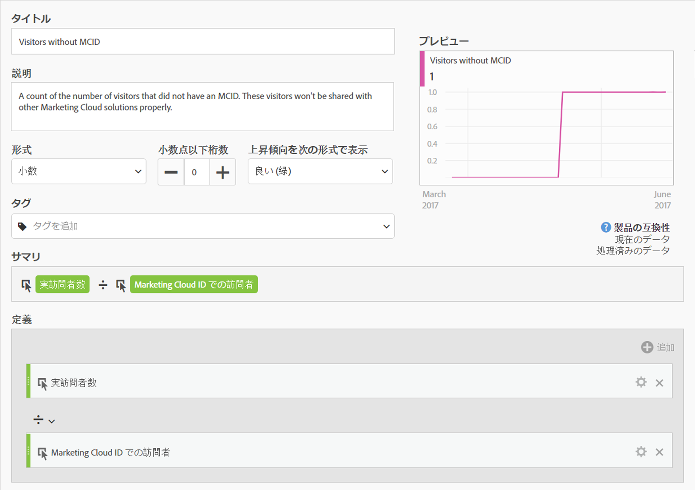
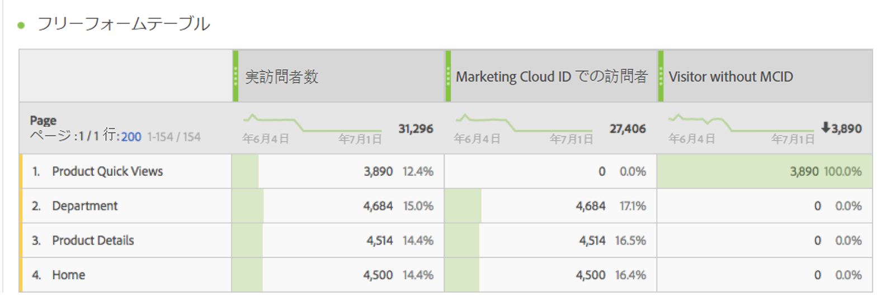
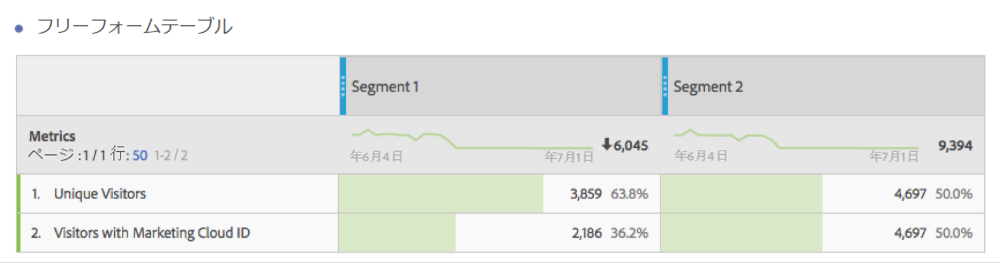

# Experience Cloud ID での訪問者

Analysis Workspace とセグメントビルダーで使用可能です。

Experience Cloud ID を持つ訪問者の数を示します。どのページがIDサービスをデプロイしたかを把握でき、他のExperience Cloudソリューションと共有できる訪問者数を把握できます。また、この Experience Cloud に共有されるセグメントでこの指標を使用することもできます。

>[!IMPORTANT]
>
>For this metric to appear, you have to have the [Identity Service](https://marketing.adobe.com/resources/help/en_US/mcvid/) running for the report suite.

## Experience Cloud ID 設定のデバッグ {#section_679E62142A3E46548FF8FBDA46568005}

The [!UICONTROL Visitors with Experience Cloud ID] metric is a useful metric in Adobe Analytics intended to help you find and debug your [!UICONTROL Identity Service]setup. 指標は、IDサービスからExperience Cloud IDを割り当てられたレポートスイート内の訪問者数のカウントです。この指標は、特定の Experience Cloud 統合が想定どおりの数の訪問者を共有していない可能性がある場合にその原因を診断したり、MCID がまだ導入されていない可能性のあるサイト領域を特定したりするうえで、非常に役に立ちます。

「Experience Cloud ID での訪問者」指標を使用するには、次の[!UICONTROL ページ]レポートのような任意のレポートに指標としてドラッグするだけです。

この例では、各ページの実訪問者数が Experience Cloud ID での訪問者と同じ数になっていることに注意してください。ただし、実訪問者数の合計数は Experience Cloud ID での訪問者の合計数より大きくなっています。まだすべての訪問者に MCID を設定していないページを見つけるには、次のような定義の[計算指標を作成](https://marketing.adobe.com/resources/help/en_US/analytics/calcmetrics/cm_build_metrics.html)します。

この計算指標をレポートに追加することで、MCID を持たない訪問者の数が最も多いページがひとめでわかるように、ページレポートをソートすることができます。

すぐに、「製品クイックビュー」ページがIDサービスと適切に実装されていないので、できるだけ早く更新することができます。ブラウザーのタイプ、サイトセクション、コンテンツタイプなど、任意のタイプのディメンションに基づいて、同様のレポートを作成することができます。

MCID を持たない訪問者がいるページを特定したら、その情報を実装チームにフィードバックして、それらのページを修正してもらうことができます。

場合によっては、MCID サービスがページに実装されていても一部の訪問者に MCID が設定されていないこともあります。そのような場合、原因として最も可能性が高いのは、Analytics JavaScript または DTM のよくある設定ミスで、レポートスイートが用意される前に AppMeasurement 関数が呼び出されることです。これを避けるには、適切に[コア AppMeasurement コードを挿入](https://marketing.adobe.com/resources/help/en_US/sc/implement/dtm/t_appmeasurement-code.html)します。

上記の「Product Quick Views」ページに基づくセグメントのうち、Experience Cloud と共有しているものはすべて、他の Experience Cloud ソリューションとの一致率が非常に低くなる可能性が高いことに注意してください。任意のセグメントの MCID 適用範囲を確認するには、次のようなレポートを作成します。

このテーブルでは実訪問者数と Experience Cloud ID での訪問者の数を比較していますが、これを見ると、「セグメント 1」の MCID 適用範囲が 100％でないのに対して、「セグメント 2」の場合は 100％になっていることが容易にわかります。つまり、セグメント 1 を Experience Cloud と共有しても、合計 3,859 人の訪問者のうち 2,186 人しか共有対象にならないということです。
