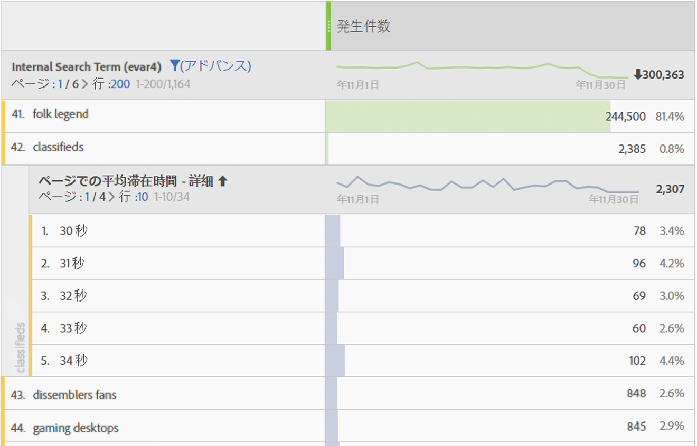
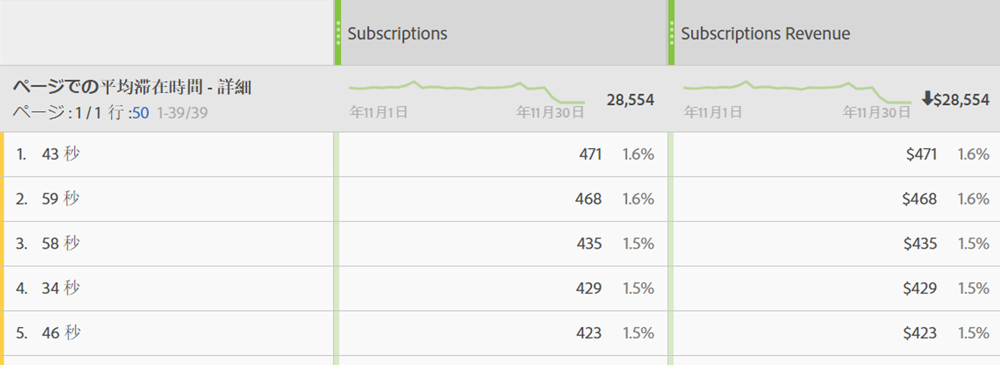

# 滞在時間

Adobe Analytics には、様々な滞在時間指標およびディメンションが用意されています。ここでは、その内容および計算方法について説明します。

* [滞在時間指標](../../../components/c-variables/c-metrics/metrics-time-spent.md#section_4F54D70300944748A62088F5870E4B6C)
* [滞在時間ディメンション](../../../components/c-variables/c-metrics/metrics-time-spent.md#section_D51606544CB046FC902E2E317318892C)
* [滞在時間の計算方法](../../../components/c-variables/c-metrics/metrics-time-spent.md#section_90A3882638974969A4B8B674FFDB7624)
* [滞在時間に関する FAQ](../../../components/c-variables/c-metrics/metrics-time-spent.md#section_51C2735BACAB42CCBA1DD3CBF238E2F7)
* [計算例](../../../components/c-variables/c-metrics/metrics-time-spent.md#section_3D63D6A601F34E42AD5366435CB610D5)

## 滞在時間指標 {#section_4F54D70300944748A62088F5870E4B6C}

次の表に、様々な滞在時間指標、定義、および Adobe Analytics での使用対象を示します。

<table id="table_7095406DF1614F3CAD5E437B919598D1"> 
 <thead> 
  <tr> 
   <th colname="col1" class="entry"> 指標 </th> 
   <th colname="col2" class="entry"> 定義 </th> 
   <th colname="col3" class="entry"> 使用対象 </th> 
  </tr> 
 </thead>
 <tbody> 
  <tr> 
   <td colname="col1"> 
合計滞在時間（秒） 
 </td> 
   <td colname="col2"> 
訪問者が特定のディメンション項目に関与した合計時間を表します。 
 
すべての後続のヒットにわたる値と永続性のインスタンスを含みます。prop の場合、滞在時間には後続のリンクイベントもカウントされます。 
 </td> 
   <td colname="col3"> 
Analysis Workspace 
 
Reports &amp; Analytics 
 
Report Builder（「合計滞在時間」と呼ばれる） 
 
Data Warehouse 
 </td> 
  </tr> 
  <tr> 
   <td colname="col1"> 
訪問別滞在時間（秒） 
 </td> 
   <td colname="col2"> 
<i>合計滞在時間（秒） / （訪問 - バウンス数）</i> 
 
各訪問で訪問者が特定のディメンション項目に関与した平均時間を表します。 
 </td> 
   <td colname="col3"> 
Analysis Workspace 
 
Reports &amp; Analytics 
 </td> 
  </tr> 
  <tr> 
   <td colname="col1"> 
訪問者別滞在時間（秒） 
 </td> 
   <td colname="col2"> 
<i>合計滞在時間（秒） / （実訪問者 - バウンス実訪問者数）</i> 
 
訪問者のライフタイム（cookie の期間）にわたって訪問者が特定のディメンション項目に関与した平均時間を表します。 
 </td> 
   <td colname="col3"> 
Analysis Workspace 
 
Reports &amp; Analytics 
 </td> 
  </tr> 
  <tr> 
   <td colname="col1"> 
サイトでの平均滞在時間（秒） 
 </td> 
   <td colname="col2"> 
ディメンション項目のシーケンスごとに、訪問者が特定のディメンション項目に関与した合計時間を表します。名前が示すような「サイト」の平均に限定されません。シーケンスについて詳しくは、滞在時間の計算方法の節を参照してください。 
 
注意：この指標は、計算での分母の違いにより、ディメンション項目レベルで訪問別滞在時間と異なる可能性が非常に高くなります。 
 </td> 
   <td colname="col3"> 
Analysis Workspace 
 
Reports &amp; Analytics（秒単位で表示） 
 
Report Builder（分単位で表示） 
 </td> 
  </tr> 
  <tr> 
   <td colname="col1"> 
ページでの平均滞在時間 
 </td> 
   <td colname="col2"> 
<b>廃止された指標です。</b> 
 
ディメンション項目の平均時間が必要な場合は、「サイトでの平均滞在時間」を使用することをお勧めします。 
 </td> 
   <td colname="col3"> 
Report Builder（リクエストにディメンションがある場合） 
 </td> 
  </tr> 
  <tr> 
   <td colname="col1"> 
セッションの長さの合計 
 
（別名：以前のセッションの長さ） 
 </td> 
   <td colname="col2"> 
Mobile アプリ SDK のみ。アプリが次回起動されたときに、以前のセッションの長さが決まります。この指標は、秒単位で計算され、アプリがバックグラウンドにある場合はカウントされず、使用中の場合のみカウントされます。これは、セッションレベルの指標です。 
 
例：アプリ ABC をインストールして起動し、2 分間使用してからアプリを閉じます。このセッション時間に関するデータは送信されません。次回起動すると、セッションの長さの合計が送信されます（値は 120）。 
 </td> 
   <td colname="col3"> 
Analysis Workspace 
 
Reports &amp; Analytics 
 
Report Builder 
 
Mobile Services UI 
 </td> 
  </tr> 
  <tr> 
   <td colname="col1"> 
平均セッション時間（モバイル） 
 </td> 
   <td colname="col2"> 
セッションの長さ合計/（起動回数-初回起動） 
 
Mobile アプリ SDK のみ。これは、セッションレベルの指標です。 
 </td> 
   <td colname="col3"> 
Report Builder 
 
Mobile Services UI 
 </td> 
  </tr> 
 </tbody> 
</table>

## 滞在時間ディメンション {#section_D51606544CB046FC902E2E317318892C}

次の表に、様々な滞在時間ディメンション、定義および Adobe Analytics での使用対象を示します。

<table id="table_BF1B7B8620714105BFB5C1AC37ABE02C"> 
 <thead> 
  <tr> 
   <th colname="col1" class="entry"> ディメンション </th> 
   <th colname="col2" class="entry"> 定義 </th> 
   <th colname="col3" class="entry"> 使用対象 </th> 
  </tr> 
 </thead>
 <tbody> 
  <tr> 
   <td colname="col1"> 
訪問別滞在時間 - 詳細 
 </td> 
   <td colname="col2"> 
訪問中の合計滞在時間（秒単位）であり、訪問の一部として各ヒットに適用されます。これは、訪問レベルのディメンションです。 
 </td> 
   <td colname="col3"> 
Analysis Workspace 
 </td> 
  </tr> 
  <tr> 
   <td colname="col1"> 
訪問別滞在時間 - グループ 
 </td> 
   <td colname="col2"> 
9 個の異なる範囲にグループ分けされた詳細なディメンションです。これは、訪問レベルのディメンションです。範囲を次に示します。 
 
    <ul id="ul_BC909A2D22ED4D48A3F7CE6A666F26E5"> 
     <li id="li_0FB28A1F0D894B7C95724A8C6BD5B00B">1 分未満 </li> 
     <li id="li_10223656420A475AAB3443981D49D10E">1 ～ 5 分 </li> 
     <li id="li_0DEE723B81C64EAFB5BD1125D48D3AD2">5 ～ 10 分 </li> 
     <li id="li_B736AC970E0049EB8844480702F345A6">10 ～ 30 分 </li> 
     <li id="li_21B8ECC3EE66497E8D870A004351B04B">30 ～ 60 分 </li> 
     <li id="li_79FB658128FD4F97AAE1A803F1687BD1">1 ～ 2 時間 </li> 
     <li id="li_CCC0746FEB954BECB9E670ECCDBF30F3">2 ～ 5 時間 </li> 
     <li id="li_BD7AFC524C814F9FAE423A4E301661D4">5 ～ 10 時間 </li> 
     <li id="li_C9B5F1A83F99437A98A61756EE286687">10 ～ 15 時間 </li> 
     <li id="li_8CC5A279D5804C5EA34C1B3589EF07BA">15 時間以上 </li> 
    </ul> 
注意：12 時間を超える訪問は、ヒットをばらばらに受け取った場合に発生する可能性があります。 
 </td> 
   <td colname="col3"> 
Analysis Workspace 
 
Reports &amp; Analytics 
 
Report Builder 
 </td> 
  </tr> 
  <tr> 
   <td colname="col1"> 
ページでの滞在時間 - 詳細 
 </td> 
   <td colname="col2"> 
各ヒットに関する合計滞在時間（秒単位）です。ヒットレベルのディメンションであり、ページビュー数およびリンクイベントを含みます。名前が示すような「ページ」ディメンションに限定されません。 
 </td> 
   <td colname="col3"> 
Analysis Workspace 
 </td> 
  </tr> 
  <tr> 
   <td colname="col1"> 
ページでの滞在時間 - グループ 
 </td> 
   <td colname="col2"> 
10 個の異なる時間範囲にグループ分けされた詳細なディメンションです。ただし、グループディメンションは、ページビュー数のみをカウントします（リンクイベントを除く）。これは、ヒットレベルのディメンションです。範囲を次に示します。 
 
    <ul id="ul_D5F067A2520646A99AA261F9A4625C03"> 
     <li id="li_82307DE66EC548F0AD79DB1505A21F0D">15 秒未満 </li> 
     <li id="li_585965B82C4D43B6870978A5CE63B5B6">15 ～ 29 秒 </li> 
     <li id="li_5C20DC78E126472A838818EBA1D954D0">30 ～ 59 秒 </li> 
     <li id="li_2579C0B9279340ABA3AD4A527D758239">1 ～ 3 分 </li> 
     <li id="li_E0FD800E948049A48DB4329A3E7A2478">3 ～ 5 分 </li> 
     <li id="li_D9DBBFE6004F42BD80BB4F9268DF7DA7">5 ～ 10 分 </li> 
     <li id="li_20F146799679456E8D6434D79EE12C31">10 ～ 15 分 </li> 
     <li id="li_A38951A553A14AE7A0F23A904EEE35DE">15 ～ 20 分 </li> 
     <li id="li_D44D773A344E47BFAA771302A49D8BD4">20 ～ 30 分 </li> 
     <li id="li_8766683DB29147CD8470D2317F750E97">31 分以上 </li> 
    </ul> </td> 
   <td colname="col3"> 
Analysis Workspace 
 
Reports &amp; Analytics 
 </td> 
  </tr> 
 </tbody> 
</table>

## 滞在時間の計算方法 {#section_90A3882638974969A4B8B674FFDB7624}

Adobe Analytics は、明示的な値（リンクイベントおよびビデオ視聴を含む）を使用して、[!UICONTROL 滞在時間]を計算します。

>[!NOTE]
>
>[!UICONTROL ビデオビュー] や [!UICONTROL 出口リンク]などのリンクイベントがない場合、訪問の最終ヒットでの滞在時間は把握できません。また、同様の理由で、[!UICONTROL バウンス訪問]（つまり、単一のヒットを含む[!UICONTROL 訪問]）には、関連付けられた[!UICONTROL 滞在時間]がありません。

すべての滞在時間の計算での&#x200B;**分子**&#x200B;は、「合計滞在時間 (秒)」です。

**分母**&#x200B;は、Analytics では個別の指標として使用できません。ヒットレベルの滞在時間指標では、分母はシーケンスです。シーケンスは、連続したヒットのセットであり、特定の変数が同じ値を含みます（設定されるか、後続に展開するか、永続化によって）。「後続に展開」とは、滞在時間を計算するための、ページビュー間の（つまり、後続のリンクイベントにまたがる）prop の永続性のことをいいます。

* 例えば、[!UICONTROL ページ名]またはそのヒットレベルの他のディメンションの場合、分母は基本的に[!UICONTROL インスタンス]または[!UICONTROL ページビュー数]ですが、リロードして値が設定されていない場合（リンクイベントなど）は、単一のインタラクション（シーケンス）としてカウントされます。

* [!UICONTROL バウンス]および[!UICONTROL 離脱]ヒットも、滞在時間が確認できないので、分母から削除されます。

## 滞在時間に関する FAQ {#section_51C2735BACAB42CCBA1DD3CBF238E2F7}

<table id="table_D8BA825412B6420390CA78D77A5E57C2"> 
 <thead> 
  <tr> 
   <th colname="col1" class="entry"> 質問 </th> 
   <th colname="col2" class="entry"> 回答 </th> 
  </tr> 
 </thead>
 <tbody> 
  <tr> 
   <td colname="col1"> 
すべての滞在時間指標を任意のディメンションに適用できますか。 
 </td> 
   <td colname="col2"> 
次の滞在時間指標は、任意のディメンションに適用できます。 
 
    <ul id="ul_FC9513D0184B4A74BA1F4CCEA8BC1940"> 
     <li id="li_669156CC549040E08AB4977AF4B8AECB">合計滞在時間（秒） </li> 
     <li id="li_3CCD7E7D127448689228E98A5EE854CB">訪問別滞在時間（秒） </li> 
     <li id="li_1F61C157EC414C7F8702BC3F365AA2D7">訪問者別滞在時間（秒） </li> 
     <li id="li_A3EF959A9BAB4872915F1A5C1A86D48E">サイトでの平均滞在時間（秒） </li> 
    </ul> </td> 
  </tr> 
  <tr> 
   <td colname="col1"> 
他のディメンションを使用した分類で使用するのに最適なのは、どの滞在時間ディメンションですか。 
 </td> 
   <td colname="col2"> 
「ページでの滞在時間-詳細」ディメンションは、ヒットレベルのディメンションです。これを他のディメンションで分類すると、ヒットが存続して分類ディメンションも存在した秒数がわかります。 
 
次の例では、検索語句「classifieds」が 54 秒、59 秒などのヒット時間に関連付けられており、おそらく訪問者がその検索語句で返されたコンテンツを読むのに時間を費やしていることを示しています。 
 
 
 </td> 
  </tr> 
  <tr> 
   <td colname="col1"> 
「ページでの滞在時間-詳細」のディメンションに対して適切な指標は何ですか。 
 </td> 
   <td colname="col2"> 
すべての指標です。このディメンションは、イベントが発生したヒットの滞在時間を表します。滞在時間が長くなると、訪問者がイベントが発生したページ（ヒット）により長く滞在したことを意味します。 
 
 
 </td> 
  </tr> 
  <tr> 
   <td colname="col1"> サイトでの平均滞在時間は訪問別滞在時間とどのように異なりますか。 </td> 
   <td colname="col2"> 
違いは、指標の分母です。 
 
    <ul id="ul_E9D7B4D3EDCC4691B2C724E0FE5480D2"> 
     <li id="li_CA34D84A3164473A8737D258425CA468"> サイトでの平均滞在時間は、ディメンション項目を含むシーケンスを使用します。 </li> 
     <li id="li_2F2639480BE24927919732D00364EECA"> 訪問別滞在時間は、訪問数を使用します。 </li> 
    </ul> 
結果として、これらの指標は、訪問レベルでは似たような結果を生みますが、ヒットレベルでは異なります。 
 </td> 
  </tr> 
 </tbody> 
</table>

## 計算例 {#section_3D63D6A601F34E42AD5366435CB610D5}

次のサーバーコールのセットは、1 回の訪問での 1 名の訪問者のものであるとします。

<table id="table_63CBB5097E5A46659877E2CA3C94D81C"> 
 <thead> 
  <tr> 
   <th colname="col1" class="entry"> 訪問ヒット数 </th> 
   <th colname="col2" class="entry"> 1 </th> 
   <th colname="col3" class="entry"> 2 </th> 
   <th colname="col4" class="entry"> 3 </th> 
   <th colname="col5" class="entry"> 4 </th> 
   <th colname="col6" class="entry"> 5 </th> 
   <th colname="col7" class="entry"> 6 </th> 
   <th colname="col8" class="entry"> 7 </th> 
  </tr> 
 </thead>
 <tbody> 
  <tr> 
   <td colname="col1"> <b>訪問経過時間（秒）</b> </td> 
   <td colname="col2"> 0 </td> 
   <td colname="col3"> 30 </td> 
   <td colname="col4"> 80 </td> 
   <td colname="col5"> 180 </td> 
   <td colname="col6"> 190 </td> 
   <td colname="col7"> 230 </td> 
   <td colname="col8"> 290 </td> 
  </tr> 
  <tr> 
   <td colname="col1"> <b>滞在時間（秒）</b> </td> 
   <td colname="col2"> 30 </td> 
   <td colname="col3"> 50 </td> 
   <td colname="col4"> 100 </td> 
   <td colname="col5"> 10 </td> 
   <td colname="col6"> 40 </td> 
   <td colname="col7"> 60 </td> 
   <td colname="col8"> - </td> 
  </tr> 
  <tr> 
   <td colname="col1"> <b>ヒットタイプ</b> </td> 
   <td colname="col2"> ページ </td> 
   <td colname="col3"> リンク </td> 
   <td colname="col4"> ページ </td> 
   <td colname="col5"> ページ </td> 
   <td colname="col6"> ページ </td> 
   <td colname="col7"> ページ </td> 
   <td colname="col8"> ページ </td> 
  </tr> 
  <tr> 
   <td colname="col1"> <b>ページ名</b> </td> 
   <td colname="col2"> ホーム </td> 
   <td colname="col3"> - </td> 
   <td colname="col4"> 製品 </td> 
   <td colname="col5"> ホーム </td> 
   <td colname="col6"> ホーム 
（リロード） 
 </td> 
   <td colname="col7"> 買い物かご </td> 
   <td colname="col8"> 注文確認 </td> 
  </tr> 
 </tbody> 
</table>

### eVarの例

<table id="table_6D0CF0C53DC145D3A53C06EC3012BCC0">  
 <thead> 
  <tr> 
   <th colname="col1" class="entry"> 訪問ヒット数 </th> 
   <th colname="col2" class="entry"> 1 </th> 
   <th colname="col3" class="entry"> 2 </th> 
   <th colname="col4" class="entry"> 3 </th> 
   <th colname="col5" class="entry"> 4 </th> 
   <th colname="col6" class="entry"> 5 </th> 
   <th colname="col7" class="entry"> 6 </th> 
   <th colname="col8" class="entry"> 7 </th> 
  </tr> 
 </thead>
 <tbody> 
  <tr> 
   <td colname="col1"> <b>eVar1</b> </td> 
   <td colname="col2"> 赤 
（設定） 
 </td> 
   <td colname="col3"> 赤 
（永続化） 
 </td> 
   <td colname="col4"> （期限切れ） </td> 
   <td colname="col5"> 青 
（設定） 
 </td> 
   <td colname="col6"> 青 
（設定） 
 </td> 
   <td colname="col7"> 青 
（永続化） 
 </td> 
   <td colname="col8"> 赤 
（設定） 
 </td> 
  </tr> 
  <tr> 
   <td colname="col1"> <b>eVar 滞在時間（秒）</b> </td> 
   <td colname="col2"> 30 </td> 
   <td colname="col3"> 50 </td> 
   <td colname="col4"> - </td> 
   <td colname="col5"> 10 </td> 
   <td colname="col6"> 40 </td> 
   <td colname="col7"> 60 </td> 
   <td colname="col8"> - </td> 
  </tr> 
 </tbody> 
</table>

### propの例

<table id="table_1CB4D24A6CAA479C8E59A7C77FFB8226">  
 <thead> 
  <tr> 
   <th colname="col1" class="entry"> 訪問ヒット数 </th> 
   <th colname="col2" class="entry"> 1 </th> 
   <th colname="col3" class="entry"> 2 </th> 
   <th colname="col4" class="entry"> 3 </th> 
   <th colname="col5" class="entry"> 4 </th> 
   <th colname="col6" class="entry"> 5 </th> 
   <th colname="col7" class="entry"> 6 </th> 
   <th colname="col8" class="entry"> 7 </th> 
  </tr> 
 </thead>
 <tbody> 
  <tr> 
   <td colname="col1"> <b>prop1</b> </td> 
   <td colname="col2"> A 
（設定） 
 </td> 
   <td colname="col3"> A 
（後続に展開） 
 </td> 
   <td colname="col4"> （未設定） </td> 
   <td colname="col5"> B 
（設定） 
 </td> 
   <td colname="col6"> B 
（設定） 
 </td> 
   <td colname="col7"> A 
（設定） 
 </td> 
   <td colname="col8"> C 
（設定） 
 </td> 
  </tr> 
  <tr> 
   <td colname="col1"> <b>prop1 滞在時間（秒）</b> </td> 
   <td colname="col2"> 30 </td> 
   <td colname="col3"> 50 </td> 
   <td colname="col4"> - </td> 
   <td colname="col5"> 10 </td> 
   <td colname="col6"> 40 </td> 
   <td colname="col7"> 60 </td> 
   <td colname="col8"> - </td> 
  </tr> 
 </tbody> 
</table>

上の表に基づいて、滞在時間指標は次のように計算されます。

| prop1 | 合計滞在時間（秒） | 訪問別滞在時間 | 訪問者別滞在時間 | シーケンス数 | サイトでの平均滞在時間 |
|---|---|---|---|---|---|
| A | 30+50+60=140 | 140/1=140 | 140/1=140 | 2 | 140/2=70 |
| B | 10+40=50 | 50/1=50 | 50/1=50 | 1 | 50/1=50 |
| C | 0 | 0 | 0 | 0 | 0 |
| 不明な時間 | 100 | - | - | - | - |

| eVar1 | 合計滞在時間（秒） | 訪問別滞在時間 | 訪問者別滞在時間 | シーケンス数 | サイトでの平均滞在時間 |
|---|---|---|---|---|---|
| 赤 | 30+50=80 | 80/1=80 | 80/1=80 | 1 | 80/1=80 |
| 青 | 10+40+60=110 | 110/1=110 | 110/1=110 | 1 | 110/1=110 |
| 不明な時間 | 100 | - | - | - | - |

滞在時間ディメンションの場合、関連するレポートに次の行が表示されます。

* 訪問別滞在時間（詳細）：290
* ページでの滞在時間（詳細）：10、30、40、50、60、100

この例の補足として、次の追加の注意事項があります。

* すべての滞在時間の計算は、訪問の最初のヒットでゼロから始まる、訪問の経過時間に基づいています。
* 「滞在時間（秒）」は、現在のヒットのタイムスタンプと次のヒットのタイムスタンプの間の差異です。結果として、訪問の最後のヒット（およびバウンス数）には滞在時間が含まれません。
* 「シーケンス」は、連続したヒットのセットであり、特定の変数が同じ値を含みます（設定されるか、後続に展開するか、永続化によって）。例えば、prop1「A」には、ヒット 1 と 2 およびヒット 6 の 2 つのシーケンスがあります。最後のヒットは滞在時間を含まないので、訪問の最後のヒットの値では新しいシーケンスは開始されません。サイトでの平均滞在時間は、分母のシーケンスを使用します。

   * 滞在時間を目的とする場合のみ、前述の prop1 のヒット 2 に示されているように、prop がページヒットから後続のリンクヒットに「後続に展開」されます。これにより、prop1 のヒット 1（「A」）に設定された値をヒット 2 の滞在時間に累計できます。
   * eVar は、eVar が設定または永続化された任意のヒットの滞在時間を累計します。eVar の永続性は、Analytics 管理者の eVar 設定で定義されます。
