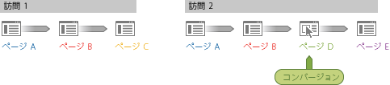

# 訪問者パーティシペーション - Ad Hoc Analysis

訪問者パーティシペーションは、訪問者による複数のセッション全体にわたってマーケティングチャネル、キャンペーン、売上高などのパーティシペーションを表示できる一連の指標です。例えば、注文があった訪問の前に発生した他のマーケティングタッチポイントに戻って、購入や売上高のクレジットを与えることができます。Ad hoc analysis では、訪問全体にわたって訪問者パーティシペーションを表示できます。

**売上高（パーティシペーション）**：コンバージョンにつながる単一の訪問において、コンバージョンページまでのすべてのページにわたるコンバージョンのクレジットをスプレッドします。

**売上高（訪問者パーティシペーション）**：指定した期間に基づいて、すべてのページおよび訪問にわたるコンバージョンのクレジットをスプレッドします。

**クロス訪問売上高パーティシペーションの例**

訪問者がサイトを 2 回訪問したとします。2 回目の訪問時に、D のページでコンバージョンイベントが発生し、$60 の売上があったとします。

レポートでのコンバージョンの配分は次のようになります。

* **売上高**：ページに配分されます。
* **売上高（パーティシペーション）**：2 回目の訪問に配分されます。
* **売上高（訪問者パーティシペーション）**：両方の訪問に配分されます。

<table id="table_91A7244E77854838A8392B49366FB445"> 
 <thead> 
  <tr> 
   <th colname="col1" class="entry"> ページ </th> 
   <th colname="col2" class="entry"> 売上高 </th> 
   <th colname="col3" class="entry"> 売上高（パーティシペーション） </th> 
   <th colname="col4" class="entry"> 売上高（訪問者パーティシペーション） </th> 
  </tr> 
 </thead>
 <tbody> 
  <tr> 
   <td colname="col1"> 
A 
 </td> 
   <td colname="col2"> 
0 
 </td> 
   <td colname="col3"> 
$60 
 </td> 
   <td colname="col4"> 
$60 
 </td> 
  </tr> 
  <tr> 
   <td colname="col1"> 
B 
 </td> 
   <td colname="col2"> 
0 
 </td> 
   <td colname="col3"> 
$60 
 </td> 
   <td colname="col4"> 
$60 
 </td> 
  </tr> 
  <tr> 
   <td colname="col1"> 
C 
 </td> 
   <td colname="col2"> 
0 
 </td> 
   <td colname="col3"> 
0 
 </td> 
   <td colname="col4"> 
$60 
 </td> 
  </tr> 
  <tr> 
   <td colname="col1"> 
D 
 </td> 
   <td colname="col2"> 
$60 
 </td> 
   <td colname="col3"> 
$60 
 </td> 
   <td colname="col4"> 
$60 
 </td> 
  </tr> 
 </tbody> 
</table>

