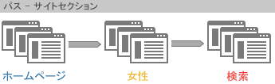
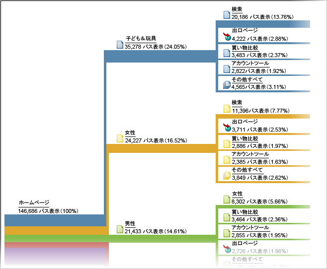

# パス

パス分析に基づくレポートのグループ。技術的には、パスとは、あるページ名から別のページ名（ある値から別の値）に移動することです。

より柔軟なパスオプションについては、[Analysis Workspace のフロー](https://marketing.adobe.com/resources/help/en_US/analytics/analysis-workspace/flow.html)を使用します。

> [!NOTE]パスを有効にするには、**[!UICONTROL 管理者／レポートスイート／設定を編集／トラフィック／トラフィック変数]**&#x200B;に移動します。サイトセクションおよびサーバーレポートでパスを有効にするには、カスタマーケアにお問い合わせください。

値が収集される順序がわかっている場合は、それらの値を収集する変数のパスを有効にする必要があります。ページのパスはデフォルトで有効になっています。prop のパスは、特定の場合にのみ当てはまるので、デフォルトで無効になっています。prop のパスを有効にする場合は、カスタマーケアにお問い合わせください。

> [!NOTE]Ad Hoc Analysis では、prop の分類を有効にすると、有効な prop に設定されているすべての分類でパス指標を利用できるようになります。

**例：サイトセクションのパス**

パスの有効化(*`s.channel`*&#x200B;変数のパスを有効にすると、サイトの訪問者がサイトセクション間をどのように移動しているかを（値の変化により）トラッキングできます。



パスは、[!UICONTROL 次のサイトセクションのフロー] などの様々なパスレポートで利用できます。このレポートには、訪問者がサイトのページグループやセクションをどのように移動しているかが表示されます。



**例：検索のパス**

ある値から別の値に移動するのと同じ概念が、他のトラフィック変数にも当てはまり、*`s.props`* と呼ばれる iFrame を読み込みます。例えば、内部検索キーワード&#x200B;*`s.prop`* のパスを有効にすると、訪問者が検索用語をたどったパスを確認できます。

**例：ログインステータスごとのパス**

訪問者のログインステータスに基づき、人々が自分のサイトをどのようにたどっているかを知りたいことがあります。この情報を確認するために、パスレポートでログインステータスを確認したりはしません。これらのレポートは、訪問者がそのレポート内の値をどのように変更させたか、またはログインからログアウトの間に訪問者がどのように変化したかを示すものだからです。代わりに、セグメント値と  *`s.pageName`* 変数を連結し、その結果の変数をパスします。次に、メンバーステータスごとのページパスのサンプルコードを示します。

```js
s.pageName="Home Page"; 
s.prop18="Gold"; // Member Status 
s.prop19=s.prop18 + ":" + s.pageName;
```

次に、*`s.prop19`*&#x200B;のパスを有効にして、メンバーがページ間をどのようにパスするかを確認します。

> [!NOTE]Ad Hoc Analysis を実行すると、セグメント値を連結することなく、ページパスをセグメント化でき、任意のセグメントをパスレポートに適用できます。

