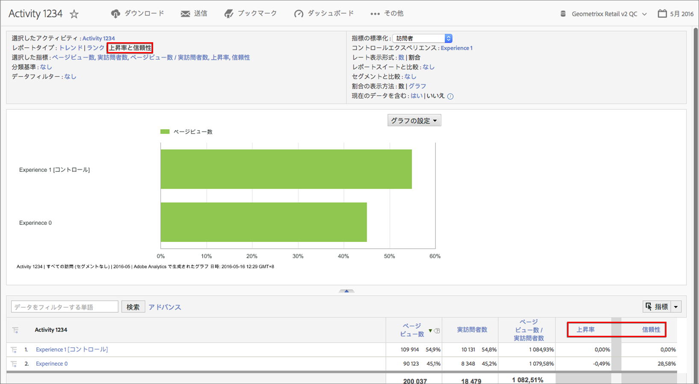

# Target の上昇率と信頼性

以前の [!DNL Target Classic] と同じように、Adobe Analytics 上でキャンペーンの成功を評価できます。

**[!UICONTROL Analytics]** > **[!UICONTROL Reports]** > **[!UICONTROL View All Reports]** > **[!UICONTROL Adobe Target]** > **[!UICONTROL Analytics for Target]** > **[!UICONTROL Target Activities]** .

Adobe Target ドキュメントには、[上昇率](https://docs.adobe.com/content/help/en/target/using/administer/preferences/estimating-lift-in-revenue.html)と[信頼性](https://docs.adobe.com/help/en/target/using/reports/settings/average-lift-bounds-and-confidence-interval.html)についての詳細な情報が記載されています。

上昇率と信頼性を計算するには：

1. In the **[!UICONTROL Target Activities]** report, click on an activity to bring up its details.
1. 「レポートタイプ」で、を選択しま **[!UICONTROL Lift and Confidence]**&#x200B;す。
1. をクリック **[!UICONTROL Show Metrics]** して、指標を1つ追加します。 テストは 1 つの指標のみで評価するのがベストプラクティスなので、このタイプのレポートでは、2 つ以上の指標を追加できません。多くの指標を追加してもノイズが増えるだけで、テストの信号が減ってしまいます。
1. (Optional) Under **[!UICONTROL Normalizing Metric]**, select one of the following: Visitors, Visits, or Impressions. ほとんどの場合、これはデフォルトの訪問者数になります。

1. レポートは、これらの指標（指標と標準化指標の比率を含む）を追加します。

## レポート設定 {#section_3508439E09CA4E38B2EA309BA477C01D}

<table id="table_0FBB257C96454CDA82D487DC68459C13"> 
 <thead> 
  <tr> 
   <th colname="col1" class="entry"> 設定 </th> 
   <th colname="col2" class="entry"> 説明 </th> 
  </tr> 
 </thead>
 <tbody> 
  <tr> 
   <td colname="col1"> 選択したアクティビティ </td> 
   <td colname="col2"> 現在、上昇率と信頼性を表示および計算している Target アクティビティ。 </td> 
  </tr> 
  <tr> 
   <td colname="col1"> レポートタイプ </td> 
   <td colname="col2"> ここで上昇率と信頼性を選択します。下のレポート結果に指標として表示されます。 </td> 
  </tr> 
  <tr> 
   <td colname="col1"> 選択した指標 </td> 
   <td colname="col2"> 選択した指標（前述の例では、売上高）、標準化指標（実訪問者数）、これら 2 つの指標の比率、およびコントロールエクスペリエンスと比較した上昇率および信頼性の計算を表示します。 </td> 
  </tr> 
  <tr> 
   <td colname="col1"> 分類基準 </td> 
   <td colname="col2"> レポートを他のレポートでさらに分類します。 </td> 
  </tr> 
  <tr> 
   <td colname="col1"> データフィルター </td> 
   <td colname="col2"> このレポートに特定のフィルターを適用できます。 </td> 
  </tr> 
  <tr> 
   <td colname="col1"> 指標の標準化 </td> 
   <td colname="col2"> 訪問回数、訪問者数またはインプレッション数を使用して標準化できます。標準化指標は、上昇率計算の分母になります。また、信頼性計算が適用される前のデータの集計方法に影響します。 </td> 
  </tr> 
  <tr> 
   <td colname="col1"> コントロールエクスペリエンス </td> 
   <td colname="col2"> 比較対象および上昇率を計算する対象の Target エクスペリエンス。 </td> 
  </tr> 
  <tr> 
   <td colname="col1"> レポートスイートと比較 </td> 
   <td colname="col2"> 比較対象となる他のレポートスイートを選択できます。 </td> 
  </tr> 
  <tr> 
   <td colname="col1"> セグメントと比較 </td> 
   <td colname="col2"> 比較対象となるセグメントを選択できます。 </td> 
  </tr> 
  <tr> 
   <td colname="col1"> 割合の表示方法：数／グラフ </td> 
   <td colname="col2"> 上昇率と信頼性の割合を数またはグラフとして表示します。 </td> 
  </tr> 
  <tr> 
   <td colname="col1"> 現在のデータを含む </td> 
   <td colname="col2"> 
Reports &amp; Analytics の「現在のデータを含む」オプションを使用すると、ほとんどの場合、データが完全に処理されてファイナライズされる前に最新の Analytics データを表示できます。「現在のデータ」には、ほとんどの指標が数分以内で表示され、迅速な意思決定を可能にする実用的なデータが提供されます。 
 </td> 
  </tr> 
 </tbody> 
</table>

