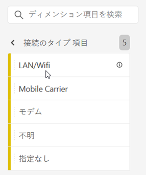
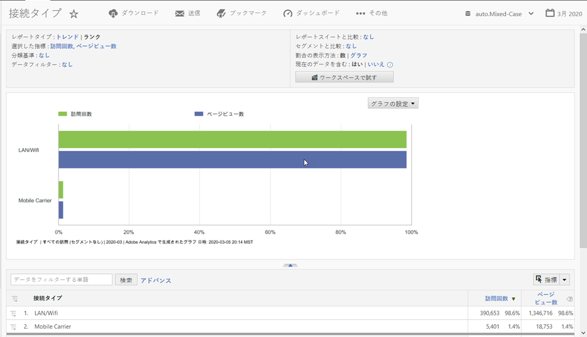

# 接続のタイプ

モデム、LAN/WiFi、携帯電話会社など、インターネット接続の種類の指標を表示します。

## 例

次のレポートは、訪問回数指標とページビュー数指標の [接続タ](https://docs.adobe.com/content/help/en/analytics/components/variables/metrics/metrics-visit.html) イプを [比較します](https://docs.adobe.com/content/help/en/analytics/components/variables/dimensions-reports/reports-page-views.html)。

携帯電話会社の接続タイプに関するその他のインサイトは、携帯電話会社レポートを [**表示して確認できます&#x200B;**](https://docs.adobe.com/content/help/en/analytics/components/variables/dimensions-reports/reports-mobile-carrier.html)。
