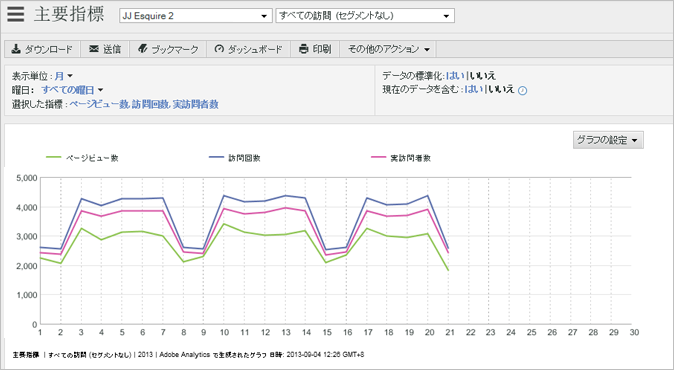

# 主要指標

主要指標レポートでは指標を比較し、同じ傾向があるかどうかを確認できます。例えば、ページビュー回数の増加につれて訪問者数も増加しているかどうかを確認できます。

<!-- 

 <b>Use Cases</b> 
 

Social Media: You can use the Key Metrics Report to examine social groups, such as Total Mentions or Audience Sentiment, and see how they are affecting revenue. How do you tie key metrics like Revenue to Social metrics? Look at the KM report by those groupings--total mentions, total audience, mapped to revenue. i.e. tv grouping, computing grouping, to see if it spikes or drives revenue. 

 -->

