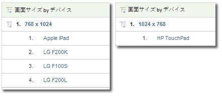

# モバイル

モバイルデバイスからの Web サイトへのアクセスに関する情報が表示されます。モバイルレポートは、サイトの閲覧に使用されたモバイルデバイスについてのデータを収集することで訪問者の識別を改善します。モバイルレポートからは、デバイスの製造元、および画面サイズ、ビデオ、オーディオ、cookie のサポートなどの機能を識別できます。モバイルレポートはすべてのレポートスイートで使用できます。

## モバイル {#topic_D306EA4558194488AC47A45B9C570150}

モバイルデバイスからの Web サイトへのアクセスに関する情報が表示されます。モバイルレポートは、サイトの閲覧に使用されたモバイルデバイスについてのデータを収集することで訪問者の識別を改善します。モバイルレポートからは、デバイスの製造元、および画面サイズ、ビデオ、オーディオ、cookie のサポートなどの機能を識別できます。モバイルレポートはすべてのレポートスイートで使用できます。

>[!NOTE]
>
>モバイルレポートにはモバイルWebトラフィックのみが表示されます。ネイティブ iOS、Android および他の SDK を使用して収集されたモバイル アプリ データがモバイルアプリレポートに表示されます。また、これらのデータは管理ツールで有効になっている場合にのみ表示されます。

次のモバイルレポートを使用できます。

<table id="table_900BB8F2F3A746B6B97DC629B39910DA"> 
 <thead> 
  <tr> 
   <th colname="col1" class="entry"> レポート </th> 
   <th colname="col2" class="entry"> 説明 </th> 
  </tr> 
 </thead>
 <tbody> 
  <tr> 
   <td colname="col1"> 
デバイス 
 </td> 
   <td colname="col2"> 
モバイルデバイス（iOS や Android のデバイスなど）を使用してサイトにアクセスした訪問者の人数を示します。このレポートは、モバイルイニシアチブの重要性を把握し、対策をとるために役立ちます。このレポートは次の目的に使用できます。 
 
 
     <ul id="ul_8CC40461C2944A63AED561E384275D24"> 
      <li id="li_4667815ED7384DE9824FB47F02040374"> 
モバイルユーザーに対する戦略を展開できます 
 </li> 
      <li id="li_12C1F430E5464FB4AC29C2D970165935"> 
オーディエンス側の基本設定がわかります 
 </li> 
      <li id="li_BFECB3B1F5A345BA82FC22BF99E8E418"> 
ワイヤレスおよびモバイルユーザーの訪問者数の増加をトラッキングできます 
 </li> 
     </ul> 
 </td> 
  </tr> 
  <tr> 
   <td colname="col1"> 製造元 </td> 
   <td colname="col2"> モバイルデバイスからのサイト訪問回数を、製造元別にグループ分けします。このレポートには、製造元のタイプ、製造元別の訪問回数と割合が表示されます。 </td> 
  </tr> 
  <tr> 
   <td colname="col1"> 画面のサイズ </td> 
   <td colname="col2"> 
 モバイルデバイスからのサイト訪問回数を、デバイスの画面サイズ別にグループ分けします。このレポートには、各画面サイズ、各画面サイズを使ってサイトに来訪した訪問者数、全ビュー数に対する各画面サイズ使用者の割合が表示されます。画面の高さレポートには高さだけが、そして画面の幅レポートには幅だけが表示されるのに対し、画面のサイズレポートには画面サイズの高さと幅の両方が表示されます。 
 
現在、モバイルの画面のサイズレポートはデバイスごとに固定されています。画面の向きに関係なく、各デバイスの固定された画面解像度がレポートに示されます。この画面解像度は、モバイルデバイス別に画面サイズを細分化すると設定できます。 
 </td> 
  </tr> 
  <tr> 
   <td colname="col1"> 画面の高さ </td> 
   <td colname="col2"> 
 様々なモバイルデバイスの画面の高さ、および画面の高さごとのビュー数を表示します。画面サイズレポートで、画面の高さと幅の両方を確認することもできます。 
 </td> 
  </tr> 
  <tr> 
   <td colname="col1"> 画面の幅 </td> 
   <td colname="col2"> 
 様々なモバイルデバイスの画面の幅、および画面の幅ごとのビュー数を表示します。画面サイズレポートで、画面の高さと幅の両方を確認することもできます。 
 </td> 
  </tr> 
  <tr> 
   <td colname="col1"> cookie サポート </td> 
   <td colname="col2"> 
モバイルデバイスからの訪問数を、cookie がサポートされているかどうかによってグループ分けします。訪問者は、cookie をサポートする訪問者とサポートしない訪問者のグループに分けられます。モバイルデバイスの種類はユーザーエージェント文字列で識別されます。アドビは cookie をサポートしていることがわかっているモバイルデバイスリストを管理しています。If the mobile device listed in the user agent string is also listed in Adobe’s list of mobile devices, then the  Supported line item in the  Cookie Support report is incremented. Otherwise, the  Not Supported line item in the report is incremented. 
 </td> 
  </tr> 
  <tr> 
   <td colname="col1"> 画像サポート </td> 
   <td colname="col2"> 
 サポートする画像形式別にモバイルデバイスをグループ分けします。 
 
例えば、訪問者が .jpeg 画像をサポートしている電話でサイトにアクセスすると、画像サポートレポートの値は少なくとも 1 増分されます。携帯電話が複数の画像形式をサポートしている場合は、サイトへの訪問によってレポートの値がその画像形式の数だけ増分されます。つまり、.jpeg、.png および .gif 形式をサポートしている携帯電話を使用してサイトを訪問した場合、レポートの各グループの値が増分されます。このため、グループの合計は、レポートの一番下に表示される合計値より大きくなることがあります。 
 </td> 
  </tr> 
  <tr> 
   <td colname="col1"> 画面の色 </td> 
   <td colname="col2"> 
 モバイルデバイスからの訪問回数を、サポートされている色の数でグループ分けします。このレポートには、モバイルデバイスを使用してサイトに来訪した訪問者総数とモバイルデバイスの画面の色数別のグループに細分した訪問者数が表示されます。 
 
例えば、訪問者の携帯電話が 24 色をサポートしている場合、レポートではこれら 24 色に対応する行項目が増分されます。 
 </td> 
  </tr> 
  <tr> 
   <td colname="col1"> オーディオサポート </td> 
   <td colname="col2"> 
 サポートするオーディオ形式別にモバイルデバイスをグループ分けします。 
 
例えば、訪問者の電話が .mp3 形式をサポートしている場合、オーディオサポートレポートの値は少なくとも 1 増分されます。携帯電話が複数のオーディオ形式をサポートしている場合は、1 回のサイトへの訪問で、レポートの値がサポートしている各オーディオタイプの数だけ増分される可能性があります。つまり、.mp3、.aac、.amr 形式をサポートしている携帯電話を使ってサイトを訪問した場合、レポートの各グループの値が増分されます。そのため、グループの合計は、レポートの一番下に表示されている合計値より大きくなります。 
 </td> 
  </tr> 
  <tr> 
   <td colname="col1"> ビデオサポート </td> 
   <td colname="col2"> 
 サポートするビデオ形式別にモバイルデバイスをグループ分けします。 
 
例えば、訪問者が .mp4 をサポートしているモバイルデバイスでサイトにアクセスすると、ビデオサポートレポートの値は少なくとも 1 増分されます。携帯電話が複数のビデオ形式（.mp4、.wmv など）をサポートしている場合、レポートの各グループの値が増分されます。このため、グループの合計は、レポートの一番下に表示される合計値より大きくなることがあります。 
 </td> 
  </tr> 
  <tr> 
   <td colname="col1"> DRM </td> 
   <td colname="col2"> 
 サポートされるデジタル著作権管理（DRM）のタイプ別にモバイルデバイスをグループ分けします。DRM グループには 転送ロック、  結合配信、  分離配信、  不明。 
 </td> 
  </tr> 
  <tr> 
   <td colname="col1"> 通信方式 </td> 
   <td colname="col2"> 
 サポートするネットワークプロトコル（GPRS、CSD、EDGE、HSCSD など）別にモバイルデバイスをグループ分けします。また、識別できないネットワークプロトコルは「不明」グループに分類されます。 
 
訪問者がモバイルデバイスでサイトにアクセスすると、ネットプロトコルレポートの値が少なくとも 1 増分されます。電話が複数のネットワークプロトコルをサポートしている場合、レポートの各グループの値が増分されます。このため、グループの合計は、レポートの一番下に表示される合計値より大きくなることがあります。 
 </td> 
  </tr> 
  <tr> 
   <td colname="col1"> オペレーティングシステム（廃止） </td> 
   <td colname="col2"> 
 デバイスで実行されているモバイルオペレーティングシステム別にモバイルデバイスをグループ分けします。モバイルオペレーティングシステムには Windows、RIM、iOS、Symbian などがあります。また、識別できないモバイルオペレーティングシステムは「不明」グループに分類されます。 
 
Note: This report was deprecated when the Technology &gt; <a href="../../../components/c-variables/dimensionslist/reports-operating-system.md#concept_3FADC871C6204533B4FCE73316B0B34F" format="dita" scope="local"> Operating Systems</a> report was updated to include all operating systems, including mobile. 「モバイルデバイス」が存在するセグメントを作成して、技術／オペレーティングシステムレポートに適用し、モバイルオペレーティングシステムだけを表示できます。 
 </td> 
  </tr> 
  <tr> 
   <td colname="col1"> Java バージョン </td> 
   <td colname="col2"> 
 サポートされる Java バージョン別にモバイルデバイスをグループ分けします。Java バージョンレポートでは、デバイスでサポートされている Java 仕様要求（JSR）により Java バージョンを識別します。また、識別できないモバイルオペレーティングシステムは「不明」グループに分類されます。 
 
JSR の詳細については、<a href="https://jcp.org/en/jsr/overview" scope="external" format="html">Java Community Process</a> の Web サイトをご覧ください。 
 </td> 
  </tr> 
  <tr> 
   <td colname="col1"> ブックマーク URL の長さ </td> 
   <td colname="col2"> 
 ブックマーク URL のサポートされている長さ（文字数）別にモバイルデバイスをグループ分けします。 
 </td> 
  </tr> 
  <tr> 
   <td colname="col1"> メール URL の長さ </td> 
   <td colname="col2"> 
 電子メール URL のサポートされている長さ（文字数）別にモバイルデバイスをグループ分けします。 
 </td> 
  </tr> 
  <tr> 
   <td colname="col1"> ブラウザー URL の長さ </td> 
   <td colname="col2"> 
 Web ブラウザー URL のサポートされている長さ（文字数）別にモバイルデバイスをグループ分けします。 
 </td> 
  </tr> 
  <tr> 
   <td colname="col1"> 機体番号送信（オン/オフ） </td> 
   <td colname="col2"> 
 機体番号送信をサポートしているかどうかでモバイルデバイスをグループ分けします。機体番号送信がサポートされているかどうかを判断できないデバイスは、レポートで「不明」グループに分類されます。 
 </td> 
  </tr> 
  <tr> 
   <td colname="col1"> PTT </td> 
   <td colname="col2"> 
 プッシュツートーク（PTT）をサポートしているかどうかでモバイルデバイスをグループ分けします。レポートには PTT サポートを設定できないデバイスの PTTがサポートされていないデバイスの 不明なグループ。 
 </td> 
  </tr> 
  <tr> 
   <td colname="col1"> デコメ対応 </td> 
   <td colname="col2"> 
 DecoMail をサポートしているかどうかでモバイルデバイスをグループ分けします。DecoMail は画像やアニメーションでメールを装飾できる機能です。レポートには PTT サポートを設定できないデバイスの デコレーションメールがサポートされていないデバイスの 不明なグループ。 
 </td> 
  </tr> 
  <tr> 
   <td colname="col1"> 情報配信 </td> 
   <td colname="col2"> 
 サポートするニュースサービス（Channel I/B、EZ News Flash、W+INFO など）別にモバイルデバイスをグループ分けします。訪問者がニュースサービスをサポートしているモバイルデバイスでサイトにアクセスすると、情報サービスレポートの値が少なくとも 1 増分されます。電話が複数のニュースサービスをサポートしている場合、レポートの各グループの値が増分されます。このため、グループの合計は、レポートの一番下に表示される合計値より大きくなることがあります。 
 </td> 
  </tr> 
 </tbody> 
</table>

