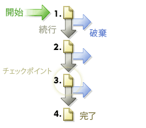

# パス

Web サイトのページがアクセスされた順序が表示されます。訪問者がサイト上の各ページに達する前と後にどのページにアクセスしたかの情報を収集できます。

## パス {#topic_39F11BCBEDC3495EA1300149FC6D4F14}

Web サイトのページがアクセスされた順序が表示されます。訪問者がサイト上の各ページに達する前と後にどのページにアクセスしたかの情報を収集できます。

パスレポートには、閲覧されたページのクリックストリームを明らかにする標準分析とオプションの詳細分析が含まれます。完全パス、最長パス、最も頻繁にアクセスされるパスの表示、ページフロー、フォールアウト、ドロップアウトの図解、新しいパターンおよび経時的な変化パターンの表示、入口や出口パスの分析などをおこなうことができます。

**[!UICONTROL 次ページのフロー]**&#x200B;または&#x200B;**[!UICONTROL 次サイトのフロー]**：訪問者が選択したページから移動して閲覧したページ（またはセクション、部門など）の 2 階層の分岐画像を表示します。このレポートを使用して、選択されたページを閲覧した後に訪問者が最もよくとるステップを分析し特定することができます。以下の操作をおこなうことができます。

* 選択されたページを閲覧した後に最も多くおこなわれた手順を把握します。
* 訪問者を目的のページに誘導するよう、サイトのパス設計を最適化します。
* 訪問者が、想定したページ以外のどのページへ移動しているかを特定します。

**[!UICONTROL 次のページ]**（または次のカテゴリ）：詳細なサイトパス分析データを示し、訪問者がサイトの特定のページにアクセスした後に閲覧した Web ページを特定します。例えば、サイト全体を選択してレポートするとき、レポートには最上位 10 のランディングページに続いて、各ランディングページの次に最頻訪問されるページが 5 つずつ表示されます。このデータは、どのコンテンツ、特集などが最もよく訪問者をひきつけてサイト内を移動させるかを把握するのに役立ちます。

**[!UICONTROL 前のページフロー]**（または前のカテゴリのフロー）：選択されたページの前に訪問者が最頻訪問するページを 2 つのレベルで表示します。また、訪問者がサイトに来訪した時間が強調表示されます。

**[!UICONTROL 前のページ]**（または他の前のページ）：詳細なサイトパス分析データを示し、訪問者がサイトの特定のページにアクセスする前に閲覧した Web ページを特定します。

**[!UICONTROL フォールアウト]**：定義した各チェックポイント間の訪問低下率とコンバージョン率を示します。ステップが上から下へ順に表示されます。それぞれの行番号と割合が左側に、コンバージョン率およびフォールアウト率が右側に表示されます。

詳しくは、[フォールアウトレポート](../../../components/c-variables/dimensionslist/reports-fallout.md#concept_DE1F8040F1B741F087B78568B342EC41)からの作成

**[!UICONTROL パスファインダー]**：フルパスをフラグメントに細分し、サイトの最適化に役立つ精密なパターンを作り出すことができます。パスファインダーウィザードを使用すると、レポートの生成に使用する選択条件を指定できるので、パスフラグメントを分析し、特定のページで始まるパス、特定のページで終わるパス、または特定のページで始まり特定のページで終わるパスを検索できます。

**[!UICONTROL パスの長さ]**：訪問者がサイトをどれだけ深くブラウズするかを表示します（割合と合計数の両方）。つまり、このレポートはサイトの平均的な訪問者がサイトを出るまでに閲覧するページ数を示します。

**[!UICONTROL ページ分析]**：以下を分析できるレポートのサブセットを含みます。

* **[!UICONTROL ページサマリ / サイトカテゴリサマリ]**：ページレポートについて知る必要のあるすべてが表示されます。このレポートは、単一のページに関するページ特有の情報を収集してまとめ、1 つのレポートとして表示します。
* **[!UICONTROL リロード回数]**：個々のページが訪問者によってリロードされた回数を表示します。
* **[!UICONTROL ページでの滞在時間 / サイトカテゴリでの滞在時間]**：訪問者がサイトで個々のページを閲覧する時間の長さを表示します。滞在時間は 10 のカテゴリ（15 秒未満、15 ～ 30 秒、30 ～ 60 秒、1 ～ 3 分、3 ～ 5 分、5 ～ 10 分、10 ～ 15 分、15 ～ 20 分、20 ～ 30 分、30 分超）に分類されます。
* **[!UICONTROL ページへのクリック数]**：サイトの各ページにアクセスするのに訪問者が使ったクリック数を識別します。ページの深さとは、そのページにアクセスするまでに閲覧したページをカウントしたページ数のことです。

**[!UICONTROL 入口と出口]**：入口ページレポートは、新規訪問者がサイトで最初に閲覧したページの割合および合計訪問回数を示します。表示される情報は以下のとおりです。

* **[!UICONTROL 入口ページ]**（またはセクション）：新規訪問者がサイトで最初に閲覧したページの割合および合計訪問回数を示します。このレポートは、最頻入口点である Web ページを特定したり、サイトの主な入口点を最適化したり、入口トラフィックを主要メッセージのあるページに導くために使用できます。
* **[!UICONTROL オリジナルエントリページ]**：サイトへの初回の訪問で訪問者が最初に閲覧したページを表示します。各ユーザーは、各自が cookie を削除したり、cookie を使って追跡されていない場合を除き、一度しかカウントされません。
* **[!UICONTROL 直帰数]**：訪問者のブラウズセッションの入口ページおよび出口ページとして最も多いページを表示します。
* **[!UICONTROL 出口ページ]**：訪問者がサイトを抜ける前に最後に閲覧したページの割合および合計訪問回数を示します。

