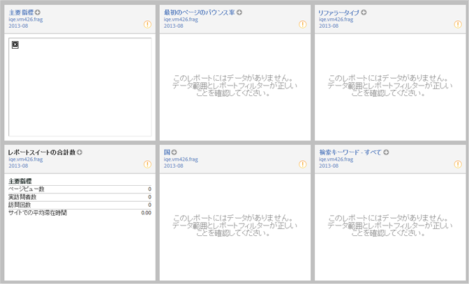

# サイト概要

サイト指標／サイト概要レポートはログイン時に表示され、関連データを直ちに表示して操作できます。レイアウトを編集してダッシュボードとして保存し、データをドリルダウンして深く分析できます。

ツールバーの「**[!UICONTROL レイアウト]**」をクリックすると、このレポートをカスタマイズしてダッシュボードに保存できます。

ダッシュボードをランディングページとして表示するように指定した場合、このレポートが自動的に表示されることはありません。
