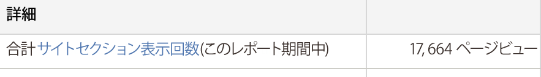

# サイトセクションサマリ

前のページの入口点と次のページの出口点や、インスタンス（このインターフェイスではページビューと呼ばれます）、サイトセクションの深さ、サイトセクションの滞在時間などに関する情報を表示する、サイトセクションに関するサマリレポートです。

繰り返しになりますが、**[!UICONTROL 詳細]の下に表示されるページビュー数は、インスタンスとして解釈する必要があります。**

