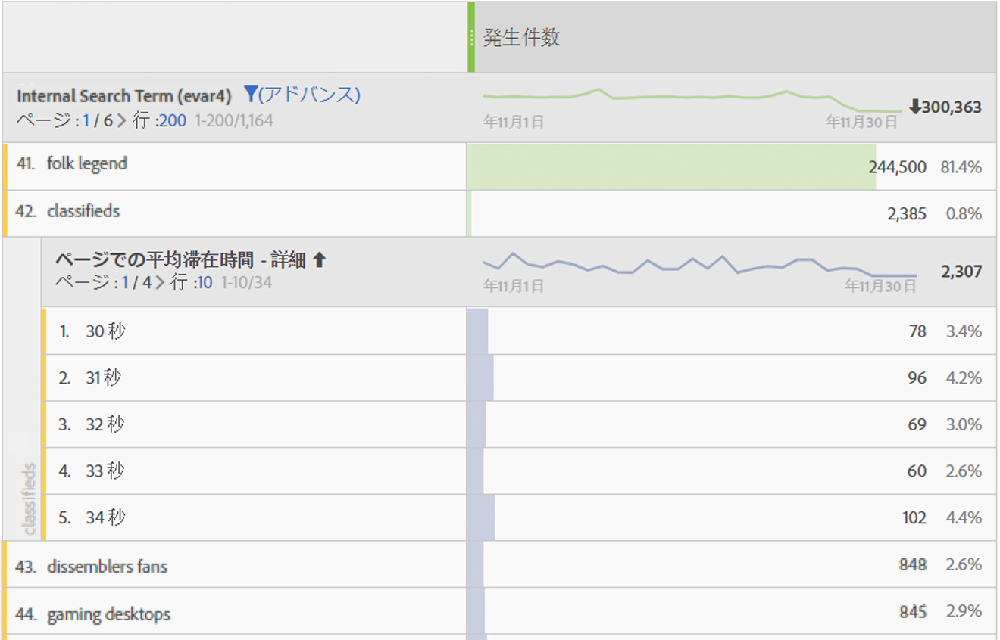

# Time spent on page

Adobe Analyticsでは、Analyticsレポートでの滞在時間を決定する方法がいくつか用意されています。 ほとんどの場合、滞在時間は次の手順で計算されます。

1. 特定のヒットについて、タイムスタンプとディメンションの値を確認します。
2. このヒットを、訪問の次のヒットのタイムスタンプと比較します。
3. この2つのヒット間の経過時間が、そのページの滞在時間に寄与します。

滞在時間ディメンションデータを表示する場合は、次の点に注意してください。

* 滞在時間は、配分と有効期限を考慮に入れます。
* 滞在時間データを計算する際は、ページビュー数とリンクトラッキングのヒットタイプの両方が考慮されます。
* 滞在時間は、その後のイメージリクエストで経過時間を測定しないので、訪問の最後のヒット時には測定されません。
* バウンスは、1回のヒットで構成されるので、滞在時間を測定できません。

ページでの滞在時間は、訪問のヒット間の経過時間を測定します。 分類されたディメンションは、分 **類された** 、分類さ **れたディメンション**。

* **** 詳細：各ディメンション値は、2つのヒットの間に費やされた秒数が異なります。
* **** グループ：各ディメンション値は、事前定義されたグループです。
   * 15秒未満
   * 15 ～ 29 秒
   * 1 ～ 3 分
   * 3 ～ 5 分
   * 5 ～ 10 分
   * 10 ～ 15 分
   * 15 ～ 20 分
   * 20 ～ 30 分
   * 30分以上

このディメンションはヒットベースであり、分類として使用すると、より意味のあるデータを提供できます。 このディメンションを、訪 [問ベースのディメンション](reports-time-spent-per-visit.md)（訪問別滞在時間）と比較します。

