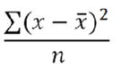
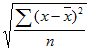

# 基本関数


[計算指標ビルダー](/help/components/calculated-metrics/workflow/c-build-metrics/cm-build-metrics.md)では、統計関数および数学関数を適用できます。この記事では、関数とその定義のアルファベット順のリストについて説明します。

>[!NOTE]
>
>[!DNL metric] が関数の引数として特定されている場合は、指標の他の式も許可されます。例えば、[COLUMN MAXIMUM(metrics)](#column-maximum) を [COLUMN MAXIMUM(PageViews + Visits)](#column-maximum) としてもかまいません。


## 表関数と行関数

テーブル関数は、テーブルの各行に対して出力が同じである関数です。 行関数は、テーブルの各行ごとに出力が異なる関数です。

該当する場合および関連する場合、関数には、関数のタイプで注釈が付けられます。[!BADGE テーブル]{type="Neutral"}または[!BADGE 行]{type="Neutral"}

## ゼロを含むパラメーターとは

このパラメーターは、計算にゼロを含むかどうかを示します。ゼロは&#x200B;*何もない*&#x200B;ことを意味する場合もあれば、重要な意味を持つ場合もあります。

例えば、売上高の指標がある場合に、ページビュー数の指標をレポートに追加すると、すべてゼロの売上高の行が突然表示されます。その追加の指標が **[MEAN](cm-functions.md#mean)**（平均値）、**[ROW MINIMUM](cm-functions.md#row-min)**（行の最小値）、**[QUARTILE](cm-functions.md#quartile)**（四分位数）および売上高列にあるその他の計算に影響を与えることは避けるべきです。この場合は、`include-zeros` パラメーターを確認します。

別のシナリオとして、2 つの目標指標があり、一方の指標の平均または最小値が高くなるのは、一部の行がゼロであるためです。その場合、パラメーターにゼロを含めるかどうかを確認しないことを選択できます。


## 絶対値 {#absolute-value}

<!-- markdownlint-disable MD034 -->

>[!CONTEXTUALHELP]
>id="functions-abs"
>title="絶対値"
>abstract="数値の絶対値を返します。数値の絶対値は、正の値を持つ数値です。"

<!-- markdownlint-enable MD034 -->


 **[!UICONTROL ABSOLUTE VALUE(metric)]**

[!BADGE 行]{type="Neutral"} 数値の絶対値を返します。数値の絶対値は、正の値を持つ数値です。

| 引数 | 説明 |
|---|---|
| 指標 | 絶対値を求める指標です。 |

**ユースケース**：収益の差分やパーセンテージの変更など、負の値を生成する可能性のある指標を分析する場合は、すべての結果が正であることを確認します。 これにより、方向に関係なく、変化の大きさに注目することができます。

**計算指標ビルダー**: **絶対値**&#x200B;関数で指標または式をラップします。例：**絶対値** （現在の収益 – 前収益）。 これにより、負の違いが正の値に変換されます。

>[!TIP]
>
>パフォーマンスの増減にかかわらず、2つの期間またはセグメント間の絶対差を測定する場合に使用します。
>

## 列の最大値 {#column-maximum}

<!-- markdownlint-disable MD034 -->

>[!CONTEXTUALHELP]
>id="functions-col-max"
>title="列の最大値"
>abstract="指標列の一連のディメンション要素の中の最大値を返します。MAXV は、ディメンション要素をまたいで、1 つの列（指標）内を垂直方向に評価します。"

<!-- markdownlint-enable MD034 -->

 **[!UICONTROL COLUMN MAXIMUM(metric, include_zeros)]**

指標列の一連のディメンション要素の中の最大値を返します。MAXV は、ディメンション要素をまたいで、1 つの列（指標）内を垂直方向に評価します。

| 引数 | 説明 |
|---|---|
| 指標 | 少なくとも 1 つの指標が必要ですが、任意の数の指標をパラメーターとして指定できます。 |
| include_zeros | 計算にゼロ値を含めるかどうか。 |

**ユースケース**：最も多くの訪問を行った日や、最も多くの収益を得た製品など、内訳の中で最も高い値を特定します。 これにより、カテゴリー全体のパフォーマンスを向上できます。

**計算指標ビルダー**: **日**&#x200B;または&#x200B;*製品*&#x200B;までに分類する場合、*収益*&#x200B;または&#x200B;*訪問*&#x200B;などの指標に&#x200B;*列の最大値*&#x200B;を適用します。 関数は、各行の列の最大値を返します。

>[!TIP]
>
>[IF](https://experienceleague.adobe.com/ja/docs/analytics-platform/using/cja-components/cja-calcmetrics/cm-adv-functions#if) （**Revenue** = *Column Maximum&#x200B;**（Revenue*）, 1, 0）などの&#x200B;**&#x200B;IF** ステートメントを使用して、分類で最もパフォーマンスの高い項目を強調表示します。
>

## 列の最小値 {#column-minimum}

<!-- markdownlint-disable MD034 -->

>[!CONTEXTUALHELP]
>id="functions-col-min"
>title="列の最小値"
>abstract="指標列の一連のディメンション要素の中の最小値を返します。MINV は、ディメンション要素をまたいで、1 つの列（指標）内を垂直方向に評価します。"

<!-- markdownlint-enable MD034 -->


 **[!UICONTROL COLUMN MINIMUM(metric, include_zeros)]**

指標列の一連のディメンション要素の中の最小値を返します。MINV は、ディメンション要素をまたいで、1 つの列（指標）内を垂直方向に評価します。

| 引数 | 説明 |
|---|---|
| 指標 | 少なくとも 1 つの指標が必要ですが、任意の数の指標をパラメーターとして指定できます。 |
| include_zeros | 計算にゼロ値を含めるかどうか。 |

**ユースケース**: コンバージョンが最も少ないキャンペーンや、収益が最も少ない日など、ブレークダウン内で最もパフォーマンスの低い値を特定します。 これにより、パフォーマンスの低いセグメントを迅速に特定できます。

**計算指標ビルダー**: **キャンペーン**&#x200B;または&#x200B;*日*&#x200B;までに分類する場合、*収益*&#x200B;または&#x200B;*コンバージョン率*&#x200B;のような指標に&#x200B;*列の最小値*&#x200B;を適用します。 関数は、各行の列の最小値を返します。

>[!TIP]
>
>[IF](https://experienceleague.adobe.com/ja/docs/analytics-platform/using/cja-components/cja-calcmetrics/cm-adv-functions#if) （**Revenue** = *Column Minimum&#x200B;**（Revenue*）, 1, 0）などの&#x200B;**&#x200B;IF** ステートメントを使用して、分類で最もパフォーマンスの低い項目を強調表示します。
>


## 列の合計値 {#column-sum}

<!-- markdownlint-disable MD034 -->

>[!CONTEXTUALHELP]
>id="functions-col-sum"
>title="列の合計値"
>abstract="（1 つのディメンションの複数の要素の）1 つの列内の指標のすべての数値を加算します。"

<!-- markdownlint-enable MD034 -->


 **[!UICONTROL COLUMN SUM(metric)]**

（1 つのディメンションの複数の要素の）1 つの列内の指標のすべての数値を加算します。

| 引数 | 説明 |
|---|---|
| 指標 | 少なくとも 1 つの指標が必要ですが、任意の数の指標をパラメーターとして指定できます。 |

**ユースケース**：すべての製品の合計売上高や、すべての日間の合計訪問数など、分類の中のすべての値の合計を計算します。 これは、個々の行の値と比較するために全体的な合計が必要な場合に役立ちます。

**計算指標ビルダー**: **製品**&#x200B;または&#x200B;*日*&#x200B;までに分類する際に、*収益*&#x200B;または&#x200B;*訪問*&#x200B;などの指標に&#x200B;*列合計*&#x200B;を適用します。 関数は、各行の列のすべての値の合計を返します。

>[!TIP]
>
>合計パフォーマンスのシェアまたはパーセンテージを計算するために、全体の合計を参照する必要がある場合に使用します。
>


## カウント {#count}

<!-- markdownlint-disable MD034 -->

>[!CONTEXTUALHELP]
>id="functions-count"
>title="カウント"
>abstract="1 つの列内の指標のゼロ以外の値の数（カウント）（ディメンション内でレポートされた一意の要素の数）を返します。"

<!-- markdownlint-enable MD034 -->


 **[!UICONTROL COUNT(metric)]**

[!BADGE テーブル]{type="Neutral"} 1 つの列内の指標のゼロ以外の値の数（カウント）（ディメンション内でレポートされた一意の要素の数）を返します。

| 引数 | 説明 |
|---|---|
| 指標 | カウントする指標です。 |

**ユースケース**：日付範囲の日数や内訳の商品数など、計算に含まれるデータポイントの数をカウントします。 これは、集計された値に貢献するアイテム数を知る必要がある場合に役立ちます。

**計算指標ビルダー**: **訪問**&#x200B;または&#x200B;*収益*&#x200B;のような指標に&#x200B;*カウント*&#x200B;を適用して、現在の内訳または日付範囲に含まれる行（またはデータポイント）の合計数を返します。

>[!TIP]
>
>**列合計**&#x200B;と組み合わせて使用すると、平均値を手動で計算できます（例：**列合計** （*収益*） / **カウント** （収益））。
>

## 指数 {#exponent}

<!-- markdownlint-disable MD034 -->

>[!CONTEXTUALHELP]
>id="functions-exp"
>title="指数"
>abstract="指定された数値の累乗した e を返します。定数 e は、自然対数のベースである 2.71828182845904 に等しくなります。EXPONENT（指数）は LN（数の自然対数）の逆関数です。"

<!-- markdownlint-enable MD034 -->

 **[!UICONTROL EXPONENT(metric)]**

[!BADGE 行]{type="Neutral"} 指定された数値の累乗した e を返します。定数 e は、自然対数のベースである 2.71828182845904 に等しくなります。EXPONENT（指数）は LN（数の自然対数）の逆関数です。

| 引数 | 説明 |
|---|---|
| 指標 | 底 e に適用される指数です。 |

**ユースケース**：指定された数値または指標の累乗に&#x200B;*e*&#x200B;を引き上げます。 これは、成長傾向をモデル化したり、指標を飛躍的に拡張したりする場合に便利です。

**計算指標ビルダー**&#x200B;で：**指数**&#x200B;を指標と共に使用します。 例：**指数** （*訪問数*）は、*e*&#x200B;を&#x200B;*訪問数*&#x200B;指標の累乗に引き上げます。

>[!TIP]
>
>高度なモデリング用に&#x200B;**対数**&#x200B;と組み合わせるか、成長パターンを比較する際に非常に変動の大きいデータを滑らかにします。
>


## 平均 {#mean}

<!-- markdownlint-disable MD034 -->

>[!CONTEXTUALHELP]
>id="functions-mean"
>title="平均"
>abstract="1 つの列の指標の算術平均（平均値）を返します。"

<!-- markdownlint-enable MD034 -->


 **[!UICONTROL MEAN(metric, include_zeros)]**

[!BADGE テーブル]{type="Neutral"} 1 つの列の指標の算術平均（平均値）を返します。

| 引数 | 説明 |
|---|---|
| 指標 | 平均を求める指標です。 |
| include_zeros | 計算にゼロ値を含めるかどうか。 |

**ユースケース**:1日の平均売上高やキャンペーンあたりの平均訪問数など、一連の値の算術平均を計算します。 これにより、データセット内の個々の値を比較するためのベースラインを確立できます。

**計算指標ビルダー**: **収益**&#x200B;または&#x200B;*訪問*&#x200B;のような指標に&#x200B;*平均*&#x200B;を適用して、選択した内訳または日付範囲のすべてのデータポイントの平均値を返します。

>[!TIP]
>
>を使用して全体的なパフォーマンスの傾向を把握するか、**標準偏差**&#x200B;と組み合わせて、平均の一貫性を測定します。
>

## 中央値 {#median}

<!-- markdownlint-disable MD034 -->

>[!CONTEXTUALHELP]
>id="functions-median"
>title="中央値"
>abstract="1 つの列の指標の中央値を返します。中央値は、一連の数の中央にある数値です。つまり、数の半分は中央値よりも大きいか等しい値であり、残りの半分は中央値よりも小さいか等しい値です。"

<!-- markdownlint-enable MD034 -->


 **[!UICONTROL MEDIAN(metric, include_zeros)]**

[!BADGE テーブル]{type="Neutral"} 1 つの列の指標の中央値を返します。中央値は、一連の数の中央にある数値です。つまり、数の半分は中央値よりも大きいか等しい値であり、残りの半分は中央値よりも小さいか等しい値です。

| 引数 | 説明 |
|---|---|
| 指標 | 中央値を求める指標です。 |
| include_zeros | 計算にゼロ値を含めるかどうか。 |

**ユースケース**:1訪問あたりの日別売上高の中央値やページビューの中央値など、一連のデータの中央値を特定します。 これは、異常値の影響を軽減し、データの中心的な傾向を確認したい場合に役立ちます。

**計算指標ビルダー**：収益またはページビューなどの指標に中央値を適用して、選択した分類または日付範囲のすべてのデータポイントの中間値を返します。

>[!TIP]
>
>データに平均をゆがめる可能性のある極端な高低が含まれている場合は、**Mean**&#x200B;の代わりに使用してください。
>


## モジュロ {#modulo}

<!-- markdownlint-disable MD034 -->

>[!CONTEXTUALHELP]
>id="functions-modulo"
>title="モジュロ"
>abstract="ユークリッド除法 で x を y で割った余りを返します。 "

<!-- markdownlint-enable MD034 -->


 **[!UICONTROL MODULO(metric_X, metric_Y)]**

ユークリッド除法 で x を y で割った余りを返します。

| 引数 | 説明 |
|---|---|
| metric_X | 除算する最初の指標。 |
| metric_Y | 除算する 2 番目の指標。 |

**使用例**：ある数値を別の数値で割った後に残りを返します。 これは、n番目の曜日やキャンペーンを順番に特定するなど、周期的または繰り返しパターンに役立ちます。

**計算指標ビルダー**: **モジュール**&#x200B;を2つの数値入力で使用します。 例：**モジュール** （*日番号*, 7）は、日番号を7で割った後に残りを返します。これは、週ごとにデータをグループ化するのに役立ちます。

>[!TIP]
>
>条件付きロジックと組み合わせることで、繰り返し発生するインターバルをハイライト表示したり、繰り返しサイクルにもとづいてデータをセグメント化したりできます。
>

### その他の例

返される値の符号は入力した値の符号と同じです（またはゼロが返されます）。

```
MODULO(4,3) = 1
MODULO(-4,3) = -1
MODULO(-3,3) = 0
```

常に正の数を求めるには、次の構文を使用します。

```
MODULO(MODULO(x,y)+y,y)
```

## パーセンタイル {#percentile}

<!-- markdownlint-disable MD034 -->

>[!CONTEXTUALHELP]
>id="functions-percentile"
>title="パーセンタイル"
>abstract="0～100 の値である、n 番目のパーセンタイルを返します。n &lt; 0 の場合、関数は 0 を使用します。n > 100 の場合、関数は 100 を返します。"

<!-- markdownlint-enable MD034 -->


 **[!UICONTROL PERCENTILE(metric, k, include_zeros)]**

[!BADGE テーブル]{type="Neutral"} 0～100 の値である、n 番目のパーセンタイルを返します。n &lt; 0 の場合、関数は 0 を使用します。n > 100 の場合、関数は 100 を返します。

| 引数 | 説明 |
|---|---|
| 指標 | 0 ～ 100（0 と 100 を含む）の範囲のパーセンタイル値です。 |
| k | 相対的な値を定義する指標列です。 |
| include_zeros | 計算にゼロ値を含めるかどうか。 |

**ユースケース**:1日当たりの売上高またはページビューの90 パーセンタイルなど、特定のデータポイントの割合が下回る値を特定します。 これにより、分布を測定し、パフォーマンスの高い異常値を検出することができます。

**計算指標ビルダー**&#x200B;で：**収益**&#x200B;または&#x200B;*訪問*&#x200B;などの指標に&#x200B;*パーセンタイル*&#x200B;を適用し、目的のパーセンタイル値（例：**パーセンタイル** （*収益*、90）を指定します。 その結果、データポイントの90%が以下に該当するという閾値が示されました。

>[!TIP]
>
>パフォーマンスのベンチマークを設定したり、パフォーマンスの高い曜日、キャンペーン、商品をフィルタリングしたりするために使用します。
>

## 累乗演算子 {#power-operator}

<!-- markdownlint-disable MD034 -->

>[!CONTEXTUALHELP]
>id="functions-pow"
>title="累乗演算子"
>abstract="x の y 乗を返します。"

<!-- markdownlint-enable MD034 -->

 **[!UICONTROL POWER OPERATOR(metric_X, metrix_Y)]**

x の y 乗を返します。

| 引数 | 説明 |
|---|---|
| metric_X | metric_Y の累乗に上げる指標です。 |
| metric_Y | metric_X を何乗まで上げるかを示します。 |

**ユースケース**：値の垂直化や指数重みの適用など、ある数値または指標を別の数値の累乗に上げます。 これは、成長をモデル化したり、値を拡張したり、高度な数学的変換を実行したりする場合に役立ちます。

**計算指標ビルダー**: 2つの数値または指標の間に&#x200B;**Power Operator**&#x200B;を使用します。 例：*Revenue* ^ 2は、*Revenue*&#x200B;の値を2番目の累乗に上げます。

>[!TIP]
>
>**Exponent**&#x200B;関数と同様ですが、数学的演算子として表現されるため、計算指標の中でよりコンパクトな数式を使用できます。
>

## 四分位数 {#quartile}

<!-- markdownlint-disable MD034 -->

>[!CONTEXTUALHELP]
>id="functions-quartile"
>title="四分位数"
>abstract="指標の値の四分位数を返します。例えば、四分位数を使用して、最も売上高の多い上位 25 ％の製品を探すことができます。"

<!-- markdownlint-enable MD034 -->


 **[!UICONTROL QUARTILE(metric, quartile, include_zeros)]**

[!BADGE テーブル]{type="Neutral"} 指標の値の四分位数を返します。例えば、四分位数を使用して、最も売上高の多い上位 25 ％の製品を探すことができます。[COLUMN MINIMUM](#column-minimum)、[MEDIAN](#median)、および [COLUMN MAXIMUM](#column-maximum) は、四分位数がそれぞれ `0`（ゼロ）、`2`、`4` に等しい場合、[QUARTILE](#quartile) と同じ値を返します。

| 引数 | 説明 |
|---|---|
| 指標 | 四分位数値を求める指標です。 |
| 四分位数 | 四分位数として返す値を示します。 |
| include_zeros | 計算にゼロ値を含めるかどうか。 |

**ユースケース**: データセットを4つの等しい部分に分割して、売上や訪問数で上位25%の日数を特定するなど、値の配分方法を理解します。 これにより、パフォーマンスをランク付けされたグループにセグメント化し、より詳細に比較できます。

**計算指標ビルダー**&#x200B;で：**四分位数**&#x200B;を&#x200B;*収益*&#x200B;または&#x200B;*訪問*&#x200B;などの指標に適用し、どの四分位数を返すかを指定します（例：**四分位数** （*収益*, 3）で、3番目の四分位数のしきい値または上位25%）。

>[!TIP]
>
>を使用して、低、中、高パフォーマンスのキャンペーンや製品などのパフォーマンス層に値をグループ化します。
>

## 四捨五入 {#round}

<!-- markdownlint-disable MD034 -->

>[!CONTEXTUALHELP]
>id="functions-round"
>title="四捨五入"
>abstract="*数値*&#x200B;パラメーターのない四捨五入は、*数値*&#x200B;パラメーターが 0 の四捨五入と同じで、直近の整数に四捨五入します。*数値*&#x200B;パラメーターがある場合、ROUND は小数点の右側に&#x200B;*数*&#x200B;桁を返します。*数*&#x200B;が負数の場合、小数点の左側に 0 が返されます。"

<!-- markdownlint-enable MD034 -->

 **[!UICONTROL ROUND(metric, number)]**

*数値*&#x200B;パラメーターのない四捨五入は、*数値*&#x200B;パラメーターが 0 の四捨五入と同じで、直近の整数に四捨五入します。*数値*&#x200B;パラメーターがある場合、ROUND は小数点の右側に&#x200B;*数*&#x200B;桁を返します。*数*&#x200B;が負数の場合、小数点の左側に 0 が返されます。

| 引数 | 説明 |
|---|---|
| metric | 四捨五入する指標です。 |
| number | 小数点の右側に返す桁数。（負の数が小数点の左側に 0 を返す場合）。 |

**ユースケース**：数値を指定した小数点以下桁に丸めて、数値の結果を簡略化します。 これは、よりクリーンなビジュアライゼーションを作成したり、レポートで計算された指標を読みやすくしたりするのに役立ちます。

**計算指標ビルダー**: **ラウンド**&#x200B;を指標または式に適用し、小数点以下桁の数を指定します。 例：**ラウンド** （*コンバージョン率*, 2）は、値を小数点以下2桁に丸めます。

>[!TIP]
>
>レポート全体で指標の書式設定を標準化するために使用します。特に、パーセンテージや通貨値を表示する場合に使用します。
>

### その他の例

```
ROUND( 314.15, 0) = 314
ROUND( 314.15, 1) = 314.1
ROUND( 314.15, -1) = 310
ROUND( 314.15, -2) = 300
```

## 行数 {#row-count}

<!-- markdownlint-disable MD034 -->

>[!CONTEXTUALHELP]
>id="functions-count-rows"
>title="行数"
>abstract="指定された列の行の数（ディメンション内でレポートされた一意の要素の数）を返します。*超過したユニーク数*&#x200B;は 1 としてカウントされます。"

<!-- markdownlint-enable MD034 -->

 **[!UICONTROL ROW COUNT()]**

指定された列の行の数（ディメンション内でレポートされた一意の要素の数）を返します。*超過したユニーク数*&#x200B;は 1 としてカウントされます。

**ユースケース**: レポートに含まれる日数、キャンペーン、製品など、分類またはデータセットで返される行の合計数をカウントします。 これは、分析に貢献する項目の数を把握するのに役立ちます。

**計算指標ビルダー**: **行数**&#x200B;を適用して、現在の分類またはセグメントの合計行数を返します。 例えば、*製品*&#x200B;によって&#x200B;*収益*&#x200B;を表示すると、**行数**&#x200B;は表示された製品数を返します。

>[!TIP]
>
>**列合計**&#x200B;などの他の関数で使用すると、平均を手動で計算できます（例：**列合計** （*収益*） / **行数** （））。
>

## 行の最大値 {#row-max}

<!-- markdownlint-disable MD034 -->

>[!CONTEXTUALHELP]
>id="functions-row-max"
>title="行の最大値"
>abstract="各行の列の最大値。"

<!-- markdownlint-enable MD034 -->

 **[!UICONTROL ROW MAX(metric, include_zeros)]**

各行の列の最大値。

| 引数 | 説明 |
|---|---|
| 指標 | 少なくとも 1 つの指標が必要ですが、任意の数の指標をパラメーターとして指定できます。 |
| include_zeros | 計算にゼロ値を含めるかどうか。 |

**ユースケース**：特定の日またはセグメントに対して最大の値を持つ指標（例：*収益*、*注文*、*訪問*）を決定するなど、1行のすべての指標で最も高い値を特定します。 これにより、データの各行のどの指標がリードしているのかを把握できます。

**計算指標ビルダー**：計算指標に複数の指標が含まれている場合は、**行の最大値**&#x200B;を適用します。 例：**行の最大値** （*収益*、*注文*、*訪問*）は、各行のこれらの指標の中で最大の値を返します。

>[!TIP]
>
>を使用すると、関連する指標を並べて比較し、各行内のパフォーマンスに最も貢献する指標を特定できます。
>

## 行の最小値 {#row-min}

<!-- markdownlint-disable MD034 -->

>[!CONTEXTUALHELP]
>id="functions-row-min"
>title="行の最小値"
>abstract="各行の列の最小値。"

<!-- markdownlint-enable MD034 -->

 **[!UICONTROL ROW MIN(metric, include_zeros)]**

各行の列の最小値。

| 引数 | 説明 |
|---|---|
| 指標 | 少なくとも 1 つの指標が必要ですが、任意の数の指標をパラメーターとして指定できます。 |
| include_zeros | 計算にゼロ値を含めるかどうか。 |

**ユースケース**：特定の日またはセグメントに対して最小の値を持つ指標（例：*収益*、*注文*、*訪問*）を見つけるなど、1行のすべての指標で最小の値を特定します。 これにより、データの各行内で最もパフォーマンスの低い指標を特定できます。

**計算指標ビルダー**&#x200B;で、複数の指標を比較する場合は&#x200B;**行以上**&#x200B;を適用します。 例：**行の最小値** （*収益*、*注文*、*訪問*）は、各行のこれらの指標の中で最小値を返します。

>[!TIP]
>
>行の最大値と組み合わせてパフォーマンス範囲を計算したり、パフォーマンスの低い指標を並べて比較したりできます。
>

## 行の合計 {#row-sum}

<!-- markdownlint-disable MD034 -->

>[!CONTEXTUALHELP]
>id="functions-row-sum"
>title="行の合計"
>abstract="各行の列の合計。"

<!-- markdownlint-enable MD034 -->

 **[!UICONTROL ROW SUM(metric, include_zeros)]**

各行の列の合計。

| 引数 | 説明 |
|---|---|
| 指標 | 少なくとも 1 つの指標が必要ですが、任意の数の指標をパラメーターとして指定できます。 |

**ユースケース**: *収益*&#x200B;と&#x200B;*税金*&#x200B;を合計して合計取引額を計算したり、様々なソースから&#x200B;*訪問*&#x200B;を組み合わせたりするなど、1行に複数の指標の値を追加します。 これにより、関連する指標を1つの合計にまとめることができます。

**計算指標ビルダー**: **行合計**&#x200B;を適用して、複数の指標を組み合わせます。 例：**行の合計** （*収益*, *税金*）は、分類の各行に対してこれらの2つの指標を追加します。

>[!TIP]
>
>を使用すると、合計を作成したり、関連するパフォーマンス指標を単一の計算指標にグループ化したりできます。
>

## 平方根 {#square-root}

<!-- markdownlint-disable MD034 -->

>[!CONTEXTUALHELP]
>id="functions-sqrt"
>title="平方根"
>abstract="数値の正の平方根を返します。 数値の平方根は、その数値を 1/2 乗した値です。"

<!-- markdownlint-enable MD034 -->


 **[!UICONTROL SQUARE ROOT(metric, include_zeros)]**

[!BADGE 行]{type="Neutral"} 数値の正の平方根を返します。数値の平方根は、その数値を 1/2 乗した値です。

| 引数 | 説明 |
|---|---|
| 指標 | 平方根を求める指標です。 |

**ユースケース**：標準偏差の計算やデータセット内の値の正規化の際に分散のルートを見つけるなど、数値または指標の平方根を返します。 これは、高度な統計またはデータ変換の計算に役立ちます。

**計算指標ビルダー**&#x200B;で：**平方根**&#x200B;を指標または式に適用します。 例：**平方根** （分散（*収益*））は、*収益*&#x200B;の標準偏差を返します。

>[!TIP]
>
>指標を比例してスケールする必要がある場合や、ルート値に依存する他の統計関数をサポートする場合に使用します。
>

## 標準偏差 {#standard-deviation}

<!-- markdownlint-disable MD034 -->

>[!CONTEXTUALHELP]
>id="functions-stdev"
>title="標準偏差"
>abstract="データのサンプル母集団に基づいて標準偏差（平方偏差の平方根）を返します。"

<!-- markdownlint-enable MD034 -->

 **[!UICONTROL STANDARD DEVIATION(metric, include_zeros)]**

[!BADGE テーブル]{type="Neutral"} データのサンプル母集団に基づいて標準偏差（平方偏差の平方根）を返します。

| 引数 | 説明 |
|---|---|
| | 標準偏差を求める指標です。 |
| include_zeros | 計算にゼロ値を含めるかどうか。 |

**ユースケース**:1日の売上や訪問の一貫性を経時的に評価するなど、平均と異なる値の量を測定します。 これは、パフォーマンスの変動、安定性、通常と異なる変動を特定するのに役立ちます。

**計算指標ビルダー**: **収益**&#x200B;または&#x200B;*訪問*&#x200B;などの指標に&#x200B;*標準偏差*&#x200B;を適用して、選択した内訳または日付範囲内の値のスプレッドを計算します。 例：**標準偏差** （*収益*）は、1日の収益が平均からどの程度偏差しているかを示します。

>[!TIP]
>
>*Mean*&#x200B;と組み合わせて使用すると、キャンペーン、製品、またはセグメント間で異常値を検出したり、パフォーマンスの一貫性を比較したりできます。
>

## 平方偏差 {#variance}

<!-- markdownlint-disable MD034 -->

>[!CONTEXTUALHELP]
>id="functions-variance"
>title="平方偏差"
>abstract="データのサンプル母集団に基づいて平方偏差を返します。"

<!-- markdownlint-enable MD034 -->

 **[!UICONTROL VARIANCE(metric, include_zeros)]**

[!BADGE テーブル]{type="Neutral"} データのサンプル母集団に基づいて平方偏差を返します。

| 引数 | 説明 |
|---|---|
| 指標 | 平方偏差を計算する指標です。 |
| include_zeros | 計算にゼロ値を含めるかどうか。 |

**ユースケース**: 1日の収益またはセッション期間が時間の経過とともにどのくらい変化するかを分析するなど、データセット内の値が平均からどの程度広がっているかを測定します。 これは、パフォーマンスの一貫性や変動を定量化するのに役立ちます。

**計算指標ビルダー**: **収益**&#x200B;または&#x200B;*訪問あたりの滞在時間*&#x200B;などの指標に&#x200B;*分散*&#x200B;を適用して、平均からの平均二乗偏差を計算します。 例：**Variance** （*Revenue*）は、選択した範囲の平均と収益値がどれだけ異なるかを示します。

>[!TIP]
>
>**標準偏差**&#x200B;で使用すると、データの変動をより詳細に把握し、予測不可能なパフォーマンスの領域を特定できます。
>

VARIANCE の式は次のようになります。

{width="100"}

ここで、*x* はサンプルの平均値 [MEAN(*metric*)](#mean) であり、*n* はサンプルサイズです。


平方偏差を計算するには、数字の列全体を見ます。まず、すべての数字の平均を求めます。平均を求めたら、各数字に対して次の計算を行います。

1. 数字から平均を減算します。

1. 結果を 2 乗します。

1. その結果を合計に加算します。

この計算をすべての列に対して実行したら、1 つの合計を求めます。次に、その合計を列内のアイテム数で割ります。 この数値が列のバリエーションになります。 それは単一の数字です。 ただし、数字の列として表示されます。

次の 3 項目列の例では、

| 列 |
|:---:|
| 1 |
| 2 |
| 3 |

この列の平均は2です。 この列の平方偏差は、((1 - 2)<sup>2</sup> + (2 - 2)<sup>2</sup> + (3 - 2)<sup>2</sup>/3) = 2/3 です。

<!--

## Absolute Value (Row)

Returns the absolute value of a number. The absolute value of a number is the number with a positive value.

```
ABS(metric)
```

|  Argument  | Description  |
|---|---|
|  *metric* | The metric for which you want the absolute value.  |

## Column Maximum

Returns the largest value in a set of dimension elements for a metric column. MAXV evaluates vertically within a single column (metric) across dimension elements.

```
MAXV(metric)
```

|  Argument  | Description  |
|---|---|
|  *metric* | A metric that you would like to have evaluated.  |

## Column Minimum 

Returns the smallest value in a set of dimension elements for a metric column. MINV evaluates vertically within a single column (metric) across dimension elements.

```
MINV(metric)
```

|  Argument  | Description  |
|---|---|
|  *metric* | A metric that you would like to have evaluated.  |

## Column Sum 

Adds all of the numeric values for a metric within a column (across the elements of a dimension).

```
SUM(metric)
```

|  Argument  | Description  |
|---|---|
|  *metric* | The metric for which you want the total value or sum.  |

## Count (Table) 

Returns the number, or count, of non-zero values for a metric within a column (the number of unique elements reported within a dimension).

```
COUNT(metric)
```

|  Argument  | Description  |
|---|---|
|  *metric* | The metric that you want to count.  |

## Exponent (Row) 

Returns *e* raised to the power of a given number. The constant *e* equals 2.71828182845904, the base of the natural logarithm. EXP is the inverse of LN, the natural logarithm of a number.

```
EXP(metric)
```

|  Argument  | Description  |
|---|---|
|  *metric* | The exponent applied to the base *e*.  |

## Exponentiation 

Power Operator


pow(x,y) = x<sup>y</sup> = x*x*x*… (y times)


## Mean (Table) 

Returns the arithmetic mean, or average, for a metric in a column.

```
MEAN(metric)
```

|  Argument  | Description  |
|---|---|
|  *metric* | The metric for which you want the average.  |

## Median (Table) 

Returns the median for a metric in a column. The median is the number in the middle of a set of numbers-that is, half the numbers have values that are greater than or equal to the median, and half are less than or equal to the median.

```
MEDIAN(metric)
```

|  Argument  | Description  |
|---|---|
|  *metric* | The metric for which you want the median.  |

## Modulo 

The remainder of col1 / col2, using Euclidean division.

Returns the remainder after dividing x by y.

```
x = floor(x/y) + modulo(x,y)
```

The return value has the same sign as the input (or is zero).

```
modulo(4,3) = 1 
modulo(-4,3) = -1 
modulo(-3,3) = 0
```

To always get a positive number, use 

```
modulo(modulo(x,y)+y,y)
```

## Percentile (Table) 

Returns the k-th percentile of values for a metric. You can use this function to establish a threshold of acceptance. For example, you can decide to examine dimension elements who score above the 90  percentile.

```
PERCENTILE(metric,k)
```

<table id="table_35CD840ACFB44CD9979881DB8823CC53"> 
 <thead> 
  <tr> 
   <th colname="col1" class="entry"> Argument </th> 
   <th colname="col2" class="entry"> Description </th> 
  </tr> 
 </thead>
 <tbody> 
  <tr> 
   <td colname="col1"> <i>metric</i> </td> 
   <td colname="col2"> The metric column that defines relative standing. </td> 
  </tr> 
  <tr> 
   <td colname="col1"> <p>k </p> </td> 
   <td colname="col2"> The percentile value in the range 0 to 100, inclusive. </td> 
  </tr> 
 </tbody> 
</table>

## Quartile (Table) 

Returns the quartile of values for a metric. For example, quartiles can be used to find the top 25% of products driving the most revenue. MINV, MEDIAN, and MAXV return the same value as QUARTILE when quart is equal to 0 (zero), 2, and 4, respectively.

```
QUARTILE(metric,quart)
```

<table id="table_64EA3DAAE77541439D59FAF0353F83A2"> 
 <thead> 
  <tr> 
   <th colname="col1" class="entry"> Argument </th> 
   <th colname="col2" class="entry"> Description </th> 
  </tr> 
 </thead>
 <tbody> 
  <tr> 
   <td colname="col1"> <i>metric</i> </td> 
   <td colname="col2"> The metric for which you want the quartile value. </td> 
  </tr> 
  <tr> 
   <td colname="col1"> <p>quart </p> </td> 
   <td colname="col2"> Indicates which *value to return. </td> 
  </tr> 
 </tbody> 
</table>

&#42;If *quart* = 0, QUARTILE returns the minimum value. If *quart* = 1, QUARTILE returns the first quartile (25 percentile). If *quart* = 2, QUARTILE returns the first quartile (50 percentile). If *quart* = 3, QUARTILE returns the first quartile (75 percentile). If *quart* = 4, QUARTILE returns the maximum value.

## Round 

Returns the nearest integer for a given value. For example, if you want to avoid reporting currency decimals for revenue and a product has $569.34, use the formula Round( *Revenue*) to round revenue to the nearest dollar, or $569. A product reporting $569.51 will be round to the nearest dollar, or $570.

```
ROUND(metric)
```

|  Argument  | Description  |
|---|---|
|  *number* | The metric you want to round.  |

Round without a digits parameter is the same as round with a digits parameter of 0, namely round to the nearest integer. With a digits parameter it returns that many digits to the right of the decimal. If digits is negative, it returns 0's to the left of the decimal.

```
round( 314.15, 0) = 314 
round( 314.15, 1) = 314.1 
round( 314.15, -1) = 310 
round( 314.15, -2) = 300
```

## Row Count 

Returns the count of rows for a given column (the number of unique elements reported within a dimension). "Uniques exceeded" is counted as 1.

## Row Max 

The maximum of the columns in each row.

## Row Min 

The minimum of the columns in each row.

## Row Sum

The sum of the columns of each row.

## Square Root (Row) 

Returns the positive square root of a number. The square root of a number is the value of that number raised to the power of 1/2.

```
SQRT(metric)
```

|  Argument  | Description  |
|---|---|
|  *number* | The metric for which you want the square root.  |

## Standard Deviation (Table) 

Returns the standard deviation, or square root of the variance, based on a sample population of data.

The equation for STDEV is:



where x is the sample mean (*metric*) and *n* is the sample size.

```
STDEV(metric)
```

<table id="table_8BCF2E4B02434AABAAD026FB3C4E8B2F"> 
 <tbody> 
  <tr> 
   <td> <b> Argument</b> </td> 
   <td> <b> Description</b> </td> 
  </tr> 
  <tr> 
   <td> <b> <i> metric</i> </b> </td> 
   <td> <p> The metric for which you want for standard deviation. </p> </td> 
  </tr> 
 </tbody> 
</table>

## Variance (Table) 

Returns the variance based on a sample population of data.

The equation for VARIANCE is:


where x is the sample mean, MEAN(*metric*), and *n* is the sample size.

```
VARIANCE(metric)
```

|  Argument  | Description  |
|---|---|
|  *metric* | The metric for which you want the variance.  |

In order to calculate a variance you look at an entire column of numbers. From that list of numbers you first calculate the average. Once you have the average you go through each entry and do the following:

1. Subtract the average from the number.

2. Square the result.

3. Add that to the total.

Once you have iterated over the entire column you have a single total. You then divide that total by the number of items in the column. That number is the variance for the column. It is a single number. It is, however, displayed as a column of numbers.

In case of a three-item column:

1

2

3

The average of this column is 2. The variance for the column will be ((1 - 2)<sup>2</sup> + (2 - 2)<sup>2</sup> + (3 - 2)<sup>2</sup>/3 = 2/3.

-->