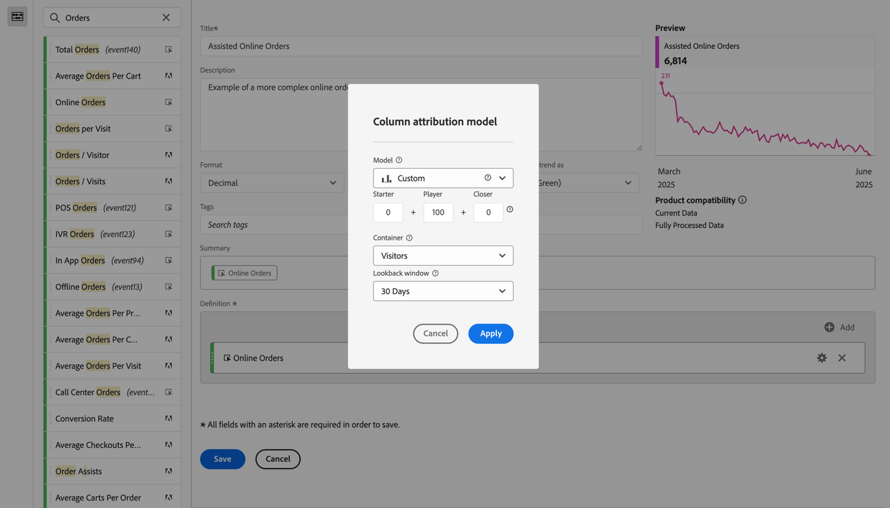
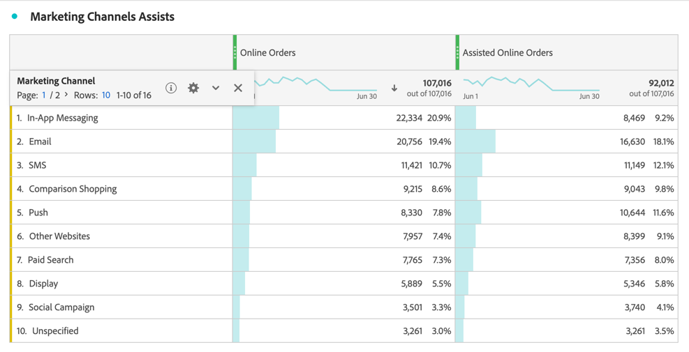

# より複雑な計算指標の構築

この記事では、計算指標のより複雑な例を説明します。 この計算指標は、どのマーケティングチャネルが注文の促進に役立っているかを示しています。 このタイプの計算指標は、あらゆるディメンションや成功イベントに適応させることができます。

1. [指標の作成](/help/components/calculated-metrics/workflow/c-build-metrics/cm-build-metrics.md)の説明に従って、計算指標の作成を開始します。

1. 計算指標ビルダーで、指標`Assisted Online Orders`などの名前を付けます。

1. **[!UICONTROL 指標]** コンポーネントから&#x200B;**[!UICONTROL オンライン注文]**&#x200B;指標を選択し、指標を&#x200B;**[!UICONTROL 定義]**&#x200B;領域にドラッグします。

   1. 指標に「」を選択します。
   1. 「**[!UICONTROL デフォルト以外のアトリビューションモデルを使用]**」を選択します。
   1. **[!UICONTROL 列アトリビューションモデル]**&#x200B;でアトリビューションモデルを調整します。
      1. **[!UICONTROL モデル]**&#x200B;の&#x200B;**[!UICONTROL カスタム]**&#x200B;を選択します。 **[!UICONTROL Starter]**&#x200B;を`0`に、**[!UICONTROL Player]**&#x200B;を`100`に、**[!UICONTROL Closer]**&#x200B;を`0`に設定します。
      1. **[!UICONTROL コンテナ]**&#x200B;の&#x200B;**[!UICONTROL 訪問者]**&#x200B;を選択します。
      1. **[!UICONTROL ルックバックウィンドウ]**&#x200B;の&#x200B;**[!UICONTROL 30日]**&#x200B;を選択します。

      1. 「**[!UICONTROL 適用]**」を選択します。

      

1. 計算指標を保存するには、**[!UICONTROL 保存]**&#x200B;を選択します。

計算指標を使用するには：

1. Analysis Workspaceで、**[!UICONTROL マーケティングチャネル]** ディメンション、**[!UICONTROL オンラインオーダー]**、新しい&#x200B;**[!UICONTROL アシストオンラインオーダー]**&#x200B;指標を含むフリーフォームテーブルを作成します。

   

1. （オプション）計算指標の共有[計算指標の共有](/help/components/calculated-metrics/workflow/cm-sharing.md)の説明に従って、組織内の他のユーザーと指標を共有します。

これは、注文を促進するのに役立ったマーケティングチャネルを容易に把握する方法です。 または、フリーフォームテーブルから任意の指標を選択し、コンテキストメニューからテーブルから直接アトリビューションモデルを調整することもできます。
