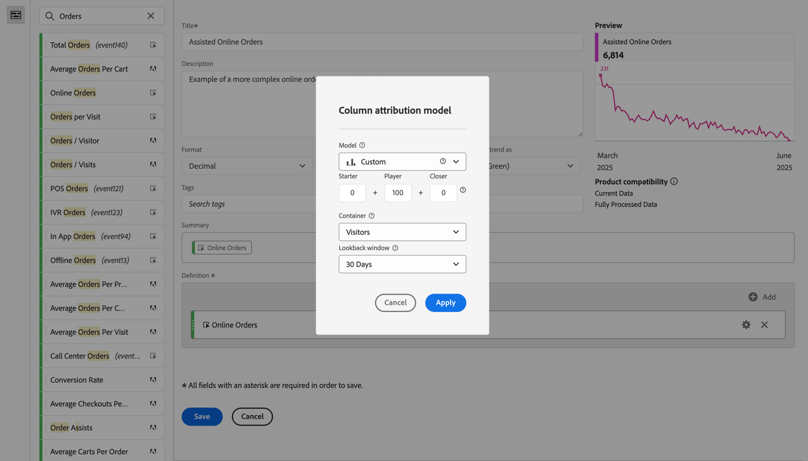
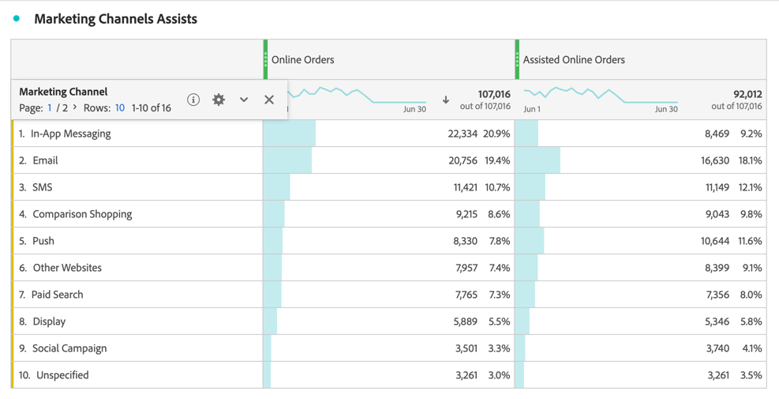

# より複雑な計算指標の作成

この記事では、計算指標のより複雑な例について説明します。 この計算指標は、どのマーケティングチャネルが注文の促進に役立つかを示します。 このタイプの計算指標は、任意のディメンションまたは成功イベントに適応させることができます。

1. [&#x200B; 指標の作成 &#x200B;](/help/components/calculated-metrics/workflow/c-build-metrics/cm-build-metrics.md) の説明に従って、計算指標の作成を開始します。

1. 計算指標ビルダーで、指標に `Assisted Online Orders` などの名前を付けます。

1. **[!UICONTROL 指標]** コンポーネントから **[!UICONTROL オンライン注文]** 指標を選択し、指標を **[!UICONTROL 定義]** 領域にドラッグします。

   1. 指標の  を選択します。
   1. **[!UICONTROL デフォルト以外のアトリビューションモデルを使用]** を選択します。
   1. **[!UICONTROL 列アトリビューションモデル]** のアトリビューションモデルを調整します。
      1. **[!UICONTROL モデル]** に **[!UICONTROL カスタム]** を選択します。 **[!UICONTROL スターター]** を `0` に、**[!UICONTROL プレーヤー]** を `100` に、**[!UICONTROL クローザー]** を `0` に設定します。
      1. **[!UICONTROL コンテナ]** の **[!UICONTROL 訪問者]** を選択します。
      1. **[!UICONTROL ルックバックウィンドウ]** に **[!UICONTROL 30 日]** を選択します。

      1. 「**[!UICONTROL 適用]**」を選択します。

      

1. 「**[!UICONTROL 保存]**」を選択して、計算指標を保存します。

計算指標を使用するには：

1. Analysis Workspaceで、**[!UICONTROL マーケティングチャネル]** ディメンション、**[!UICONTROL オンライン注文]** および新しい **[!UICONTROL 支援オンライン注文]** 指標を使用してフリーフォームテーブルを作成します。

   

1. （任意） [&#x200B; 計算指標の共有 &#x200B;](/help/components/calculated-metrics/workflow/cm-sharing.md) の説明に従って、組織の他のユーザーと指標を共有します。

これで、どのマーケティングチャネルが注文の促進を支援したかを簡単に示すことができます。または、フリーフォームテーブルから任意の指標を選択し、コンテキストメニューを使用して、テーブルから直接アトリビューションモデルを調整することもできます。
