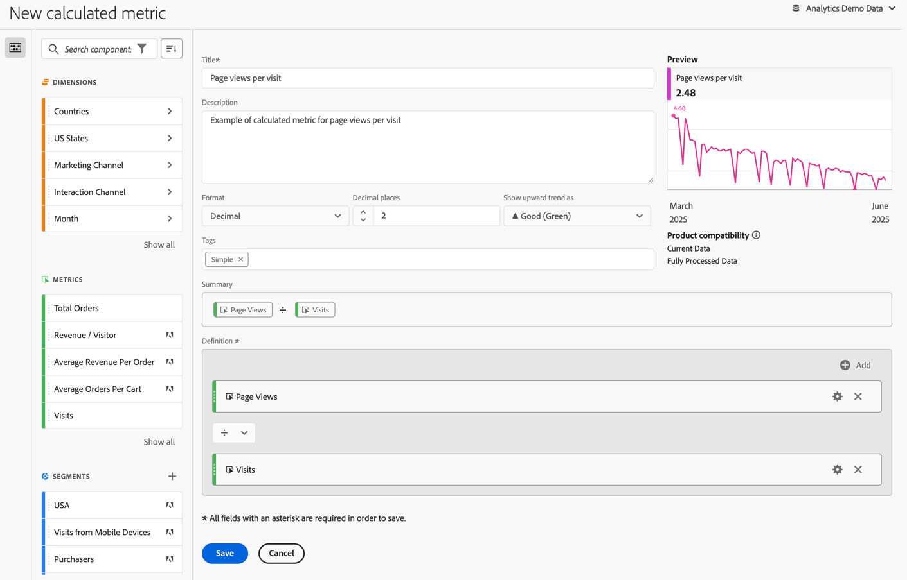

# シンプルな計算指標の構築

次の情報では、訪問数あたりの単純な&#x200B;*ページビュー数*&#x200B;指標の作成方法について説明します。

1. [指標の作成](/help/components/calculated-metrics/workflow/c-build-metrics/cm-build-metrics.md)の説明に従って、指標の作成を開始します。
1. 指標に`Page Views per Visit`などの名前を付けます。
1. 指標にユーザーフレンドリーな&#x200B;**[!UICONTROL 説明]**&#x200B;を指定して、指標が何に使用されているかを示します。
1. 適切な&#x200B;**[!UICONTROL 形式]**&#x200B;を選択してください。 この例では、**[!UICONTROL Decimal]**&#x200B;を選択します。
1. レポートを表示する小数点以下桁の数を指定します。
1. **[!UICONTROL 上昇傾向を]**&#x200B;として表示ドロップダウンメニューで、▲ **[!UICONTROL 良好（緑）]**&#x200B;を選択します。
1. **[!UICONTROL タグ]**&#x200B;を追加して指標を管理します。
1. この計算指標の場合、最初に&#x200B;**[!UICONTROL ページビュー]**&#x200B;を&#x200B;**[!UICONTROL 指標]** コンポーネントからキャンバスの&#x200B;**[!UICONTROL 定義]** セクションにドラッグします。
1. 次に、**[!UICONTROL 指標]** コンポーネントから&#x200B;**[!UICONTROL 訪問]**&#x200B;をドラッグし、**[!UICONTROL ページビュー]**&#x200B;の下に指標をドロップします（指標をドロップする前に青い線が表示されるまで待ちます）。
1. 除算演算子を選択します。 （除算はデフォルトの演算子です）。
1. 指標の構築中に、指標の&#x200B;**[!UICONTROL プレビュー]**&#x200B;を確認できます。
1. [製品の互換性](/help/components/calculated-metrics/cm-compatibility.md)は、指標が現在のデータと互換性があるかどうか、または完全に処理されたデータのみと互換性があるかどうかを示します。

   
1. 「**[!UICONTROL 保存]**」を選択します。

   「**[!UICONTROL 概要]**」の数式は、指標の定義を変更すると更新されます。

1. （オプション）指標を共有、承認、（再）タグ付け、名前変更または削除するには、[計算指標マネージャー](/help/components/calculated-metrics/workflow/cm-manager.md)に移動します。

