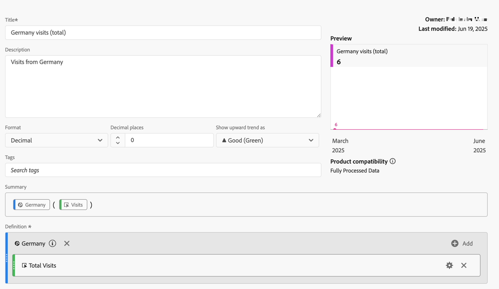
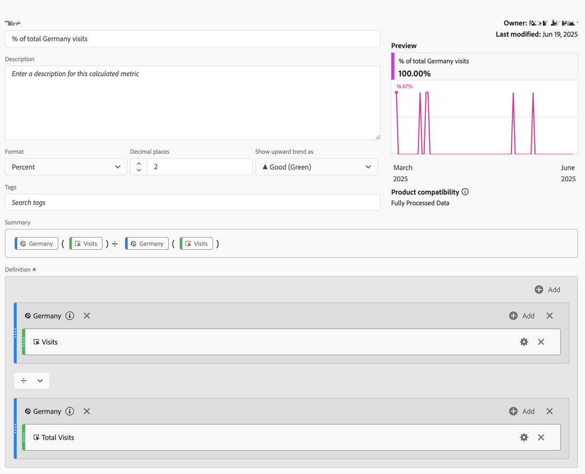

# セグメント化指標

[計算指標ビルダー](cm-build-metrics.md#definition-builder)では、指標の定義内にセグメントを適用できます。 セグメントの適用は、分析でデータのサブセットに指標を使用する場合に役立ちます。

>[!NOTE]
>
>セグメント定義は、[ セグメントビルダー](/help/components/segmentation/segmentation-workflow/seg-build.md)を通じて更新されます。 セグメントに変更を加えると、セグメントが計算指標の定義の一部であるかどうかも含め、そのセグメントが使用されるあらゆる場所で自動的に更新されます。
>

自社と接触したドイツ人と、それ以外の国や地域の人との指標を比較します。 例えば、次のような質問に答えることができます。

1. 最も人気のある[ ページを訪問しているドイツ人と外国人の数](#popular-pages)。
1. 今月、オンラインで自社と接触したドイツ人と外国人の数（[合計](#totals)）を比較します。
1. あなたの人気ページにアクセスしたドイツ人と外国人の[ パーセンテージ ](#percentages)は何ですか？

以下のセクションでは、セグメント化された指標がこれらの質問に対する回答にどのように役立つかを示しています。 必要に応じて、より詳細なドキュメントを参照します。

## 人気ページ

1. [Workspace プロジェクトから`Germany`という名前の計算指標](../cm-workflow.md)を作成します。
1. [計算指標ビルダー](cm-build-metrics.md)内から、[国フィールドを使用する`Germany`というタイトルのセグメント ](/help/components/segmentation/segmentation-workflow/seg-build.md)を作成します。

   >[!TIP]
   >
   >計算指標ビルダーでは、コンポーネントパネルを使用して直接セグメントを作成できます。
   >   

   セグメントは次のようになります。

   

1. 計算指標ビルダーに戻り、セグメントを使用して計算指標を更新します。

   

計算指標の国際バージョンについて、上記の手順を繰り返します。

1. Workspace プロジェクトから、`Non Germany visits`というタイトルの計算指標を作成します。
1. 計算指標ビルダー内から、`Not Germany`というタイトルのセグメントを作成します。このセグメントは、CRM データからCRMの国フィールドを使用して、ユーザーがどこから来たのかを判断します。

   セグメントは次のようになります。

   

1. 計算指標ビルダーに戻り、セグメントを使用して計算指標を更新します。

   

1. Analysis Workspaceで、ドイツ人とドイツ人以外の訪問者が訪問したページを見るプロジェクトを作成します。

   

## 合計

1. 総計に基づいて、2つの新しい計算指標を作成します。 以前に作成した各セグメントを開き、セグメント名を変更し、**[!UICONTROL 人物]**&#x200B;の&#x200B;**[!UICONTROL 指標タイプ]**&#x200B;を&#x200B;**[!UICONTROL グランド合計]**&#x200B;に設定し、**[!UICONTROL 別名で保存]**&#x200B;を使用して、新しい名前を使用してセグメントを保存します。 例：

   

1. Workspace プロジェクトに新しいフリーフォームテーブルのビジュアライゼーションを追加し、今年の合計ページを表示します。

   

## 割合

1. 先ほど作成した計算指標から割合を計算する、2つの新しい計算指標を作成します。

   

1. Workspace プロジェクトを更新します。

   

