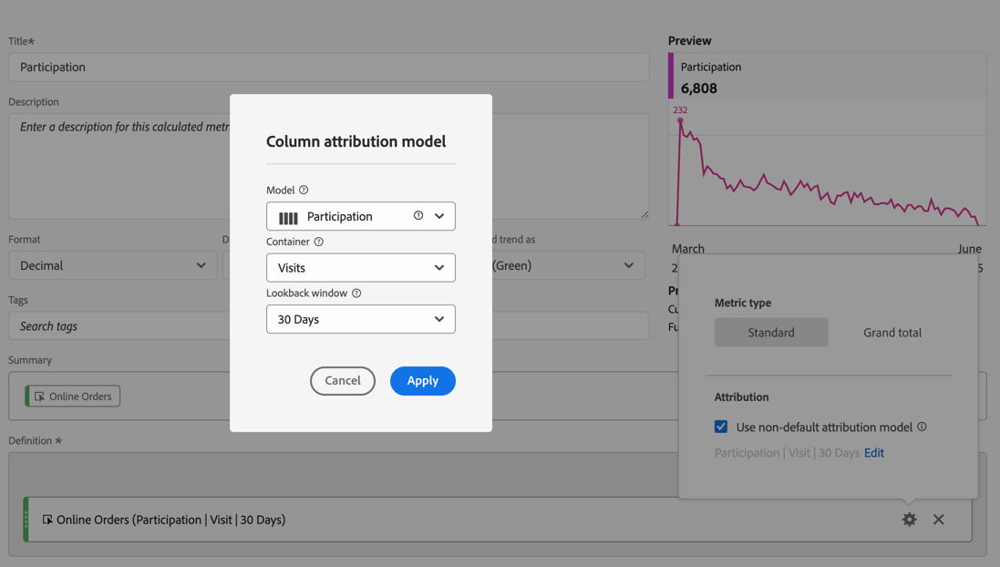
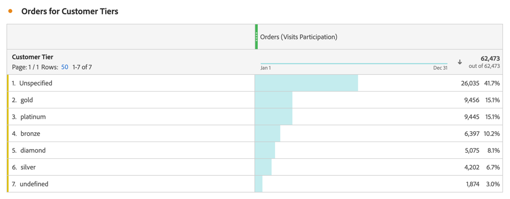
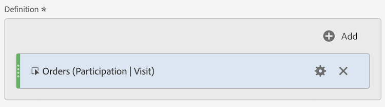
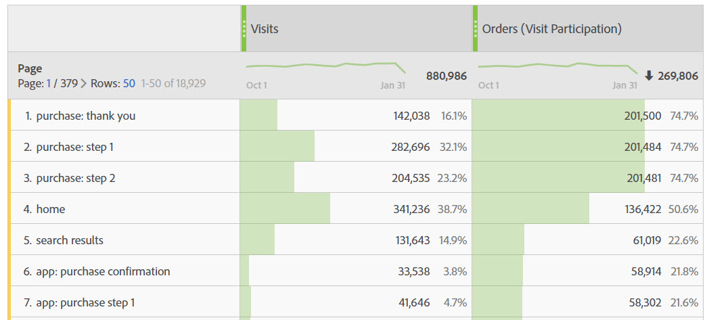

# パーティシペーション指標

参加指標は、ディメンションの個々の値（ページビューなど）が、特定の指標（注文数など）を含む訪問にどのように貢献し、または参加するかを定量化するために使用されます。

次の手順は、参加指標を作成する方法を示しています。

1. [計算指標](../cm-workflow.md)を作成し、[計算指標ビルダー](cm-build-metrics.md)で、指標`Orders (Visit Participation)`または類似の名前を付けます。
1. 成功イベントを含む指標（例：[!DNL Online Orders]）を[!UICONTROL **[!UICONTROL 定義]**]領域にドラッグします。
1. 指標に「」を選択します。
1. 表示されるポップアップで、「**[!UICONTROL デフォルト以外のアトリビューションモデルを使用]**」を選択して、そのイベントの[ アトリビューションモデル ](m-metric-type-alloc.md#attribution-models)を&#x200B;**[!UICONTROL 参加]**&#x200B;に定義し、[!UICONTROL  コンテナ ]の&#x200B;**[!UICONTROL 訪問]**&#x200B;を選択します。 「**[!UICONTROL 適用]**」を選択して確認します。

   

   **（パーティション|訪問|30日間）**&#x200B;が指標コンポーネント名に追加されました。

1. [!UICONTROL **保存**]&#x200B;を選択して、指標を保存します。
1. レポートで計算指標を使用します。 例えば、レポートで計算された[!DNL Orders (Session Participation)]指標を使用して、注文を含むセッションに貢献した（または参加した）顧客層を表示します。

   顧客層と注文を示す

<!--

The following information explains how to create a metric that shows which pages contributed to (or participated in) visits that contained an order.

This type of information could be useful for any content owner.

>[!NOTE]
>
>You can enable participation metrics in the Admin Tools, but only for custom events 1 - 100.

1. Begin creating a calculated metric, as described in [Build metrics](/help/components/calculated-metrics/workflow/c-build-metrics/cm-build-metrics.md).

1. In the Calculated metrics builder, name the metric "Participation".

1. Drag the success event "Orders" into the Definition canvas.

1. Change the [attribution model](/help/components/calculated-metrics/workflow/c-build-metrics/m-metric-type-alloc.md) of that event to **[!UICONTROL Participation]** under the **[!UICONTROL Settings]** gear. Select **[!UICONTROL Visit]** lookback. The definition should look similar to this:

   

1. Select [!UICONTROL **Save**] to save the metric.

1. Use the calculated metric in a **[!UICONTROL Pages]** report.

    

1. (Optional) Share the metric with other users in your organization, as described in [Share calculated metrics](/help/components/calculated-metrics/workflow/cm-sharing.md).
-->