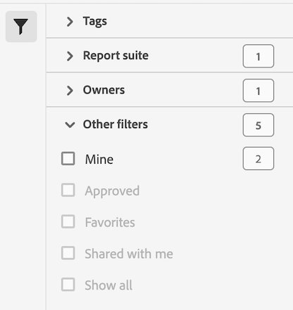

# 計算指標のリストのフィルタリング

計算指標のリストをフィルタリングできます。 計算指標に対してフィルターを使用すると、使用可能な計算指標を簡単に見つけたり、[ 計算指標マネージャー ](cm-manager.md) から計算指標を管理したりできます。

計算指標のリストをフィルタリングするには：

1. 「」を選択して、フィルターパネルを開きます。フィルターリストにスペースが必要な場合は、もう一度「」を選択してパネルを閉じることができます。
1. 使用可能ないずれかの [ フィルターセクション ](#filter-sections) からフィルターを選択します。

   >[!INFO]
   >
   >*項目* [ 計算指標リスト ](cm-manager.md#filters-list) に表示されるフィルター項目を参照します。
   > 

## フィルターセクション

{{tagfiltersection}}
{{reportsuitefiltersection}}
{{ownerfiltersection}}
{{otherfiltersfiltersection}}

[ 計算指標リスト ](cm-manager.md#filters-list) は、フィルター設定に基づいて自動的に更新されます。 設定済みのフィルターは、[アクティブなフィルターバー](cm-manager.md#active-filter-bar)で確認できます。

<!--
# Filter calculated metrics

Filter by tags, owners, and other filters (Show All, Mine, Shared With me, Favorites, and Approved.)

Filtering makes it easier to search for calculated metrics in the segment rail.

1. In Adobe Analytics, select the **[!UICONTROL Components]** tab, then select **[!UICONTROL Calculated metrics]**. 

1. In the Calculated metrics manager, click the **[!UICONTROL Filters]** icon:  

   

1. The following filters are available:

   |  Filter Name  | Description  |
   |---|---|
   |  Tags  |Lets you filter on calculated metrics with specific [tags](/help/components/calculated-metrics/workflow/cm-tagging.md). The Tags column is shown by default.  |
   |  Owners  | Lets you filter calculated metrics by owner.  |
   | Report suite | Lets you filter calculated metrics by report suite. |
   |  Other Filters > Show All  | **(Admin only)** Shows all calculated metrics, their owner, and the last date they were modified.  |
   |  Other Filters > Mine  | Shows all calculated metrics that you own.  |
   |  Other Filters > Shared with me  |Shows all calculated metrics that others [shared](/help/components/calculated-metrics/workflow/cm-sharing.md) with you.  |
   |  Other Filters > Favorites  |Shows all calculated metrics you marked as [Favorites](/help/components/segmentation/segmentation-workflow/t-seg-favorite.md).  |
   |  Other Filters > Approved  |Shows all officially [approved](/help/components/calculated-metrics/workflow/cm-approving.md) calculated metrics.  |
   |  Search calculated metrics  | Lets you search for calculated metrics by name.  |

   -->
