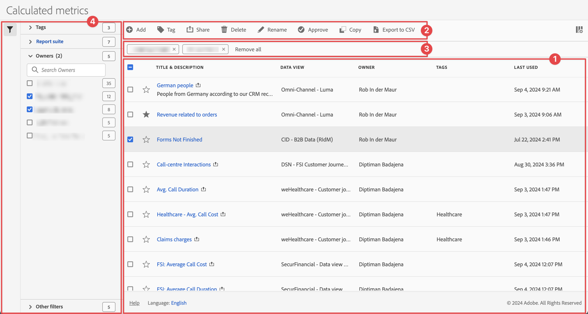

# 計算指標の管理

中央の[!UICONTROL 計算指標]管理インターフェイスから、計算指標を共有、フィルタリング、タグ付け、承認、名前変更、コピー、削除、書き出ししたり、計算指標をお気に入りにマークしたりできます。 計算指標を管理するには：

* メインインターフェイスで「**[!UICONTROL コンポーネント]**」を選択し、「**[!UICONTROL 計算指標]**」を選択します。

## 計算指標マネージャー

計算指標マネージャーには、次のインターフェイス要素があります。

### 計算指標リスト

計算指標リスト ➊には、所有している、または共有されているすべての計算指標が表示されます。 リストには、次の列があります。

<!-- I think this table incorrectly talks about quick calculated metrics -->

| 列 | 説明 |
| --- | --- |
|  | 計算指標としてを優先するか、を優先しない場合に選択します。 [計算指標をお気に入りにマーク &#x200B;](cm-favorite.md)を参照してください |
| **[!UICONTROL タイトルと説明]** | 計算指標を編集するには、タイトルリンクを選択します。これにより、[計算指標ビルダー](c-build-metrics/cm-build-metrics.md)が開きます。 共有された計算指標は、と共に示されます。 |
| **[!UICONTROL レポートスイート]** | この計算指標が適用されるレポートスイート。 |
| **[!UICONTROL 所有者]** | 計算指標の所有者。 ユーザーには、自分が所有している注釈または自分と共有されている注釈のみが表示されます。 |
| **[!UICONTROL タグ]** | この計算指標のタグを一覧表示します。 |
| **[!UICONTROL 共有先]** | 計算指標を共有した個人またはグループの数を一覧表示します。 選択して、**[!UICONTROL 計算指標を共有]** ダイアログを開きます。 詳しくは、[計算指標の共有](cm-sharing.md)を参照してください。 |
| **[!UICONTROL 変更日時]** | 計算指標が最後に変更された日時。 |
| **[!UICONTROL 使用場所]** | 計算指標が現在使用されている場所と、各領域で指標が何回使用されているかを示します。 
例えば、計算指標が40件のプロジェクトと2件のアラートで使用されている場合、この列の値は&#x200B;[!UICONTROL **42個のコンポーネント**]&#x200B;として表示されます。 
この列の値を選択すると、計算指標が使用されている場所の内訳が表示されます（例：[!UICONTROL **プロジェクト（40）**]、[!UICONTROL **モバイルスコアカード（2）**]）。 さらに、計算指標が使用されている項目のリストを表示できます。 例えば、使用されているプロジェクトのリストを表示するには、[!UICONTROL **プロジェクト（40）**]&#x200B;リンクを選択します。

次の各領域は、その領域で使用されている計算指標のインスタンス数を示しています。
 <ul><li>[!UICONTROL **プロジェクト**]
計算指標ビルダー[&#128279;](c-build-metrics/cm-build-metrics.md)で作成された[計算指標が含まれており、すべてのプロジェクトで使用できます。
</li><li>[!UICONTROL **アドホックコンポーネント**]
クイック計算指標](/help/analyze/analysis-workspace/components/apply-create-metrics.md#create-calculated-metrics-for-a-single-project)として作成された計算指標が含まれており、単一のプロジェクト内でのみ使用できます。
</li><li>[!UICONTROL **スケジュールされたプロジェクト**]</li><li>[!UICONTROL **モバイルスコアカード**]</li><li>[!UICONTROL **注釈**]</li><li>[!UICONTROL **Report Builder**]
このオプションを選択すると、次のデータ列を含むCSV ファイルがダウンロードされます。
<ul><li>Report Builder 名</li><li>前回のアクセス</li><li>最後にアクセスした IMS ユーザー ID</li><li>前回アクセスしたユーザー名</li></ul></li></ul>
この情報は、コンポーネントが組織内のユーザーにとって有用かどうか、どこで使用されているか、削除または変更する必要があるかどうかを判断するのに役立ちます。

この列を表示する際は、次の点を考慮してください。
<ul><li>この情報は、システム管理者のみが使用できます。</li><li>[!UICONTROL **使用**]&#x200B;列はデフォルトでは表示されません。 この列の表示を構成するには、 を使用します。</li><li>この情報には、API またはデータウェアハウスからの使用は含まれません。</li><li>特定のコンポーネントに対してこの列にデータがない場合でも、[!UICONTROL **最終使用日**]&#x200B;が設定されている場合、そのコンポーネントは保存されずに分析で使用されている可能性があります。</li><li>使用状況に関する情報は、2023年9月より提供されます。</li></ul>
この情報と共に[データ辞書](/help/analyze/analysis-workspace/components/data-dictionary/data-dictionary-overview.md)を使用すると、組織内でのコンポーネントの使用方法を追跡し、より深く理解することができます。
 |
| **[!UICONTROL 前回の使用]** | 計算された指標が最後に使用された日時。 |

{style="table-layout:auto"}

 を使用して、表示する列を指定します。

### アクションバー

アクション バー➋を使用してフィルターに対してアクションを実行できます。 アクションバーには、次のアクションが含まれます。

| アイコン | アクション | 説明 |
|:---:|---|---|
|  | **[!UICONTROL 追加]** | [計算指標ビルダー](c-build-metrics/cm-build-metrics.md)を使用して、別の計算指標を追加します。 |
|  | [!UICONTROL *タイトルで検索*] | リストで計算指標が選択されていない場合は、この検索フィールドを使用してフィルターを検索します。 |
|  | **[!UICONTROL タグ]** | 選択した計算指標にタグを付けます。 **[!UICONTROL 計算指標のタグ]** ダイアログで、選択した計算指標のタグを選択または選択解除します。 選択した計算指標のタグを保存するには、**[!UICONTROL 保存]**&#x200B;を選択します。 詳しくは、[計算指標のタグ付け](cm-tagging.md)を参照してください。 |
|  | **[!UICONTROL 共有]** | 選択した計算指標を共有します。 **[!UICONTROL 計算指標を共有]** ダイアログで、 *個人またはグループを検索*&#x200B;するか、**[!UICONTROL 組織]**&#x200B;または&#x200B;**[!UICONTROL グループ]**&#x200B;を選択できます。 選択した計算指標の共有の詳細を保存するには、**[!UICONTROL 保存]**&#x200B;を選択します。 詳しくは、[計算指標の共有](cm-sharing.md)を参照してください。 |
|  | **[!UICONTROL 削除]** | 選択した計算指標を削除します。 確認メッセージが表示されます。 |
|  | **[!UICONTROL 名前変更]** | 選択した1つの計算指標の名前を変更します。 選択すると、計算指標の名前をインラインで変更できます。 |
|  | **[!UICONTROL 承認]** | 選択した計算指標を承認します。 [計算指標の承認](cm-approving.md)を参照してください。 |
|  | **[!UICONTROL コピー]** | 選択した計算指標をコピーします。 新しい計算指標が、同じ名前と接尾辞`(Copy)`で作成されます |
|  | **[!UICONTROL CSV に書き出し]** | 計算指標を`Calculated  metric List.csv` ファイルにエクスポートします。 |

### アクティブなフィルターバー

フィルターバー➌には、フィルターパネルから計算指標のリスト（存在する場合）に適用されたアクティブなフィルターが表示されます。  を使用すると、フィルターをすばやく削除できます。 複数のフィルターを指定した場合は、「**[!UICONTROL すべて削除]**」を使用すると、すべてのフィルターを削除できます。

### フィルターパネル

 **[!UICONTROL フィルター]**&#x200B;左側のパネル ➍を使用して、計算指標のリストをフィルターできます。 フィルターパネルには、フィルターのタイプと、特定のフィルターを適用する計算指標の数が表示されます。 「」を選択して、フィルターパネルの表示を切り替えます。

詳しくは、[計算指標のリストのフィルター](cm-filter.md)を参照してください。

<!--
OLD CONTENT

The Calculated metrics page offers many ways of curating metrics, such as sharing, filtering, tagging, approving, copying, deleting, and marking as favorites.

The Calculated metrics page shows you all the segments you own and that have been shared with you. Admin-level users can see all custom metrics in the organization. 

## Access the Calculated metrics manager

1. In Adobe Analytics, select [!UICONTROL **Components**] > [!UICONTROL **Calculated metrics**].

## Available actions in the Calculated metrics manager

In the Calculated metrics manager, you can:

* [Filter calculated metrics](/help/components/calculated-metrics/workflow/cm-filter.md)

* [Mark calculated metrics as favorites](/help/components/calculated-metrics/workflow/cm-favorite.md)

* [Approve calculated metrics](/help/components/calculated-metrics/workflow/cm-approving.md)

* [Tag calculated metrics](/help/components/calculated-metrics/workflow/cm-tagging.md)

* [Share calculated metrics](/help/components/calculated-metrics/workflow/cm-sharing.md)

* Export a calculated metric to a CSV file. 

* [Copy calculated metrics](/help/components/calculated-metrics/workflow/cm-copy.md)

* Delete calculated metrics

## Configure columns

You can configure the information displayed for each calculated metric in the Calculated metrics manager by configuring the columns that are displayed.

To configure the visible columns in the Calculated metrics manager:

1. In Adobe Analytics, select the **[!UICONTROL Components]** tab, then select **[!UICONTROL Calculated metrics]**. 

1. In the Calculated metrics manager, select the **Customize columns** icon , then select the columns that you want to be displayed in the Calculated metrics manager.

   The following columns are available:

   | Column title  | Description |
   |---|---|
   | Favorites  | Displays star icons next to each calculated metric, allowing you to mark calculated metrics as favorites. For more information, see [Mark calculated metrics as favorites](/help/components/calculated-metrics/workflow/cm-favorite.md). |
   | Title and description | These values are provided in the Calculated metric builder. To edit the title and description, select the title link to open the Calculated metric builder.  |
   | Report suite | Indicates in which report suite the metric was last saved.  |
   | Owner | Indicates who owns the custom metric. As a non-admin, you can see only metrics you own or those that were shared with you.  |
   | Tags | Shows tags that were applied to the metric, either by you or by people who shared the calculated metric with you.  |
   | Shared with | Lists individuals or groups (admin only) or All (admin only) that you shared the calculated metric with. 
When a calculated metric is being shared, a share icon displays next to the calculated metric name.
  |
   | Date modified | Indicates the date when the custom metric was last modified.  |
   | Used in | Shows where calculated metrics are currently being used, and how many times they are being used in each area. 
For example, if the calculated metric is being used in 40 projects and 2 alerts, then the value of this column shows as [!UICONTROL **42 components**]. 
Select the value in this column to see the breakdown of where the calculated metrics are being used (for example, [!UICONTROL **Projects (40)**], [!UICONTROL **Alerts (2)**]). Furthermore, you can view the list of items where the calculated metrics are being used. For example, so see the list of projects where they are being used, select the [!UICONTROL **Projects (40)**] link.

Each of the following areas shows the number of instances of calculated metrics being used in that area:
 <ul><li>[!UICONTROL **Projects**]
Contains calculated metrics that were [created in the calculated metric builder](/help/analyze/analysis-workspace/components/apply-create-metrics.md#create-calculated-metrics-for-all-projects) and are available for all projects.
</li><li>[!UICONTROL **Ad hoc components**]
Contains calculated metrics that were [created as quick calculated metrics ](/help/analyze/analysis-workspace/components/apply-create-metrics.md#create-calculated-metrics-for-a-single-project) and are available only within a single project.
</li><li>[!UICONTROL **Scheduled projects**]</li><li>[!UICONTROL **Mobile Scorecards**]</li><li>[!UICONTROL **Annotations**]</li><li>[!UICONTROL **Alerts**]</li><li>[!UICONTROL **Report Builder**]
Selecting this option downloads a CSV file, with the following columns of data:
<ul><li>Report Builder Name</li><li>Last accessed</li><li>Last accessed IMS User ID</li><li>Last accessed user name</li></ul>
When viewing information for Report Builder, usage information is available starting in September 2024.
</li></ul>
This information can help you determine whether a component is valuable to users in your organization, where it is used, and if it needs to be deleted or modified.

Consider the following when viewing this column:
<ul><li>This information is available only to system administrators.</li><li>The [!UICONTROL **Used in**] column does not display by default. [Configure columns](#configure-columns) to display it.</li><li>If a calculated metric includes another calculated metric in its definition, any use of that calculated metric is not shown in the [!UICONTROL **Used in**] column. If a calculated metric is included in the definition of another type of component (such as a segment), then usage is shown in the [!UICONTROL **Used in**] column.</li><li>This information does not include usage from the API or Data Warehouse.</li><li>If there is no data in this column for a given component but it has a [!UICONTROL **Last used**] date, the component might have been used in an analysis without being saved.</li><li>Usage information is available starting in September 2023.</li></ul>
You can use the [Data Dictionary](/help/analyze/analysis-workspace/components/data-dictionary/data-dictionary-overview.md) along with this information to help you keep track of and better understand how components are being used in your organization.
 |
   | Last used | Shows the date when the calculated metric was last used in any of the following areas: <ul><li>Alerts</li><li>Calculated metrics</li><li>Projects</li><li>Scheduled projects</li></ul> 
This information can help you determine whether a component is valuable to users in your organization, where it is used, and if it needs to be deleted or modified.

Consider the following when viewing this column:
<ul><li>This information does not include usage from the API, Report Builder, or Data Warehouse.</li><li>For some components, this column might not contain data if the component was last used prior to September 2023.</li><li>This information is available only to system administrators.</li></ul>
You can use the [Data Dictionary](/help/analyze/analysis-workspace/components/data-dictionary/data-dictionary-overview.md) along with this information to help you keep track of and better understand how components are being used in your organization. |

   {style="table-layout:auto"}

-->