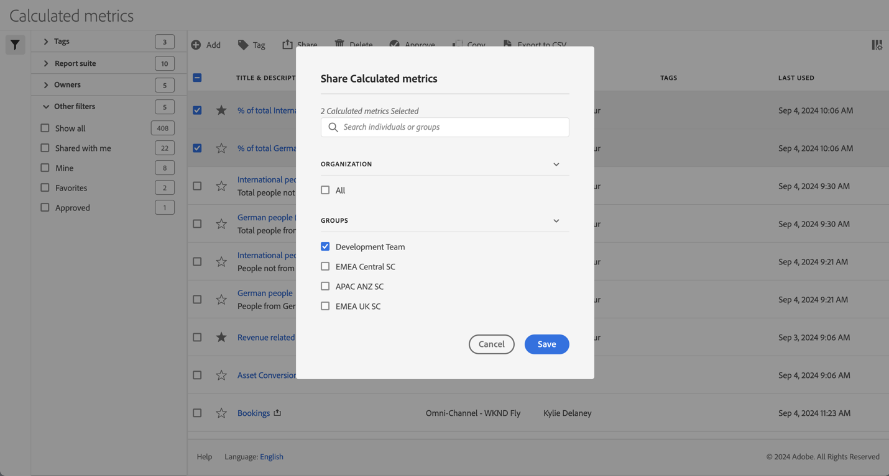
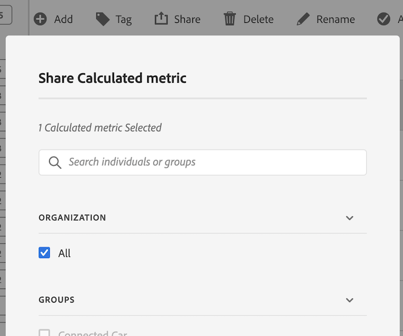

# 計算指標の共有

[計算指標マネージャー](cm-manager.md)では、計算指標を共有できます。 権限に応じて、計算指標を組織全体、グループ、または個々のユーザーと共有できます。

* **管理者**：管理者は、計算指標を組織全体、組織内のグループ、個々のユーザーと共有できます。 詳しくは、[Admin Console のドキュメント](https://helpx.adobe.com/jp/enterprise/using/manage-products.html)を参照してください。
* **管理者以外**：管理者以外のユーザーは、作成した計算指標のみを共有し、個々のユーザーとのみ共有できます。

1つ以上の計算指標を共有するには：

1. [計算指標マネージャー](cm-manager.md)で、共有する計算指標の1つ以上を選択します。
1. アクションバーから、 **[!UICONTROL 共有]**&#x200B;を選択します。
1. **[!UICONTROL 計算指標を共有]** ダイアログで、次の操作を行います。

   

   1. （オプション）計算指標を共有するグループまたは個人のリストを制限するには、から&#x200B;*個人またはグループ*&#x200B;を使用します。

   1. **[!UICONTROL 組織]**&#x200B;または&#x200B;**[!UICONTROL グループ]** セクションから1つ以上のオプションを選択するか、1つ以上の個人を検索して選択します。 利用可能なオプションは、役割によって異なります。

   1. 計算指標を共有するには、**[!UICONTROL 保存]**&#x200B;を選択します。 「**[!UICONTROL キャンセル]**」を選択すると、キャンセルします。

## ベストプラクティス

ここでは、計算指標を共有する必要がある場合と、計算指標を共有する必要があるユーザーに関するベストプラクティスをいくつか紹介します。

* 管理者は、組織内の誰もが計算指標を使用することに慣れていると確信している場合にのみ、計算指標を「すべて」と共有します。 また、これらの計算指標を採用することも検討できます。 詳しくは、[計算指標をお気に入りとしてマーク &#x200B;](cm-favorite.md)を参照してください。

* 管理者は、計算指標が特定のグループのユーザー部分にビジネス価値を提供する場合、その計算指標を特定のグループと共有します。

* 管理者または個人ユーザーは、計算指標を1人以上のユーザーと共有して、計算指標を検証します。 セグメントが有用であることが証明されない場合は、計算指標を削除できます。

<!--
Depending on your permissions, you can share metrics with your whole organization, groups, or individual users.

|  Role | Permissions |
|---|---|
|  Administrator  | Can share metrics with All, with Groups, and with Users. Groups are set up as permission groups in the Admin Console. |
|  Non-Administrator  | Can share metrics only with individual users.  |

To share a calculated metric:

1. In Adobe Analytics, select the **[!UICONTROL Components]** tab, then select **[!UICONTROL Calculated metrics]**. 

1. In the Calculated metrics manager, select the checkbox to the left of any metrics that you want to share. 

1. Select the **[!UICONTROL Share]** icon. 
   
   The Share Calculated metric dialog box displays.

   

1. Select **[!UICONTROL Share]**.

1. Choose who you want to share with:

   * **[!UICONTROL All]** (Administrators only): Shares with all users in the organization.

     Consider sharing with all only if it's of use to the entire company and everyone is comfortable using it. In this case, you should also consider making it an [approved metric](/help/components/calculated-metrics/workflow/cm-approving.md).
   
   * **[!UICONTROL Groups]** (Administrators only): Select any groups you want to share with.

     Consider sharing with a group if the metric provides good business value for that team.
   
   * **[!UICONTROL Individual users]**: Search for and select the individual users you want to share with.

      This is the only share option available to all users. Administrators might want to use this option to vet and validate a metric prior to making it available to a group or to everyone. If the metric isn't useful, it can be discarded. Administrators should not officially approve this type of metric.

1. Select **[!UICONTROL Share]**.

   The Shared icon appears next to the metric: .

1. You can filter on metrics shared with you by going to **[!UICONTROL Filters]** > **[!UICONTROL Other Filters]** > **[!UICONTROL Shared with Me]**.

1. (Optional) To filter the list of calculated metrics in the Calculated metrics manager to show only metrics that are shared with you, select the **Filter** icon, expand **[!UICONTROL Other filters]**, then select **[!UICONTROL Shared with me]**.
-->
