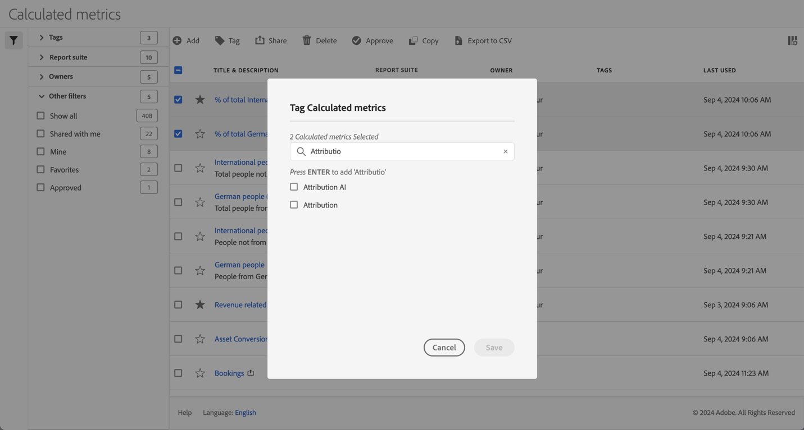

# 計算指標をタグ付け

[計算指標マネージャー](cm-manager.md)では、タグを使用して計算指標を整理できます。 管理者は、すべての計算指標にタグを付けることができます。 管理者以外のユーザーは、作成した計算指標または共有された指標のみをタグ付けできます。

1つ以上の計算指標にタグを付けるには：

1. [計算指標マネージャー](cm-manager.md)で、タグ付けする1つ以上の計算指標を選択します。
1. アクションバーから、 **[!UICONTROL タグ]**&#x200B;を選択します。
1. **[!UICONTROL 計算指標のタグ付け]** ダイアログで

   

   1. （オプション）タグのリストを検索して制限するには、を使用します。

   2. タグのリストに基づいて、次の操作を行います。

      * リストから1つ以上の既存のタグを選択するか
      * 新しいタグを入力し、**[!UICONTROL ENTER]**&#x200B;を押します。 これを繰り返して、複数の新しいタグを追加します。

1. 計算指標のタグを保存するには、**[!UICONTROL 保存]**&#x200B;を選択します。 「**[!UICONTROL キャンセル]**」を選択すると、キャンセルします。

保存すると、タグは、[計算指標ビルダー](cm-tagging.md)で選択した計算指標の[!UICONTROL &#x200B; タグ &#x200B;] フィールドに一覧表示されます。

<!--
In the Calculated metric manager, you can organize segments by tagging them.

All users can create tags for calculated metrics and apply one or more tags to a metric. However, you can see tags only for those calculated metrics that you own or that have been shared with you. 

>[!TIP]
>
>The most useful types of tags are usually tags that are based on the following criteria:
>
>* **Team names**, such as Social Marketing or Mobile Marketing.
>* **Projects** (analysis tags), such as Entry-page analysis.
>* **Categories**, such as Women's or Geography.
>* **Workflows**, such as To be approved or Curated for (a specific business unit)

## Apply tags to a calculated metric

1. In Adobe Analytics, select [!UICONTROL **Components**] > [!UICONTROL **Calculated metrics**].

1. In the Calculated metrics manager, select the checkbox next to any metrics that you want to tag. 

   
   
1. In the **[!UICONTROL Tag Calculated metric]** dialog box:

    * Add a new tag. Type the name in the [!UICONTROL **Add tags**] field, then press Enter.
    * Select one or more existing tags to apply to the selected metrics. 

1. Select [!UICONTROL **Save**] to apply the tags.

## View applied tags

1. In Adobe Analytics, select [!UICONTROL **Components**] > [!UICONTROL **Calculated metrics**] to go to the Calculated metrics manager.

1. In the Calculated metrics manager, tags appear in the [!UICONTROL **Tags**] column. (Click the gear icon on the top-right to manage your columns.)

## Filter metrics by tags

1. In Adobe Analytics, select [!UICONTROL **Components**] > [!UICONTROL **Calculated metrics**] to go to the Calculated metrics manager.

1. In the Calculated metrics manager, select the **Filter** icon, then select the tags that you want to filter by. 

   Only metrics that have the filter you select are shown.
-->