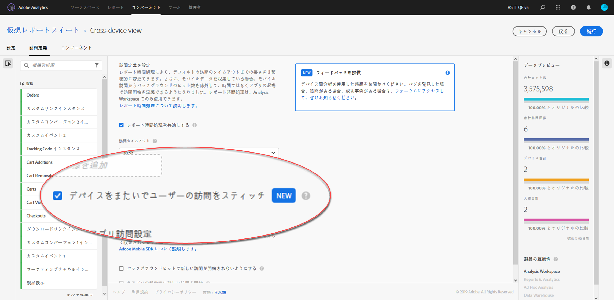

# クロスデバイス分析の設定

> [!NOTE] デバイス間分析のドキュメントは、この機能がさらに開発されるに従って変更される場合があります。 定期的にもう一度確認して、更新を確認してください。

すべての前提条件が満たされたら、次の手順を使用してデバイス間分析を有効にします。 以下の手順に従うには、製品プロファイル管理者グループに属するか、Adobe Analyticsの管理者権限が必要です。

> [!IMPORTANT] これらの手順を実行する前に、すべての前提条件を満たす必要があります。 すべての前提条件が満たされていない場合、この機能は使用できないか、機能しません。 前提条 [件と制限については、デバイス間分析](cda-home.md) を参照してください。

## CDAに対して有効にするデバイス間レポートスイートを選択します

組織がCDAを使用するようにプロビジョニングされている場合は、使用するレポートスイートを選択します。 この選択は、アドビのアカウントマネージャーを通じて伝えることができます。 その後、アドビが選択したレポートスイートをCDA処理用に有効にします。

## デバイス間の仮想レポートスイートを作成して、デバイス間の表示を確認する

仮想レポートスイートを作成するアクセス権を持つ管理者は、次の手順でCDA仮想レポートスイートを作成できます。

1. Experiencecloud.adobe.com [に移動し、AdobeIDの資格情報を使用して](https://experiencecloud.adobe.com) 、ログインします。
2. 上部の9グリッドアイコンをクリックし、「Analytics」をクリックします。
3. 上部の「コンポーネント」の上にカーソルを置き、「仮想レポートスイート」をクリックします。
4. 「Add」をクリックします。
5. 仮想レポートスイートの名前を入力し、CDA対応のレポートスイートが選択されていることを確認します。
6. 「レポートの時間処理を有効にする」チェックボックスをクリックし、デバイス間分析などのその他のオプションを有効にします。
7. 「デバイス間のユーザー訪問をステッチ」チェックボックスをクリックします。
8. 「続行」をクリックし、仮想レポートスイートの設定を終了して、「保存」をクリックします。

## デバイス間の仮想レポートスイートの追加と変更

仮想レポートスイートでデバイス間分析が有効になっている場合は、次の変更点に注意してください。

* 仮想レポートスイート名の横に、新しいデバイス間のアイコンが表示されます。 このアイコンは、デバイス間の仮想レポートスイートにのみ使用できます。
* 「ユーザー」と「個別デバイス」という新しい指標を使用できます。
* 「個別訪問者数」指標は、「人」と「個別デバイス」に置き換えられるので、使用できません。
* セグメントを作成する際、「訪問者」セグメントコンテナは「人」コンテナに置き換えられます。

## 圧縮計算指標

The ability for Cross-Device Analytics to stitch devices together depends on a wide range of factors. The effectiveness of the feature's ability to stitch data can be measured with a calculated metric called compression. Factors that contribute to compression include:

* Using the Co-op graph or Private graph: Generally speaking, organizations using the device co-op tend to see better compression rates than organizations using the private graph.
* Log in rate: The more users log in on your site, the more Adobe can identify and stitch visitors across devices. Sites with a low log in rate also have low compression rates.
* Experience Cloud ID coverage: Only visitors with an ECID can be stitched. A lower percentage of visitors to your site using an ECID correlates to lower compression rates.
* Multiple device usage: If visitors to your site don't use multiple devices, you can see lower compression rates.
* Reporting granularity: Compression by day is typically smaller than compression by month or year. The chances for an individual to use multiple devices becomes smaller within a single day than over an entire month. Segmenting, filtering, or using breakdown dimensions can also show a lower compression rate.

特定の期間における組織の圧縮を確認するには：

1. Click Workspace at the top, then click 'Create New Project'.
2. Start with a Blank Project, then click Create.
3. Drag the Unique Devices metric onto the canvas area labeled 'Drop a Metric Here'.
4. [個別デバイス]指標ヘッダーの右側にあるキャンバスに[人]指標を直接ドラッグし、2つの指標を並べて表示します。
5. 左側の利用可能な指標の横にある「`+`」記号をクリックして、計算指標ビルダーを開きます。
6. この計算指標に次の設定を指定します。
   * 名前：デバイス間圧縮
   * 形式：パーセント
   * 小数点以下の桁数：2
   * 定義: `[Static Number: 1] minus [People] divided by [Unique Devices]`
      > [!TIP] 定義領域の右上隅にある「追加」をクリックして、静的な番号を追加します。 左側の使用可能な指標のリストから「ユーザー」と「個別デバイス」をドラッグします。
7. 「保存」をクリックします。
8. 新しい計算指標をキャンバスに直接人物指標ヘッダーの右側にドラッグして、3つの指標が並ぶようにします。
9. オプション：デフォルトでは、ワークスペースにDayディメンションが読み込まれます。 週や月などの代替日ディメンションを日ディメンションの上にドラッグします（別の時間精度が必要な場合）。
